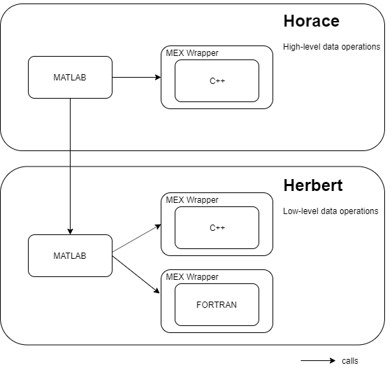

# PACE - Architectural Design Document

## Introduction

Horace is a suite of programs for the visualization and analysis of large datasets from time-of-flight neutron inelastic scattering spectrometers

The code is split into two projects: 

- `Horace`: user-level functions
- `Herbert`: a library of lower-level data manipulation routines that are used by Horace, but may be used independently.

Both projects include a small number of C++ and Fortran implementations of performance critical routines.

The Horace code base includes a fallback implementation of each of the C++ routines for use in the compiled source has not been loaded.

## Overview

### MATLAB

The core system is implemented in MATLAB. This functionality is based around the creation and processing of `sqw` objects with encapsulated `dnd` data.

MATLAB provides the API to all routines.

### C++

The C++ routines in Horace and Herbert implement low-level functionality for performance benefit.

These operations include:

- read ASCII Tobyfit `.par` files, `.spe` or `.phx` data files
- combine_sqw

### Fortran

The routines which do rebinning and integration are still needed, as these operations are not ones that are intrinsically vectorisable -- there were situations when the equivalent MATLAB was vastly slower - say two orders of magnitude when the number of bins in the input data that was being rebinned when they were written. 

There are some utility routines that are called by the rebinning and integration routines (e.g. upper_index). There is no C++ that performs the same functions. 

Other Fortran is no longer needed, for example that which reads the old Mslice slices and cuts (Mslice is a MATLAB program that is still use a bit to look at neutron data at ISIS and elsewhere), but there are MATLAB routines which do the same job and they can be retained as a fallback. 

### Python

TBI - this will replicate the MATLAB API to support users with Python rather than MATLAB skills.

## MPI Framework

See [MPI Framework](./04_mpi_framework.md)

## File Formats

See [File Formats](./05_file_formats.md)

## Data objects

The MATLAB source for Horace  defines two core data objects that represent experiment data.

- SQW is the core data object for Horace. The object contains the raw pixel data (file-backed), methods to transform, combine. slice and process it and metadata describing the instrument and experiment.
- DND objects share common structure with SQW but exclude the raw pixel data, detector information and other headers

#### V3 Implementation

The Horace v3 [implementation](./02_sqw_current_implementation.md) 

- uses "classic" MATLAB classes
- implements over 150 public methods in the API
- includes significant code duplication between the SQW and DND objects

#### V4 redesign

An [initial redesign](../design_forV4/Matlab&#32;Horace&#32;redesign.docx) of the SQW object has been performed by Alex Buts.

Starting with this, a new design has been created to:

- use "new style" classes
- use handle classes to simplify Python wrapper (note this will require users of the copy assignment to update their code)
- use a projection manager to separate the existing projections and support the simple inclusion of addition ones, eg. spherical
- extract duplicate code from DND and SQW objects
- add function-level unit testing

The public methods overloading the basic MATLAB operations are required so cannot be removed.

## Update strategy

#### Immediate

Work on Vertical Slices of key project functions:

- sqw : rewrite the SQW and DND objects to use new-style, handle classes
  - initially preserve the current API
  - remove duplication between DND and SQW objects
- gen-sqw : Read one or more `.spe` files and a detector parameter file, and create an output `.sqw` file
  - load files
  - combine file data into new SQW file
  - return SQW data object
- symmetrize : Symmetrize a SQW dataset in a plane specified by the a vector triple.
- cut-sqw : Take a cut from an SQW object by integrating over one or more axes.
- projections : 

 These slices are all dependent on the `sqw` object for which the updated API must be designed.

#### Mid term

- restructure C++ libraries to separate the MATLAB wrapper from the core functionality; this will enable simpler testing and the future addition of Python bindings for the functions:

  

#### Long term

- create Python API bindings for C++
- move all code out of MATLAB into Python or C++

## Architecture References

A number of documents exist describing the existing architecture; these are referenced here for record:

In Horace:

- [Horace_fields_summary](../Horace_fields_summary.doc)
- [Matlab Horace redesign](../design_forV4/Matlab%20Horace%20redesign.docx)
- [Parallel Horace](../design_forV4/Parallel%20Horace.pptx)

In Herbert

- [Parallel Framework Design](../../../Herbert/documentation/ParallelFrameworkDesign.docx).