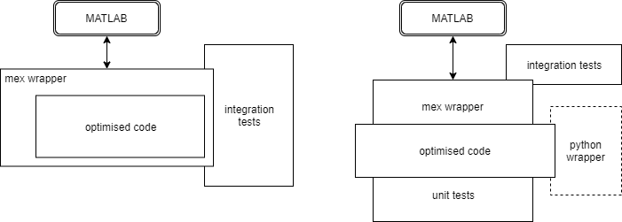

# PACE - Architectural Design Document

## Introduction

Horace is a suite of programs for the visualization and analysis of large datasets from time-of-flight neutron inelastic scattering spectrometers

The code is split into two projects: 

- `Horace`: user-level functions
- `Herbert`: a library of lower-level data manipulation routines that are used by Horace, but may be used independently.

Both projects include a small number of C++ and Fortran implementations of performance critical routines.

The Horace code base includes a fallback implementation of each of the C++ routines for use in the compiled source has not been loaded.

## Overview

### MATLAB

The core system is implemented in MATLAB. This functionality is based around the creation and processing of `sqw` objects with encapsulated `dnd` data.

### C++

The C++ routines in Horace and Herbert implement low-level functionality for performance benefit.

These operations include:

- read ASCII Tobyfit `.par` files, `.spe` or `.phx` data files
- combine_sqw
- 

### Fortran

The routines which do rebinning and integration are still needed, as these operations are not ones that are intrinsically vectorisable -- there were situations when the equivalent MATLAB was vastly slower - say two orders of magnitude when the number of bins in the input data that was being rebinned when they were written. 

There are some utility routines that are called by the rebinning and integration routines (e.g. upper_index). There is no C++ that performs the same functions. 

Other Fortran is no longer needed, for example that which reads the old Mslice slices and cuts (Mslice is a MATLAB program that is still use a bit to look at neutron data at ISIS and elsewhere), but there are MATLAB routines which do the same job and they can be retained as a fallback. 

## Data objects

### SQW

The SQW is the core data object for Horace. The object contains the raw pixel data (file-backed), methods to transform, combine. slice and process it and metadata describing the instrument and experiment.

#### V3 Implementation

The Horace v3 [implementation](./02_sqw_current_implementation.md) 

- uses "classic" MATLAB classes
- implements over 150 public methods in the API
- includes massive code duplication between the SQW and DND objects

#### V4 redesign

An [initial redesign](../design_forV4/Matlab&#32;Horace&#32;redesign.docx) of the SQW object has been performed by Alex Buts.

Starting with this, a new design has been created to:

- use "new style" classes
- use a projection manager to separate the existing projections and support the simple inclusion of addition ones, eg. spherical
- extract duplicate code from DND and SQW objects
- add function-level unit testing

The public methods overloading the basic MATLAB operations are required so cannot be removed.

## Update strategy

Work on Vertical Slices of key project functions:

- sqw : rewrite the SQW and DND objects to use new-style classes

- gen-sqw : Read one or more `.spe` files and a detector parameter file, and create an output `.sqw` file
- symmetrize : Symmetrize a SQW dataset in a plane specified by the a vector triple.
- cut-sqw : Take a cut from an SQW object by integrating over one or more axes.
- projections : 

 These slices are all dependent on the `sqw` object for which the updated API must be designed.

- restructure C++ libraries to separate the MATLAB wrapper from the core functionality; this will enable simpler testing and the future addition of Python bindings for the functions:

  

## Questions

1) is it necessary that the V4 API be 100% compatibly with the V3? That would require multiple function wrappers to be implemented in the class masking push of functionality down into helper functions.

2) ~~Do we need to support the legacy `fit*` and `multifit_legacy*` APIs in the new SQW objects?~~ 
		*No: confirmed by Toby 19-Nov*

2) The SQW and DND class interfaces define a full arithmetic (plus, divide etc) overloading the MATLAB operators. These manipulations are done in-memory for the full dataset. There is a requirement to implement file-backed operations, where the data for the arguments are specified by file-name not passed as a preloaded data object.

This needs to be clarified -- what is the purpose of this change:

1. remove lines of code for users, so there is no need to load data from file and then manipulate, simply manipulate
2. support operations on larger file sizes i.e. data sets that are too big to load in to memory

Target API for these file backed operations: 
     - `plus(a, filename)`, `plus(filename1, filename2)`?
     - does this return a new SQW object with the file headers from the loaded file appropriately modified data or create a new file containing the updated data and return that name?
     