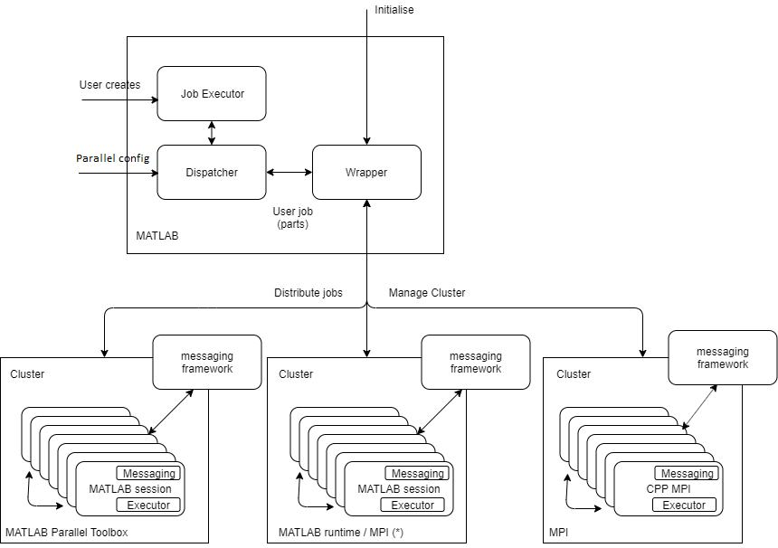

# Generic MPI Framework

A generic framework for parallelization has been created in MATLAB. The framework presents a common interface to users and supports parallelization through the MATLAB parallel toolbox and using MPI. A switch argument is used to configure 'the amount of parallelism'

Jobs are compiled operations (e.g. C++, compiled MATLAB) or MATLAB scripts (*)

Communication between nodes and the dispatcher is via a Messaging Framework which can be file- or MPI- based.

The chunking of jobs into "pieces"is done in the MATLAB layer. The framework has been written with the assumption that *chunks may be processed independently*, however the framework supports limited inter-process-communication.

(*: one MATLAB license for each execution node or Matlab distributed server license with correspondent number of nods is required)

### Interface

A common interface has been implemented to ensure the operation is independent of the underlying service and messaging framework.

#### Cluster Management

| Method | Notes|
| :--- | :--- |
| | |

#### Job Management

| Method | Notes|
| :--- | :--- |
| | |

#### Message Framework

The default message framework is file based

| Method | Notes|
| :--- | :--- |
|`mess_name`||
|`send_message`||
|`receive_message`||
|`probe_all`||
|`send_all`||
|`receive_all`||
|`finalize_all`||