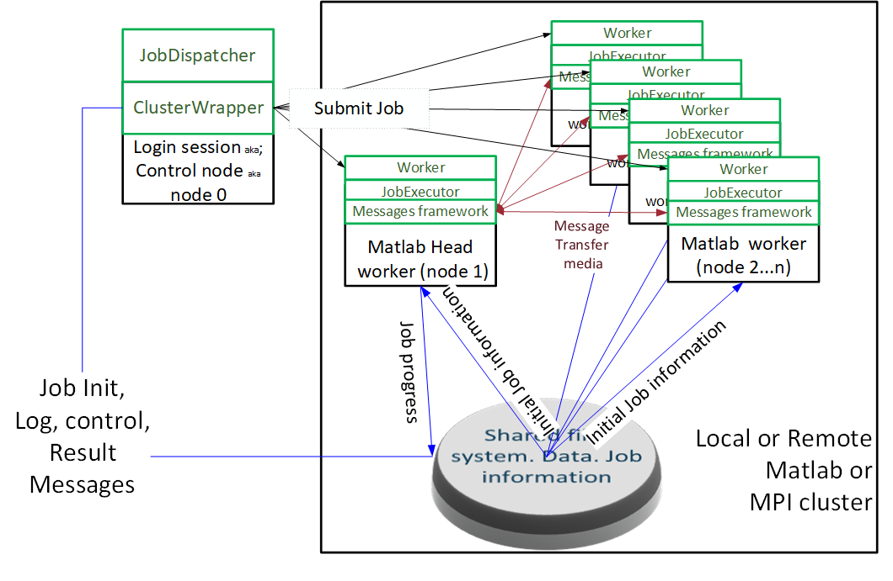
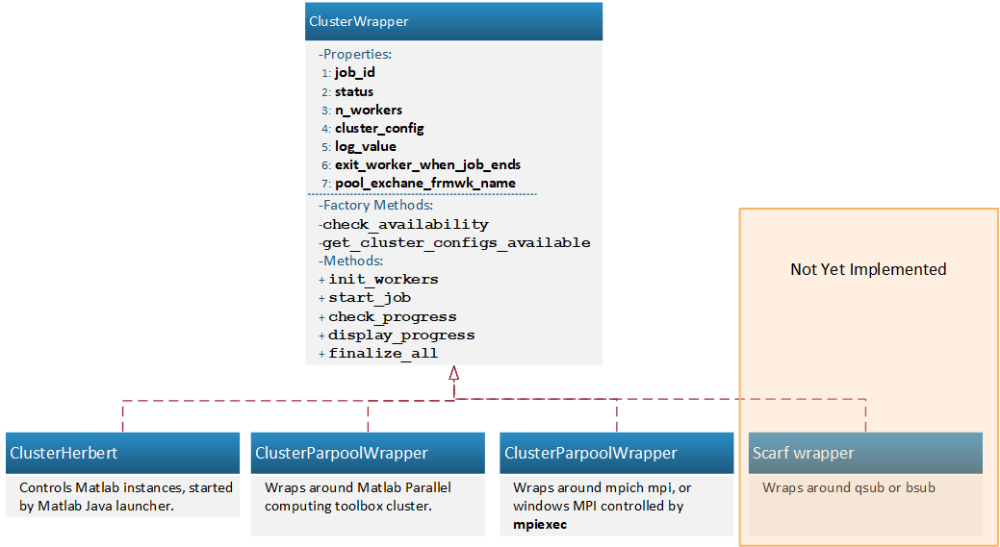
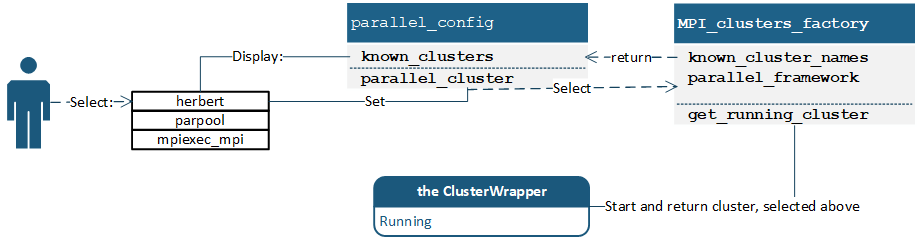
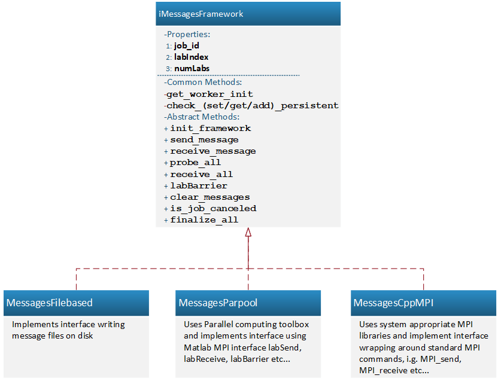
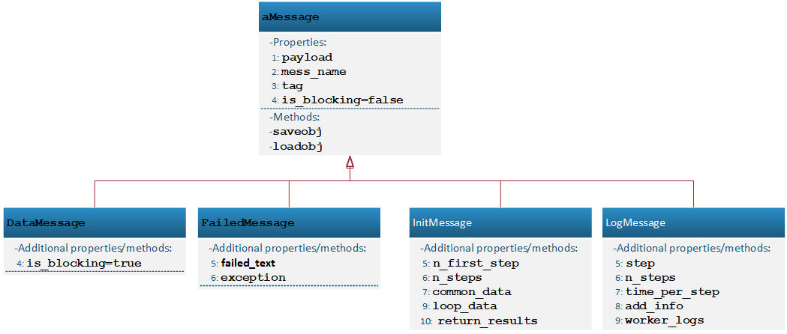

# Generic MPI Framework

A generic parallelization framework has been created for Horace to improve performance of computationally-expensive operations benefiting from parallel execution.
The framework substantially simplifies the Horace parallelization by tailoring general MPI interface to the subset of the tasks, relevant to Horace.

A standard message passing framework consists of a communicator part, which controls parallel processes and 
an information exchange medium, responsible for point-to-point or collective interaction between these processes.

To accommodate different demands of different users on different systems, Horace can utilize three different **message transfer media**, namely:

1. Communications via message files written/read from a storage device,
2. Using Matlab parallel computing toolbox MPI implementation (based on the toolbox lab`**` operations) and finally,
3. Communication using standard MPI framework. Currently supported MPI implementations are Microsoft MPI for Windows and MPICH for Linux.
 
The **communicator/controller** [[1]](https://en.wikipedia.org/wiki/Message_Passing_Interface#Communicator) parts for these media, 
responsible for controlling the parallel processes, are correspondingly:

1. Pool of Matlab sessions or compiled Matlab sessions, launched by Matlab's Java launcher,
2. Matlab Parallel computing toolbox job control mechanism and
3. **mpiexec** launcher, directly controlling standard MPI processes.
 
An additional controller will be necessary to use Horace parallelization on a public cluster. 
This controller wraps around and interfaces the cluster job submission mechanism (e.g. *qsub* or *bsub*).

Option 1) suits the users who do not want to compile C\++ code and do not have Matlab parallel computing toolbox installed.

Option 2) is best for people who have the Matlab parallel computing toolbox.

Option 3) is best for users who have acess to Herbert's compiled C++ binaries, and do not have access to Matlab's Parallel Computing Toolbox.

To provide simple switching between different frameworks, common wrappers are written around the libraries and programs controlling parallel processes and transferring the messages.
The wrappers provide common interface to user jobs. 
Horace parallel job tasks are controlled and communicate with each other using this interface, which makes them independent of the underlying communication method.

Each **communicator/controller** is responsible for correspondent **message transfer media**. The correspondence is summarized in the following table:

**Table 1.** Parallel communicators and message transfer media used by Horace parallel framework.

| communicator\media              |  Filebased |  Matlab MPI | mpiexec MPI |
| :----                           | :---:      | :---:       | :---:       |
| `Java Launcher`                 | **Native** | ---         | ---         |
| `Matlab MPI`                    | *possible* |  **Native** | ---         |
| `mpiexec MPI`                   | *possible* | ---         | **Native**  |
| `Job submission/initialization` | **Only**   | ---         | ---         |

Where the word *Native* indicates the medium a communicator is designed for (e.g. mpiexec is responsible for controlling the pool of parallel processes/programs, communicating over MPI interface). 
*Possible* means that, despite *Native* mechanisms existing, communication can be performed by alternative means, 
i.e. *mpiexec* MPI processes can communicate between each other sending file-based messages if necessary.
This usually makes sense for debugging purposes only and is described in **ClusterWrapper** classes chapter below.
The last row of the table indicates that each parallel job is initialized and controlled from the *Login Session* (**Fig 1**) using file-based messages mechanism, 
i.e. the initialization information for a parallel task. Logging of the progress and the information about the task results are distributed using file-based messages. 

The File-based framework has been written with the assumption that *job chunks may be processed independently*, 
and there are limited numbers of interprocess communications. 
This restricts the use of file-based framework to the correspondent part of Horace algorithms and for initial job submission. 
Matlab MPI and standard MPI frameworks do not have such restrictions but can not be used for job submission to the cluster.

A cluster, executing a Horace job using the wrappers should have the following simple topology: 



**Fig 1:** Cluster running Horace job with location of main software components of the parallel framework.

The diagram shows the interaction between the main hardware and software components, used to run these jobs. 
Black boxes in **Fig 1** indicate the hardware components, namely parallel processes or parallel programs running Horace software. 
Green boxes refer to the software components, running on the appropriate hardware. 
The red arrows on the picture refer to the message transfer medium, used for communication between the processes/nodes. 
Currently implemented Horace jobs mainly communicate with the *head node*, though this is an implementation detail rather than a constraint.
The frameworks allow efficient communication between nodes without any constraints. 
The Blue lines on the diagram refer to file-based message transfer, used to submit initial job and return job progress and information about the job results.
Black arrows, refer to the process of the software submission to the cluster, described in more details in the chapter on **Common initialization**.

From a user perspective, interaction with a parallel job occurs the same way as they would work with Horace analysing their data, implicitly launching parallel jobs for time-consuming operations, 
if parallel execution is configured for appropriate algorithms. 
Horace is currently written in Matlab. 
Matlab is commercial software, but for the cases the licensing requests (*) are not satisfied, we provide compiled version of this code, 
requiring only one Matlab license for the head node and [Matlab Redistributable](https://uk.mathworks.com/products/compiler/matlab-runtime.html) installed on the cluster. 
A Python wrapper around Horace code, eliminating the need for any Matlab licensing, is under development.


Generic Horace parallel job management and the interaction between software components is presented in **Fig 2**:


**Fig 2:**  Horace parallel job framework

An algorithm with parallel capabilities defines an appropriate **JobExecutor** class, 
which together with correspondent parallel configuration, defined by  **parallel\_config** class is provided to **JobDispatcher**. 
The **JobDispatcher** performs **ClusterWrapper** initialization according to the **parallel_config** 
and the chunking of jobs into parallel "chunks" using a description of the physical problem, provided by **JobExecutor**. 
**ClusterWrapper** starts the parallel cluster and takes the chunks of the job from the **JobDispatcher**, 
formatted as job initialization messages. 
**ClusterWrapper** sends these chunks to the parallel *workers*, which run independent Matlab instances, 
executing the particular **JobExecutor** job chunks and communicating between each other using the appropriate **MessagesFramework**

The components of a Horace parallel job, presented in **Fig 1** and **Fig 2** and mentioned here are described below. 

(*: one Matlab license for each execution node or Matlab distributed server license with correspondent number of nodes licenses is required)


## Interfaces

A common interface has been implemented to ensure the operation is independent of the underlying service and messaging framework. 
As we use only a limited subset of MPI operations - those necessary to our purpose - 
the interface is simpler than that of standard MPI or Matlab's Parallel Computing Toolbox.


## Job Management

#### JobExecutor:

Each independent Matlab or compiled Matlab session, controlled by any **Controller/ClusterWrapper** runs a *worker* script, which instantiates and runs **JobExecutor** class.  To run under the framework, a Horace parallel job has to inherit from the abstract **JobExecutor** class and define the main methods responsible for the particular job execution.

The methods to be defined for a job are:

**Table 2** Abstract methods of a **JobExecutor** class

| Method         | Description                                                                                                                   | Practical Example (From [*accumulate\_headers\_job*](https://github.com/pace-neutrons/Horace/blob/master/horace_core/sqw/%40accumulate_headers_job/accumulate_headers_job.m)  parallel algorithm) |
| :----          | :---                                                                                                                          | :---                                                                                                                                                                                              |
| `do_job`       | Do chunk of the job independent on other parallel executors                                                                   | Read range of tmp files and calculate this range average signal and error.                                                                                                                        |
| `reduce_data`  | Send result to head worker node (**Fig 1**)  (node 1) or receive partial result and combine them on the head worker (node 1). | Send the average signal/error to node 1 or accept partial averages, sum them and send results to the logon node for node 1                                                                        |
| `is_completed` | Check if the job completed and return true if it is                                                                           | return true                                                                                                                                                                                       |

The **JobExecutor** parent class itself contains methods and properties responsible for inter-node communication and communication with the control node which launched the job.
The *worker* instantiates a job specific instance of **JobExecutor** child class and runs the following pseudo-code loop:

```matlab
 fbMPI = FileBasedFramework.initialize(Initialization_string) % Initialize file-based framework
 initializetion_info = fbMPI.get_initialization_info();  % and obtain job initialization info,
                                                   %from the head node, running JobDispatcher

 TheJobExecutor.init(initialization_info);      % Initialized

 while ~TheJobExecutor.is_completed;
  	TheJobExecutor.do_job();           % Do chunk of the work
	TheJobExecutor.labBarrier();       % Synchronize independent processes
	TheJobExecutor.reduce_data();      % Reduce intermediate data
 endwhile
 TheJobExecutor.labBarrier();

 TheJobExecutor.reduce_send_messages(Final result); % take final result and process it
 TheJobExecutor.finish_task();

```
The main methods and properties (M/P) of **JobExecutor** involved in a job control and intertask communications are summarized in the table 3:

**Table 3** Main communication and control properties and methods of **JobExecutor** used in *worker* script

| Method or Property      | M/P | Description                                                                                                                                                                                                    |
|:------------------------|:---:|:---------------------------------------------------------------------------------------------------------------------------------------------------------------------------------------------------------------|
| `labIndex`              | P   | The id(number) of the running task (Worker Number in file-based, labindex in Matlab or MPI rank+1 for MPI framework)                                                                                           |
| `mess_framework`        | P   | Access to messages framework used for messages exchange between the parallel tasks. For file-based messages its the same as *control\_node\_exch*  but for proper MPI job or remote host it usually  different |
| `control_node_exch`     | P   | The framework used to exchange messages between MPI jobs pool and the control (login) node. Contains initialized instance of a **MessagesFileBased** class.                                                    |
| `task_outputs`          | P   | The property, containing the result of `do_job` operation to distribute to another nodes or to transfer to the headnode(node-1) for if these outputs are defined.                                              |
| *Communicator methods:* | ::  | *convenience methods, operating over defined messages frameworks*                                                                                                                                              |
| `init`                  | M   | Initialize JobExecutor's communications capabilities                                                                                                                                                           |
| `reduce_send_message`   | M   | collect similar (usually unblocking (see below)) messages send from all nodes and send final message to the head node (node 1 for nodes with N>1 or logon node for node 1)                                     |
| `log_progress`          | M   | log progress of the job execution and report it to the calling framework.                                                                                                                                      |
| `labBarrier`            | M   | synchronize parallel workers execution, deploying MPI barrier operation of the framework, used for interprocess communications                                                                                 |
| `finish_task`           | M   | Safely finish job execution and inform other nodes about it.                                                                                                                                                   |

The file-based messaging framework is part of Herbert, as such, this framework is always available. 
The input data of the particular parallel algorithm are separated into chunks and distributed to parallel workers using file-based messages.
The **JobDispatcher** class is responsible for the splitting the task and running the *worker*s instantiating user jobs, in parallel.

#### JobDispatcher:
To run the instances of **JobExecutor** in parallel, its input data have to be divided into appropriate chunks, and are sent for execution on the appropriate parallel environment. 
The class, responsible for distributing the task, controlling the parallel pool of workers, sending user job information to this pool and initial data for the user jobs, reporting the progress of the job and retrieving the job results for further use is the **JobDispatcher** class.
The main methods and properties (M/P) of this class are:

**Table 4** Main properties and methods of **JobDispatcher** class.

| Method or Property                         | M/P | Description                                                                                                                                                                                                                                                                                                                                     |
|:-------------------------------------------|:---:|:------------------------------------------------------------------------------------------------------------------------------------------------------------------------------------------------------------------------------------------------------------------------------------------------------------------------------------------------|
| **Job/Cluster identification properties:** | ::  | *Properties, used to identify the particular job and describe media, used in parallel execution:*                                                                                                                                                                                                                                               |
| `job_id`                                   | P   | The name, which describes the job, and distinguish it from any other job, may be running on a system. A folder with such name is created by **MessagesFilebased** class on a shared file system and all file-based messages, related to this job control are distributed through this folder.                                                   |
| `mess_framework`                           | P   | The instance of the file-based messages framework used for exchange between *logon* node and the cluster. Used for providing initialization information for the job, receiving log messages from *node 1(head-worker)* and returning some calculations results (See **Table 1**).                                                               |
| `cluster`                                  | P   | Exposes read access to the class, controlling cluster, i.e. **ClusterWrapper** -- the pool of independent processes or programs, to execute parallel job.                                                                                                                                                                                       |
| `is_initialized`                           | P   | true if *JobDispatcher* already controls a cluster so the next job can be executed on existing cluster rather then after starting a new one. False if the cluster is not running and needs to be started up                                                                                                                                     |
| **Job control properties**:                | ::  |                                                                                                                                                                                                                                                                                                                                                 |
| `task_check_time`                          | P   | how often (in second) job dispatcher should query the task status and report progress to user                                                                                                                                                                                                                                                   |
| `fail_limit`                               | P   | number of times to try action until deciding the action have failed                                                                                                                                                                                                                                                                             |
| `time_to_fail`                             | P   | Time interval to wait until job which do not return any messages from the cluster is considered failed and should be terminated.                                                                                                                                                                                                                |
| **Job control Methods** :                  | ::  |                                                                                                                                                                                                                                                                                                                                                 |
| `start_job`                                | M   | Taking as input the number of workers requested, job name and its input job parameters, splits the job among workers using *split\_tasks*, starts the cluster and controls the job execution, regularly querying the *cluster* on the progress of the job execution and displaying the results of the execution. Returns the result of the job. |
| `restart_job`                              | M   | Restart parallel Matlab job started earlier by *start\_job* command, providing it with new input data. The cluster to do the job must be running. Do the same as *start\_job* after that and returns the results of the new job.                                                                                                                |
| `finalize_all`                             | M   | Stop parallel processes and delete cluster. Clear all existing messages                                                                                                                                                                                                                                                                         |
| `display_fail_job_results`                 | M   | Auxiliary method to display job results  if the job have failed.                                                                                                                                                                                                                                                                                |
| `split_tasks`                              | M   | Auxiliary method, used internally by the following methods and taking as input the structure, containing the information common to all parallel workers, number of workers and cellarray of input parameters to split among the workers. Returns the array of messages, to initialize each worker of the cluster.                               |


One of the main properties of *JobDispatcher* class is *cluster* property, containing an instance of *ClusterWrapper* class, responsible for control of the pool of multiple parallel processes or programs, i.e. the *cluster*. The *JobDispatcher* controls and communicates with the cluster through the **ClusterWrapper** properties, described below. 


## Cluster Management 
Cluster classes are responsible for launching and initializing parallel workers, obtaining job progress and completing the parallel execution. 
The parent for all cluster classes is a *ClusterWrapper* class, which provides common interface for the communicators/controllers managing the parallel processes itself. 
**Fig 3** shows the *ClusterWrapper* interface and lists the current implementations of cluster classes. 



**Fig 3:** Cluster Wrappers interface and its current implementations. 

The particular implementation of a cluster overloads and expands *init* method of **ClusterWrapper**, 
which is responsible for launching the parallel process and implements the standard methods for the medium. 
The majority of the methods do not need extensive extension, as all deploy file-based messaging framework to exchange information with the cluster. 
The list of the main methods is provided in the **Table 5** below. 

Every cluster uses and may expand the *ClusterWrapper* methods used by *JobDispatcher* to control the jobs:

**Table 5** A Cluster properties and methods list:

| Method or Property              | M/P   | Description                                                                                                                                                                                                                                                                                              |
| :---                            | :---: | :---                                                                                                                                                                                                                                                                                                     |
| `job_id`                        | P     | The string, providing unique identifier(name) for the running cluster and the job running on this cluster. When cluster is running, it is the same name as *job\_id* in the *JobDispatcher*. This name is also propagated to *iMessagesFramework* below.                                                 |
| `n_workers`                     | P     | number of independent parallel *workers*, running within the cluster. Each worker is a headless Matlab session or compiled Matlab session executing *worker* script, instantiating the job.                                                                                                              |
| `status`                        | P     | Set of properties, used to control the cluster state and the job progress. Used by *JobDispatcher* to check and display the job progress.                                                                                                                                                                |
| `exit_worker_when_job_ends`     | P     | Logical property, indicating if cluster should be shut-down after the job is finished, or if it should be run waiting for the next job.                                                                                                                                                                  |
| `pool_exchange_frmwk_name`      | P     | The name of the messages exchange framework, used to exchange information between parallel workers. Normally it is the native for the cluster type message exchange framework (see **Table 1**) but file based message exchange can be set up here. Normally it can be requested for debugging purposes. |
| **Job Control methods:**        | ::    | *list of the methods, used to control the parallel job*:                                                                                                                                                                                                                                                 |
| `init`                          | M     | Accepts number of independent workers and physically start these parallel processes.                                                                                                                                                                                                                     |
| `start_job`                     | M     | Accepts the list of messages, used to initialize particular parallel job. The list is generated by *JobDispatcher*. Sends these messages to parallel processes to start the actual job execution.                                                                                                        |
| `check_progress`                | M     | Check the messages, indicating the progress of the parallel job and receive these messages.                                                                                                                                                                                                              |
| `display_progress`              | M     | Report job progress using internal state of the cluster calculated by executing *check\_progress* method                                                                                                                                                                                                 |
| `retrieve_results`              | M     | Get the results of the parallel job execution.                                                                                                                                                                                                                                                           |
| `finalize_all`                  | M     | Close parallel framework, delete file-based exchange folders and complete parallel job.                                                                                                                                                                                                                  |
| **Factory methods**             | ::    | *list of the methods, used by MPI\_fmwks\_factory to identify and work with available cluster types:*                                                                                                                                                                                                    |
| `check_availability`            | M     | the method, returning true if cluster of given type is available on given machine. E.g., check_availability  for **ClusterParpoorlWrapper** will return false if parallel computing toolbox is not installed on the given machine.                                                                       |
| `get_cluster_configs_available` | M     | a given type of cluster (except **ClusterHerbert**) may have different configurations. E.g., for **ClusterMPI** it may be *local* for running MPI on a local machine or clusters described by **mpiexec** hosts files. These files should be located in special clusters configurations folder.          |

To provide simple selection of a framework, all subclasses of **ClusterWrapper** are subscribed to framework factory **MPI\_clusters\_factory**. User interacts with the factory through **parallel\_config** configurations class:


**Fig 4:** Selection of a parallel framework. The cluster classes are subscribed to factory with the following names: **herbert:->ClusterHerbert; parpool:->ClusterParpoolWrapper; mpiexec_mpi:->ClusterMPI**

**Parallel_config** class receives a list of the subscribed and available Cluster Wrapper names from **MPI\_clusters\_factory** and the user selects the appropriate wrapper and framework. 
**Job_dispatcher** then uses the factory method **get\_running\_cluster** to start the cluster and use it for running the parallel job defined by the **JobExectutor** instance.

A brief description of the **ClusterWrappers** factory is provided in the **Table 6**

**Table 6** MPI clusters factory methods.

| Method or Property    | Access | Description                                                                                                                                                                                |
| :---                  | :---:  | :---                                                                                                                                                                                       |
| *Properties list:*    | -      |                                                                                                                                                                                            |
| `parallel_cluster`    | `RW`   | returns or accepts the name of the cluster and message exchange framework to use as default                                                                                                |
| `known_cluster_names` | `R`    | returns the list of names of the parallel clusters, defined in Herbert and subscribed to factory                                                                                           |
| *Static Method*       | -      |                                                                                                                                                                                            |
| `instance`            | `R`    | Return unique instance of the factory                                                                                                                                                      |
| *Methods*             | -      |                                                                                                                                                                                            |
| `get_cluster`         | `R`    | given the name of cluster wrapper above, return the uninitialized instance of the cluster                                                                                                  |
| `get_all_configs`     | `R`    | given the name of cluster wrapper above, return the list of configurations, available for this cluster. See **parallel_config** description on the details about the cluster configuration |
| `get_running_cluster` | `R`    | given the requested number of parallel workers, initialize and return the initialized and running MPI cluster, selected as the default cluster                                             |

The user normally interacts with this factory through the **parallel_config** class, selecting which cluster to use. 
**JobDispatcher** then uses this factory's `get_running_cluster` method to start the parallel cluster.

Each of cluster runs its own type of parallel processes. 
To be useful, the processes should normally interact with each other. 
Messages framework classes are responsible for providing common interface for message exchange within the cluster and the messages exchange between **JobDispatcher** running on the *control node (node 0)* of the user session and the *head node (node 1)* of the cluster.


## Message Framework

A message framework is responsible for handling the information exchange between independent workers. 
The messages API itself is built using very reduced subset of standard MPI API, hiding more advanced and complex details of MPI API from users. 
The information is transmitted through corresponding medium and wrapped by **Messages**, which are the instances of special *messages classes*, described in detail in the next chapter. 
The same interface is used for sending the initial job description and parameters from the *logon node* to cluster nodes, but as neither Matlab MPI nor normal MPI are available for communications between logon node and a parallel job, only the file-based framework and file-based messages are used for a job initialisation.

The parent for all message framework classes is abstract **iMessagesFramework** interface, which provides methods, common for all message frameworks, and defines the interface for the methods, which need different implementations.



**Fig 5:** Messages Framework

Each message framework natively works with appropriate cluster wrapper. 
This is why no independent factory exists to select framework as, by default, each cluster uses its native framework. 
The **ClusterWrapper** property  *pool\_exchange\_frmwk\_name* can be used to set the **MessagesFilebased** framework to perform exchange between independent workers. 
This is a very inefficient mechanism which should be used for debugging only.

Main Messages Framework methods are provided in the **Table 7**

**Table 7** Main message framework methods and properties.

| Method or Property          | M/P   | Description                                                                                                                                                                                                                                                                                                                                                                                                                                                            |
| :---                        | :---: | :---                                                                                                                                                                                                                                                                                                                                                                                                                                                                   |
| `job_id`                    | P     | The string, providing unique identifier(name) for the running cluster and the job running on this cluster. The same ID as the one used in **ClusterWrapper** (it picks up the value from the messages framework) and **JobExecutor** (synchronized through **JobDispatcher**)                                                                                                                                                                                          |
| `labIndex`                  | P     | The number of parallel process, used to identify the particular parallel worker.                                                                                                                                                                                                                                                                                                                                                                                       |
| `NumLabs`                   | P     | Total number of workers in the parallel pool.                                                                                                                                                                                                                                                                                                                                                                                                                          |
| `time_to_fail`              | P     | Time in seconds a system waits for blocking message until returning "not-received" (and normally throwing error)                                                                                                                                                                                                                                                                                                                                                       |
| `throw_on_interrupts`       | P     | The property defines framework behavior in case when interrupt message (canceled or failed) received through the network. Normally this means that all processing would be completed and worker shut-down so exception would be thrown. When the framework is gathering information on exceptions to report issue to user, interrupt messages are received to be processed by framework to return the diagnostics to users. The property in this case is set to false. |
| **Common service methods:** | ::    | *Methods, used by all frameworks regardless of the framework type:*                                                                                                                                                                                                                                                                                                                                                                                                    |
| `build_worker_init`         | M     | Generate ASCII string, used for initialization of all workers. See **Common initialization**                                                                                                                                                                                                                                                                                                                                                                           |
| `get_interrupt`             | M     | Check if an interrupt message was received before and return it. See **Interrupts** below.                                                                                                                                                                                                                                                                                                                                                                             |
| `set_interrupt`             | M     | Check if the input message is an interrupt message and store interrupt message in the interrupt buffer. See the chapter **Interrupts** below.                                                                                                                                                                                                                                                                                                                          |
| `retrieve_interrupt`        | M     | Helper method used to add interrupt messages to the list of the messages, received from other labs if interrupt message has been received before. Wrapper around `get_interrupt`. See the chapter **Interrupts** below.                                                                                                                                                                                                                                                |
| **Abstract methods:**       | ::    | *The methods, exposing interface to MPI communications. Implementation is specific for each framework:*                                                                                                                                                                                                                                                                                                                                                                |
| `init_framework`            | M     | Given input data, necessary for framework initialization, make framework operational. E.g. for file-based framework it may be name of the folder and the id of the current parallel worker when for MPI framework, this command wraps C++ *MPI_init* command, which defines the worker ID and number of workers (MPI rank and MPI pool size).                                                                                                                          |
| `send_message`              | M     | send message to a specified worker. Unblocking or pretends to be unblocking.                                                                                                                                                                                                                                                                                                                                                                                           |
| `receive_message`           | M     | Receive message from the specified task. Depending on the requested message type it can be blocking, unblocking or persistent message (see **Messages types** below). The user can explicitly request synchronous or asynchronous operation providing appropriate option ['-synchronous'!'-asynchronous'] See also **Note [^1]**                                                                                                                                       |
| `probe_all`                 | M     | list all messages existing in the system from the tasks requested. Non-blocking                                                                                                                                                                                                                                                                                                                                                                                        |
| `receive_all`               | M     | receive all messages directed to current node and originated from the tasks with id-s specified as input. Non-blocking if issued without any message name or with keyword *any* and blocking if a requested message name is specified. The user can explicitly request synchronous or asynchronous operation providing appropriate option ['-synchronous'!'-asynchronous']                                                                                             |
| `labBarrier`                | M     | synchronize parallel worker execution and wait until all independent workers arrive at the barrier.                                                                                                                                                                                                                                                                                                                                                                    |
| `clear_all`                 | M     | receive and reject all messages, directed to the current node including interrupt messages. Used to finish current **JobExecutor** task, and prepare cluster to run another job.                                                                                                                                                                                                                                                                                       |
| `finalize_all`              | M     | shut down parallel framework and parallel cluster.                                                                                                                                                                                                                                                                                                                                                                                                                     |


A Horace job uses the relevant implementation of  **iMessageFramework** and uses the methods, defined in the interface above to communicate with neighbouring workers when it becomes necessary according to an algorithm's logic. 
Some coarse logic, providing basic communications and synchronization is implemented in the *worker* script.

[^1]: The developer should expect that error may happen during a worker execution, and a *Fail* or *Canceled* message can be sent from the client instead of regular exchange message. 
If a *receive_message* command is issued in synchronous mode, the frameworks based on the real MPI exchange checks for interrupt once, and enters into synchronous MPI read or wait state, waiting appropriate synchronous message to appear. 
If an interrupt message has been sent instead regular message, indicating error or cancellation issued by other parallel worker, the receivers remain waiting for initial message state. 
An interript messge usually indicate a critical failure so the framework will be canceled through parallel interrupt, but if this is not happening, the parallel worker will hang up. 
The *receive_all* method should be used instead of *receive_message* in any situation where synchronous receive can be interrupted. 
The *receive_all* method will also fail on time-out if the requested syncronous message is not sent within the expected time interval.


#### Common initialization.

Different frameworks launch different types of parallel processes but each process should know what sub-task it needs to perform. 
The job description can be very different in size, so it is better to provide such description by writing appropriate description files. 
Command line arguments are used to provide each parallel worker with information about the location of a folder, where the job initialization information is placed on a shared file system plus some auxiliary information. 
Currently auxiliary information contains the name of the *message framework* used for communications between workers and worker number (*labNum*) for file-based messages framework. 
To avoid issues with different frameworks and different operating systems processing non-ASCII characters in a command line differently, the location information is encoded into single ASCII-128 string using standard Java base64 encoder. 
The *build_worker_init* method of **iMessagesFramework** performs the encoding of the input initialization information for further transfer of this information to parallel workers using command line arguments of correspondent job.

#### Interrupts or Persistent messages.

Independent workers may need to report to the other workers some special conditions occurring during their execution. 
Such conditions currently result in a failure (an interrupt is raised at code execution). 
We use Persistent messages aka Interrupt messages to distribute information about such states of the system as parallel interrupts, as MPI interrupts used for these purposes in standard MPI frameworks are not available in all parallel frameworks. 
Such a message, received by a worker from other worker, block all further communication with this worker. 
All requests for information from this worker result in the persistent message (*failure*). 
This state holds until special command (*clear_all* above) is executed by the receiving worker.

#### Messages types.

Different operations can be handled using different types of messages. There are 3 main types, differentiated in Horace.

1. Logging, diagnostics and informing user about progress of a job.
2. Interprocess data exchange, necessary for performing a particular user job and
3. Information about error or failure.


Corresponding types of messages created to serve these purposes:

1. Non-blocking (transient)  messages. Informing user about a job progress is an important task, but often the user is interested only in the final value.
   Different independent tasks should not be synchronous with regard to log messages as only some average progress is required. 
   Non-blocking messages are best suited for such kind of task. 
   If more then one non-blocking message is present in the MPI messages queue, the client receives only the last message.
3. Blocking messages are necessary to transfer information between independent workers when the result of calculations on a single node depends on the results on other nodes.
4. Persistent messages necessary to indicate some critical conditions or error states, as, for example, 
   parallel interrupts available in MPI are not available in file-based messages system (*ClusterHerbert*) and not accessible for Matlab MPI (*ClusterParpool*). 
   Persistent messages are used to carry such information. 

To provide the described flexibility and variability of messages, all messages used by Horace MPI are children of **aMessage** class and subscribed to a messages factory (see below). 

## Messages class and messages factory.
### Messages:

To information transferred between independent workers is wrapped into message classes, which are the children of **aMessage** class. 
The information for the transfer is the job specific data, assigned to the *payload* property.
Any Matlab data can be assigned to the *payload* property. 
The only requirement is that the data are  serializable, i.e. it is either basic Matlab data type or a class which have *saveobj/loadobj* methods or can be correctly converted into/from a structure.

The appropriate processing of messages data (see the **Messages types** above) is assured by different message classes. 
The simplest messages classes are just instances of **aMessage** class with different names, indicating different states. 
An example of such messages are the `starting`  or `canceled`  messages, indicating the appropriate states of the program. 
Some messages need additional functionality, so additional properties are defined for the subclasses, describing these messages. 
Any message class - subclass of **aMessage** class must follow the naming convention *`MessageClassName = [MessageName, 'Message']`*. This convention is enforced by messages factory  **MESS_NAMES**, where each message is subscribed by its meaningful name (lower case of `messagename` of the message class name). 
The factory is described in the next chapter. 
Current family of specialized message classes is presented in **Fig 6**




**Fig 6** Existing family of messages classes

All additional properties and methods of the overloaded classes needs to be just a convenience methods to get or change appropriate parts of the *payload* property below.

**Table 8** describes the main properties of the message class:

**Table 8** Main properties of **aMessage** class:
| Method or Property | M/P   | Description                                                                                                                                                                                         |
| :---               | :---: | :---                                                                                                                                                                                                |
| `payload`          | P     | The property to accept any information, relevant to the particular job. The information has to be serializable.                                                                                     |
| `mess_name`        | P     | The string, containing meaningful message name. Used to distinguish different messages from each other                                                                                              |
| `tag`              | P     | The number, assigned to the message class at subscription to the factory, and used in the transfer of messages through standard MPI interfaces instead of the message name to identify the message. |
| `is_blocking`      | P     | If message is blocking message, so the program requesting it should wait until the message is received. (see **Messages types** of previous chapter)                                                |
| `is_persistent`    | P     | True if the message contains the information about critical task state, i.e. describes interrupts (see **Messages types** of previous chapter)                                                      |
| `saveobj`          | M     | convert message into a serializable structure                                                                                                                                                       |
| `loadobj`          | M     | build message from the structure, obtained by *saveobj* method                                                                                                                                      |


Algorithms which need to send a message, instantiate an appropriate message by its constructor. 
The constructor of **aMessage** class calls the **MESS_NAMES** factory, checks the message subscription and verifies if the correct message constructor has been invoked. 


### MessagesFactory:

The messages factory contains common information about all messages, defined in the system. 
Currently messages factory is responsible for associating message names with message tags, identifying and verifying the specific message classes, presented in **fig 6** and allowing instances of **aMessage** class only for the messages, which do not have specialized class overloads.
To do that, all messages, used by Horace are subscribed to the messages factory class **MESS\_NAMES**.  
The messages are subscribed to factory by their meaningful name *mess\_name*. Currently, the following message names are defined:

 *'any','completed','pending','queued','init', 'starting','started','log', 'barrier','data','canceled','failed'*
 
Where *any* is not a message, but the name, related to the tag, referring to any message in the system. 
Not all messages are used by every framework. 
For example, `barrier` message is used by **MessagesFilebased** framework only, as other frameworks use MPI specific command `barrier` to achieve process synchronization. 

There is agreement within the frameworks code, that the 'any' message has tag -1. 
As Matlab MPI does not accept negative tags, the Herbert framework tags are shifted internally to get valid Matlab tags and Matlab tags are shifted back at receive to be consistent Herbert framework tags.

The messages which do not have defined message class are created as instances of **aMessage** class with a specific message name. 
For example, messages which identify task initialization process and the end of a task initialization are **aMessage** classes instances with the names *starting* and *started*. 
These messages are instantiated by calling **aMessage** class with the appropriate name, namely **aMessage(`starting`)** or **aMessage(`started`)**.
*log* messages containing more advanced information about the progress of the job needs to be initialized by their own constructor **LogMessage(step,n\_steps,step\_time,add\_info)** (see the class documentation describing the log message parameters meaning). 
As the class for *log* message exist, log messages can not be instantiated by simply calling **aMessage('log')** class. 
**MESS\_NAMES** factory, called within **aMessage** class constructor, would throw error on such attempt.

Main methods, defined by Messages factory are summarized in the **Table 8**.
All methods of the factory are static methods.

**Table 9** Main methods and properties of the **MESS\_NAMES** factory.

| Method or Property | M/P   | Description                                                                                                                                                                     |
| :---               | :---: | :---                                                                                                                                                                            |
| *Properties*       | -     | *Read-only class properties accessible through the instances of* **MESS\_NAMES**  *factory:*                                                                                    |
| `known_messages`   | P     | list of the messages, registered with the factory.                                                                                                                              |
| `is_initialized`   | P     | true when messages factory is initialized. Used by factory initialization algorithm.                                                                                            |
| `interrupts`       | P     | List of the message names, used as interrupts (see message types)                                                                                                               |
| `interrupts_tags`  | P     | List of the tags for messages, used as interrupts.                                                                                                                              |
| *Class methods:*   | -     | *methods, accessed through the instance of the* **MESS\_NAMES** *class:*                                                                                                        |
| `is_registered`    | M     | true if the message with the name, provided as input is registered with the factory                                                                                             |
| `is_subscribed`    | M     | check if the message with name provided is subscribed to the factory (Used in factory initialization as valid message always subscribed when the factory is fully initialized.) |
| `get_mess_class`   | M     | get empty message class instance for the message name, provided as input.                                                                                                       |
| *Static methods*   | -     |                                                                                                                                                                                 |
| `instance`         | M     | get access to a single unique instance of the  **MESS\_NAMES** class                                                                                                            |
| `get_class_name`   | M     | returns message class name, corresponding to the message name provided. (Either specialized class name **NameMessage** if available or name: **aMessage**)                      |
| `mess_id`          | M     | returns the message tag from the input message name                                                                                                                             |
| `mess_name`        | M     | returns the message name from the input message tag                                                                                                                             |
| `tag_valid`        | M     | verify if the tag provided as input is a valid message tag.                                                                                                                     |
| `is_blocking`      | M     | true if the message, described by the input message name is a blocking message                                                                                                  |
| `is_persistent`    | M     | true if the message described by the input message name is a persistent message                                                                                                 |

## Parallel configuration

The optimal setup, needs to be identified for given hardware and software, along with the appropriate message framework and other parallel settings. 
These should stored and used for all subsequent calculations on a given computer. 
The **parallel\_config** class is used to store this configuration and return chosen settings to the appropriate factories. 
The class is the child of **config\_base**, providing the ability to save appropriate values to the configuration files and load and return these values on request. 

The properties of the **parallel\_config** class provides are listed in **Table 9**

**Table 10** Parallel configuration settings.
| Property                  | R/W^1 | Description                                                                                                                                                                 |
| :---                      | :---: | :---                                                                                                                                                                        |
| `worker`                  | `RW`  | The name of the script or program to run  on cluster in parallel using parallel workers.                                                                                    |
| `is_compiled`             | `R`   | false if the worker is a Matlab script and true if this script is compiled using Matlab applications compiler.                                                              |
| `parallel_framework`      | `RW`  | The name of a parallel framework to use. Currently available are **`h[erbert]`**, **`p[arpool]`** and  **`m[pi_cluster]`** frameworks.                                      |
| `cluster_config`          | `RW`  | The configuration class describing parallel cluster, running selected framework                                                                                             |
| `shared_folder_on_local`  | `RW`  | The folder on your working machine containing the job input and output data                                                                                                 |
| `shared_folder_on_remote` | `RW`  | The folder where shared data should be found on a remote worker as accessed by remote worker itself                                                                         |
| `working_directory`       | `RW`  | The folder, containing input data for the job and tmp and output results should be stored. Needs to have the same view from the local and remote workers *(inconsistency?)* |
| `known_frameworks`        | `R`   | Information method returning the list of the parallel frameworks, known to Herbert and available on the machine                                                             |
| `known_clust_configs`     | `R`   | Information method returning the list of the clusters, available to run the selected framework                                                                              |


^1 `RW` -- read-only `(R)` or read/write `(RW)` access to the property.

## MPI state helper

The code, used by MPI framework must also be able to run serially. 
The serial implementation may be complex and it is desirable to make minor changes to the serial code to accommodate parallel execution. 
As mentioned above, the parallel code needs to inherit from **JobExecutor** class, and it is inconvenient to modify the interface of the serial functions, to get access to generic methods of the **JobExecutor** class within the initially serial code (e.g. to deploy MPI logging functionality when the code runs in parallel).

The class **MPI\_State** is written to address this issue. 
The class is a singleton, where *parallel\_worker* sets the property *is\_deployed* when the code is run under any of the parallel frameworks used by Horace. 
In addition to that, the **MPI\_State** receives the references to the functions, most useful within the serial code. 
These functions currently are *log_progress* and check if the parallel job *is cancelled*. The serial code then modified with the checks like:

```matlab
if MPI_State.instance().is_deployed
	if MPI_State.instance().is_cancelled
		throw error -- parallel job is cancelled
	else
		MPI_State.instance().log_progress() % to parallel framework
	end
else
	report serial job progress to user
end
```
to adapt its behavior to a parallel environment. 

In addition to that  **MPI\_State** gets from the *parallel\_worker* and provides to the particular code accessors to the parallel framework, used for message exchange between workers. The usage of direct MPI methods within mainly serial code is undesirable as it makes serial code substantially parallel, but may be still necessary for the particular purposes and particular jobs.

## Some details of implementation and operations
### Error processing
On error, user job, performed by job executor throws appropriate exception. 
This exception is intercepted in parallel_worker and processed by **JobExecutor**'s *process_fail_state* method. 
The method checks exception and if this is not **PARALLEL_FRAMEWORK:canceled** exception, sends to all other workers *CanceledMessage* and finishes failing task.
The cancellation message is always identified as incoming by *probe_all* method and received instead of any other expected message, by any framework *receive* method. If message received within **JobExecutor** *receive_all* method, the **PARALLEL_FRAMEWORK:canceled** exception is thrown by parallel worker. 
This exception, caught within its parallel worker, finishes approptiate task. 
If user receives messages using a framework *receive* method directly, or sets up framework property *throw_on_interrupts* to false, he has to organize custom processing of possible *CancelMessage* reception.

### Interrupts storage
Received interrupts are stored in a cache with keys corresponding to task-id the interrupt has been received from. 
The purpose of this is to provide better diagnostics of the reason for the interrupt. 
The logic on failure is that on receiving interrupt message, framework throws **PARALLEL_FRAMEWORK:canceled** exception, which is handled by the *finish_task* method of **JobExecutor**. 
The *finish_task* method at normal execution synchronously waits for **completed** messages from all parallel workers. 
In case of failure, these messages are appropriate interrupt messages, received from the corresponding tasks. 
This is the idea behind the cache, but for some reason it works even without the interrupt cache. 
Maybe it's just random passing or may be interrupt cache is unnecessary complication.

### Messages channels
To understand framework operation it is convenient to assume that the framework implicitly organizes message propagation using three channels, namely synchronous, asynchronous and interrupt. 
Any receive operation scans an appropriate (synchronous or asynchronous depending on message type) channel along with the interrupt channel and returns information. 
Synchronous receive waits for a message to appear, where asynchronous returns empty if nothing is available at the moment when the request has been issued.
