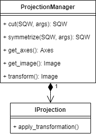

# SQW Redesign

## Overview

The SQW object holds neutron scattering experiment data and provides methods that manipulate, slice and project the data and generate model fits using third-party functions.

The object also provides an interface to Horace "sqw" data files which can be interchanged with external applications and a public API.

The object exists in two distinct forms: 

- "SQW" which contains all experimental data and the detector pixel array,
- "DND" which contains only processed neutron image data

which are treated by Horace as 'first class citizens'. They share a common API where that is appropriate. In an SQW object, operations are performed on the pixel array data and the current image data recalculated from this. For DND objects the operations are performed directly on the image data. In addition, the extra information and raw data contained on the SQW object allows a scattering model to be fitted.

## Redesign issues

A redesign of the SQW object is undertaken in the PACE project. It addresses (at least) two issues:

1. The object exists in two distinct forms: 
   - "SQW" which contains all experimental data and the detector pixel array,
   - "DND" which contains only processed neutron image data

​		While conceptually these two forms remain distinct, over time the interdependence of their implementations has grown, and to support further development of the object it is desirable to refactor the objects to remove such interdependence.

2. Their data includes representations of the instruments, detectors and samples (collectively, components) producing this data - these are used in the Resolution/Convolution form ("Tobyfit") of the fitting algorithms, which fit model calculations to the data including uncertainties due to the components. These components in principle are duplicated in two ways:
   * an experiment consists of a number of runs, and while in principle all components may change between runs, in practice the same components are often used across a number of runs. If duplicates of the components are created for each run, memory usage is increased unnecessarily
   * when a cut is taken from the data, a new SQW object is created, and again the components may be duplicated. 

## Document scope

The remainder of the document covers the following:

1. Main classes. Description of the class hierarchy for SQW and DnD objects
2. Subclass details. Description of the new packaging of header data into Experiment, Instrument and Sample classes, and the places where duplication can occur.
3. Removal of duplicate objects. Goes into some detail about where duplicate object removal should occur, and what Matlab mechanisms will allow objects to remain unduplicated.
4. Other property objects. Describes the remainder of the data in the SQW object.
5. Pseudocode. Sketches various workflows in pseudocode form.

# Main Classes

The following diagram shows the overall interaction of the refactored SQW/DnD objects, showing how they interrelate via the common base support class SQWDnDBase. It is followed by a more detailed description of its sub-classes


### SQWDnDBase

Abstract base class for the SQW and DND objects.

This includes the image data and main header information, available in both the `SQW` and `DnD` classes.

This class also includes common methods, in particular the large number of unary and binary operations which are implemented as calls to operations managers which will be defined in the implementing classes.

### SQW

The `SQW` object provides the public API to data. Data manipulations are performed on the `PixelData` and `Image` is recalculated.

This class includes the full experiment data including the raw pixel data and details of the instrument and detectors.

The "header" property of the previous design consisted of a cellarray of size the number of experimental runs, each giving for one run appropriate parameters for the run. This included the instrument and sample descriptions. The detector descriptions were provided in the separate property "detpar" (considered to be a minimalist description.)

In the design diagrammed below, "header" and "detpar" have been refactored into  properties of a single object of class Experiment. The instrument and sample parts of "header" have been extracted into two collections of class IX_inst and IX_sample objects. In the diagram there is still one such object of each for each run: that is, removal of duplicates has not yet taken place. The remainder of the data header structs for each run has been included in the IX_Experiment class. 

The refactor of detpar into a set of IX_DetectorArrays has not yet been done, and there is still a "detpar" property in the SQW object.

The use of the Header object property in Experiment is not yet defined.

These classes are detailed further below.


### DnDBase, DnD

The `DnD` object is a "cut-down SQW" object containing only `Image` data. This exists in n-dimensional forms, with each class extending an abstract base class. The `PixelData`, `IX_Instr`and other components, and `IX_DetectorArray` information is NOT included.

Any data manipulation operations are performed directly on the `Image` data.

The `DnDBase` base class is an abstract class holding the common code for all the individual D[0-4]D objects; this includes the operation manager which is responsible for matching dimensions between the specific `DnD` objects before executing.


# Subclass Details

Note that the capitalisation is not yet consistent between figures, text and code.

### Main Header

The `MainHeader` object contains high-level metadata for the `SQW` or `DND` object, including the dataset title and file location. It is currently a struct with these properties. If this is converted into a more specific class object, this will not be done until the remainder of these refactors have been completed. At the moment it is unchanged from the previous SQW class design.


### Experiment

The Experiment object wraps all data relating to the sample, instrument and experiment conditions. This makes use of the `IX_xxx` classes (see below).

This data should all be available from the Mantid `.nxspe` file. However, it is likely that there is data missing in the current Mantid spec or not populated, so a method will be created to load that data from another source. In the first instance this will be a custom data file (1).

The `.nxspe` files include properties labelled `instrument` and `sample`. However these are not intended to be instrument or sample properties using the `IX_instr` or `IX_sample` classes described below; rather they are free-format structures and are unspecified. When `.nxspe` files are read into Horace, they are converted to `Rundata/h` objects with the same properties, again with the same unspecified free-format structures. 

At the moment `instrument` and `sample` are imported into the SQW object without checks on the data in these properties. Under the changes noted below, it is expected that empty structs for either of these properties will be converted into `IX_null_xxxx` properties, to ensure a clear statement of purpose (empty structs are ambiguous, empty classes i.e. those returning true from `isempty()` almost as much since Matlab variables are automatically sized containers), and to distinguish them from whatever is coming in via `Rundata`.

**Notes**
(1): the format of this datafile is TBD. To ease the eventual integration with Mantid a Nexus/HDF5 file or some other structured data that maps easily into the HDF5 format should be used.

####  Instrument specification (`IX_inst`)
The instrument classes contain the information about the components that make up the instrument pre-sample, including the choppers, moderators and incident beams. Specific instrument classes (`IX_inst_DGfermi` and `IX_inst_DGdisk`) already exist, distinguished by their chopper type, and also specifying moderator and aperture. At present these are completely distinct types. It may be that some refactoring into a common superclass `IX_DGchopper` could be useful, but that is beyond the scope of this document. Rather the aim is to ensure that other instrument types can be added in as required.

At the moment a separate instrument description is stored for each run in an array or cellarray of polymorphic superclass objects of class `IX_inst`, which is the (abstract) superclass of `IX_inst_DGfermi` and `IX_inst_DGdisk`. It is intended that this will be replaced by a reduced-size array of unique instances only, and an index to these will provide the relevant instrument object for each run. The details of the reduction to unique instances is given below.

For the cases where no instrument information has been given, a class `IX_null_inst` (subclass of `IX_inst`) is used to mark the existence of an instrument. This provides minimal properties, but will have at least a `name` property which can be used to label the data source if required.

#### Detector information (`IX_DetectorArray`)
The detector information class contains information about individual detector elements and their geometry. The data in this object will change when calibrations are performed or elements replaced or serviced as part of regular maintenance tasks. 

Multiple definitions can be defined in the `IX_detector_array` and indexes in the `header` class associate data points with specific values.

This use of `IX_DetectorArray` has not yet replaced `detpar`.

#### Sample information (`IX_sample`) 
The sample class contains properties for the sample orientation, lattice parameters and lattice description (Hall symbol), and temperature. It is expected that all samples with defined properties will be of the same class, differing only in property values, although this could change, and the proposed design will permit this.

As with instrument descriptions, sample descriptions coming from `.nxspe` files via `Rundata/h` objects will be free-format structs which may be empty. To preserve the concept of sample objects, samples in SQW objects coming from such undefined data will be represented by `IX_null_sample` objects which will have the minimal properties of `name` (to provide a label for basic information) but also the lattice parameters `alatt` and `angdeg`. This is because this information was originally present in the header structure for each run,  and so will be available independent of what comes in from `Rundata/h`.

Similarly to `IX_inst`, samples will be stored as a polymorphic array or cellarray of (abstract) base class objects of class `IX_samp`. 


#### Experiment information (`IX_experiment`)

The remainder of the information from the original header structs has been transferred to IX_experiment objects, currently one for each run. This includes about the goniometer position data and energy.

Notes: 

(1): this is a new  `IX_xxx` class


## Removal of duplicate objects

Populating the instruments of the SQW object can happen at a number of points in the overall Horace workflow. There also needs to be a mechanism to identify and remove the duplicates while remembering which run goes with which unique object.

### Workflow for instrument creation in gen_sqw

An ideal workflow for the population of an SQW object with a number of different instruments is the following:

1. At the stage of `gen_sqw` execution, a sequence of `Rundata/h` objects (created from `.nxspe` files with whatever additional information is furnished at the time) is converted into run data within the SQW object.
2. The instrument description for each run in turn is converted into an appropriate `IX_inst` sub-class object.
3. A list of unique instruments so far has been constructed. The new object is compared against  each unique instrument in turn, for class, equality of components, equality of parameters. If a match is found, the index of the match is stored against the current run. If not, the object is stored as a new unique object, and its index is stored against the current run.
4. Clear the new object. Presuming that copy on write leaves whatever was copied in the list of unique objects in place after the clear instrument step.

Comments:

1. It is unclear to what extent indexing into the unique object list creation is needed. It is assumed that the instruments are value classes rather than handle classes. As such they are subject to CopyOnWrite. Consequently, at stage 3 above, rather than store an index to the object, it would be enough to copy the unique object directly into the current instrument slot rather than store an index to it. The major reason for preferring an index is to enable the user to keep track of the copying process as it would otherwise not be possible to distinguish objects that are actually the same object in memory from those that are merely identical. But see below for populating immediately before Tobyfit.

### Workflow for instrument transfer when creating a cut

The process of creating a cut produces a new SQW object with copies of the instruments from the original SQW object. As such copies are produced by the CopyOnWrite mechanism, then provided the new instrument objects are not subsequently modified, they will internally be references to the original objects and initially no new objects will be created in memory.

Comment: This presumably works with the current design, hence while objects are currently copied in creating the original SQW object, no additional memory copies should be created on producing a cut. This is subject to the analysis of the next step.

### Workflow for adding instruments immediately before Tobyfit

As previously noted, instrument descriptions may not be available on initial creation of the SQW object, and the user may wish to populate the instrument descriptions later, when deciding to do a resolution/convolution fitting. This may also happen because, having examined the completed set of results, it proves necessary to reset instrument descriptions to improve calibration.

An issue here may be that the cuts to be fitted have already been taken. In that case the cuts will not have had the instrument information copied from the original SQW object, and populating the instruments in the cuts from the original SQW is not so obvious.

A simple solution would be to populate the original SQW object as above, and transfer the unique list and the indexes to the cut objects - thus providing a preference for indexing. The indexes will match the number of run objects and then index into the new instrument set.

It is obviously necessary for the objects to be added to the SQW in the correct and consistent order. We need to devise a protocol for this to happen, and a supporting class to implement it. Design of this class will be deferred until we have a clear picture of the workflow used by users when they add these objects at this point.

### Other component types

Obviously samples can work in the same way.

### Removing duplicates

An existing class in Herbert, `object_lookup`, already exists to perform this function, and it is proposed to reuse it.

## Other property objects

#### Header

The `Header` object contains the mapping from the `PixelData` to the appropriate array elements of the instrument, detector, experiment and sample arrays specific to each contributing neutron measurement. This configuration supports recalibration of detectors and changing experiment conditions to be handled.


### Pixel Block

Contains the "raw" pixel data expressed as crystal Cartesian and detector index form.

Provides methods to "get contributing pixels" for any subset of image pixels as well as get/set methods for each column or block of columns, e.g. `get_signals()`, `get_coordinates()`, `get_energy_ids()` and the number of pixels.

Custom data may be stored per-pixel in a named elements `get_data(name): array[num_pixels,num_cols]`.

The same `get_data(name)` method can be used to provide access to the "standard" data (e.g. `get_data("signal")`)

|  | Description | Notes |
|-----|---------|---|
|u1, u2, u3, dE | coordinate in crystal Cartesian lattice (a\*, b\*, a\* x b*, dE) | (2) |
| iRun | index into headers array for run (source file) |(1)|
| iDetector | index of pixel detector |(1)|
| iEnergy | index of energy bin | (1) |
| signal | Correlated intensity ||
| variance | Intensity variance ||

**Notes**
(1): the triple of indexes uniquely identify the detector element corresponding to this pixel and are an alternate representation of the (u1, u2, u3, dE) data.

(2): pixel data are ordered by IMAGE PIXEL. If projection is applied the IMAGE PIX ARRAY IS REORDERED

(3): existing binary data format must be extended to include additional "number of columns" field (&ge;9) information and the file read/write routines updated to read from an array of `n` columns.


### Image

Represents the n-dimensional array of image pixel data with associated axis information. 
Image pixel data is generated from the `PixelData` via one or more projections.

|  | Description | Notes |
|-----|---------|---|
| signal[] | Mean intensity, calculated as `Sum(pix_signal(k))/npix(k)` | (1), (2) |
| err[] | Average error, calculated as  `sqrt(Sum(pix_variance(k)/npix(k)))` |(1), (2) |
| npix[] | Number of detector pixels contributing to each image pixel ||
| uoffset[] | Offset of pixel projection axes origin | (3) |
| u_to_rlue\[\]\[\] | Matrix of pixel projection in hkle | (3) |
| ulen[] | Length of pixel projection axes Ang^-1 or meV | (3), (4) |

The `Axis` classes describes image axes
- value range
- unit vectors
- units
- matrix mapping these axes to the pixel data
- requires a well-defined mapping from image pixels to source data pixel

**Notes**
(1): if the image data is updated, e.g. after a slice or projection, the backing pixel data must be updated/reordered
(2): `pix_signal` represents the array of pixel signal data from which this image data was derived, `pix_variance` the array of pixel variance.
(3): uoffset and ulen are 4x1 vectors and u_to_rlue is a 4x4 matrix, with the four coordinates are always assumed to be (u1, u2, u3, dE) in that order.
(4): u1, u2, u3 have units of Ang^-1, dE has units of meV.

### Projection Manager

The `ProjectionManager` class will manage all projection operations.



Responsible for all image projections - this includes symmetrization and simpler data operations:

- Crystal Cartesian to h,k,l,
- arbitrary rotation,
- arbitrary offset,
- plane cuts
- spherical cuts
- cylindrical cuts

Operations result in the creation of a new SQW/DND object and are performed to the Image Pixels using data from the backing `PixelData`.


### Operations

#### Generate SQW file

Combine multiple experiment [data files](http://horace.isis.rl.ac.uk/Input_file_formats)  (pairs of legacy `.spe` and `.par` files, or `.nxspe` files from Mantid) into a single SQW object. 

1) `.nxspe` / `.spe` (per-run) data files are converted to intermediate `.sqw`-format data files. Pixel data is ordered by "image pixel" buckets. There is *no aggregation of signal/err data* in this step.

2) Intermediate files are combined on a image-pixel bucket basis to produce the final `.sqw` file. 

#### Read/Write

- Read the file data, but not pixel data

- Read the pixel data or an m-dimensional cut of the pixel data
- Read the pixel data corresponding to specific image pixels
- Write the pixel data for specific image pixels
- Write all pixel data
- Support for legacy Horace file format 
- Support for a new NeXus / HDF5 format `.nxsqw` (tbd)
- Display data to console ('display')
- Export data to ASCII file ('save_xye')

#### Data manipulation

- Basic arithmetic operations on object data. 
- Cut -- extract a N-dimensional subset of pixels
- Projection -- aggregate pixel data onto an M-dimensional surface (M &le; N). This should support projections onto planes and spherical shells (TBI) and spiral slices (TBI) as well as reorientations.
- Symmetrization -- enhance signal-to-noise utilizing symmetries within the data

The operations are performed on the pixel data and the image recalculated from that. If the pixel-data is not available (a DND object) the operations are performed directly on the image with reduced functionality but higher speed.

The data manipulations are implemented through the `ProjectionManager` class and instances of `IProjection`.

Note: future extensions may add support for projections for which `M > N`. These would require the creation of a generalized higher-dimension DnD object.

#### Model Fitting

- Fit experiment data to parametrized models. 
- Tobyfit (included in Horace) and third-party models are supported.
- Models may take additional resolution convolution function to remove artefacts from the image
- Fit functions will be able to take Python or custom user functions

## Migration Path

 *After each refactoring change it is essential that the unit and system tests pass; unit tests should be added for all new APIs.*

1. Ensure system tests exist that cover the major end-to-end paths through the system (`gen_sqw`,`tobyfit`, `multifit`, `cut`, `symmetrize` etc.) and that these run and pass
2. Extract small data and utility classes from existing SQW object updating APIs across Horace and Herbert code  where appropriate. New classes should be "new style" MATLAB classes.
3. Extract `PixelData` into new class. All associated APIs updated.
4. Migrate `SQW` and `DND` objects to new style classes.
5. Review API and data in `SQW` and `DND`classes with a view to removing unrequired methods and data.
6. Migrate save-data object to HDF format

## Implementation Decisions

- All classes to be rewritten as "new-style" MATLAB classes defined by the `classdef` keyword (e.g. DND, SQW) if currently implemented as "old-style" (`@-directory`) classes

- Update SQW pixel block to include a number of data columns and read/write `N` columns rather than the current fixed nine

- Experiment object includes array of instrument, sample, lattice, detector data and mappings from pix-block to objects

- Instrument data will be added to SQW object post-creation until full data is available in the Mantid data files; scripts exist for construction of LET and are a model for other instruments. Since the Mantid file parse will require an XML to IX_Inst builder this can be written ahead of time and instruments created as XML.

- A standard set of units will be used for all internally stored data, but the data *will not* carry dimension information (c.f. Euphonic):

|   | Unit |
| ---- | ---- |
| Distance | m   |
| Angle    | radian |
| Energy   | meV   |

Lattice parameters will be the only deviation from these standard units
|   | Unit |
| ---- | ---- |
| Distance | angstrom, 1 Å = 10<sup>-10</sup> m |
| Angle    | degree   |

- Plots routines taken outside the core data objects. It is preferable to move these functions from the general namespace to avoid collisions with any user defined plot routines.
  If required a `sqw.plot(...)` function can be retained that calls these implementations.

- Move the `.sqw` datafile format to an [HDF5](https://www.hdfgroup.org/solutions/hdf5/) file with extension `.nxsqw`. HDF5 has performant read/write operations from C++, Python and MATLAB and is an open self-describing format which supports simple interfacing with external application. The use of the [NeXus format](https://www.nexusformat.org/) is preferred but may not be possible immediately if key data are not supported in the current standards.

### Constraints

Object must support working with objects larger than system RAM. This requires the use of a "temporary" SQW file with updated pixel data; changes only written to the original file with an explicit write to avoid accidental modification of data.

Operations should make use of multi-core and multiprocessors when available

## PseudoCode

### GenSQW

```
tmp_filenames = []
for file in files:
    rd = rundata(file)
    rd = rd.load();

    sqw = rd.convert_to_q(lattice, goniometer);
    urange = minmax(urange, sqw.range);
    sqw = sqw.rebin()
    tmp_filenames = [tmp_filenames sqw.save_to_tmp()];
end

sqw = sqw.combine_tmp(tmp_filenames, new_filename)
```

### Cut

```
contributing_bins = old_sqw.get_contributing_pixels(new_projection, bins)
pix_in_hkl = old_sqw.projection.convert(pix_in_crc);

%contributing_bins = old_sqw.get_contributing_pixels(new_projection,bins)
%rot_matrix=new_proj.get_transf(old_proj)
%[new_proj_coord=hkl_grid*rot_matrix

contributing_edges= get_edges(new_proj_coord, bins);
contributing_pixels = convert_edges_to_pix_positions();
%
all_poss_pix = old_sqw.get_pix(contributing_bins);
the_pix = new_proj.cut_pix(all_poss_pix);
```

### PixelData

Existing `PixelData` read/write from the `SQW` object are to slices, e.g. in `tobyfit_DGdisk_resconv`

```matlab
% Run and detector for each pixel
irun = win(i).data.pix(5,:)';   % column vector
idet = win(i).data.pix(6,:)';   % column vector
npix = size(win(i).data.pix,2);
```

or `read_cut_diff`

```matlab
% Take difference between the cut files, looking after error bars appropriately
data=data1;     % pick up values from first dataset

data.y=data1.y-data2.y;    
data.pixels(:,5)=data1.pixels(:,5)-data2.pixels(:,5);
if all(ebars==[0,0])
    data.e=zeros(size(data.e));
    data.pixels(:,6)=0;
elseif all(ebars==[0,1])
    data.e=data2.e;
    data.pixels(:,6)=data2.pixels(:,6);
elseif all(ebars==[1,1])
    data.e=sqrt(data1.e.^2+data2.e.^2);
    data.pixels(:,6)=sqrt(data1.pixels(:,6).^2+data2.pixels(:,6).^2);
end
```


#### Proposed API

The new `PixelData` will wrap this access to the full array with a `getPixels()` if there is a need, e.g. for writing, or via a set of helper `getX`/`setX` functions. These shield users from knowledge of the arrangement of data in the pixel array supporting a radical restructuring of the data in the HDF5 file if that is needed.

So the example in  `tobyfit_DGdisk_resconv` becomes

```matlab
% Run and detector for each pixel
irun = win(i).data.getRunIds()';   % column vector
idet = win(i).data.getDetectorIds()';   % column vector
npix = win(i).data.getNumPixels();
```

For the use-cases in `recompute_bin_data`:

```matlab
wout.data.s=accumarray(ind, w.data.pix(8,:), [nbin,1])./w.data.npix(:);
```
becomes
```matlab
wout.data.s=accumarray(
  ind, w.data.getSignal(), [nbin,1]
)./w.data.getNumPixels();
```
and in `noisify`        

```matlab
[wout(i).data.pix(8,:),wout(i).data.pix(9,:)]=noisify(
  w(i).data.pix(8,:), w(i).data.pix(9,:), varargin{:});
```
becomes
```matlab
[sig, var] = noisify(
  w(i).data.getSignal(), w(i).data.getVariance(), varargin{:}
)

wout(i).data.setSignal(sig)
wout(i).data.setVar(var)
```
or
```matlab
wout(i).data.setSigVar(
  noisify(
    w(i).data.getSignal(), w(i).data.getVariance(), varargin{:}
  )
)
```

## Public API


### Model fitting (SQW)

| Operation            | SQW  | DND  | Notes |
| -------------------- | :--: | :--: | :---- |
| `multifit.m`         |  y   |  y   |       |
| `multifit_func.m`    |  y   |  y   |       |
| `multifit_sqw.m`     |  y   |  y   |       |
| `multifit_sqw_sqw.m` |  y   |  y   |       |

`multifit.m` is a class constructor function for a `mfclass` for fitting a function defined on the coordinates of the SQW or DND object it applies to.

`mutlifit_func.m` is a function which wraps an `mfclass` so that users can use an older syntax where the fitting was defined in a single line in one function.

`multifit_sqw.m` is a wrapper which automatically converts the coordinates of the SQW or DND object to crystal coordinates (*Qh*, *Qk*, *Ql*, *dE*) before passing these to a user defined model *foreground* function.
Background functions are passed the coordinates of the SQW or DND object directly.

`multifit_sqw_sqw.m` is a wrapper which converts the coordinates to (*Qh*, *Qk*, *Ql*, *dE*) for both foreground and background functions.

### Bin calculations (SQW)
| Operation            | SQW  | DND  | Notes |
| -------------------- | :--: | :--: | :---- |
|`calculate_q_bins.m` | y | y ||
|`calculate_qsqr_bins.m`| y | ||
|`calculate_qsqr_w_bins.m`| y | ||
|`calculate_qsqr_w_pixels.m`| y | ||
|`calculate_qw_bins.m` | y | y ||
|`calculate_qw_pixels2.m`| y | ||
|`calculate_uproj_pixels.m` | y | |Projection|

### Projection Manager  (SQW)

Provides methods to *generate* an image from an existing image (DND) or the base pixel data; supports definition of multiple sequential transformations.
| Operation            | SQW  | DND  | Notes |
| -------------------- | :--: | :--: | :---- |
|`cut` | y | n | Perform a cut and return new SQW object|
|`symmetrize`| y | n | Symmetrize return new SQW object |
| `transform` | y | y | Execute a sequence of `IProjection`s on the data to create a new image |

### IProjection

Interface class to support the creation of a range of simple projections - translation, rotation, skew, cylindrical, spherical.

| Operation            | SQW  | DND  | Notes |
| -------------------- | :--: | :--: | :---- |
|`apply_tansformation` | y | y | Execute the transformation and return a new data object|

### Data manipulation (SQW)

| Operation            | SQW  | DND  | Notes |
| -------------------- | :--: | :--: | :---- |
|`mask.m` | y | y |(bins) mask chunks of data|
|`mask_points.m`| y | y | Mask all pixels lying outside axis bounds |
|`mask_detectors.m`| y | n | Remove all pixels from one or more detectors ids |
|`mask_pixels.m`| y | n | Retain pixels defined by binary mask (1) |
|`mask_random_fraction_pixels.m`| y | n | Retain a random fraction `(0,1)` of pixels from the dataset (scalar or per-axis) |
|`mask_random_pixels.m`| y | n | Discard all except N random pixels from the dataset (scalar or per-axis) |
|`mask_runs.m`| y | n | Remove all pixels from a specified run |
|`noisify.m`| y | y | Add random noise and update error for image data |
|`slim.m`| y | n | Remove random pixels (wrapper around `mask_*` functions)|

Note: operations are performed on backing detector data where appropriate and image recalculated using the current projection

### Object Conversions (IX_Dataset)

| Operator | SQW  | DND  | Notes |
| -------- | :-:  | :-:  | :------ |
|`IX_Dataset` |      |      | Factory returning `IX_Dataset_Nd` instance |

### Load/Save (SQW)

| Operation  | SQW  | DND  | Notes                                   |
| ---------- | :--: | :--: | :-------------------------------------- |
| `read.m`   |  y   |  y   | read .`nxsqw` or `.sqw` file            |
| `save.m`   |  y   |  y   | save `.nxsqw` (or`.sqw` file with flag) |
| `export.m` |  y   |  y   | export data to ascii file               |

### Display (helper)

|Operator|SQW|DND|Notes  |
|--------|:-:|:-:|:------|
|`display.m`  | y | y | pretty print object|
|`shift_energy_bins.m`| y | n | for plotting data adjusted with `shift_pixels` |
|`run_inspector.m`| y | n | Display UI for browsing|

### Standard arithmetic operations (SQW via OperationsManager)

| Operator                            | SQW  | DND  | Notes |
| ----------------------------------- | :--: | :--: | :---- |
| *Standard MATLAB unary operations*  |      |      |       |
| `acos.m`                            |  y   |  y   |       |
| `acosh.m`                           |  y   |  y   |       |
| `acot.m`                            |  y   |  y   |       |
| `acoth.m`                           |  y   |  y   |       |
| `acsc.m`                            |  y   |  y   |       |
| `acsch.m`                           |  y   |  y   |       |
| `asec.m`                            |  y   |  y   |       |
| `asech.m`                           |  y   |  y   |       |
| `asin.m`                            |  y   |  y   |       |
| `asinh.m`                           |  y   |  y   |       |
| `atan.m`                            |  y   |  y   |       |
| `atanh.m`                           |  y   |  y   |       |
| `cos.m`                             |  y   |  y   |       |
| `cosh.m`                            |  y   |  y   |       |
| `cot.m`                             |  y   |  y   |       |
| `coth.m`                            |  y   |  y   |       |
| `csc.m`                             |  y   |  y   |       |
| `csch.m`                            |  y   |  y   |       |
| `exp.m`                             |  y   |  y   |       |
| `log.m`                             |  y   |  y   |       |
| `log10.m`                           |  y   |  y   |       |
| `sec.m`                             |  y   |  y   |       |
| `sech.m`                            |  y   |  y   |       |
| `sin.m`                             |  y   |  y   |       |
| `sinh.m`                            |  y   |  y   |       |
| `sqrt.m`                            |  y   |  y   |       |
| `tan.m`                             |  y   |  y   |       |
| `tanh.m`                            |  y   |  y   |       |
| *Standard MATLAB binary operations* |      |      |       |
| `plus.m`                            |  y   |  y   |       |
| `minus.m`                           |  y   |  y   |       |
| `uminus.m`                          |  y   |  y   |       |
| `uplus.m`                           |  y   |  y   |       |
| `mtimes.m`                          |  y   |  y   |       |
| `mrdivide.m`                        |  y   |  y   |       |
| `mldivide.m`                        |  y   |  y   |       |
| `mpower.m`                          |  y   |  y   |       |

### Pixel Block

Object supports storage of custom data in addition to the standard 9-columns of pixel data. These are stored in a dictionary `{name: value}`.

| Operation  |          | Notes |
| ---------|---------- | :---- |
| `get_pixels` | `set_pixels` | Return/replace full pixel block array |
| `get_coords` | `set_coords` | Return/replace `n x 4` array of the four co-ordinates |
| `get_run_ids` | `set_run_ids` | Return/replace `n x 1` vector of run indexes |
| `get_energy_ids` | `set_energy_ids` | Return/replace `n x 1` vector of energy indexes |
| `get_detector_ids` | `set_detector_ids` | Return/replace `n x 1` vector of detector indexes |
| `get_signal` | `set_signal` | Return/replace `n x 1` vector of run signal |
| `get_variance`| `set_variance`  | Return/replace `n x 1` vector of run signal variances |
| `get_num_pixels`|   | Return number of pixels (`n`) |
| `get_data(name)` | `set_data(name, ...)` | Return/replace `n x m` array of (named) custom or default data |

### Experiment

| Property | Type        | Notes |
| -------- | ----------- | ----- |
| sample   | `IX_Sample[n_runs]` |  |
| detector | `IX_DetectorArray[n]` | |
| instrument | `IX_Instr[n_runs]` ||
| experiment | `IX_Experiment[n_runs]` ||
| header | `Header` ||

### MainHeader

| Property | Type | Notes |
| -------- | ---- | ----- |
| filepath | string | Source file location |
| filename | string | Source filename |
| num_files | int | Number of contributing files (empty if `DND` object) |
| title | string | User-specified title for the object data |

### Header

| Property | Type        | Notes |
| -------- | ----------- | ----- |
| filepath | string | Source `.nxspe` location |
| filename | string | Source `.nxspe` filename |
| detector_blocks | int[] | Map of `PixelData.detector_id` and `PixelData.energy_id` to `Experiment.detector` index |
| instrument_blocks | int[] | Map of `PixelData.run_id` and `PixelData.energy_id` to `Experiment.instrument` index |
| sample_blocks | int[] | Map of `PixelData.run_id` and `PixelData.energy_id` to `Experiment.sample` index |

### IX_Experiment

| Property | Type | Notes |
| --- | --- | --- |
| efix | float | Fixed energy (meV) |
| psi | float | Angle of u w.r.t. ki (deg) |
| omega | float | Angle of axis of small goniometer arc w.r.t. notional u (deg) |
| dpsi | float | Correction to psi (deg) |
| gl | float | Large goniometer arc angle (deg) |
| gs | float | Small goniometer arc angle (deg)  |

### IX_Sample

| Property | Type | Notes |
| --- | --- | --- |
| name | string | Name of the sample (e.g. 'YBCO 6.6')|
| single_crystal | bool | true if sample is a single crystal |
| xgeom | array | |
| ygeom | array | |
| shape | string | Model for sample shape (e.g., 'cuboid') |
| ps | array | Parameters for the sample shape model (array; length depends on `shape`) |
| eta | |  Mosaic spread (FWHH) (deg) |
| temperature | | Temperature of the sample (K) |
| hall_symbol | string | Hall symbol describing sample symmetry |

The `shape` and `ps` attributes can be replaced with an instance of a new `Shape` class with `.covariance(...)` and `.random_points(...)` methods at the point support for more than `cuboid` is required.


## Glossary

| | |
|---|---|
|`.d0d`, `.d1d`, `.d2d`, `.d3d`, `.d4d` | n-dimensional Horace binary data file|
| DND | n-dimensional image data object |
|`.nxspe`| NeXus / HDF5 experiment data and detector geometry file [format](http://download.nexusformat.org/sphinx/classes/applications/NXspe.html) |
|`.par`| Legacy detector geometry information [format](https://docs.mantidproject.org/nightly/algorithms/SavePAR-v1.html#algm-savepar) |
|`.spe`| Legacy experiment data [format](https://docs.mantidproject.org/nightly/algorithms/SaveSPE-v1.html#algm-savespe) |
|`.sqw`| Horace binary data file |
| SQW | Horace data object including experiment, pixel and image data |
|`.nxsqw` | Horace NeXus/HDF5 data file format (TBD) |

