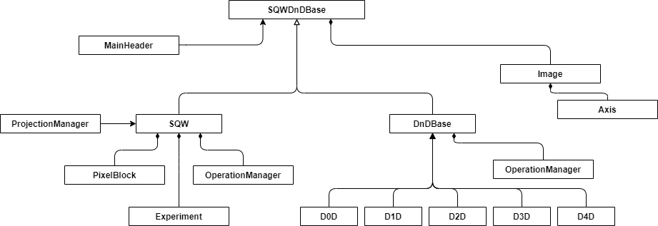

# SQW

## Overview

This document describes the role of the SQW object within the Horace framework, data it holds and operations it supports *without focusing on any implementation details*.

Where specific fields are cited they are the key data that represent that information.

### What is the purpose?

The `sqw` object holds major neutron scattering experiment data and provides methods that manipulate, slice and project the data and generate model fits using third-party functions.

The object provides an interface to the Horace file which can be interchanged with external applications and a public API.

The `sqw` object contains two information blocks, describing experiment from different sides and under different approximations:

- `dnd-object` which is the part of the `SQW` object contains processed neutron image data, expressed in the system of coordinates, requested by the neutron physicist doing experiment. Very often its `hkl-dE` (three reciprocal lattice units and energy transfer) coordinate system, but it is possible to define other coordinate system of interest too. Later we will discuss different coordinate system, related to `dnd` object in more details.
- `sqw-object` itself contains, in addition to the image data of `dnd` object,  (a) the records of all neutron events occurring in the experiments, expressed (currently) in Crystal Cartesian coordinate system, (b) the information about all experimental runs the neutron events have been obtained from, (c) information about the instrument and sample used in the experiment, (d) the instrument states during the experiment and (e) the information about detector pixel array used to collect neutron events. This information is sufficient to calculate the resolution function of the instrument. The neutron events are held in the relevant `PixelDataBase` child class (`PixelDataBaseFilebacked` or `PixelDataBaseMemory`), and arranged in such a way that selection of a part of the `dnd-object` neutron image allows the effective selection of the appropriate part of the `PixelDataBase` events contributing to this part of the image.


The two objects are treated by Horace as 'first class citizens'. The objects share a common API where that is appropriate. In an sqw object, operations are performed on the pixel array data and the `dnd` image data recalculated from this. For `dnd` objects the operations are performed directly on the image data.
In addition, the extra information and raw data contained on the `sqw` object allows a scattering model to be fitted.

## Main Classes:

The class diagram describing the relationship between main Horace classes is provided on Fig.1:




### SQWDnDBase

Abstract base class for the `sqw` and `dnd` objects, describing the interface and algorithms common for both `sqw` and `dnd` objects.

May include code of the methods which work identically on both `sqw` and `dnd` objects.

Currently it also include common methods, in particular the large number of unary and binary operations which are implemented as calls to the operations managers defined in the children classes and implementing the particular behaviour, different for `sqw` and `dnd` objects.

### SQW

The `sqw` object provides the public API to all the relevant experimental data. The main data manipulations are performed on the `PixelDataBase` property `pix` and the `Image` stored in property `data`,  containing the `dnd` object corresponding to the `sqw` object, which is recalculated according to the operations performed over the pixels.

This class includes the full experiment data including the raw pixel data and the relevant to neutron scattering details of the sample, instrument and detectors. As the `PixelData` containing all information about neutron events is normally very large dataset, `sqw` object in number of operations may be used leaving the `PixelData` untouched. Alternatively, when `PixelData` is large and can not be loaded in memory, the operations on the `PixelData` can be performed on separate data chunks loaded and processed in memory, leaving the main `PixelData` arrays located in files.
The structure of a generic `sqw` object is presented in Fig.2:


### DnDBase, DnD

The `DnD` object exists as part of  `sqw` object but also can exist as a separate "cut-down `sqw`" object containing only multidimensional `Image` data expressed in the coordinate system of interest. The "Image" exists in 0 to 4 dimensional forms, with each particular number of dimensions class defining the particular dimensions of the abstract base class `DnDBase` and resulting in the particular dimensionality `DnD` class (`d0d-d4d` subclasses). The `PixelData`, `main_header` and `Experiment` information are NOT included in `DnD` object so any data manipulation operations are performed directly on the `Image` data.

An extract from the whole inheritance diagram for the `DnD` objects is presented on the Fig.3:


The diagram also shows `data_sqw_dnd` object inheriting from `DnDBase` and containing an arbitrary number of dimensions, unlike other `DnD` objects which define their specific number of dimensions.  This object is retained for IO compatibility with previous versions of Horace code, and is not used in Horace for any other purpose except restoring  old data.

The `DnDBase` base class is an abstract class holding the common data and common code, including the operation manager which is responsible for matching dimensions between the specific `DnD` objects before executing appropriate algorithms. The structure of `DnDBase` class together with its children, defining specific number of dimensions is presented in Fig.4:


The diagram shows that any `DnD` object contains *signal*, *error* and *npix* arrays of appropriate dimensions plus  two additional properties, namely *proj* and *axes*.
 *npix* describes the number of pixels (neutron events) contributing to each area of the image according to the image axes scaling (described by `AxesBlockBase` below). *proj* field contains a child  of `aProjectionBase` class, which defines the transformation from the coordinate system of `PixelDataBase` class to the `Image` (`DnD` object) coordinate system. For example, in the most common case of `Image` coordinate system being `hkl-dE` coordinate system and `PixelDataBase` class coordinate system being Crystal Cartesian coordinate system, the transformation is the matrix multiplication of the `PixelData` coordinates by the `UB` matrix of Bussing and Levy [^1].

The `AxesBlockBase` class is closely related to the appropriate `aProjectionBase` class and defines the coordinate system of the image, its binning axes and units along the axes scales.

In more details the the `projection` class and `axes_block` classes are described below.

#### Image (`DnDBase` class in more details)

`DnDBase` class contains the n-dimensional arrays of image pixel data transformed into the selected coordinate system with associated axis information related to this coordinate system. 
Image pixel data is generated from the `PixelData` via one or more projections. 

|  | Description | Notes |
|-----|---------|---|
| signal[] | Mean intensity, calculated as `Sum(pix_signal(k))/npix(k)` | (1), (2) |
| err[] | Average error, calculated as  `sqrt(Sum(pix_variance(k)/npix(k)))` |(1), (2) |
| npix[] | Number of detector pixels contributing to each image pixel even if the signal on this image pixel is equal to zero.||
| proj | The instance of `aProjection` class, describing the transformation used for builing this image | |
| axes | The instance of `AxesBlockBase` class, defining the shape and size of *signal* *err* and *npix* arrays and the units along their axes |(3) |


**Notes**
(1): if the image data is updated, e.g. after a slice or projection, the backing pixel data must be updated/reordered
(2): `pix_signal` represents the array of pixel signal data from which this image data was derived, `pix_variance` the array of pixel variance.
(3): The `axes_block` classes describes image axes, namely
- value range
- unit vectors
- units


The **DnD class** (current implementation of the image) contains a transformation defined by an instance of a generic projection and the methods, necessary to implement generic cut procedure.:

The Image block ( **DnD class**) consists of 1) an **axes_block** class, defining image binning ranges and coordinates axes used in plotting, 2) a particular instance of **aProjection** class defining the transformation from Crystal Cartesian coordinate system of the **PixelData** class into Image coordinate system (e.g. hkl-dE coordinates for rectilinear projection) and back and 3) *signal*, *error* and *npix* arrays, having the dimensions defined by the **axes_block** and containing information about the pixels, contributed into appropriate bins of the **axes_block**.

The cut algorithm takes existing **sqw** object containing existing **projection** and **axes_block** classes. retrieves target **projection** and **axes_block** classes from the input binning parameters of the cut, and calculates *npix*, *signal* and *error* from the pixel information, present in the source **sqw** object or from  *npix*, *signal* and *error* of the source object if the pixel information is not present in the source object.

#### A projection class
The family of existing projection classes is presented on the Fig.5:


All projections classes inherit from abstract `aProjectionBase` class and define their own transformations methods `transform_pix_to_img/tranform_img_to_pix` converting between a source coordinate system and a target coordinate system. The source coordinate system for majority of projections is the Crystal Cartesian coordinate system which is the main coordinate system for data stored in `PixelData` classes and the target coordinate system may be identified by the projection name. For example, `spher_proj` is the transformation from Crystal Cartesian to spherical coordinate system.  The exception is the `instrument_projection` which transform data obtained in instrument coordinate system (detector positions & Energy transfer) into  Crystal Cartesian coordinate system of `PixelData`.  
`line_proj` class is related to the transformation into `hkl` coordinate system or the system, which is related to any direction in reciprocal space.

Main properties and methods of `aProjectionBase` class and other projection classes presented on Fig 5. are summarized below:

| Property | Type | Notes |
| --- | --- | --- |
| alatt | 1x3 vector of floats | 3 lattice parameters (in angstrom) |
| angdeg |1x3 vector of floats | 3 lattice angles (deg) |
| offset |1x4 vector of floats | offset of the centre of the coordinate system from the h=0,k=0,l=0,dE=0 position expressed in hkl coordinate system |
| img_offset | 1x4 vector of floats | the same as offset but expressed in image coordinate system. (e.g. R,Theta,Phi dE for `spher_proj` or [hh,kk,l,dE] for `line_proj` rotated by 45 degrees vrt the h-axis |
| label | 4x1 cellarray of strings | Labels to put along all 4 coordinate axes|
| title|  string | title to place over the plots of the cuts built using this projection |
| *Methods:*
| **Method** | **Output type** | **Notes** |
| get_nrange | [bl_start,bl_size] arrays | return the positions (wrt the position of the first pixel which is 1) and the sizes of the pixels blocks belonging to the cells which may contribute to the final cut. The cells are defined by the projections and axes block-s, provided as input.|
| bin_pixels | Contributed pixels and various image averages | Convert pixels into the coordinate system defined by the projection and bin them into the coordinate system defined by the axes block, specified as input.|
| transform_pix_to_hkl| pix_hkl 3xNpix or 4xNpix array of floats| Converts from pixel coordinate system (Crystal Cartesian) to `hkl` coordinate system 3xNpix or 4xNpix array of `PixelData` coordinates provided as input, where Npix is number of columns in the array provided |
| tansform_img_to_hkl | pix_hkl 3xNpix or 4xNpix array of floats| Converts from image coordinate system to `hkl` coordinate system 3xNpix or 4xNpix array of image coordinates provided as input, where Npix is number of columns in the array provided. The array is expressed in the units of the image the projection defines | 
| from_this_to_targ_coord | pix_target 3xNpix or 4xNpix array of floats | Converts input 4xNpix or 3xNpix array of coordinates expressed in this projection coordinate system to the coordinate system defined by other projection. The other projection have to be assigned to hidden property of this projection: `targ_proj` |
| Abstract Methods:
| **Method** | **Output type** | **Notes** |
| get_proj_axes_block | an `AxesBlockBase` class instance | Construct the axes block, corresponding to this projection class. Returns generic `AxesBlockBase`, built from the block ranges or the binning ranges provided as input. | 
| transform_pix_to_img | pix_transformed  3xNpix or 4xNpix array of pixel coordinates transformed into this projection coordinate system | Transforms coordinates of the pixels from pixels coordinate system (Often Crystal Cartesian) to image coordinate system |
| transform_img_to_pixels | pix_cc  3xNpix or 4xNpix array of pixel coordinates transformed into Crystal Cartesian coordinate system | Transforms coordinates of the image into pixels coordinate system. (Often Crystal Cartesian) |

The particular projection classes are the children of the abstract `aProjectionBase`class defining three abstract `aProjectionBase` methods, namely:

`line_proj` class defines the transformation between Crystal Cartesian system of coordinates and the system of coordinates expressed in reciprocal units. 
`spher_proj` transforms between Crystal Cartesian and spherical coordinate system.


**Notes**
^1 Transformed from source `AxesBlockBase` coordinate system to the coordinate system, which is the target of the transformation. For operation being correct, the hypercube needs to be scaled so that at least one node of the generated grid would belong to a contributed cell of the original grid. E.g. if **a** is the size of the scaler cube with respect to **orhto_projection**, the hypercube should be rescaled as **a/sqrt(2)** |

#### AxesBlockBase classes

Inheritance diagram for `AxesBlockBase` classes family is presented on Fig.6.:


**AxesBlockBase** class is overloaded for every coordinate system defined by a projection, with possibility to overload plot methods for the convenience of the plotting in the particular coordinate system and for generating the correct plot titles for each coordinate system.

Operations using projections, and cut operations in particular, result in the creation of a new `sqw/dnd` object. They are performed to the Image Pixels using data from the original `PixelData` class. Similar operations are possible on images (`DnD` objects) themselves, but as these objects do not contain all necessary information, the cuts from `DnD` objects are only quantitative estimates for the cuts, obtained using full experiment information available from `sqw` objects.


Another specific method of projection classes is `get_proj_axes_block` which returns the axes, specific for the projection transformation to the projection image. 

`AxesBlockBase` instance class return
The **axes_block** class contains three methods, necessary to implement the cut:

| method | Description | Notes |
|-----|---------|---|
| *get_axes_scales* |  Return the array of vertices of a 4D cube, describing the grid cell of the axes block.  |  |
| *get_bin_nodes* | accepts the hypercube, produced by *get_axes_scales* and generates the grid which covers all range, described by the current **axes_block** class |^1|
| *bin_pixels* | takes the coordinates of the pixels, expressed in the **access_block** coordinate system and, optionally, signal and error for these pixels and calculates  *npix*, *signal* and *error* from these pixels to the **axes_block** cells |  |


### Plotting interface

The 1D-3D`sqw` and `dnd` Horace objects can be plotted with the appropriate dimensions plots. There is a large number of plotting functions so it is reasonable to extract these functions into a separate plotting interface. `sqw`, `dnd` and Herbert `IX_dataset` objects inherit `data_plot_interface` and implement particular plotting functions specific to the particular n-dimensional objects. The inheritance diagram of this plotting interface is presented in the Fig.5:


The top level interface class defines all plotting functions as abstract (or rather throwing **not-implemented** exception), while actual 1D-3D objects implement their appropriate plotting functions (e.g. 1D objects -- 1D plotting, 2D objects -- 2D plotting etc.). The upper level objects add some wrapping to the plot, but mainly delegate plotting to the lower level objects (One can define objects level as the function of their complexity so the objects hierarchy looks `sqw`->`dnd`->`IX_dataset` following the decrease in the amount of information every object contains). The actual plotting functionality is implemented on Herbert `IX_dataset` objects.


### Main Header

The `MainHeader` object contains high-level metadata for the `sqw` objects. It contains the dataset title, file location the date when the dataset was initially created and the number experimental runs contributed into the dataset.


### Experiment

The Experiment object wraps all data relating to the sample, instrument and experiment conditions. This makes use of the `IX_xxx` classes (see below).

This data should all be available from the Mantid `.nxspe` file, however it is likely that there is data missing in the current Mantid spec or not populated so a method will be created to load that data from another source. In the first instance this will be a custom data file (1).

**Notes**
(1): the format of this datafile is TBD. To ease the eventual integration with Mantid a Nexus/HDF5 file or some other structured data that maps easily into the HDF5 format should be used.

####  Instrument specification (`IX_inst`)
The instrument class contains the information about the components that make up the instrument pre-sample, including the choppers, moderators and incident beams.

The specific subclasses contain a structured set of components that will be unique to each neutron facility

#### Detector information (`IX_detector_array`)
The detector information class contains information about individual detector elements and their geometry. The data in this object will change when calibrations are performed or elements replaced or serviced as part of regular maintenance tasks. 

Multiple definitions can be defined in the `IX_detector_array` and indexes in the `Experiment` class associate data points with specific values.

#### Sample information (`IX_sample`) 
This includes sample orientation, lattice angles and lattice description (Hall symbol).

Notes:

(1): the lattice description (Hall Symbol) is not included in the current implementation and will be added.

#### Experiment information (`IX_experiment`)

This includes about the goniometer position data and energy.

Notes: 

(1): this is a new  `IX_xxx` class

#### Experiment

The `Experiment` object contains the mapping from the `PixelData` to the appropriate array elements of the instrument, detector, experiment and sample arrays specific to each contributing neutron measurement. This configuration supports recalibration of detectors and changing experiment conditions to be handled.

### Pixel Block

Contains the "raw" pixel data expressed as crystal Cartesian and detector index form.

Provides methods to "get contributing pixels" for any subset of image pixels as well as get/set methods for each column or block of columns, e.g. `get_signals()`, `get_coordinates()`, `get_energy_ids()` and the number of pixels.

Custom data may be stored per-pixel in a named elements `get_data(name): array[num_pixels,num_cols]`.

The same `get_data(name)` method can be used to provide access to the "standard" data (e.g. `get_data("signal")`)

|  | Description | Notes |
|-----|---------|---|
|u1, u2, u3, dE | coordinate in crystal Cartesian lattice (a\*, b\*, a\* x b*, dE) | (2) |
| iRun | index into the experiment array for run (source file) |(1)|
| iDetector | index of pixel detector |(1)|
| iEnergy | index of energy bin | (1) |
| signal | Correlated intensity ||
| variance | Intensity variance ||

**Notes**
(1): the triple of indexes uniquely identify the detector element corresponding to this pixel and are an alternate representation of the (u1, u2, u3, dE) data.

(2): pixel data are ordered by IMAGE PIXEL. If projection is applied the IMAGE PIX ARRAY IS REORDERED

(3): existing binary data format must be extended to include additional "number of columns" field (&ge;9) information and the file read/write routines updated to read from an array of `n` columns.


### Operations

#### Generate SQW file

Combine multiple experiment [data files](http://horace.isis.rl.ac.uk/Input_file_formats)  (pairs of legacy `.spe` and `.par` files, or `.nxspe` files from Mantid) into a single SQW object. 

1) `.nxspe` / `.spe` (per-run) data files are converted to intermediate `.sqw`-format data files. Pixel data is ordered by "image pixel" buckets. There is *no aggregation of signal/err data* in this step.

2) Intermediate files are combined on a image-pixel bucket basis to produce the final `.sqw` file. 

#### Read/Write

- Read the file data, but not pixel data

- Read the pixel data or an m-dimensional cut of the pixel data
- Read the pixel data corresponding to specific image pixels
- Write the pixel data for specific image pixels
- Write all pixel data
- Support for legacy Horace file format 
- Support for a new NeXus / HDF5 format `.nxsqw` (tbd)
- Display data to console ('display')
- Export data to ASCII file ('save_xye')

#### Data manipulation

- Basic arithmetic operations on object data. 
- Cut -- extract a N-dimensional subset of pixels
- Projection -- aggregate pixel data onto an M-dimensional surface (M &le; N). This should support projections onto planes and spherical shells (TBI) and spiral slices (TBI) as well as reorientations.
- Symmetrization -- enhance signal-to-noise utilizing symmetries within the data

The operations are performed on the pixel data and the image recalculated from that. If the pixel-data is not available (a `dnd` object) the operations are performed directly on the image with higher speed but with reduced accuracy or, if the correct accuracy may be achieved, with highly reduced functionality. The correct accuracy can be achieved for axis aligned cuts only.

The data manipulations are implemented through the `ProjectionManager` class and instances of `IProjection`.

Note: future extensions may add support for projections for which `M > N`. These would require the creation of a generalized higher-dimension `dnd` object.

#### Model Fitting

- Fit experiment data to parametrized models. 
- Tobyfit (included in Horace) and third-party models are supported.
- Models may take additional resolution convolution function to remove artefacts from the image
- Fit functions will be able to take Python or custom user functions


## Implementation Decisions

- All classes to be rewritten as "new-style" MATLAB classes defined by the `classdef` keyword (e.g. DND, SQW) if currently implemented as "old-style" (`@-directory`) classes

- Update SQW pixel block to include a number of data columns and read/write `N` columns rather than the current fixed nine

- Experiment object includes array of instrument, sample, lattice, detector data and mappings from pix-block to objects

- Instrument data will be added to SQW object post-creation until full data is available in the Mantid data files; scripts exist for construction of LET and are a model for other instruments. Since the Mantid file parse will require an XML to IX_Inst builder this can be written ahead of time and instruments created as XML.

- A standard set of units will be used for all internally stored data, but the data *will not* carry dimension information (c.f. Euphonic):

|   | Unit |
| ---- | ---- |
| Distance | m   |
| Angle    | radian |
| Energy   | meV   |

Lattice parameters will be the only deviation from these standard units
|   | Unit |
| ---- | ---- |
| Distance | angstrom, 1 Å = 10<sup>-10</sup> m |
| Angle    | degree   |

- Plots routines taken outside the core data objects. It is preferable to move these functions from the general namespace to avoid collisions with any user defined plot routines.
  If required a `sqw.plot(...)` function can be retained that calls these implementations.

- Move the `.sqw` datafile format to an [HDF5](https://www.hdfgroup.org/solutions/hdf5/) file with extension `.nxsqw`. HDF5 has performant read/write operations from C++, Python and MATLAB and is an open self-describing format which supports simple interfacing with external application. The use of the [NeXus format](https://www.nexusformat.org/) is preferred but may not be possible immediately if key data are not supported in the current standards.

### Constraints

Object must support working with objects larger than system RAM. This requires the use of a "temporary" SQW file with updated pixel data; changes only written to the original file with an explicit write to avoid accidental modification of data.

Operations should make use of multi-core and multiprocessors when available

## PseudoCode

### GenSQW

```
tmp_filenames = []
for file in files:
    rd = rundata(file)
    rd = rd.load();

    sqw = rd.convert_to_q(lattice, goniometer);
    urange = minmax(urange, sqw.range);
    sqw = sqw.rebin()
    tmp_filenames = [tmp_filenames sqw.save_to_tmp()];
end

sqw = sqw.combine_tmp(tmp_filenames, new_filename)
```

### Cut

```
contributing_bins = old_sqw.get_contributing_pixels(new_projection, bins)
pix_in_hkl = old_sqw.projection.convert(pix_in_crc);

%contributing_bins = old_sqw.get_contributing_pixels(new_projection,bins)
%rot_matrix=new_proj.get_transf(old_proj)
%[new_proj_coord=hkl_grid*rot_matrix

contributing_edges= get_edges(new_proj_coord, bins);
contributing_pixels = convert_edges_to_pix_positions();
%
all_poss_pix = old_sqw.get_pix(contributing_bins);
the_pix = new_proj.cut_pix(all_poss_pix);
```

### PixelData

Existing `PixelData` read/write from the `SQW` object are to slices, e.g. in `tobyfit_DGdisk_resconv`

```matlab
% Run and detector for each pixel
irun = win(i).data.pix(5,:)';   % column vector
idet = win(i).data.pix(6,:)';   % column vector
npix = size(win(i).data.pix,2);
```

or `read_cut_diff`

```matlab
% Take difference between the cut files, looking after error bars appropriately
data=data1;     % pick up values from first dataset

data.y=data1.y-data2.y;    
data.pixels(:,5)=data1.pixels(:,5)-data2.pixels(:,5);
if all(ebars==[0,0])
    data.e=zeros(size(data.e));
    data.pixels(:,6)=0;
elseif all(ebars==[0,1])
    data.e=data2.e;
    data.pixels(:,6)=data2.pixels(:,6);
elseif all(ebars==[1,1])
    data.e=sqrt(data1.e.^2+data2.e.^2);
    data.pixels(:,6)=sqrt(data1.pixels(:,6).^2+data2.pixels(:,6).^2);
end
```


#### Proposed API

The new `PixelData` will wrap this access to the full array with a `getPixels()` if there is a need, e.g. for writing, or via a set of helper `getX`/`setX` functions. These shield users from knowledge of the arrangement of data in the pixel array supporting a radical restructuring of the data in the HDF5 file if that is needed.

So the example in  `tobyfit_DGdisk_resconv` becomes

```matlab
% Run and detector for each pixel
irun = win(i).data.getRunIds()';   % column vector
idet = win(i).data.getDetectorIds()';   % column vector
npix = win(i).data.getNumPixels();
```

For the use-cases in `recompute_bin_data`:

```matlab
wout.data.s=accumarray(ind, w.data.pix(8,:), [nbin,1])./w.data.npix(:);
```
becomes
```matlab
wout.data.s=accumarray(
  ind, w.data.getSignal(), [nbin,1]
)./w.data.getNumPixels();
```
and in `noisify`        

```matlab
[wout(i).data.pix(8,:),wout(i).data.pix(9,:)]=noisify(
  w(i).data.pix(8,:), w(i).data.pix(9,:), varargin{:});
```
becomes
```matlab
[sig, var] = noisify(
  w(i).data.getSignal(), w(i).data.getVariance(), varargin{:}
)

wout(i).data.setSignal(sig)
wout(i).data.setVar(var)
```
or
```matlab
wout(i).data.setSigVar(
  noisify(
    w(i).data.getSignal(), w(i).data.getVariance(), varargin{:}
  )
)
```

## Public API


### Model fitting (SQW)

| Operation            | SQW  | DND  | Notes |
| -------------------- | :--: | :--: | :---- |
| `multifit.m`         |  y   |  y   |       |
| `multifit_func.m`    |  y   |  y   |       |
| `multifit_sqw.m`     |  y   |  y   |       |
| `multifit_sqw_sqw.m` |  y   |  y   |       |

`multifit.m` is a class constructor function for a `mfclass` for fitting a function defined on the coordinates of the SQW or DND object it applies to.

`mutlifit_func.m` is a function which wraps an `mfclass` so that users can use an older syntax where the fitting was defined in a single line in one function.

`multifit_sqw.m` is a wrapper which automatically converts the coordinates of the SQW or DND object to crystal coordinates (*Qh*, *Qk*, *Ql*, *dE*) before passing these to a user defined model *foreground* function.
Background functions are passed the coordinates of the SQW or DND object directly.

`multifit_sqw_sqw.m` is a wrapper which converts the coordinates to (*Qh*, *Qk*, *Ql*, *dE*) for both foreground and background functions.

### Bin calculations (SQW)
| Operation            | SQW  | DND  | Notes |
| -------------------- | :--: | :--: | :---- |
|`calculate_q_bins.m` | y | y ||
|`calculate_qsqr_bins.m`| y | ||
|`calculate_qsqr_w_bins.m`| y | ||
|`calculate_qsqr_w_pixels.m`| y | ||
|`calculate_qw_bins.m` | y | y ||
|`calculate_qw_pixels2.m`| y | ||
|`calculate_uproj_pixels.m` | y | |Projection|

### Projection Manager  (SQW)

Provides methods to *generate* an image from an existing image (DND) or the base pixel data; supports definition of multiple sequential transformations.
| Operation            | SQW  | DND  | Notes |
| -------------------- | :--: | :--: | :---- |
|`cut` | y | n | Perform a cut and return new SQW object|
|`symmetrize`| y | n | Symmetrize return new SQW object |
| `transform` | y | y | Execute a sequence of `IProjection`s on the data to create a new image |

### IProjection

Interface class to support the creation of a range of simple projections - translation, rotation, skew, cylindrical, spherical.

| Operation            | SQW  | DND  | Notes |
| -------------------- | :--: | :--: | :---- |
|`apply_tansformation` | y | y | Execute the transformation and return a new data object|

### Data manipulation (SQW)

| Operation            | SQW  | DND  | Notes |
| -------------------- | :--: | :--: | :---- |
|`mask.m` | y | y |(bins) mask chunks of data|
|`mask_points.m`| y | y | Mask all pixels lying outside axis bounds |
|`mask_detectors.m`| y | n | Remove all pixels from one or more detectors ids |
|`mask_pixels.m`| y | n | Retain pixels defined by binary mask (1) |
|`mask_random_fraction_pixels.m`| y | n | Retain a random fraction `(0,1)` of pixels from the dataset (scalar or per-axis) |
|`mask_random_pixels.m`| y | n | Discard all except N random pixels from the dataset (scalar or per-axis) |
|`mask_runs.m`| y | n | Remove all pixels from a specified run |
|`noisify.m`| y | y | Add random noise and update error for image data |
|`slim.m`| y | n | Remove random pixels (wrapper around `mask_*` functions)|

Note: operations are performed on backing detector data where appropriate and image recalculated using the current projection

### Object Conversions (IX_Dataset)

| Operator | SQW  | DND  | Notes |
| -------- | :-:  | :-:  | :------ |
|`IX_Dataset` |      |      | Factory returning `IX_Dataset_Nd` instance |

### Load/Save (SQW)

| Operation  | SQW  | DND  | Notes                                   |
| ---------- | :--: | :--: | :-------------------------------------- |
| `read.m`   |  y   |  y   | read .`nxsqw` or `.sqw` file            |
| `save.m`   |  y   |  y   | save `.nxsqw` (or`.sqw` file with flag) |
| `export.m` |  y   |  y   | export data to ascii file               |

### Display (helper)

|Operator|SQW|DND|Notes  |
|--------|:-:|:-:|:------|
|`display.m`  | y | y | pretty print object|
|`shift_energy_bins.m`| y | n | for plotting data adjusted with `shift_pixels` |
|`run_inspector.m`| y | n | Display UI for browsing|

### Standard arithmetic operations (SQW via OperationsManager)

| Operator                            | SQW  | DND  | Notes |
| ----------------------------------- | :--: | :--: | :---- |
| *Standard MATLAB unary operations*  |      |      |       |
| `acos.m`                            |  y   |  y   |       |
| `acosh.m`                           |  y   |  y   |       |
| `acot.m`                            |  y   |  y   |       |
| `acoth.m`                           |  y   |  y   |       |
| `acsc.m`                            |  y   |  y   |       |
| `acsch.m`                           |  y   |  y   |       |
| `asec.m`                            |  y   |  y   |       |
| `asech.m`                           |  y   |  y   |       |
| `asin.m`                            |  y   |  y   |       |
| `asinh.m`                           |  y   |  y   |       |
| `atan.m`                            |  y   |  y   |       |
| `atanh.m`                           |  y   |  y   |       |
| `cos.m`                             |  y   |  y   |       |
| `cosh.m`                            |  y   |  y   |       |
| `cot.m`                             |  y   |  y   |       |
| `coth.m`                            |  y   |  y   |       |
| `csc.m`                             |  y   |  y   |       |
| `csch.m`                            |  y   |  y   |       |
| `exp.m`                             |  y   |  y   |       |
| `log.m`                             |  y   |  y   |       |
| `log10.m`                           |  y   |  y   |       |
| `sec.m`                             |  y   |  y   |       |
| `sech.m`                            |  y   |  y   |       |
| `sin.m`                             |  y   |  y   |       |
| `sinh.m`                            |  y   |  y   |       |
| `sqrt.m`                            |  y   |  y   |       |
| `tan.m`                             |  y   |  y   |       |
| `tanh.m`                            |  y   |  y   |       |
| *Standard MATLAB binary operations* |      |      |       |
| `plus.m`                            |  y   |  y   |       |
| `minus.m`                           |  y   |  y   |       |
| `uminus.m`                          |  y   |  y   |       |
| `uplus.m`                           |  y   |  y   |       |
| `mtimes.m`                          |  y   |  y   |       |
| `mrdivide.m`                        |  y   |  y   |       |
| `mldivide.m`                        |  y   |  y   |       |
| `mpower.m`                          |  y   |  y   |       |

### Pixel Block

Object supports storage of custom data in addition to the standard 9-columns of pixel data. These are stored in a dictionary `{name: value}`.

| Operation  |          | Notes |
| ---------|---------- | :---- |
| `get_pixels` | `set_pixels` | Return/replace full pixel block array |
| `get_coords` | `set_coords` | Return/replace `n x 4` array of the four co-ordinates |
| `get_run_ids` | `set_run_ids` | Return/replace `n x 1` vector of run indexes |
| `get_energy_ids` | `set_energy_ids` | Return/replace `n x 1` vector of energy indexes |
| `get_detector_ids` | `set_detector_ids` | Return/replace `n x 1` vector of detector indexes |
| `get_signal` | `set_signal` | Return/replace `n x 1` vector of run signal |
| `get_variance`| `set_variance`  | Return/replace `n x 1` vector of run signal variances |
| `get_num_pixels`|   | Return number of pixels (`n`) |
| `get_data(name)` | `set_data(name, ...)` | Return/replace `n x m` array of (named) custom or default data |

### Experiment

| Property | Type        | Notes |
| -------- | ----------- | ----- |
| sample   | `IX_Sample[n_runs]` |  |
| detector | `IX_DetectorArray[n]` | |
| instrument | `IX_Instr[n_runs]` ||
| experiment | `IX_Experiment[n_runs]` ||
| header | `Header` ||

### MainHeader

| Property | Type | Notes |
| -------- | ---- | ----- |
| filepath | string | Source file location |
| filename | string | Source filename |
| num_files | int | Number of contributing files (empty if `DND` object) |
| title | string | User-specified title for the object data |

### Header

| Property | Type        | Notes |
| -------- | ----------- | ----- |
| filepath | string | Source `.nxspe` location |
| filename | string | Source `.nxspe` filename |
| detector_blocks | int[] | Map of `PixelData.detector_id` and `PixelData.energy_id` to `Experiment.detector` index |
| instrument_blocks | int[] | Map of `PixelData.run_id` and `PixelData.energy_id` to `Experiment.instrument` index |
| sample_blocks | int[] | Map of `PixelData.run_id` and `PixelData.energy_id` to `Experiment.sample` index |

### IX_Experiment

| Property | Type | Notes |
| --- | --- | --- |
| efix | float | Fixed energy (meV) |
| psi | float | Angle of u w.r.t. ki (deg) |
| omega | float | Angle of axis of small goniometer arc w.r.t. notional u (deg) |
| dpsi | float | Correction to psi (deg) |
| gl | float | Large goniometer arc angle (deg) |
| gs | float | Small goniometer arc angle (deg)  |

### IX_Sample

| Property | Type | Notes |
| --- | --- | --- |
| name | string | Name of the sample (e.g. 'YBCO 6.6')|
| single_crystal | bool | true if sample is a single crystal |
| xgeom | array | |
| ygeom | array | |
| shape | string | Model for sample shape (e.g., 'cuboid') |
| ps | array | Parameters for the sample shape model (array; length depends on `shape`) |
| eta | |  Mosaic spread (FWHH) (deg) |
| temperature | | Temperature of the sample (K) |
| hall_symbol | string | Hall symbol describing sample symmetry |

The `shape` and `ps` attributes can be replaced with an instance of a new `Shape` class with `.covariance(...)` and `.random_points(...)` methods at the point support for more than `cuboid` is required.


## Glossary

| | |
|---|---|
|`.d0d`, `.d1d`, `.d2d`, `.d3d`, `.d4d` | n-dimensional Horace binary data file|
| DND | n-dimensional image data object |
|`.nxspe`| NeXus / HDF5 experiment data and detector geometry file [format](http://download.nexusformat.org/sphinx/classes/applications/NXspe.html) |
|`.par`| Legacy detector geometry information [format](https://docs.mantidproject.org/nightly/algorithms/SavePAR-v1.html#algm-savepar) |
|`.spe`| Legacy experiment data [format](https://docs.mantidproject.org/nightly/algorithms/SaveSPE-v1.html#algm-savespe) |
|`.sqw`| Horace binary data file |
| SQW | Horace data object including experiment, pixel and image data |
|`.nxsqw` | Horace NeXus/HDF5 data file format (TBD) |


[^1]: Busing, W. R and Levy, H. A; Angle calculations for 3- and 4-circle X-ray and neutron diffractometers; Acta Crystallographica N4 1976 pp.457-464.