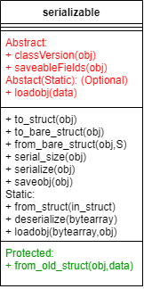

# Serializable interfaces
Date: 2022-06-01

## Objectives and problems to solve.
Current Horace package use Horace-specific binary open source file format to store Horace `sqw` objects and allow fast access to these objects. The problem in accessing these objects is large amount of the pixel information. This information in fact are the recordings of all registered neutron events from a week-long inelastic scattering neutron experiment. The main reason for using Horace binary format is the fact that these data are fare large then the memory of common computers (average size of the files would be *~50Gb* but *500Gb* files are not so uncommon), so we need to keep these data on a disk and provide efficient ways of accessing and processing them.

In addition to this, users often work with only parts of the experimental data, those containing their areas of interest. These data can often, though not always, fit into memory, but users may want to store these relevant subsections (cuts) for later use. In memory, the data are represented as Horace `sqw` objects, so users often use Matlab proprietary `.mat` file format (through `saveobj`), which allows efficient binary store/restore operations to/from Matlab classes.

To satisfy users requirements, we in fact support two independent binary file formats described above. Each format is best suited for subset of user needs.

The fact that the data are binary and Horace-specific causes problems for users. To access data written in native Horace file format, users need a deep understanding of Horace, as the binary objects are the reflection of `sqw` objects in memory. These objects have a complex structure which is necessary for storing complex experimental data. Users who want to utilize smaller `sqw` objects stored in `.mat` files must also use Horace as restoring Matlab classes relies on Matlab knowing the relevant class definition.

Number of problems have to be resolved to satisfy the demands of the user community and the needs of the further development, namely:

#### Standard Format:
To support accessing Horace data from third party applications, the team has decided to change the Horace file format from raw binary, to the [HDF](https://www.hdfgroup.org/) file format, as this format is the industry standard for efficient storage and accessing of binary scientific data, and is accessible by number of third party applications unrelated to Matlab and Horace. The decision on making the `.hdf` data [NeXus](https://www.nexusformat.org/) compatible is still pending, as no Matlab implementation for NeXus wrapper exists and it will request substantial efforts from our team to implement at least subset of the NeXus library.

#### Backwards compatibility:
 Current binary file format is relatively complex and related to current structure of `sqw` classes. To satisfy the project requests we are bringing substantial changes to `sqw` objects so the file format to store these objects should also change. To maintain consistent user experience we need to support the way of reading various previous versions of the `sqw` binary files and `sqw` objects, stored in proprietary `.mat` files.

#### Support for multiple readers:
 An additional problem is that currently there are two independent file formats to maintain. Any changes to `sqw` objects require changes in two independent file reader/writers which requires additional developer effort. It would be beneficial to avoid this duplication of efforts and maintain the code which is as much as possible common for accessing both large (partially fitting to memory) and small (fully fitting to memory) `sqw` objects, written to disk.

## Suggested solution -- serializable interface.
To resolve the issues mentioned in the previous chapter, the team has decided to rely on the Matlab's standard mechanism of storing/restoring objects. If a Matlab object defines `saveobj/loadobj` methods, Matlab uses these methods to convert to/from binary format, to convert a Matlab object into a structure or to recover the object from the structure. The structure then is saved/loaded to/from the Matlab proprietary file format (`.mat`). The responsibility of maintaining this format then lies with Matlab.

To utilize the `saveobj/loadobj` Matlab functionality we have decided to make all Horace objects to make all Horace objects the subclasses of a special class `serializable`. The custom `serializable` class defines `saveobj/loadobj` pair of methods and some additional methods, necessary to maintain class versioning (see below).
To implement our *serializable* interface we have to make two assumptions about our objects:

1. The object has an empty constructor, i.e. the constructor with no arguments.
2. The object has a public interface which will populate all required data in the object. The object should be able to exist with all contents unset, and this interface should overwrite all existing contents with the new consistent data, while not retaining any previous contained data.


If such assumptions are satisfied, we may define `serializable` objects, which need to overload only a handful of class-specific methods, but which would immediately have number of very useful generic features. The class diagram describing such object is presented on the **Fig 1**:

<center></center>

**Fig 1:** Main interface and methods of **serializable** class.

The parent class, presented in the **Fig 1**, allows easy construction and maintenance of standardized serializable objects by overloading the following abstract methods:

**Table 1: Main abstract methods requesting overloading (definition)**

| Method | Description |
|-----|---------|
|  classVersion | returns the number which describes current class version. E.g.: 1 - for version 1|
| saveableFields | returns list of property names, defining the class public interface |

As soon as these properties are defined, one can use other class methods to serialize/deserialize objects and convert objects to/from structure. The main features of the available methods are summarized in the Tables 2:
** Table 2 Main methods, available for serializable objects:**

| Method | Description |
|-----|---------|
|  `struct = to_bare_struct(obj)` | returns structure, with the field names equal to the names returned by `saveableFields` method and values, defined by the values of these fields. If the values of fields are the serializable objects themselves, they are converted into correspondent structures recursively |
| `obj = from_bare_struct(obj,data)` | Reverse of `to_bare_struct` method. Sets the values of the public properties of the serializable interface from the structure, obtained from `to_bare_struct` method |
| `data = to_struct(obj)` | converts `obj` or array of `obj` into the `data` structure using `to_bare_struct` method and adds complementary information about the class name and the size and shape of the `obj` array if relevant. |
| *Static:* | |
| `obj = from_struct(data)` | Reverse of `to_struct` method, recovering the object or array of objects from the `data`, generated by the `to_struct` method |

Standard Matlab's `loadobj/saveobj` and Herbert `serialize/deserialize` methods use the data obtained from the methods described in **Table 2** or the methods themselves directly to provide/use input for/from Matlab save/load methods to save/load data to/from `.mat` files and serialize/deserialize methods to transform the objects from/to linear arrays of bytes for communications over serial pipes. The `serialize/deserialize` routines of a `serializable` class use Herbert-defined `serialize/deserialize` methods over the structures obtained using `to_struct/from_struct` methods.

Two remaining methods presented in **Fig 1** namely the static `loadobj` and `from_old_struct` methods need overloading if/when you want to support loading the versions of a class different from the current class version.

By default, a standard `loadobj` method exists and this method expects to receive the structure, produced by `to_struct` method. The `to_struct` method adds information about the class name and class version, so generic `loadobj` extracts this information and recovers the class. If a version information is missing, which may happen when you loading a class structure, generated before the object become `serializable`, you need to overload `loadobj` to provide the empty instance of the class, as described by the code snippet below:
```Matlab
        methods(Static)
            function obj = loadobj(S)
                % boilerplate loadobj method, calling generic method of
                % saveable class. Put it as it is replacing the
                "ChildClass" name by the name of the class the loadobj is
                the method of.
                obj = ChildClass();
                obj = loadobj@serializable(S,obj);
            end
        end
```
The method `from_old_struct` is used when the version of the class, stored in structure differs from the version, returned by the current class `classVersion` method. By default, the method `from_old_struct` calls `from_bare_struct` method, so it does not need overloading if the structure of your class public interface has not changed. 

If it has changed, `from_old_struct` needs overloading with the code, converting the old information, stored in the class structure into the information, necessary to define the new class.

## Interdependent properties problem.

All serializable interface described above and used inside the code is build under assumption that you define class value by assigning the values of the properties one by one. 
All public setters run checks of the validity of the values one wants to assign to the properties and throw exceptions if the input values are invalid. This assumption causes one problem with interdependent properties. For example, arrays `s`,`e`, and `npix` of a `dnd` or `sqw` object need to be the same shape and size arrays. If you are modifying, say, empty `dnd` object assigning `s`, `e` and `npix` arrays one after another, the first assignment (for `s`) would be always invalid, as the sizes of two other arrays are different from the first one as the initial object was containing empty data in arrays `e` and `npix`.

here are a number of ways, one can deal with this issue. After discussion, we have decided to use the following approach, summarized in **Fig 2** which describes the interface used to validate interdependent properties.

<center></center>

**Fig 2:** Validation interface for **serializable** class.

 Any child of the `serializable` class, which has interdependent properties, has to overload `[ok,mess,obj] = check_combo_arg(obj)` method. This method verifies the validity of interdependent properties. Each setter for the interdependent properties should run this method as in the following code snippet:
 ```Matlab
    function obj = set.an_interdependent_prop(obj,val)
        check_general_acceptance_of_input_throw_if_invalid(val);
        if obj.do_check_combo_arg_
            [ok,mess,obj] = check_combo_arg(obj,val)
            if ~ok
                error('HORACE:interdependent_properties_validation_error',message)
            end
        end
    end
 ```

Before the properties are set within the serializable class constructor or `from_bare_struct` method one by one, the `serializable` code sets the protected property **do_check_combo_arg_** to false, so the check for each interdependent property is not occurring. The code then sets the property **do_check_combo_arg_** to true and runs the check method: *check_combo_arg* after all interdependent properties have been set, throwing if **check_combo_arg** returns **false**. As the result, user can not change interdependent properties in a wrong way and needs to use constructor or serializable interface `from_bare_struct` to set defined class with interdependent properties.

The other way of setting interdependent properties while assuring their validity, is to define methods which allow the setting all interdependent properties at once. E.g. setting `s`, `e`, `npix` array may be performed by introducing the property/method `se_npix` with validates and sets all three properties together. This method may be more efficient from the point of view of serializing data, so will be used where it is justified and convenient.

## Standard form of constructor for a serializable class.

As a `serializable` class has a public interface, fully described by the list of properties returned by `saveableFields` method, it makes sense to define a standard constructor interface to define the `serializable` class. The constructor would have the form:
```Matlab
    obj = class_name(positional_val1,positional_val2,positional_val3,... 'key1',val1,'key2',val2,...);
```
where `positional_val1`, `positional_val2`... are the public properties of the `serializable` object in the order these properties are returned by `saveableFields` method. The `keys` then would be the names of these properties, followed by the appropriate values.

To facilitate creation of such constructors, the `serializable` class has a method:

```Matlab
 [obj,remains] = set_positional_and_key_val_arguments(obj,...
                param_names_list,varargin);
```

where `param_names_list` is the list of the property names. Then, a standard constructor for a serializable object would have a form:

```Matlab
    function obj = an_serializable_obj(varargin)
        if nargin == 0
            return;
        end
        prop_names = obj.saveableFields();
        obj = set_positional_and_key_val_arguments(obj,...
                param_names_list,varargin{:});
    end
```

## Generic eq operator.

As `serializable` classes have public interfaces which fully define the state of the object, it is reasonable to define an `eq` operator which would work by comparing the values, retrieved from public properties provided by *saveableFields* method of the serializable interface.

To avoid code duplication, this operator should be defined within the parent `serializable` class. If necessary, such operator may be overloaded on the particular classes, requested different comparison.