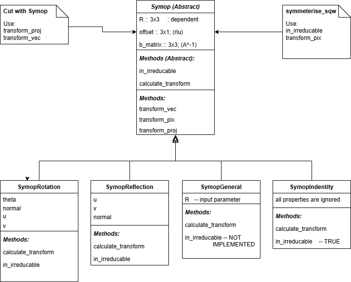
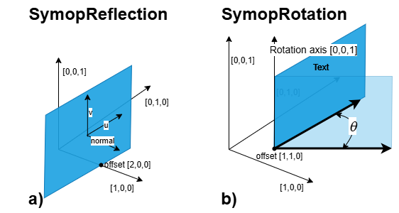
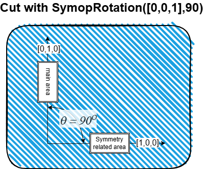

# Symmetry operations in Horace

Date: 2026-02-05

## Overview of operations

Horace allows to define various symmetry operations and apply them to `sqw` objects. 
If done correctly, with proper account for symmetry of the system, symmetry operations
improve statistics and substantially simplify the data analysis as scientist concentrates
on physically significant areas of dataset.

The symmetry operations in Horace are defined by `Symop` family of classes, which 
define simple, i.e. reflection (`SymopReflection`) and rotation (`SymopRotation`) transformations
and also partial support for generic symmetry transformations, 
defined by special unary transformation matrix `SymopGeneral`. 

All Crystal lattice related symmetry transformations may be described by specially 
constructed 3x3 transformation matrices, available on the web. Horace accesses
these transformations by accessing Python library available at https://github.com/spglib/spglib
using `get_syms` utility which interfaces this library (has to be installed for MATLAB's Python
separately) and returns set of transformations, provided by the library for given lattice given
symmetry type of this lattice.

To apply symmetry transformation to `sqw` object, one need to identify symmetry-equivalent image areas
and apply transformations, which will move all symmetry related pixels from all areas into single (main) 
symmetry area. Horace allows to do this in two different ways: 1) Symmetrise whole `sqw` object using `symmetrise_sqw` algorithm and 2) Take `sqw` object and make `cut` with symmetry operations, 
which would pick up set of zones, symmetry related to the original one and apply symmetry operations to pixels, contributing into symmetry related zones to move them to the original one.

At the moment `symmetrise_sqw` works with `SymopRotation` and `SymopReflection` transformations
only, while `cut` would work with any transformation.

The core of both algorithms is set of `Symop` operations. The inheritance diagram for all symmetry operations classes used by Horace is presented on Fig.1.

<figure>
  
  <figcaption><italic>
    Fig.1. Symop Classes Inheritance diagram with two algorithms which use `Symop`
  </italic></figcaption> 
</figure> 

The list of specific `Symop` properties and methods used in symmetrisation is presented in Table 1:

| Property | Description | Notes |
|-----|---------|---|
| `R` | Transformation matrix which describes requested symmetry transformation | 3x3 unary matrix with Det=1 or -1 |
| `offset` | Shift from the centre of coordinates to the centre of transformation | Expressed in `rlu` |
| `b_matrix` | Bussing-Levy transformation matrix used for transforming from `rlu` coordinates to Crystal Cartesian coordinates | See (1). Expressed in A^(-1)|
||||
| **Methods** | **Description** | **Notes** |
| `transform_vec` | Apply class-defined symmetry transformation including offset to the input vector.| |
| `in_irreducible` | Check array of input vectors and return logical array with true for elements which belong to irreducible zone and false otherwise| (2) |
| `calculate_transform` | Calculate `R` for appropriate `Symop` | (2) |
| `transform_pix`  | Take pixels and apply sequence of symmetry transformations to the pixels which do not fit the *irreducible* zone (see below) | used by `symmetrise_sqw` |
| `transform_proj`  | Modify input `line_porj` so that its methods `transform_pix_to_img` and `transform_img_to_pix` include class-defined symmetry transformation. Also sets `b_matrix` defined by projection to the appropriate `symop` and transforms array of `SymopRotation` and `SymopReflection` methods (if provided) into `SymopGeneral` | used by `cut` with `Symop`|

^1 Busing, W.R and Levy, H.A; Angle calculations for 3- and 4-circle {X}-ray and neutron diffractometers; Acta Crystallographica 4, 1967 pp.457-464;

^2 Different implementation for different `Symop` classes

## symmetrise_sqw

The algorithm uses `validate_and_generate_sym`, `in_irreducible`, `transform_pix` and underlying `transform_vec` methods
of appropriate instances of `Symop` classes.

The algorithm is based on the concept of **irreducible zone**, defined for `SymopRotation` and `SymopReflection` only. For `SymopReflection` irreducible zone is the half-plane constrained by the reflection plane in the direction of the normal to this plane. For `SymopRotation` its the corner between two planes located at the rotation centre defined by `offset`. The angle *&theta;* between planes is equal to the rotation angle `theta_deg` defined for `symop_rotation`.

Fig.2 provides example of irreducible zones for `SymopReflection` with `u=[1,0,0]`, `v=[0,1,0]` and `offset` [2,0,0] and `SymopRotation` with `offset` [1,1,0] constructed in cubic orthogonal coordinate system expressed in `rlu`.

<figure>
  
  <figcaption><italic>
    Fig.2. Irreducible zones for a) `SymopReflection` and b) `SymopRotation`
  </italic></figcaption> 
</figure>

`validate_and_generate_sym` method of `Symop` works with `SymopRotation` and `SymopReflection` and checks validity of input transformations for applicability with `symmetrise_sqw`. It accepts only rotations or only reflections and it is possible that current implementation of this method does not cover all reasonable combinations of the transformations users may be interested in.

Multiple reflections may be defined by cellarray of reflections. If `validate_and_generate_sym` receives single `SymopRotation`, it will be transformed into array of multiple rotations with number of rotations `n_rot` according to formula: `n_rot = 360/theta_deg` and requests that `n_rot` is integer.

`trasform_pix` method of `symop` is the core of `symmetrise_sqw` algorithm. 
It accepts `PixelDataMemory` class or [3 x npix] array of pixels coordinates and 
array including single element array or cellarray of symmetry transformations. The method checks if pixels belong to irreducible zone and if not, applies subsequent symmetry transformation to the pixels which would not belong to the irreducible. After each transformation it checks which pixels are in irreducible, and all pixels which are not in irreducible are subject of subsequent transformation. 

After modifying pixels, `symmetrise_sqw` applies the same symmetry transformations to the bounding box, surrounding pixels. Symmetry-reduced bounding box is used as input for binning transformed pixels into symmetrised image.

**IMPORTANT:**
Horace 4.1 implementation of `symmetrise_sqw` is fully memory based. Applying `symmeterise_sqw` to whole `sqw` object is possible during its generation, providing `symmetrise_sqw` as additional option to `gen_sqw` algorithm. (See Horace user Manual about this). This means that large file-based cuts which can not be placed in memory can not be transformed by `symmetrise_sqw` algorithm. The implementation of this option is possible if requested.

## `cut` with `Symop`

The idea of symmetrisation which uses `cut` with `Symop` is based on the fact that `cut` uses `line_proj` method `transform_pix_to_image` to take pixels in Crystal Cartesian coordinate system and transform them into image coordinate system. Then pixels are binned using image's `axes_block` to obtain target image and sorted according to the image bins for next cuts to be able to use pixels preselection.

`tranform_pix_to_image` method of `line_proj` modifies pixels using simple matrix expression:

$$
    pix_{img} =\hat{M}_{tr}*(pix_{cc} - offset_{cc}); \qquad \qquad \qquad (1)
$$

where $$\hat{M}_{tr}$$ is the scaled $$\hat{UB}^{-1}$$ matrix which transforms pixels expressed in Crystal Cartesian (CC) coordinate system into image coordinate system and $$pix_{cc}$$ and $$offset_{cc}$$ are the CC coordinates of pixels and CC offset correspondingly.

Symmetry is applied to pixels expressed in CC coordinate system, so modified projection would use transformation:

$$
    pix_{sym\\_img} =\hat{M}_{tr}* \hat{R}_{sym}*(pix_{cc} - \frac{mod\\_ffset_{cc}}{\hat{R}_{sym}}); \qquad (2)
$$

Where $$\hat{R}_{sym}$$ -- is the transformation matrix defined by the symmetry operation.

As both `line_proj` and `Symop` may have different offsets, $$mod\\_offset_{cc}$$ in the expression above is the combination of the `line_proj` and `Symop` offsets modified according to the formula:

$$
    mod\\_offset_{cc} = \hat{R}_{sym}*sym\\_offset_{cc} -sym\\_offset_{cc}+proj\\_offset_{cc} \qquad (3)
$$

where $$sym\\_offset_{cc}$$ and $$proj\\_offset_{cc}$$ are `Symop` and `line_proj` offsets correspondingly expressed in CC coordinate system.

As transformations, used in `line_proj` are invertible, the inversion of formula (1) is used for transforming image coordinates into CC coordinate system and the projection, modified according to expressions (1)-(3) can be used for transforming symmetry related image areas. 

`transform_proj` method sets hidden `line_porj` property `sym_transf` with value of the symmetry transformation matrix $$\hat{R}_{sym}$$. This modifies input projection into symmetry related projections, which describes symmetry related area of input image. For example, if you provide `SymopRotation([0,0,1],90)` for `cut` made in ranges presented at Fig.3, the algorithm will add to this rotation a `SymopIdentity` transformation and `transform_proj` will return two projections, where first is the original one, modified b and the second one would transform pixels from symmetry related area  into the main area (Fig.3)

<figure>
  
  <figcaption><italic>
    Fig.3. Original and symmetry related area generated within `cut` using `transform_proj` method. These two areas will be added together. 
  </italic></figcaption> 
</figure>

You may provide cellarray of symmetry transformations to `cut`. If elements of this cellarray are build from array of transformations, `transform_proj` method would combine each element of the transformation together into `SymopGeneric` transformation. This transformation will generate appropriate projection and will be applied instead of original transformation array. 