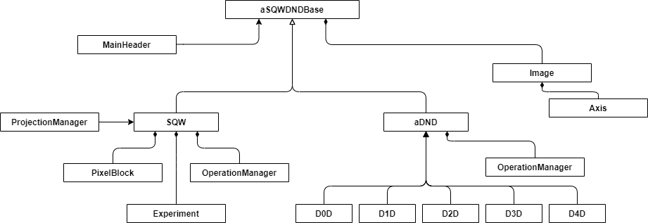

# SQW/DnD refactor

## Overview

This document describes work to refactor the SQW and DnD classes (n=0..4), in order to achieve the goals of Horace ticket #288, which were:

- convert SQW/DnD classes from the "traditional"-style MATLAB classes to "new style" MATLAB 'classdef' classes. In addition to improving the class representation of this data, simplifying the complex class construction logic and removing duplicated method implementations, this conversion also allows the proposed python front-end for PACE to work with these classes.
- switch from using `detpar` to define the instrument and detectors to a correctly constructed hierarchy of IX_Instrument classes, as described in Horace ticket #191.

## Current Work, as of 25/3/2021

The basic class hierarchy for the `SQWDnDBase` > `sqw` and `SQWDnDBase` > `DnDBase` > `dNd` classes has now been implemented and has removed the majority of code duplication between the concrete classes.

The old SQW/DnD methods are migrated across, and where possible implementation have been moved into the `SQWDnDBase` class, removing the need for the many DnD implementations which create a pixel-less SQW object, call the SQW method, and convert back to the DnD at the end.

There is further work required to clean up these interfaces. Several methods have been copied over as-is, without full consideration of what could be simplified, now there is shared code across all objects.

ToDo - current work:

- [x] merge `master`  into `288_` 
- [x] remove `[sqw|dnd]_old` from `288_`
- [x] merge DnD fit into `288_`
- [ ] merge `288_` into `master`

### Data

In the original implementation, the `dNd` objects had the properties (here shown for a d2d object):

    filename: ''
    filepath: ''
       title: ''
       alatt: [6.2832 6.2832 6.2832]
      angdeg: [90 90 90]
     uoffset: [4×1 double]
    u_to_rlu: [4×4 double]
        ulen: [1 1 1 1]
      ulabel: {'Q_h'  'Q_k'  'Q_l'  'En'}
         iax: [3 4]
        iint: [2×2 double]
         pax: [1 2]
           p: {[2×1 double]  [2×1 double]}
         dax: [1 2]
           s: 0
           e: 0
        npix: 1

while the `sqw` objects held the same data within a property called `data`of type `data_sqw_dnd`, like this (here shown for a 4D sqw):

        filename: ''
        filepath: ''
           title: ''
           alatt: [6.2832 6.2832 6.2832]
          angdeg: [90 90 90]
         uoffset: [4×1 double]
        u_to_rlu: [4×4 double]
            ulen: [1 1 1 1]
          ulabel: {'Q_h'  'Q_k'  'Q_l'  'En'}
             iax: [1 2 3 4]
            iint: [2×4 double]
             pax: [1×0 double]
               p: {1×0 cell}
             dax: [1×0 double]
               s: 0
               e: 0
            npix: 1
          urange: [2×4 double]
             pix: [9×0 PixelData]
    axis_caption: [1×1 an_axis_caption]
with additional fields `urange`, `pix`and `axis_caption`to represent the pixel data. (Note that the `data_sqw_dnd` was created by Alex as a "transition" object; this design is therefore already a first step to unifying the sqw and dnd objects.)

In the new classes this common SQW/DnD data is now all held in a `dnd_sqw_data` object, the protected  `data_`  attribute which is now in the superclass `SQWDnDBase.` 

This allows functions defined in the base class which operate on SQW and DnD objects to use a consistent API. For functions accessing this data externally, dependent properties are used to mimic the original separation of the `data_sqw_dnd` properties into class properties for DnD objects and `data` properties of the `data`attribute for sqw objects. The DnD objects have dependent properties that expose `data_` as in the current `dnd` classes as direct attributes (e.g. `d.s == d.data_.s`) , while the SQW objects exposes `data_` as a public attribute`data`  to mirror the existing `s.data.pix = s.data_.pix` API.

#### Internal Restructure

The next phase of the restructure is to move data contained within the `data_` attribute to a set of new classes. 
The `@sqw\Experiment\Experiment.m` class has been created as an initial piece of this.
The new component classes will be attributes of the `SQWDnDBase` or `sqw` class as appropriate. During the refactor, the class properties can initially be mapped to the new data location, but should eventually be removed and data accessed from these sub-objects (simplifying interfaces as they could then take an Image or Experiment object).

The restructure of data into 'logical' blocks provides an opportunity to move some of the many class methods of the SQW/DnD API into these new data classes grouping them more logically.

The outline design for this class breakdown are contained in the diagrams in the ADD (`07_sqw_redesign`), but this (intentionally) does not include a detailed breakdown. The intention was that the data and methods should be placed in the "most sensible" class as a greater understanding of the way the SQW will be used.

Note a lot of the voluminous API in `SQWDnDBase` is required to add the low-level operations to the class (binary and unary operations). Other methods have been included temporarily and relate to the Horace UI specific plotting routines. Pseudo-constructors like the `IX_dataset_nd` and `sigvar` methods may potentially be rendered unnecessary by providing `SQWDnDBase` constructors for those classes or removing them (e.g. a `sigvar` can be created explicitly as `sigvar(sqw_obj.data.s, sqw_obj.data.e)`).

#### Graphics

The plot commands are defined in the `SQWDnDBase` class. Where appropriate these include switches on dimensions to call the appropriate sub function.

Plotting is all done via instances of the `IX_dataset_nD` classes, with conversion methods implemented in the base class

### File Formats

#### Detpar / Instruments

The instrument and detector information is currently contained in the `detpar` structure, held as part of the SQW class. 

Initial work on the SQW (old-style) class was focused around converting `detpar` to `IX_Instrument`s. There are conversion routines implemented (`sqw/converters/`), but there were issues around much of the `detpar` data found in data files "failing" to create valid detectors: the tube widths as specified in the `detpar` were incompatible with the wall thicknesses defined on the standard tube detector raising errors that `2*thickness > width`. 

[Note: I have discovered and fixed an issue in the code which had switched Pressure/Thickness which may have been the issue or not...]

Instrument (hereafter assumed to include detector) definitions are used by Tobyfit to perform resolution/convolution on model output data to match it to the measured data.

Full instrument definitions are manually constructed. `Herbert/herbert_core/applications/instruments` includes example specifications for the MAPS, LET and MERLIN instruments (created by Toby). The instrument classes (and all constituent components: choppers, moderators, apertures, detectors) are defined in `Herbert/herbert_core/classes/intrument_classes`.

Ideally these definitions should be obtained by PACE within the measured data that comes from Mantid. The data currently contained in `detpar` is constructed from the the `.nxspe` files we ingest (from Mantid).  However, the current instrument description does not contain *all* information that is required (#33), nor do the Mantid data files. 

*#33 does not detail everything that is missing - the ticket was created in reaction to comments that "the SQW object does not contain all required data". A working assumption is that the instrument classes do.*

Freddie Akeroyd "owns" the Mantid file format. We've (loosely) discussed adding the data that is missing - he is happy to accommodate changes we request, but that is a larger change and will be harder/slower to roll out. PACE will have to accommodate data where the user hasn't or has incorrectly populated the fields - this is a known issue with data in source data files.

Alternative solutions to getting this information have been discussed:

- creating libraries of the "instruments" as Matlab scripts (as per the current MAPS, LET and MERLIN instruments)
- creating libraries of binary .mat files containing these instrument class objects .mat files 
- create tooling to generate an IX_instrument from an instrument definition file

The third of these options, using text file (of some kind, e.g. json, xml, csv, ...) offers the most flexibility:
- the file could be maintained and a "load data from this file" call made equally by a Python or MATLAB user
- if an XML-based format was used the work developing an XML schema would not be wasted as this could form the basis of an eventual extension to the `nxspe` HDF format
- these text files would be easy to manage and distribute and for users to create and maintain
- examples can be created from the reference LET, MAPS, MERLIN instruments

A file parser to convert this data into the correctly structured MATLAB would need writing, but that would be required to understand the Mantid files and the way instruments are stored in the SQW file (either the current binary sqw or future HDF)

### Documentation 

SQW design document is a high level summary of the basic blocks to break the SQW object into and a discussion document.

There is no detail about the implementation detail or API that is migrated.

Migrating the developer documentation to a Herbert/Horace folder in the `pace-projects` GitHub project has been discussed, specifically the ADR / ADD / SMG. I don't know whether the current decision was to:

- move the files into the `pace-developers` GitHub project, so all PACE developer documentation is in one place and the artificial separation between Horace and Herbert is removed
- leaving them in `Horace/documents` and `Herbert/documents` where they are alongside the code

### Other Work

Other outstanding work which has been side lined/forgotten:

- Moving (large) data files from the GitHub repository into the SAN storage area. 

  - Alex identified an issue accessing the SAN storage from iDAaaS, but that's not a fundamental block for all other use-cases.
  - Harry had prototyped a lot of this work with a manual system, we talked about using GitLFS to manage the files on that server as an alternative, 

  