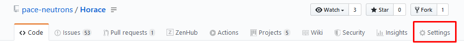
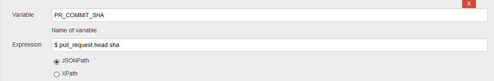
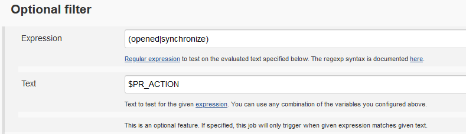
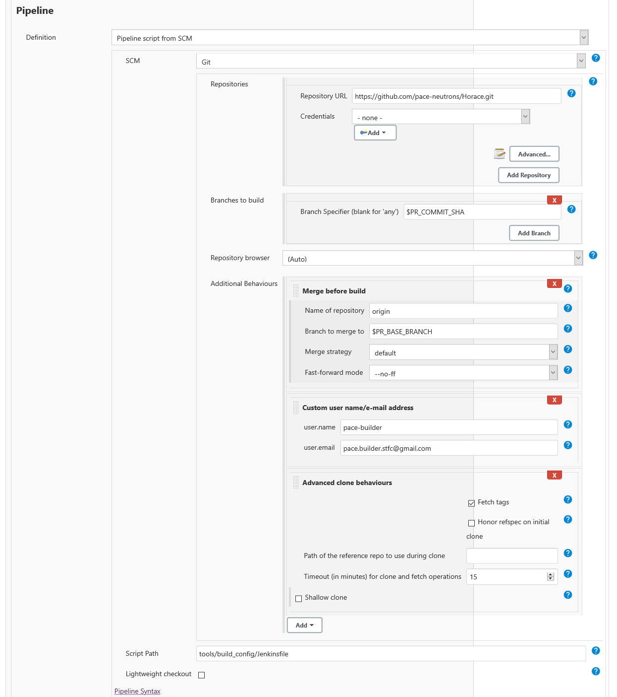

# Setting Up Jenkins CI

We use machines administered by [ANVIL](https://anvil.softeng-support.ac.uk/)
to run our continuous integration (CI) jobs. These machines are running
Jenkins v2.190.3.

We would like to be able to script and commit as much of our CI configuration
as possible. This makes things re-creatable and locally testable. However,
there is necessarily some set up that must be done within the GUI in Jenkins.
It is therefore important that this document is kept up-to-date with the steps
taken to reach the configuration we use.

We will use the CI for building pull requests and building master every
evening. Each build will create a Horace package that is shippable to users.

## Overview

Our CI builds follow the following high-level process:

- Jenkins checks out the correct branch

  For pull requests:

  - Webhooks are created in GitHub that notify Jenkins when a pull request event
  occurs.
  - When Jenkins receives a notification from GitHub it will checkout out the
  relevant pull request branch and merge it with master.

  For nightly builds:

  - Jenkins will clone master at a specific time each evening.

- Jenkins loads and runs the [`Jenkinsfile`](./../../tools/build_config/Jenkinsfile)
located in `tools/build_config`.
- The `Jenkinsfile` script runs our build script (one for Windows, one for Unix)
and updates GitHub about the status of the build.

## More Detailed Set Up

### GitHub

The only job required on GitHub is to set up webhooks to notify Jenkins of pull
requests. These can be created by GitHub repository admins by opening the
settings tab in the [main repo](https://github.com/pace-neutrons/Horace).

Then selecting the `Webhooks` menu item on the left-hand side.

Your webhook should have payload URL
`https://anvil.softeng-support.ac.uk/jenkins/generic-webhook-trigger/invoke?token=<my_secret_token>`
, content type `application/json` and only trigger on pull request events. This
will send a json containing information about the pull request (including pull
request number and the action taken in the pull request event) to Jenkins. Pull
request events trigger when a pull request is:

> *opened, closed, reopened, edited, assigned, unassigned, review requested,
> review request removed, labeled, unlabeled, synchronized, ready for review,
> locked, or unlocked.*

This means that, from the webhook's JSON, you must decide if you want to trigger
a build. usually you'd only want to trigger builds when a pull request is
`opened` or `synchronized`.

Form this page you can also re-deliver payloads that may not have reached
Jenkins e.g. if the Jenkins servers were down.

Using webhooks is a more efficient method to automatically trigger builds than
polling, as it does not require Jenkins to query GitHub on regular intervals.

### Jenkins GUI

#### Required Plugins

- [Jenkins Git](https://plugins.jenkins.io/git) - Clone Git repo
- [Generic Webhook Trigger](https://plugins.jenkins.io/generic-webhook-trigger) -
Allows GitHub to trigger build
- [xUnit](https://plugins.jenkins.io/xunit) - Parse and display test results

Follow these steps to set up the pipeline:

- Create a new "Pipeline" job.
- Enter the GitHub project URL (this creates a link to the GitHub from the pipeline).
- Select the `This project is parameterised` option:
    - Create the following string parameters:
        - `AGENT`: The label of the agent to run the job on
        - `CMAKE_VERSION`: The version of CMake to load
        - `MATLAB_VERSION`: The (release) version of Matlab to load
        - `GCC_VERSION`: The version of GCC to use (Linux only)

  For pull requests:
    - Select the `Generic Webhook Trigger` option and retrieve the json values:
        - `action`: The type of pull request event this is
        - `pull_request.number`: The pull request number on GitHub
        - `pull_request.statuses_url`: The url to send build statuses to
        - `pull_request.head.sha`: The HEAD sha of the pull request branch

      

    - Enter the token you used when setting up your webhook in the `Token`
    section.

    - In the `Optional Filter` section, choose to only trigger builds if the
    action retrieved from GitHub matches the regex `(opened|synchronize)`.

    

  - Set up the `Pipeline` section as shown below to have Jenkins pull the PR
  branch and merge it into master before building.

  

### Jenkinsfile and Build Scripts

This is the entry point for Jenkins. The script loads the versions of libraries
required, calls the build scripts and notifies GitHub of the build's status.

There are two build scripts, one written in Bash and one in Powershell. The
scripts are both named `build.<sh/ps1>` and have a similar API. To call the
script and only build use the `--build` flag, to build and test use both flags
`--build --test`. There is also a `--package` flag. These flags can be used
on there own or in combination. Note that Powershell uses *a single dash* for
parameters, i.e. `-build -test -package`.

The build scripts are intended to work locally as well as on Jenkins, so any
Jenkins specific tasks should *not* be in the build scripts.
