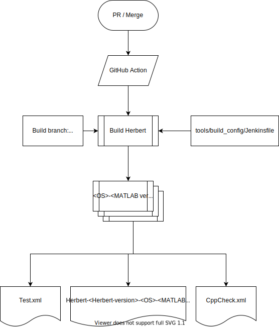
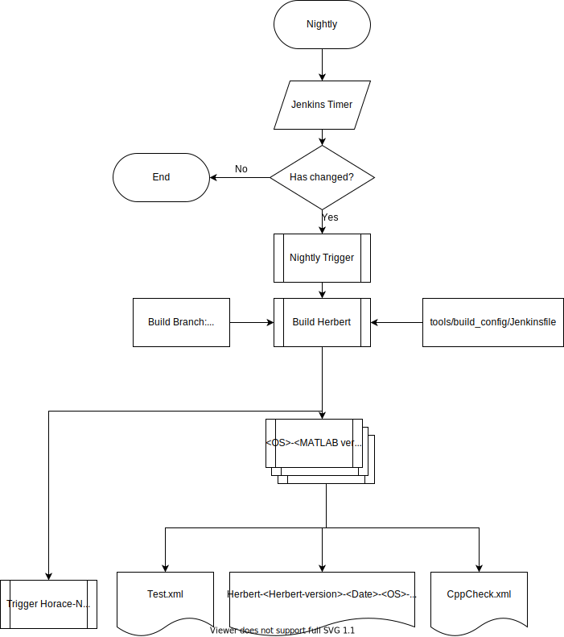
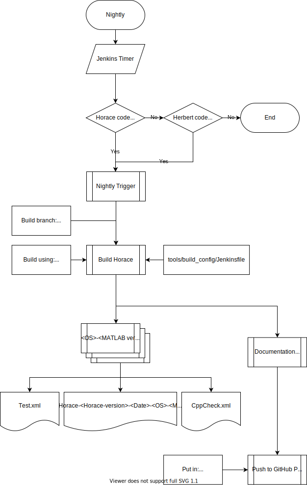
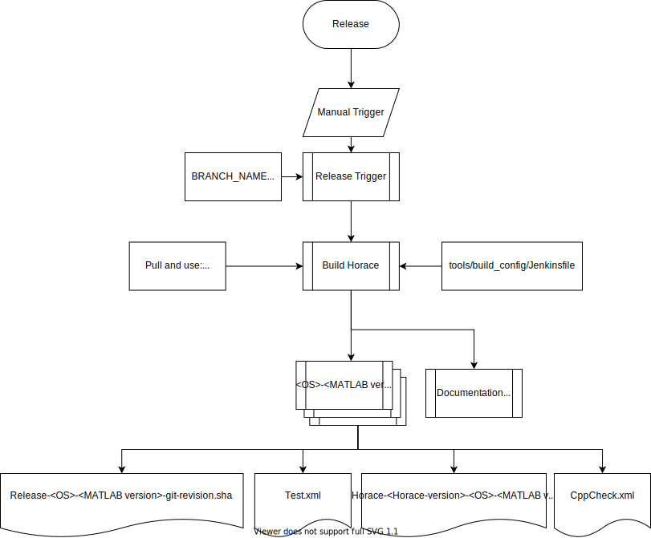
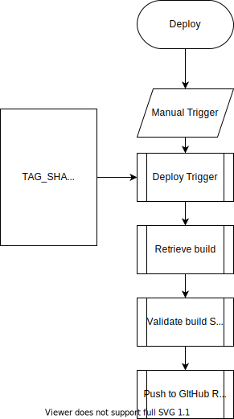
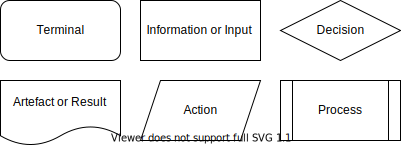

# Setting Up Jenkins CI

Machines administered by [ANVIL](https://anvil.softeng-support.ac.uk/) are used
to run the continuous integration (CI) jobs.
These machines are running Jenkins v2.204.1 (at time of writing).

As much of the CI configuration as possible should be scripted and committed to
version control. This makes things re-creatable and locally testable.
However, there is necessarily some set up that must be done within the GUI in Jenkins.
It is therefore important that this document is kept up-to-date with the steps
taken to reach the configuration we use.

Jenkins is used for building pull requests, when opened or edited,
and building master every evening.
Each build will create a Horace package that is shippable to users.

A `pace-builder` GitHub account has been created to provide authentication
between Jenkins and GitHub.

## Overview

The CI builds follow the following high-level process:

For pull requests:

- Webhooks are created in GitHub that notify Jenkins when a pull request event
  occurs.
- When Jenkins receives a notification from GitHub it will checkout out the
  relevant pull request branch and merge it with master.
- PR labels are checked to determine CI process

For nightly builds:

- Jenkins will clone master at a specific time each evening if there have been
any code changes.

For manual branch builds:

- A user manually triggers a build and enters a branch name that is then cloned.

For all:

- Jenkins loads and runs the
[`Jenkinsfile`](./../../tools/build_config/Jenkinsfile) located in `tools/build_config`.
- The `Jenkinsfile` script runs the platform specific build script and updates
GitHub about the status of the build.

## Naming conventions

The pipelines are split into folders `Herbert` and `Horace`,
each containing pipelines for their namesake's code.
All pipelines should follow the stated naming convention
and the majority of pipelines should exist in both Herbert and Horace folders.

The convention is:

```txt
[pipeline-type]-[os/platform]-[matlab-year-release]
```

Examples of `pipeline-type`:

- `PR` for pull requests
- `Branch` for builds of a user specified branch
- `Release` for pipelines creating Herbert/Horace releases
- an empty string for nightly master builds

The pipeline type defines the "type" of package that the pipeline will generate.
For example, the `PR` type will create a package whose version number contains
a Git SHA.
The `Release` type will generate a package meant for public release and the
version number will not contain a Git SHA.

Examples of `os/platform`:

- `Windows-10`
- `Scientific-Linux-7`

These names map to labels for ANVIL Jenkins agents.
This mappings are defined using the
[credentials plugin](https://www.jenkins.io/doc/book/using/using-credentials/).

Examples of `matlab-year-release`:

- 2018b
- 2019b

For example, a pipeline that builds PRs on Windows 10 using Matlab R2018b must
be called `PR-Windows-10-2018b`

It may also be useful to define _trigger_ pipelines.
These pipelines can be used to trigger a set of pipelines.
For example you may wish to trigger nightly builds for all platforms.
The naming convention for these should be `[pipeline-type]-Trigger`.

## Managing Herbert Dependency

In order to build and run, Horace requires that Herbert also be present in the
Jenkins workspace.
So that Horace builds are run against an up-to-date Herbert,
pull request and branch builds will checkout and build the latest Herbert master from GitHub.
This means that Horace is run against Herbert source,
instead of a Herbert package.
There also exists a parameter `HERBERT_BRANCH_NAME` that allows one to build a
particular branch or tag of Herbert.

Nightly builds should be equivalent to production releases, so Horace will use a
packaged version of Herbert. This will ensure that our Herbert and Horace packages
are compatible. The Herbert package to use will be copied from the last successful
Herbert nightly build.

## GitHub

The only job required on GitHub is to set up webhooks to notify Jenkins of pull
requests.
These can be created by GitHub repository admins by opening the settings tab in
the [main repo](https://github.com/pace-neutrons/Horace).


Then selecting the `Webhooks` menu item on the left-hand side.

The webhook should have payload URL:

```txt
https://anvil.softeng-support.ac.uk/jenkins/generic-webhook-trigger/invoke?token=<my_secret_token>
```

with content type `application/json` and only trigger on pull request events.
This will send a json containing information about the pull request
(including pull request number and the action taken in the pull request event)
to Jenkins.
Pull request events trigger when a pull request is:

> *opened, closed, reopened, edited, assigned, unassigned, review requested,
> review request removed, labeled, unlabeled, synchronized, ready for review,
> locked, or unlocked.*

This means that, from the webhook's JSON, it can be decided if a build is to be
triggered.
Usually, builds should only be triggered when a pull request is `opened` or
`synchronized` (a new commit is pushed to an existing pull request).

Only one webhook should be required to trigger all the necessary build jobs,
as long as the jobs share the same trigger token.

From this page payloads can be re-delivered if required, for example,
if the Jenkins servers were down and the payload was not received.

Using webhooks is a more efficient method to automatically trigger builds than
polling, as it does not require Jenkins to query GitHub on regular intervals.

### GitHub PR Labels

GitHub PRs are also pass labels through to the Jenkins build system. These labels can be accessed via the `PR_LABELS` environment variable from within scripts. Currently, there are 3 labels of importance to the Jenkins system.

- `DO_NOT_CI` - Label which skips the Jenkins system entirely (primarily for use with documentation changes).
- `do-not-build` - Label which skips the build and test phases of the pipeline (primarily for use with Jenkins Pipeline changes).
- `do-not-test` - Label which skips the test phase of the pipeline (primarily for use with changing CMake build processes)

## Jenkins GUI

### Required Plugins

- [Jenkins Git](https://plugins.jenkins.io/git) - Clone Git repo
- [Generic Webhook Trigger](https://plugins.jenkins.io/generic-webhook-trigger) -
Allows GitHub to trigger builds
- [xUnit](https://plugins.jenkins.io/xunit) - Parse and display test results

### Setting Up the Pipeline

- Create a new "Pipeline" job.
- The pipeline should follow the naming convention defined above.
E.g. `PR-Scientific-Linux-7-2018b`.
- Enter the GitHub project URL e.g. `http:/pace-neutrons.github.com/horace`
(this creates a link to the GitHub from the pipeline).

#### Nightly builds

The nightly build should run if there have been any code changes to the `master` branch.

- In the `Build Triggers` section select the `Poll SCM` option.
- Set the schedule to run overnight (e.g. between 1am and 2am `H 1 * * *`)
- Add a `RELEASE_TYPE` string parameters and set to `nightly`

Note: the Herbert build will trigger the downstream Horace build.
To ensure the latest build artifacts are used,
the Horace build must be scheduled to trigger *after the Herbert build will
have completed*.

#### Pull requests

- Select the `Generic Webhook Trigger` option and retrieve the json values:
  - `action`: The type of pull request event this is.
  - `pull_request.number`: The pull request number on GitHub.
  - `pull_request.statuses_url`: The url to send build statuses to.
  - `pull_request.head.sha`: The HEAD sha of the pull request branch.
  - `pull_request.base.ref`: The name of the base branch of the pull request.
  - `pull_request.labels[*].name`:
    The names of labels attached to the pull request ticket.
    This will be in the form `["label1", "label2"].
    These are used to specify a particular branch of Herbert to use in the
    build.

   

- Enter the token used when setting up the webhook in the `Token` section.

- In the `Optional Filter` section, choose to only trigger builds if the
action retrieved from GitHub matches the regex `(opened|synchronize)`.

  

- Set up the `Pipeline` section as shown below to have Jenkins pull the PR
branch and merge it into the pull request's base branch before building.

  

#### Branch builds

- Add a new string parameter called `BRANCH_NAME`, leave the default blank

  

- Fill in the pipeline section as shown below to checkout the given branch

  

When developers want to build a specific branch, they can navigate to the
`Branch-*` Jenkins job, choose `Build with Parameters` in the panel on the
left and enter the name of the branch they want to build.

## Jenkinsfile and Build Scripts

The `Jenkinksfile` script is the entry point for Jenkins.
This loads the required versions of libraries, calls the build scripts,
and notifies GitHub of the build's status.

The `Jenkinsfile` can be used to declare pipeline parameters,
rather than needing to set them in the GUI.
Be aware that these parameters will _not_ be set the first time you run the
Jenkinsfile.
However, the pipeline parameters will have been updated for the next time the
pipeline is run.
This moves more of the pipeline definition into code rather than in the GUI.

There are two build scripts, one written in Bash and one in PowerShell. The
scripts are named `build.<sh/ps1>` and have a similar API.

The build scripts are intended to work locally as well as on Jenkins,
so any Jenkins specific tasks should *not* be in the build scripts.

### Actions

| Argument (`.ps1`) | Argument (`.sh`)          |      |
| ----------------- | ------------------------- | ---- |
| `-configure`      | `--configure`, `-c`       | Create build folder and setup CMake |
| `-build`          | `--build`, `-b`           | Perform build   |
| `-test`           | `--test`, `-t`            | Run MATLAB and C++ tests |
|                   | `--analyze`, `-a`         | Run static code analysis (Linux only) |
| `-docs`           | `--docs`, `-d`            | Build HTML documentation |
| `-push_docs`      | `--push_docs`             | Push built documentation to GitHub pages |
| `-package`        | `--package`, `-p`         | Create archive of build artifacts |
| `-print_versions` | `--print_versions`, `-v`  | Display versions of compilers, MATLAB and libraries used |

### Options

| Argument (`.ps1`) | Argument (`.sh`) | Default | |
| --------------- | ------- | ---- | ---- |
| `-build_tests` | `--build_tests`, `-X` | `ON` | Build test files (`ON` \| `OFF`) |
| `-build_config` | `--build_config`, `-C` | `Release` | Build configuration to use (`Release` \| `Debug`) |
| `-build_dir` | `--build_dir`, `-O` | `./build` | Output directory for CMake build |
| `-cmake_flags` | `--cmake_flags`, `-F` | | Custom parameters to pass to CMake configure step |
| `-vs_version`, `VS` | | `2017` | Target Visual Studio version for CMake output (1) |

Actions may be combined.
To call the script and only build use the `--build` flag,
to build and test, use both flags `--build --test`.

Notes:

1. The Visual Studio version must match a configured Visual Studio release or
an error will be thrown
2. PowerShell uses *a single dash* for parameters, i.e. `-build -test -package`.

## Authentication

In order to create merge commits and to post build statuses to GitHub some
credentials must be provided within the Jenkins GUI.
For this, the `pace-builder` GitHub account has been created and given write
permissions to the Horace and Herbert repository.
The email for this account is `pace.builder.stfc@gmail.com`.

### Using Jenkins credentials

Credentials are saved in the Jenkins PACE area providing an API token linked
to the account.
See the
"[using credentials](https://www.jenkins.io/doc/book/using/using-credentials/)"
section of the Jenkins documentation.

These credentials can be accessed within the Jenkinsfile using a
`withCredentials` block,
this block will prevent the credentials being printed to the Jenkins log.

Do not assume Jenkins logs are private,
be careful to never publish passwords or API tokens.

#### Credentials in shell commands

Avoid string interpolation of credentials when using `"`.
Use literal (single-quoted) strings instead, or,
if you need to use string interpolation for another variable,
escape the `$` with a backslash when referencing the credential.
See
[the Jenkins docs](https://www.jenkins.io/doc/book/pipeline/jenkinsfile/#interpolation-of-sensitive-environment-variables)
for the explanation why.

```Groovy
def url = "https://github.com/"

withCredentials([string(credentialsId: 'TOKEN_ID', variable: 'secret')]) {

  /* INSECURE */
  sh """
    curl -H "Authorization: token ${secret}" ${url}
  """

  /* OK */
  sh '''
    curl -H "Authorization: token ${secret}" https://github.com/
  '''

  /* OK */
  sh """
    curl -H "Authorization: token \${secret}" ${url}
  """
}
```

## Established Jenkins pipelines

### PR

These diagrams show the process of triggering and running builds based on the creation of a pull-request in GitHub.

#### Herbert



#### Horace


### Nightly

These diagrams show the process of triggering and running builds of `master` based on a regular timer on a daily schedule. It should be noted that the builds only trigger if pushes have happened in the last 24 hours and also that the Horace pipeline will be triggered if changes have taken place in the Herbert source.

#### Herbert



#### Horace



### Release

These diagrams show the process of triggering and running builds for the purpose of review and testing before release. 

#### Herbert


#### Horace



### Deploy

These diagrams show the process of triggering the automatic deployment of the release build to GitHub as a release. 

#### Herbert



#### Horace


### Documentation


## Legend for flow diagrams


