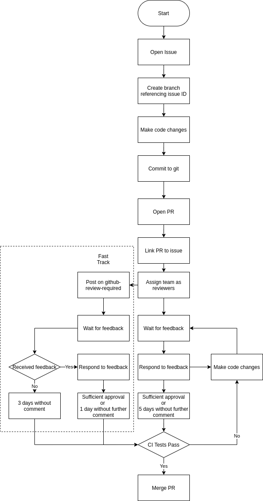
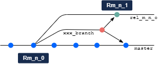

# Build/release process

This document covers the release process for releasing Horace to users.
Users can obtain versioned releases from these github pages via the Releases
section on the right sidebar of the Code page of this repository. Releases
are also propagated to the STFC/ISIS IDAaaS computing service. This document
describes how to create such releases and make the available. 

In the process of creating such releases, the build pipelines on Jenkins
are used to compile mex files and test the build, in addition to identifying
the releases and propagating them. This process is similar to the build
process used to validate pull requests when merging them to the master branch.

Production of Releases is detailed in the Releases section below.

## Build/Release pipeline

Build and test pipelines have been created in ANVIL for the Horace and Herbert
source.

All users should be using a build that has been built, tested and packaged
using the build pipelines.

### Master

The `master` branch should always be 'releasable' with all tests passing.
Builds are run on all target platforms to create `.zip`/`.tar.gz` release
packages each night.

- The Herbert `master` branch is built and a zip release build artifact with
MATLAB-release and platform-specific binary is created.

- The Horace `master` branch is built and a zip release build artifact with
MATLAB-release and platform-specific binary is created, which includes the last
successful Herbert `master` build.

The Horace build artifact is a single deployable unit to a specific MATLAB/OS
platform.
This is equivalent to the artifact created by the legacy MATLAB create release
process.

### Features

Feature development and bug fixes should be performed on branches and reviewed
using a GitHub Pull Request (PR).

When a pull request is opened or updated the merged code of the PR branch and
`master` is built and tested.

1. Feature developed on a branch taken from the `master`
2. All tests likely to be affected by changes in Herbert and Horace must be run
 on developers machine
3. Create Herbert PR (if required) for merge into `master` branch
4. Create Horace PR (if required) - if a Herbert PR has been created too the
Horace PR must not be merged until the Herbert PR has been merged
5. If the build/test of the PR against the Release branch succeeds on all
platforms, and the code has been reviewed, the PR can be merged.

### Releases

There are 4 levels of release:
   - major - numbered with a single integer n to give Vn, e.g. V4.
   - minor - numbered with an additional integer m to give Vn.m e,g. V4.1.
   - patch - numbered with a further additional integer o to give Vn.m.o`
e.g V4.1.3.
   - bugfix - numbered with the patch release number on which it is based,
plus the sha of the originating commit.

All releases actually use all three integers to
designate them; however major releases always have m=o=0 and minor releases
always have o=0.

For the purposes of generating releases, the mechanics of major and minor 
release production are identical as given below. Patch releases may also use
this mechanism, but it is not recommended and the preferred mechanism is given 
below in the following section.

Major and minor releases will always incorporate every change to the master
branch since the last non-patch release, and for this reason their creation
should always be well-tested and -documented to tell users what has changed 
in them. In particular, as IDAaaS users will always pick up the latest
IDAaaS release rather than consciously choosing to download it over the
previous release, so they should not be surprised by changes. Patch releases
generated by the alternative release process will only incorporate changes
that fix the headlined bugs and will not include other changes that have entered
the master branch. 

#### Major and minor releases

These should always be planned in advance so that users, particularly those
on IDAaaS, are aware of what is different from the previous version, as all
changes on the master branch will be exposed to them.

Creation of a release starts with identification of a commit on the master
branch as suitable for constructing a release. Based on this commit,
the Jenkins release branches (one for each build platform) are run to generate
release artifacts which the user can download from GitHub.

Before the release process is started, the release number has to be manually
determined from previous release numbers. For example, if the previous release
was V4.4, next release will be eithr V5.0 (major) or V4.5 (minor).  

This release number should then be inserted into the file `Horace/VERSION` to
replace the previous version number. It will be used by the Jenkins release
pipelines to generate the correct release tags. It should be committed to
the master branch in the normal way via a pull requested. Ideally this PR
should only include release artifacts (i.e. the release number and the release
notes) but in the past it has been changed combined with other developments, although
in those cases a release has not been generated.

A release notes file should also be created in `Horace\documentation` named
with the release number and suffixed `.md`. See previous examples for what this
should contain. The contents of this should also be copied for insertion into
the Deploy build as described below - apparently this is not directly copied
from the codebase.

With all this in place, the Jenkins release pipelines can be run. It appears
sufficient to run these on each platform (linux: currently Rocky8 at the time
of writing, and windows: currently VM-Win10) for the latest Matlab version supported
in the Jenkins pipelines (currently 2022a). See below for how this appears in 
IDAaaS.

Taking the `Release-Rocky8-2022a` pipeline as an example, clicking on that link
on the Jenkins Horace page gets you to the pipeline page. In the left sidebar
click the Build With Parameters link. On the build page, fill in the following
fields:
   - branch: set to `master`
   - release_type: set to `release`
   - agent: use preset value (here `rocky8`)
   - leave remaining fields blank (they will default)
   - tick box to build documents
   - leave box to run benchmarks unticked
and click the `build` button. The pipeline will do the build including running
the tests. Make sure these have passed. Fix any bugs.

Repeat this for the `VM-Win10` pipeline for your Matlab version.

In order to deploy the code built with these pipelines, you will need 6 pieces
of information. Two of these are the names of the pipelines (`Release-Rocky8-2022a
and Release-VM-Win10); two are the build numbers for each platform (seen top left
of the stage view of the pipeline pages); one is the version number from Horace/VERSION(as noted above);
one is the commit sha for the commit from which the release was made. This can
be obtained from the last line of the Last Succesful Artefacts section of the
pipeline page for either of the build platforms; click on the View link at
the right of the sha line (both builds will have used the same commit.

Now run the relevant Deploy pipeline. There is only one of these. Go into the 
pipeline page and from the left sidebar, click the Build With Parameters link. 
On the build page, fill in the following fields:
   - tag_sha: sha number noted above
   - version number: as noted above
   - release_job_ids: On line 1 copy `Release-Rocky8-2022a`, comma, build number 
(the number of the build on the first line of Stage View), semi-colon; and
on line 2 repeat for the `Release-windows-VM-Win10` pipeline.
   - release body: this should be a copy of the release notes.
   - draft: (check-box) see below
   - prerelease: (checkbox) see below
It is thought that if either of the checkboxes are ticked, then it is
possible to repeat the release/deploy process; the release tag is not
finalized.

The Jenkins build artifacts are are not accessible outside of STFC.
End users will be directed to GitHub to access packaged releases.

The deploy pipeline will:

- tag the Git revision with the release number (`Vm.n.o`)
- copy the built artifact to the corresponding GitHub release

The release tag will be an anchor for any subsequently needed release branch
and patch branches.

The version number is stored in a text file (`VERSION`) in the root of the
Herbert and Horace source.
This will follow [semantic versioning](https://semver.org/)
and is used in the build process to set the version number in the MATLAB
and compiled C++ components.

### Deployment on ISIS computational services machines

To provide rapid response to user requests,
bug-fixes and all advantages of constant deployment process,
the release code is rapidly available to users who use ISIS computational
resources to process the results of their experiments.
The services providing these resources are currently iDaaaS
and ISISCOMPUTE services.
These services provide users with pool of virtual (iDaaaS) or real
(ISISCOMPUTE) Linux machines, connected to the common parallel file system.

By agreement, each machine of the pool has folder `/usr/locam/mprogs/`
containing number of symbolic links to  `Horace`, `Herbert`, `Horace_bugfix`
and `Herbert_bugfix` clones of the GitHub repositories of the appropriate
packages.
In addition to that, it contains also reference  `/usr/local/mprogs/User`
pointing to the folder containing Horace,
Herbert and parallel MPI workers initialization scripts.
*Startup.m* script auto-generated on all service machines intended for the
users of inelastic experiments, enables Herbert/Horace code when Matlab starts.

The details of the packages installation and deployment on the ISIS machines
are provided in [ISIS Release Process documentation](11_ISIS_release.md)

As soon as release branch is tagged and created in the repository according to
the release  process,
the code, exposed through the links above is checked out and switched to the
recently released, so users can user the released version of the code.

#### Patch releases

Patch-fix releases are made because a bug has been identified in the 
latest major or minor release. To avoid exposing the users to recent
changes on the master branch, a patch release is made to add only fixes
for the bug to the latest major/minor release.

Before creating a branch to fix the bug, a patch branch is created if need be,
If the last release was a major or minor release, then the patch branch is 
branched from the commit for that release on the master branch. This is to
give a code branch without any of the changes which have been subsequently
made on the master branch. If the last release was a patch release then the
patch branch will already exist. In either case the changes required to fix
the bug will be merged onto the patch branch, creating the release.

To fix the bug, a normal bugfix PR branch is also made from the last release. 
Fixes will be made on this bugfix branch and the branch will be merged with
master using a PR as normal. The branch should NOT be deleted. Instead it
will be merged locally with the patch release branch, and the patch release
branch should then be pushed to github. 

Once the fix is in the patch branch, a release should then be created from 
the merge commit in the same way as for major or minor releases. The release
build pipelines should build the release and the deploy pipeline should deploy
it to the github release page. After the release is succesful the bugfix
branch may be deleted but the patch release branch should be kept.

If parallel execution is necessary for bug-fixing,
the supporter also needs to do similar changes in worker_4tests script
available in the **User** folder above.
`herbert_on/horace_on` commands within this script should be modifued to point
to the bugfix version of the code. The user's **parallel_config** class
`worker` field should then be assigned with `worker_4tests` value.
The default value of this field is `worker_v4` which initializes default
Horace/Herbert code base.
The `worker_v4` script will continue to be used by other users for their data
processing, until bug-fixing is completed and merged into the code base.

Patch releases will be made to release branches to resolve specific bugs
identified.
These should be tested and built through the same build pipeline as the initial
production releases.

1. User reports issue
2. Bug report issue created in GitHub/Issues documenting how to reproduce,
and include any custom scripts or data that triggered the issue
3. Fix developed on a branch (`xxx_branch`) taken from the *release* tag
(`Rm_n_o`)
4. All tests likely to be affected by changes in Herbert and Horace must be run
 on developers machine
5. PR created for merge into Release branch (`rel_m_n`) *and* `master` branch.
If this is the first release patch, the branch will need to be created
6. If the build and test of the PR to the Release branch succeeds on all
platforms, that build artifact can be released to the target platform as
version `m.n.o+1`

If the hot-fix is being done out-of-hours the PR can be merged by the developer
WITHOUT review provided all tests pass,
but the branch should not be deleted and should be reviewed at the earliest
opportunity.

On any Horace release branch, the associated version of Herbert (`Rm_n_x`) will
remain unchanged except for patches.

The same caveats apply about the Horace build dependencies on Herbert.

Advantages:

- build tools are not required on the production hardware
- all builds are created using the same build tools
- users are using a known, traceable, validated release

Disadvantages:

- slower; have to wait for full build and test pipeline to execute

### Hot-fix Releases

If a particular fix is required quickly on a target system, the full build and
test process can be bypassed so that facility users do not lose critical
machine time.

Quick modifications to the software, with only partial testing,
carry the risks of breaking other parts of the software,
so this is an exceptional use-case.
Non-time critical issues should be resolved through the standard Patch Release
process.

"Hot-fix" pipelines will be created in ANVIL
([Horace #241](https://github.com/pace-neutrons/Horace/issues/241) that only
build and package Herbert and Horace and do not run the tests.

This will complete is around 5 minutes as it is the test execution step of the
standard PR pipeline that take in excess of an hour to run.

1. User reports issue
2. Bug report issue created in GitHub/Issues documenting how to reproduce,
and include any custom scripts or data that triggered the issue
3. Fix developed on a branch (`xxx_branch`) taken from the *release* tag
(`Rm_n_o`)
4. New tests demonstrating the issue and its resolution are developed.
Tests identified as being likely to be affected by the code changes run on
developer's machine
5. Run the branch through the "hot-fix" build pipeline on Jenkins that *just*
executes the build and package steps
6. The build artifact can be released to the specific target platform as
version `m.n.o.<sha>`
7. Open PR to merge the hot-fix branch into the `master` and `rel_m_n` branches,
as per the standard Patch Release process
8. When the build and test of the PR to the Release branch succeeds on all
platforms, that build artifact can be released to all platforms as version
`m.n.o+1`

Advantages:

- users will run a tested and built version of Horace on all platforms most of
the time
- changes fixing an issue can be made rapidly so users will lose a minimum
amount of time while running experiments
- hot-fixed releases will have a version number including the the commit-SHA,
so the build will be identifiable and traceable
- no requirement to maintain a separate production branch.
The only "maintained" branches are the release branches and master
- patches will be rapidly deployed and well-defined, reproducible build
- packaged hot-fix release will be identical to a standard release so can be
deployed using the same processes

Disadvantages:

- not fully tested code released to part of the production system,
alleviated by the fact that affected user experienced issue anyway.

