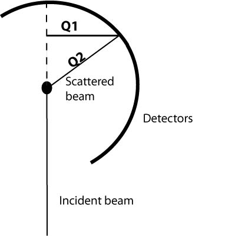

####################
The Horace Rationale
####################

Choice of Horace
#################

Horace is a suite of programs which can be used to build, visualise and analyse large datasets from time-of-flight neutron inelastic scattering spectrometers. 

The feature of Horace that is new compared to existing software, such as MSlice, is that it allows you to combine data from multiple runs (each 
with different incident energy and/or sample orientation) and thus build up a 4-dimensional dataset that, in principle, covers **Q** and energy in 
all directions.

As it is not possible to capture all combinations of **Q** and energy with a single run (as described in the next section), Horace is the set of tools
that enables users to work with a single dataset that encompasses the results of all the runs made to characterise a given sample. 

Why multiple runs are needed
############################

To understand why it is not possible to capture all combinations of **Q** and energy with a single run, consider the diagram shown below.

For a single incident energy and crystal orientation it is clear that one of the components of **Q**, that parallel to the scattered beam (**Q2**), 
is coupled to time-of-flight rather than detector position. This means that this component of **Q** is coupled to neutron energy transfer. Put simply, 
the effect of this is that a linear "scan" in **Q** actually follows a curved path in either energy or **Q2**. Clearly this can be avoided by taking 
measurements with a different orientation of the sample with respect to the incident beam, since for different orientations the coupling between **Q** 
and energy will be different. By making measurements at lots of different sample orientations, **Q** and energy can be completely decoupled.

