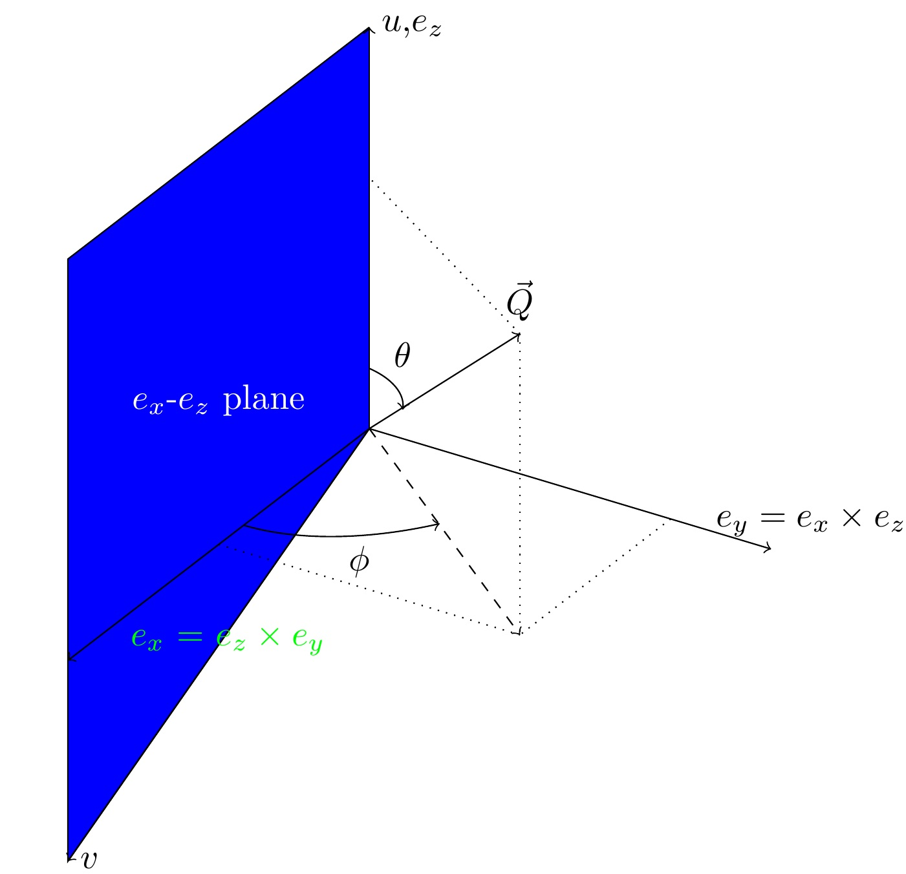

###################################################
Cutting data of interest from SQW files and objects
###################################################

.. |SQW| replace:: S(**Q**, :math:`\omega{}`)

.. |Q| replace:: :math:`|\textbf{Q}|`

Horace stores the data produced in a neutron experiment in a 4-D dataset
which are called the
"pixels". These represent the neutron events measured during an
experiment. The dataset also contains the rest of the full information about the experiment.

Horace also creates a 4-dimensional histogram (binned) of these "pixels"
represented in reciprocal space (``hkl-dE``) which we call the "image". This
carries only limited information about the original data, i.e. only the
averaged intensity over the bins remains.

.. note::

   For the differences between ``dnd`` and ``sqw`` objects see: :ref:`here
   <manual/FAQ:What is the difference between sqw and dnd objects>`

Generally, rather than attempting to deal with the full experimental
data, a user works with smaller objects, extracted from the full dataset using
``cut``. This is for multiple reasons including:

- The 4-dimensional dataset is impossible to visualise, as only 3-d (through
  slice-o-matic), 2-d and 1-d cuts can be easily represented.
- The entire dataset is often too large to fit in the memory of most computers.

:: _cut:

cut
===

``cut`` takes a (or multiple) section(s) of data from an ``sqw`` or ``dnd``
object or file, discards the pixels which lie outside of the binning regions
(described `below <#binning-arguments>`_) from an ``sqw`` and accumulates them
into a histogram (the "image" or ``dnd``, which may be independent if requested
or attached to the parent ``sqw``). It can return an object or file depending on
the parameters given.

``cut`` can produce objects of the same or reduced size and dimensions. The
result of a cut is itself an ``sqw`` or ``dnd`` object which can be further
plotted, manipulated, etc.

.. note::

   If the resulting object is estimated by Horace to be too big to fit in
   memory, it will be saved to disc, but will appear mostly indistinguishable
   from a memory-backed ``sqw`` object, supporting most operations. We call this
   a "file-backed ``sqw``" (for more detail see: `File- and memory-backed
   cuts`_). When the manual refers to an ``sqw`` object both "file-backed" and
   "memory-backed" are included.

   .. warning::

      File-backed objects may be significantly slower to operate on than memory
      backed ones.

The inputs are as follows:

.. code-block:: matlab

   my_cut = cut(data_source[, proj], p1_bin, p2_bin, p3_bin, p4_bin[, '-nopix'][, sym][, filename])

where:

- `data_source <#datasource>`_ is either a string giving the full filename (including
  path) of an input sqw file or a variable containing a ``sqw`` object.
- `proj <#projection-proj>`_ defines the axes and origin of the cut including
  the shape of the region to extract and the representation in the resulting
  histogram.
- `pN_bin <#binning-arguments>`_ describe the histogram bins to capture the
  data.

There are also several extra optional arguments which are:

- ``-nopix``

  drop the "pixels" from the resulting object returning just the ``dnd`` binned
  data (the "image"). This option is faster and the resulting object requires
  less memory, but is also more restricted in what you can do with the result.

- ``sym``

  cell array of symmetry operations. For a full description of usage, :ref:`see
  here <manual/Symmetrising_etc:Cutting>`.

- ``filename``

  if provided, uses file-backed algorithms to write the resulting object
  directly to a file named ``filename`` and return a file-backed ``sqw``.

.. warning::

   If ``cut`` is called without a return argument, the ``filename`` option is
   mandatory.

.. _datasource:

Data Source
-----------

``data_source`` in ``cut`` is either a string giving the full filename (including path) of
the input ``.sqw`` file or just the variable containing an ``sqw`` or ``dnd``
object stored in memory from which the pixels will be taken.

.. warning::

   By convention both ``sqw`` and ``dnd`` objects use the ``.sqw`` suffix when
   stored to disc. It is advisable to name the file appropriately to distinguish
   the types stored inside, e.g. ``MnO2_sqw.sqw``, ``MnO2_d2d.sqw``.

Projection (proj)
-----------------

The projection defines the coordinate system and thus the meaning of the
`Binning arguments`_ and the presentation of the data.

``proj`` should be a projection type such as ``line_proj``, ``sphere_proj``,
etc. which contains information about the target coordinate system representation.

.. note::

   To take a cut from an existing ``sqw`` or ``dnd`` object while retaining the
   existing projection, provide an empty ``proj`` argument:

   .. code-block:: matlab

      w1 = cut(w, [], [lo1, hi1], [lo2, hi2], ...)

Different projections are covered in the `Projection in more detail`_ section below.

.. note::

   Changing projection does not change the underlying pixels, merely its
   representation (binning) in the image and how thus it appears when plotted.

   It does, however, affect which pixels are selected and which are discarded
   when making a cut.

Binning arguments
-----------------

The binning arguments (``p1_bin``, ``p2_bin``, ``p3_bin`` and ``p4_bin``)
specify the binning / integration ranges for the Q & Energy axes in **the target
projection's** coordinate system (c.f. `Projection in more detail`_).

Each can independently have one of four different forms below.

.. warning::

   The meaning of the first, second, third, etc. component in ``pN_bin`` changes
   between each form. Ensure that you have the correct value in each component
   to ensure your cut is what you expect.

* ``[]`` Empty brackets indicate that the cut algorithm should identify binning ranges. 
    The hull which surrounds source image is converted into target coordinate 
    system and the min/max values of the target hull ranges in every dimension are taken
    as the new default ranges for the cut. The default ranges are taken for the directions
    where ``[]`` is used for requested ranges. The number of bins in selected dimension is 
    taken equal to the number of bins in the source dimension which have the same number as source 
    dimension. 
    
    E.g. if your provided ``[]`` for ``p4_bin`` this identifies ``dE`` ranges (4-th dimension).
    All current projections do not change energy axis so this will lead to target cut 
    having the same binning ranges in ``dE`` direction as the source cut. 
    If you provided ``[]`` for ``p3_bin`` and your source coordinate system is linear (defined by ``linear_proj``) and 
    target coordinate system is cylindrical (defined by ``cylinder_proj`` see more on :ref:`cylindrical_projection` below) 
    cut algorithm will try to identify :math:`\phi` range (3-rd coordinate of cylindrical coordinate system)
    of the source cuboid in the cylindrical coordinate system. The number of bins for the :math:`\phi` range
    will be equal to the number of bins in ``q-3`` dimension of the source coordinate system. If 
    ``q-3`` dimension was integrated, the :math:`\phi` dimension of the target cylindrical coordinate system
    will be also integrated.
    

* ``[step]``  Single (scalar) number defines a plot axis with bin width equal to the number you specify. 
    The lower and upper limits are calculated by the same algorithm as the binning range in ``[]``-brackets case.  

.. note::

   A value of ``[0]`` is equivalent to ``[n]`` using bin size of the source coordinate system. This may lead
   to strange or incorrect result if target coordinate system is changed significantly as reasonable ``0.01`` 
   q-step may be used as step size for ``-180:180`` :math:`\phi` binning range of spherical or cylindrical
   coordinate system, creating 36000 bins in :math:`\phi` direction, which is useless and probably fail.
   
.. warning::
    
   The algorithm which identifies binning ranges is pretty basic algorithm. It works reliably in simple cases, e.g. 
   for transformations described by projections of the same kind (e.g. ``line_proj->line_proj``
   or ``sphere_proj->sphere_proj`` where the offset between two projection is unchanged). In more complex cases,
   e.g.  ``line_proj->cylinder_proj`` when ``cylinder_proj`` axis is not aligned with ``line_proj`` axes, algorithm
   do not converge after reasonable number of iterations and returns warning similar to: ::
   
     ' target range search algorithm have not converged after 5 iterations.
       Search have identified the following default range:
      0        0.0120  -179.9641
      1.5843   90.0000  179.9641
      This range may be inaccurate'

   User should evaluate how acceptable is this result for the purposes of the desired cut and 
   specify 3 or 2-component binning ranges below to get more accurate binning and extending
   requested binning ranges if in doubt. More accurate version of the range-calculating algorithm will
   be developed in a future.

* ``[lo,hi]`` A vector with two components defines integration axis.
    The signal will be integrated over that axis between limits specified by the two components of the vector.

.. warning::

   A two-component binning axis defines the integration region between bin
   edges. For example, ``[-1 1]`` will capture pixels from ``-1`` to ``1``
   inclusive.

* ``[lower,step,upper]``  A three-component binning axis specifies plot axis.
  The first  ``lower`` and the last ``upper`` components specifying the centres of the
  first and the last bins of the data to be cut. The middle component specifies
  the bin width.

.. note ::

   If ``step`` is ``0``, the ``step`` is taken from the source binning axes.

.. warning::

   A three-component binning axis defines the integration region by bin centres,
   i.e. the limits of the data to be cut lie between ``min = lower-step/2`` and
   ``max = upper+step/2``, including ``min/max`` values. For example, ``[-1 1
   1]`` will capture pixels from ``-1.5`` to ``1.5`` inclusive.

* ``[lower, separation, upper, cut_width]``

  A four-component binning axis defines **multiple** cuts with **multiple**
  integration limits in the selected direction.  These components are:

  * ``lower``

    minimum cut bin-centre

  * ``separation``

    distance between cut bin-centres

  * ``upper``

    approximate maximum cut bin-centre

  * ``cut_width``

    half-width of each cut from each bin-centre in both directions

  The number of cuts produced will be the number of ``separation``-sized steps
  between ``lower`` and ``upper``.

.. warning::

   ``upper`` will be automatically increased such that ``separation`` evenly
   divides ``upper - lower``.  For example, ``[106, 4, 113, 2]`` defines the
   integration ranges for three cuts, the first cut integrates the axis over
   ``105-107``, the second over ``109-111`` and the third ``113-115``.

File- and memory-backed cuts
----------------------------

``cut`` generally returns its result in memory. However, if the resulting object
is sufficiently large (the threshold for which is determined by the
configuration parameters below, see also:
:ref:`manual/Changing_Horace_settings:HPC Config`).

If the ``filename`` argument is provided, the object will be saved to this file
and the returned object will be backed by this file.

If the ``filename`` argument is not provided, a temporary file will be created
instead. If the ``sqw`` backed by this objected is deleted, the file will be too.

.. warning::

   A temporary ``sqw`` and its descendants (through subsequent operations) will
   all be considered temporary.

   To ensure an ``sqw`` is kept, you can :ref:`manual/Save_and_load:save` this
   object to file permanently.

The options which define the maximum size in memory are:

- ``mem_chunk_size``
- ``fb_scale_factor``.

If the number of pixels in the result exceeds
``mem_chunk_size*fb_scale_factor``, the resulting ``sqw`` object is file-backed.

Projection in more detail
-------------------------

As mentioned in `Projection (proj)`_, the ``proj`` argument defines the coordinate
system of the histogrammed image.

.. warning::

   Horace, prior to version 4.0.0, used a structure with fields ``u``,
   ``v``, ... or else a ``projaxes`` object, to define the image coordinate
   system. This has been replaced by the ``line_proj``. You can still
   call ``cut`` with these structures, however, it will issue a
   warning and construct a ``line_proj`` internally.

Lattice based projections (``line_proj``)
^^^^^^^^^^^^^^^^^^^^^^^^^^^^^^^^^^^^^^^^^

The most common type of projection for single-crystal experiments is the
``line_proj`` which defines a (usually orthogonal, but not necessarily) system
of linear coordinates from a set of basis vectors.

The complete signature for ``line_proj`` is:

.. code-block:: matlab

   proj = line_proj(u, v[, w][, nonorthogonal][, type][, alatt, angdeg][, offset][, label][, title][, lab1][, lab2][, lab3][, lab4]);

Where:

* ``u``

  3-vector in reciprocal space :math:`(h,k,l)` specifying first viewing axis.

* ``v``

  3-vector in reciprocal space :math:`(h,k,l)` in the plane of the second viewing axis.

* ``w``

  3-vector of in reciprocal space :math:`(h,k,l)` of the third viewing axis.

.. note::

   The first viewing axis is strictly defined to be ``u``

   The second viewing axis is constructed by default to be in the plane of ``u``
   and ``v`` and perpendicular to ``u``.

   The third viewing axes is by default defined as the cross product of the first
   two. (:math:`u \times{} v`)

   The fourth viewing axis is always energy and cannot be modified.

   .. warning::

      None of these vectors can be collinear. An error will be thrown
      in this case.

.. note::

   The ``u`` and ``v`` of a ``line_proj`` are distinct from the vectors ``u``
   and ``v`` that are specified in :ref:`gen_sqw
   <manual/Generating_SQW_files:gen_sqw>`, which describe how the crystal is
   oriented with respect to the spectrometer and are determined by the physical
   orientation of your sample.

.. note::

   ``u`` and ``v`` are defined in the reciprocal lattice basis so if the crystal
   axes are not orthogonal, they are not necessarily orthogonal in
   reciprocal space.

   E.g.:

   .. code-block:: matlab

      angdeg % => [60 60 90]
      proj = line_proj([1 0 0], [0 1 0]);

   such that ``u`` = :math:`[1,0,0]` and ``v`` = :math:`[0,1,0]`. The
   reciprocal space projection will actually be skewed according to ``angdeg``.

.. _nonortho:

* ``nonorthogonal``

  Whether lattice vectors are allowed to be non-orthogonal

.. note::

  If you don't specify ``nonorthogonal``, or set it to ``false``, you will get
  orthogonal axes defined by ``u`` and ``v`` normal to ``u`` and ``u`` x
  ``v``. Setting ``nonorthogonal`` to ``true`` forces the axes to be exactly the ones
  you define, even if they are not orthogonal in the crystal lattice basis.

  .. warning::

     Any plots produced using a non-orthogonal basis will plot them as though
     the basis vectors are orthogonal, so features may be skewed (see
     `below <#non-orthogonal-axes>`_) .

     The benefit to this is that it makes reading the location of a feature in a
     two-dimensional **Q**-**Q** plot straightforward. This is the main reason for
     treating non-orthogonal bases this way.

* ``type``

  Three character string denoting the the projection normalization of each of
  the three **Q**-axes, one character for each axis, e.g. ``'aaa'``, ``'rrr'``,
  ``'ppp'``.

  There are 3 possible options for each element of ``type``:

  1. ``'a'``

     Inverse angstroms

  2. ``'r'``

     Reciprocal lattice units (r.l.u.) which normalises so that the maximum of
     :math:`|h|`, :math:`|k|` and :math:`|l|` is unity.

  3. ``'p'``

     Preserve the values of ``u`` and ``v``

  For example, if we wanted the first two **Q**-components to be in r.l.u. and
  the third to be in inverse Angstroms we would have ``type = 'rra'``.

* ``alatt``

  3-vector of lattice parameters.
* ``angdeg``

  3-vector of lattice angles in degrees.

.. note::

   In general, you should not need to define ``alatt`` or ``angdeg``;
   by default they will be taken from the ``sqw`` object during a
   ``cut``. However, there are cases where a projection object may
   need to be reused elsewhere.

* ``offset``

  3-vector in :math:`(h,k,l)` or 4-vector in :math:`(h,k,l,e)` defining the
  origin of the projection coordinate system. For example you may wish to make
  the origin of all your plots :math:`[2,1,0]`, in which case set ``offset
  = [2,1,0]``.

.. _plotargs:

* ``label``

  4-element cell-array of captions for axes of plots.
* ``title``

  Plot title for cut result.
* ``lab[1-4]``

  Individual components label (for historical reasons).

.. note::

   If you do not provide any arguments to ``line_proj``, by default it
   will build a ``line_proj`` with ``u=[1,0,0]`` and ``v=[0,1,0]``.

   .. code-block:: matlab

      >> line_proj()

      ans =

        line_proj with properties:

                      u: [1 0 0]
                      v: [0 1 0]
                      w: []
                   type: 'ppr'
          nonorthogonal: 0
                  alatt: [6.2832 6.2832 6.2832]
                 angdeg: [90 90 90]
                 offset: [0 0 0 0]
                  label: {'\zeta'  '\xi'  '\eta'  'E'}
                  title: ''

.. _poskwarg:

.. note::

   ``line_proj`` accepts arguments both positionally and as key-value pairs e.g.

    .. code-block:: matlab

       >> proj = line_proj([0, 1, 0], [0, 0, 1], 'type', 'aaa', 'title', 'My linear cut')

       line_proj with properties:

                    u: [0 1 0]
                    v: [0 0 1]
                    w: []
                 type: 'aaa'
        nonorthogonal: 0
               offset: [0 0 0 0]
                label: {'\zeta'  '\xi'  '\eta'  'E'}
                title: 'My linear cut'

    However, it is advised that besides ``u`` and ``v`` arguments are passed as
    key-value pairs.

    Alternatively you may define some parameters initially, and define others
    programmatically:

    .. code-block:: matlab

       proj = line_proj([0,1,0],[0,0,1]);
       proj.type = 'aaa';
       proj.title = 'My linear cut';

    Both forms result in the same object

Non-orthogonal axes
___________________

You may choose to use non-orthogonal axes (c.f. `here <#nonortho>`_), e.g.:

.. code-block:: matlab

   proj = line_proj([1 0 0], [0 1 0], [0 0 1], 'nonorthogonal', true);

The figure below shows the difference between ``nonorthogonal=false`` and
``nonorthogonal=true`` for plotting fake "Bragg reflections" from a
non-orthogonal lattice (``alatt=[2,2,4]``, ``angdeg=[90,90,70]``) where the
reflections occur in the r.l.u. points where ``hkl`` coordinates are integers.

 .. figure:: ../images/orthogonal_vs_nonorthogonal_proj.png
   :align: center
   :width: 800px
   :alt: 2d cuts ortho and non-ortho.

   Sample plot for cases where projection is a) orthogonal and b) non-orthogonal.

We can see that for the ``nonorthogonal=true`` case the reciprocal lattice
maintains its symmetry, but the ``nonorthogonal=false`` image produces precise
axis-labels but a skewed image.

.. note::

   These images are produced by the following code:

   .. code-block:: matlab

      function w = reflection(h, k, l, e, p)
           grid_h = round(h);
           grid_k = round(k);
           grid_l = round(l);
           w = p(1)*exp(-((h-grid_h).^2+(k-grid_k).^2+(l-grid_l).^2)/p(2));
      end

      function plot_cuts()
           proj = line_proj([1, 0, 0], [0, 1, 0], [], false, 'rrr', [2, 2, 4], [90, 90, 70]);
           ax = line_axes('nbins_all_dims', [200, 200, 1, 1], 'img_range', [-4, -3, -0.1, -5;4, 3, 0.1, 5]);
           tsqw = sqw.generate_cube_sqw(ax, proj);
           tsqw = sqw_eval(tsqw, @reflection, [1, 0.01]);
           plot(tsqw)
           keep_figure
           proj = line_proj([1, 0, 0], [0, 1, 0], [], true, 'rrr', [2, 2, 4], [90, 90, 70]);
           tso = sqw.generate_cube_sqw(ax, proj);
           tso = sqw_eval(tso, @reflection, [1, 0.01]);
           plot(tso)
      end

   which plots 2D exponential decay around points where ``h,k,l`` are integers.

   Note that this usage of a projection different from its usage in `cut <#cut>`_:
   The construction of ``line_proj`` here uses positional arguments and because we are building a
   fake ``sqw`` object, the projection needs the lattice to be explicitly defined.

``line_proj`` 2D cut examples: Fe Scattering Function
_____________________________________________________

.. _datalink:

.. note::

   This dataset is available as part of the Horace source on `Github
   <https://github.com/pace-neutrons/Horace/tree/master/demo>`__.

The iron crystal has been aligned along the :math:`[1,0,0]` axis.

To reproduce the example below, a cut is first made along the :math:`[0,1,0]`
and :math:`[0,0,1]` directions:

.. code-block:: matlab

    data_source = 'Fe_ei401.sqw';
    proj = line_proj([0, 1, 0], [0, 0, 1], 'type', 'aaa');
    w2 = cut(data_source, proj, [-4.5, 0.1, 14.5], [-5, 0.1, 5], [-0.1, 0.1], [-10, 10]);
    plot(w2);

.. note::

   You do not need to provide a lattice for the projection as ``cut`` will use
   the lattice parameters from the ``sqw`` object.

The code produces:

.. figure:: ../images/iv_hkl.png
   :align: center
   :width: 800px
   :alt: 2d cut

   MAPS Fe data; reciprocal space covered by MAPS for an iron sample
   with incident neutron energy of 401meV.

The cut with the same parameters as above at higher energy transfer

.. code-block:: matlab

   w2 = cut(data_source, proj, [-4.5, 0.1, 14.5], [-5, 0.1, 5], [-0.1, 0.1], [50, 60]);
   plot(w2);

shows clear spin waves:

.. figure:: ../images/iv_hkl_dE.png
   :align: center
   :width: 800px
   :alt: 2d cut instrument view energy transfer.

   MAPS Fe Data; reciprocal space covered by MAPS for an iron sample
   with incident neutron energy of 401meV. Energies integrated between [50, 60].

``line_proj`` 1D cut example
____________________________

It is simple to take a 1-d cut by integrating over all but one axis. The example
cut generated by the code below shows a cut along the :math:`[1,1,0]` direction
(note the projection's ``u`` & ``v``), i.e. the diagonal of the figure
above.

.. code-block:: matlab

    data_source = 'Fe_ei401.sqw';
    proj = line_proj([1, 1, 0], [-1, 1, 0], 'offset', [-1, 1, 0]);
    w1 = cut(data_source, proj, [-5, 0.1, 5], [-0.1, 0.1], [-0.1, 0.1], [-50, 60]);
    plot(w1);

This shows the intensity of the spin wave:

.. figure:: ../images/Fe_cut1D.png
   :align: center
   :width: 800px
   :alt: 1d cut along diagonal.

   MAPS Fe Data; 1D cut along the diagonal of the 2D image above.

Spherical Projections
^^^^^^^^^^^^^^^^^^^^^

In order to construct a spherical projection (i.e. a projection in |Q|,
:math:`\theta` (polar angle), :math:`\phi` (azimuthal angle), :math:`E`) we
create a projection in an analogous way to the ``line_proj``, but using the
``sphere_proj`` function:

The complete signature for ``sphere_proj`` is:

.. code-block:: matlab

   proj = sphere_proj([u][, v][, type][, alatt][, angdeg][, offset][, label][, title][, lab1][, lab2][, lab3][, lab4])

where:

- ``u`` The direction of the :math:`z`-axis of the spherical coordinate system. 
    The vector :math:`u` is the reciprocal space vector defining the direction of the :math:`z`-axis 
    of the target spherical coordinate system.  See :ref:`fig_sphere_coodinates` for details.

- ``v``  The direction of the :math:`x`-axis of the spherical coordinate system. 
    The vector :math:`v` is the reciprocal space vector defining the direction of the :math:`x`-axis 
    of the target spherical coordinate system. The reciprocal space vectors :math:`u-v` are not
    always orthogonal so the actual direction of spherical coordinate system :math:`x`-axis lies
    in the plain defined by :math:`u-v` vectors and is orthogonal to :math:`z`-axis. See 
    :ref:`fig_sphere_coodinates` for details.

.. note::

   The :math:`w` direction is not explicitly defined as part of the
   ``sphere_proj`` as it is always constructed to be perpendicular to the
   :math:`u`-:math:`v` plane.

.. note::

   By default a ``sphere_proj`` will define its principal axes
   :math:`u` and :math:`v` along the :math:`hkl` directions
   :math:`[1,0,0]` (:math:`u`) and :math:`[0,1,0]` (:math:`v`)
   respectively.

- ``type`` Spherical axes normalization.

  Three character string denoting the the projection normalization of each
  dimension, one character for each directions, e.g. ``'add'``, ``'rrr'``, ``'pdr'``.

  At the moment there is only one possible option for the first (length) component of ``type``:

  1. ``'a'``  Inverse angstroms.

  ..
     2. ``'r'``

        Reciprocal lattice units (r.l.u.) which normalises so that the maximum of
        :math:`|h|`, :math:`|k|` and :math:`|l|` is unity.

     3. ``'p'``

        Preserve the values of ``u`` and ``v``

  There are 2 possible options for the second and third (angular) components of
  type:

  1. ``'d'``     Degrees

  2. ``'r'``     Radians

  ..
    For example, if we wanted the **Q**-component to be in r.l.u. and
    the angles in degrees we would have ``type = 'rdd'``.

- ``alatt``   3-vector of lattice parameters.

- ``angdeg``  3-vector of lattice angles in degrees.

.. note::

   In general, you should not need to define ``alatt`` or ``angdeg``;
   by default they will be taken from the ``sqw`` object during a
   ``cut``. However, there are cases where a projection object may
   need to be reused elsewhere.

- ``offset``

  3-vector in :math:`(h,k,l)` or 4-vector in :math:`(h,k,l,e)` defining the
  origin of the projection coordinate system.

- ``label``, etc.

  See `plotargs`_ above

.. note::

   If you do not provide any arguments to ``sphere_proj``, by default
   it will build a ``sphere_proj`` with ``u=[1,0,0]``, ``v=[0,1,0]``,
   ``type='add'`` and ``offset=[0,0,0,0]``.

   ..
      Looks weird, needs clarification

   .. code-block:: matlab

       sp_pr = sphere_proj()

       sp_pr =
          sphere_proj with properties:
                 u: [1 0 0]
                 v: [0 1 0]
              type: 'add'
             alatt: []
            angdeg: []
            offset: [0 0 0 0]
             label: {'|Q|'  '\theta'  '\phi'  'En'}
             title: ''

.. note::

   Like ``line_proj``, ``sphere_proj`` can be `defined using
   positional or keyword arguments <#poskwarg>`_. However the same
   recommendation applies that positional should only be used to
   define ``u`` and ``v``.

``sphere_proj`` defines a spherical coordinate system, where:

* |Q| -- The radius from the ``sphere_proj`` origin (``offset``) in :math:`hkl`

* :math:`\theta`  -- The angle measured from :math:`e_z` to the vector (:math:`\vec{q}`),
  i.e. :math:`0^{\circ}` is parallel to :math:`e_z` and :math:`90^{\circ}` is
  perpendicular to :math:`e_z`.   Mathematically this is defined as:

.. math::

   \cos\left(\theta{}\right) = \frac{\vec{q}\cdot\vec{e_z}}{\left|q\right|\cdot\left|e_z\right|}

* :math:`\phi` --  is the angle measured between the :math:`e_x`-:math:`e_z` plane to the vector
  (:math:`\vec{q}`), i.e. :math:`0^{\circ}` lies in the :math:`e_x`-:math:`e_z`
  plane and :math:`90^{\circ}` is normal to :math:`e_x`-:math:`e_z` plane
  (i.e. parallel to :math:`e_y`). Mathematically this is defined as:

.. math::

   \sin\left(\phi{}\right) = \frac{\vec{q}\cdot\vec{e_y}}{\left|q\right|\cdot\left|e_y\right|}

* :math:`E`   is the energy transfer as defined in ``line_proj``

.. note::

   :math:`\theta`  lies in the range between :math:`0^{\circ}` and :math:`180^{\circ}` and :math:`\phi` 
   is in the range between :math:`-180^{\circ}` and :math:`180^{\circ}`. The ``sphere_proj`` settings
   allow to change these values to radians so it :math:`0 \leq \theta \leq \pi` and :math:`-\pi \leq \phi \leq \pi`.

.. _fig_sphere_coodinates:

   Spherical coordinate system used by ``sphere_proj``

Horace uses Matlab methods ``cart2sph`` and ``sph2cart`` to convert array of vectors expressed in Cartesian coordinate
system to spherical coordinate system and back. The formulas, used by these methods are provided `on Matlab help pages <https://uk.mathworks.com/help/matlab/ref/cart2sph.html>`_. The difference between formulas provided there and used by Horace is the elevation angle, which for Horace is:

    :math:`\theta = 90-elevation`

Where :math:`elevation` is the ``elevation`` angle used in Matlab ``cart2sph/sph2cart`` functions. Matlab ``azimuth`` angle form 
`the help pages <https://uk.mathworks.com/help/matlab/ref/cart2sph.html>`_  is equivalent to Horace :math:`\phi` angle.

.. note::

   A spherical projection currently does not have the ability to be
   rescaled in |Q| relative to the magnitude of :math:`u` or
   :math:`v` vectors.

When it comes to cutting and plotting, we can use a ``sphere_proj`` in
exactly the same way as we would a ``line_proj``, but with one key
difference. The binning arguments of ``cut`` no longer refer to
:math:`h,k,l,E`, but to |Q|, :math:`\theta`, :math:`\phi`, :math:`E`.

.. code-block:: matlab

   sp_cut = cut(w, sp_proj, Q, theta, phi, e, ...);

.. warning::

   The form of the arguments to ``cut`` is still the same (see: `Binning
   arguments`_). However:

   - |Q| runs from :math:`[0, \infty)` -- attempting to use a |Q| with a minimum
     bound less than :math:`0` will fail.
   - :math:`\theta` runs between :math:`[0, 180]` -- requesting binning outsize these ranges will fail.
   - :math:`\phi` runs between :math:`[-180, 180]` -- requesting binning outsize these ranges will fail.

``sphere_proj`` 2D and 1D cuts examples:
________________________________________

Integrating over the angular terms of a spherical projection of a
**single crystal** dataset will give an **approximation** of a powder
average of the sample. Integrating over the angular terms for a
**powder** sample is a valid powder averaging.

.. note::

   This is because (except for low scattering angles) the detectors do
   not cover the full :math:`4\pi` solid angular range.  Thus regions
   without detector coverage will not be sampled by the angular
   spherical integration.

   In contrast for a true powder sample, there will be crystal grains
   with the correct orientation to be detected even by the limited
   detector coverage.

   At low scattering angles (below approximately 30 degrees on LET),
   the detectors *do* cover the full angular range so the angular
   integration of a single crystal dataset will give a valid powder
   average.

   These effects are important to bear in mind when modelling the
   scattering - e.g. for a single crystal dataset it is best to model
   it as a single crystal and then let Horace perform the angular
   integration, rather than treating it as powder data.

.. note::

   Binning ranges are specified in the target coordinate system.

.. note::

   Energy transfer by default is expressed in inverse Angstroms
   (:math:`Å^{-1}`) and angles are in degrees (:math:`^\circ`).

The following is an example using the `same data as above <#datalink>`__.

.. code-block:: matlab

    data_source = 'Fe_ei401.sqw';
    sp_proj = sphere_proj();
    s2 = cut(data_source, sp_proj, [0, 0.1, 14], [0, 180], [-180, 180], [-10, 4, 400]);
    plot(s2);

This script produces the following plot:

.. figure:: ../images/powder_avrg.png
   :align: center
   :width: 500px
   :alt: |Q|-dE cut.

   MAPS Fe data; Powder averaged scattering from iron with an incident energy of 401meV.

This figure shows that the energies of phonon excitations are located under
50meV, some magnetic scattering is present at |Q| < 5 and spin waves follow the
magnetic form factor.

A spherical projection allows us to investigate the details of a particular spin
wave, e.g. around the scattering point :math:`[0,-1,1]`.

.. code-block:: matlab

    data_source = 'Fe_ei401.sqw';
    sp_proj = sphere_proj();
    sp_proj.offset  = [0, -1, 1];
    s2 = cut(data_source, sp_proj, [0, 0.1, 2], [80, 90], [-180, 4, 180], [50, 60]);
    plot(s2);

The unwrapping of the intensity of the spin-wave located around :math:`[0,-1,1]`
Bragg peak shows:

.. figure:: ../images/spin_w_tiny.png
   :align: center
   :width: 500px
   :alt: Q-phi cut

   MAPS Fe data; Spin-wave scattering intensity the the origin centred
   about the :math:`[0,-1,1]` Bragg peak. A visible gap caused by
   missing detectors is obvious in the :math:`\phi`-axis range
   :math:`[-50^\circ:+50^\circ]`.
   Inset: Linear projection of the same region; the red lines show the
   approximate mapping from the linear to spherical projections.

Integrating over the whole :math:`\theta` range and thus including other
detectors substantially improves statistics; this is done by setting the
:math:`\theta` parameter to ``[0, 180]``:

.. code-block:: matlab

    s2 = cut(data_source, sp_proj, [0, 0.1, 2], [0, 180], [-180, 4, 180], [50, 60]);

.. figure:: ../images/spin_w_theta_av.png
   :align: center
   :width: 500px
   :alt: Q-phi cut theta-averages

   MAPS Fe data; Scattering intensity from cut averaged over all :math:`\theta`
   spin-wave with the origin centred at the :math:`[0,-1,1]` Bragg
   peak.

The 1D cut below, generated by further integrating over the :math:`\phi`-axis,
shows the intensity distribution as a function of |Q|, i.e. the distance from
the spin-wave centre:

.. code-block:: matlab

    s2 = cut(data_source, sp_proj, [0, 0.1, 2], [0, 180], [-180, 180], [50, 60]);

.. figure:: ../images/spin_w_intensity_1D.png
   :align: center
   :width: 500px
   :alt: intensity vs Q.

   Scattering intensity as function of distance from the scattering
   centre at :math:`[0,-1,1]`.

.. _cylindrical_projection:

Cylindrical Projections
^^^^^^^^^^^^^^^^^^^^^^^

In order to construct a cylindrical projection (i.e. a projection in :math:`\Q_{tr}`,
:math:`\Q_{||}, :math:`\phi` (azimuthal angle) and :math:`E`) we
create a projection in an analogous way to the ``line_proj``, but using the
``cylinder_proj`` function:

The complete signature for ``cylinder_proj`` is similar to ``sphere_proj``:

.. code-block:: matlab

   proj = cylinder_proj([u][, v][, type][, alatt][, angdeg][, offset][, label][, title][, lab1][, lab2][, lab3][, lab4])

where:

- ``u`` The direction of the :math:`z`-axis of the cylindrical coordinate system. 
    The vector :math:`u` is the reciprocal space vector defining the direction of the :math:`z`-axis 
    of the target cylindrical coordinate system. See :ref:`fig_cylider_coodinates` for details.

- ``v``  The direction of the :math:`x`-axis of the cylindrical coordinate system. 
    The vector :math:`v` is the reciprocal space vector defining the direction of the :math:`x`-axis 
    of the target cylindrical coordinate system. The reciprocal space vectors :math:`u-v` are not
    always orthogonal so the actual direction of cylindrical coordinate system :math:`x`-axis lies
    in the plain defined by :math:`u-v` vectors and is orthogonal to :math:`z`-axis. See 
    :ref:`fig_cylider_coodinates` for details.

.. note::

   The :math:`w` direction is not explicitly defined as part of the
   ``sphere_proj`` as it is always constructed to be perpendicular to the
   :math:`u`-:math:`v` plane.

.. note::

   By default a ``sphere_proj`` will define its principal axes
   :math:`u` and :math:`v` along the :math:`hkl` directions
   :math:`[1,0,0]` (:math:`u`) and :math:`[0,1,0]` (:math:`v`)
   respectively.

- ``type`` Spherical axes normalization.

  Three character string denoting the the projection normalization of each
  dimension, one character for each directions, e.g. ``'add'``, ``'rrr'``, ``'pdr'``.

  At the moment there is only one possible option for the first (length) component of ``type``:

  1. ``'a'``  Inverse angstroms.

  ..
     2. ``'r'``

        Reciprocal lattice units (r.l.u.) which normalises so that the maximum of
        :math:`|h|`, :math:`|k|` and :math:`|l|` is unity.

     3. ``'p'``

        Preserve the values of ``u`` and ``v``

  There are 2 possible options for the second and third (angular) components of
  type:

  1. ``'d'``     Degrees

  2. ``'r'``     Radians

  ..
    For example, if we wanted the **Q**-component to be in r.l.u. and
    the angles in degrees we would have ``type = 'rdd'``.

- ``alatt``   3-vector of lattice parameters.

- ``angdeg``  3-vector of lattice angles in degrees.

.. note::

   In general, you should not need to define ``alatt`` or ``angdeg``;
   by default they will be taken from the ``sqw`` object during a
   ``cut``. However, there are cases where a projection object may
   need to be reused elsewhere.

- ``offset``

  3-vector in :math:`(h,k,l)` or 4-vector in :math:`(h,k,l,e)` defining the
  origin of the projection coordinate system.

- ``label``, etc.

  See `plotargs`_ above

.. note::

   If you do not provide any arguments to ``sphere_proj``, by default
   it will build a ``sphere_proj`` with ``u=[1,0,0]``, ``v=[0,1,0]``,
   ``type='add'`` and ``offset=[0,0,0,0]``.

   ..
      Looks weird, needs clarification

   .. code-block:: matlab

       sp_pr = sphere_proj()

       sp_pr =
          sphere_proj with properties:
                 u: [1 0 0]
                 v: [0 1 0]
              type: 'add'
             alatt: []
            angdeg: []
            offset: [0 0 0 0]
             label: {'|Q|'  '\theta'  '\phi'  'En'}
             title: ''

.. note::

   Like ``line_proj``, ``sphere_proj`` can be `defined using
   positional or keyword arguments <#poskwarg>`_. However the same
   recommendation applies that positional should only be used to
   define ``u`` and ``v``.

``sphere_proj`` defines a spherical coordinate system, where:

* |Q| -- The radius from the ``sphere_proj`` origin (``offset``) in :math:`hkl`

* :math:`\theta`  -- The angle measured from :math:`e_z` to the vector (:math:`\vec{q}`),
  i.e. :math:`0^{\circ}` is parallel to :math:`e_z` and :math:`90^{\circ}` is
  perpendicular to :math:`e_z`.   Mathematically this is defined as:

.. math::

   \cos\left(\theta{}\right) = \frac{\vec{q}\cdot\vec{e_z}}{\left|q\right|\cdot\left|e_z\right|}

* :math:`\phi` --  is the angle measured between the :math:`e_x`-:math:`e_z` plane to the vector
  (:math:`\vec{q}`), i.e. :math:`0^{\circ}` lies in the :math:`e_x`-:math:`e_z`
  plane and :math:`90^{\circ}` is normal to :math:`e_x`-:math:`e_z` plane
  (i.e. parallel to :math:`e_y`). Mathematically this is defined as:

.. math::

   \sin\left(\phi{}\right) = \frac{\vec{q}\cdot\vec{e_y}}{\left|q\right|\cdot\left|e_y\right|}

* :math:`E`   is the energy transfer as defined in ``line_proj``

.. note::

   :math:`\theta`  lies in the range between :math:`0^{\circ}` and :math:`180^{\circ}` and :math:`\phi` 
   is in the range between :math:`-180^{\circ}` and :math:`180^{\circ}`. The ``sphere_proj`` settings
   allow to change these values to radians so it :math:`0 \leq \theta \leq \pi` and :math:`-\pi \leq \phi \leq \pi`.

..  _fig_cylider_coodinates`:

   Cylindrical coordinate system used by ``cylinder_proj``

Horace uses Matlab methods ``cart2sph`` and ``sph2cart`` to convert array of vectors expressed in Cartesian coordinate
system to spherical coordinate system and back. The formulas, used by these methods are provided `on Matlab help pages <https://uk.mathworks.com/help/matlab/ref/cart2sph.html>`_. The difference between formulas provided there and used by Horace is the elevation angle, which for Horace is:

    :math:`\theta = 90-elevation`

Where :math:`elevation` is the ``elevation`` angle used in Matlab ``cart2sph/sph2cart`` functions. Matlab ``azimuth`` angle form 
`the help pages <https://uk.mathworks.com/help/matlab/ref/cart2sph.html>`_  is equivalent to Horace :math:`\phi` angle.

.. note::

   A spherical projection currently does not have the ability to be
   rescaled in |Q| relative to the magnitude of :math:`u` or
   :math:`v` vectors.

When it comes to cutting and plotting, we can use a ``sphere_proj`` in
exactly the same way as we would a ``line_proj``, but with one key
difference. The binning arguments of ``cut`` no longer refer to
:math:`h,k,l,E`, but to |Q|, :math:`\theta`, :math:`\phi`, :math:`E`.

.. code-block:: matlab

   sp_cut = cut(w, sp_proj, Q, theta, phi, e, ...);

.. warning::

   The form of the arguments to ``cut`` is still the same (see: `Binning
   arguments`_). However:

   - |Q| runs from :math:`[0, \infty)` -- attempting to use a |Q| with a minimum
     bound less than :math:`0` will fail.
   - :math:`\theta` runs between :math:`[0, 180]` -- requesting binning outsize these ranges will fail.
   - :math:`\phi` runs between :math:`[-180, 180]` -- requesting binning outsize these ranges will fail.

``sphere_proj`` 2D and 1D cuts examples:
________________________________________

Further Examples
----------------

.. note::

   The number of binning arguments need only match the dimensionality of the
   object ``w`` (i.e. the number of plot axes), so can be fewer than 4.

.. note::

   You cannot change the binning in a dnd object, i.e. you can only set the
   integration ranges, and have to use ``[]`` for the plot axis. The only option
   you have is to change the range of the plot axis by specifying
   ``[lo1,0,hi1]`` instead of ``[]`` (the '0' means 'use existing bin size').

Legacy calls to ``cut``: ``cut_sqw`` and ``cut_dnd``
----------------------------------------------------

Historically, ``cut`` came in two different forms ``cut_sqw`` and
``cut_dnd``. These forms are still available now, however their uses are more
limited and mostly discouraged.

- ``cut_sqw`` is fully equivalent to ``cut`` except that attempting to apply it
  to a ``dnd`` object or file, will raise an error.

- ``cut_dnd`` is equivalent to ``cut`` except it only ever returns a ``dnd`` as
  though ``-nopix`` had been passed.

section
=======

``section`` is an ``sqw`` method, which works like ``cut``, but uses the
existing bins of an ``sqw`` object rather than rebinning.

.. code-block:: matlab

   wout = section(w, p1_bin, p2_bin, p3_bin, p4_bin)

Because it only extracts existing bins (and their pixels), this means that it
doesn't need to recompute any statistics related to the object itself and is
therefore faster and more efficient. However, it has the limitation that it
cannot alter the projection or binning widths from the original.

The parameters of section are as follows:

* ``w``

  The array of ``sqw`` object(s) to be sectioned.

* ``pN_bin``

  The range of bins specified as bin edges to extract from ``w``.

  There are three valid forms for any ``pN_bin``:

  - ``[]``, ``[0]``

    Use the original binning.

  - ``[lo, hi]``

    Take a section of original axis which lies between ``lo`` and ``hi`` values.
    The range of the resulting image in this case is the range between left edge
    of image bin containing ``lo`` value and right edge of bin containing ``hi``
    value.

.. note::

   The size of ``pN_bin`` must match the dimensionality of the underlying
   ``dnd`` object.

.. note::

   These parameters are specified by inclusive edge limits. Any ranges beyond
   the the ``sqw`` object's ``img_range`` will be reduced to only capture existing
   bins.

.. warning::

   The bins selected will be those whose bin centres lie within the range ``lo -
   hi``, this means that the actual returned ``img_range`` may not match ``[lo
   hi]``. For example, a bin from ``0 - 1`` (centre ``0.5``) will be included by
   the following ``section`` despite the bin not being entirely contained within
   the range. The resulting image range will be ``[0 1]``.

   .. code-block:: matlab

      section(w, [0.4 1])

In order to extract bins whose centres lie in the range ``[-5 5]`` from a 4-D
``sqw`` object:

.. code-block:: matlab

   w4_red = section(w4, [-5 5], [], [], [])
