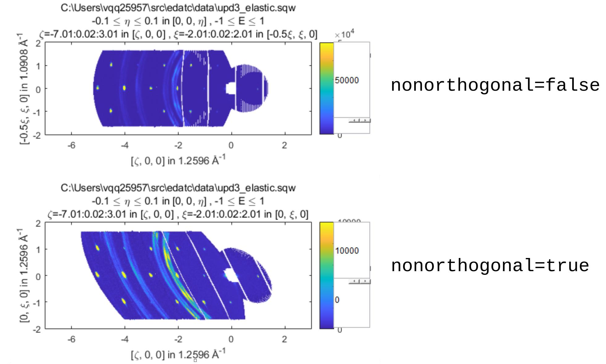
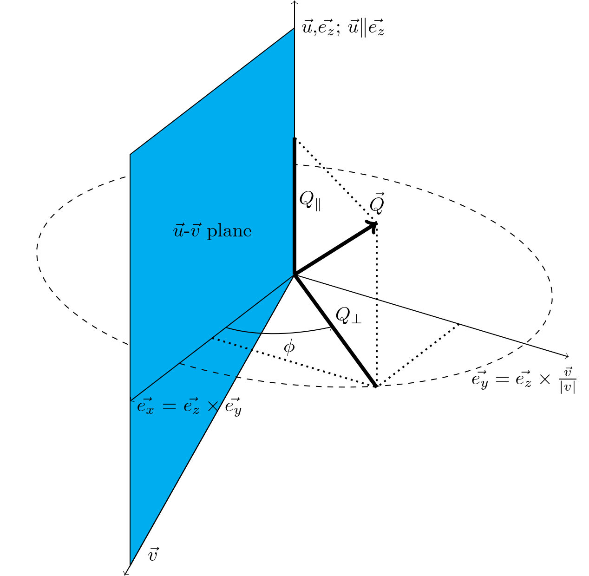

###################################################
Cutting data of interest from SQW files and objects
###################################################

.. |SQW| replace:: S(**Q**, :math:`\omega{}`)

.. |Q| replace:: :math:`|\textbf{Q}|`

The Horace ``sqw`` object is the main object that Horace operates with. 
It contains full information about the results of a neutron experiment.
This information includes information about each neutron "event" registered
in the experiment. This information is stored in a 1-D dataset called the "pixels". 
This dataset is usually by far the largest part in size part of ``sqw`` object.

Another part of ``sqw`` object is a 0 to 4-dimensional histogram (binning)
of the "pixels"  in space of interest, most often the reciprocal space (``hkl-dE``),
which we call the "image".
This carries only limited information about the original data, i.e. only the
averaged neutron intensity contributed into the image space bins. 
The "image" is the main part of Horace's ``dnd`` object -- the second by importance Horace's object.

.. note::

   For the differences between ``dnd`` and ``sqw`` objects see: :ref:`here
   <manual/FAQ:What is the difference between sqw and dnd objects>`

Generally, rather than attempting to deal with the full experimental
data, a user works with smaller objects, extracted from the full dataset using
``cut``. This is for multiple reasons including:

- The 4-dimensional dataset is impossible to visualise, as only 3-d (through
  slice-o-matic), 2-d and 1-d cuts can be easily represented.
- The entire dataset is often too large to fit in the memory of most computers.

.. note::

    "pixels" in 1D dataset are arranged in such a way, that simple calculation allows 
    to identify "pixels" contributing into every bin of a ``sqw`` object's ``image``. 
    ``cut`` uses this information to extract relevant pixels and maintains 
    the arrangement between bins and "pixels" for resulting ``sqw`` object.

.. _cut:

cut
===

``cut`` takes a (or multiple) section(s) of data from an ``sqw`` or ``dnd``
object or file, discards the pixels which lie outside of the binning regions
(described `below <#binning-arguments>`_) from an ``sqw`` and accumulates them
into a histogram (the "image" or ``dnd``, which may be independent if requested
or attached to the parent ``sqw``). It can return an object or file depending on
the parameters given.

``cut`` can produce objects of the same or reduced size and dimensions. The
result of a cut is itself an ``sqw`` or ``dnd`` object which can be further
plotted, manipulated, etc.

.. note::

   If the resulting object is estimated by Horace to be too big to fit in
   memory, it will be saved to disc, but will appear mostly indistinguishable
   from a memory-backed ``sqw`` object, supporting most operations. We call this
   a "file-backed ``sqw``" (for more detail see: `File- and memory-backed
   cuts`_). When the manual refers to an ``sqw`` object both "file-backed" and
   "memory-backed" are included.

   .. warning::

      File-backed objects may be significantly slower to operate on than memory
      backed ones.

The inputs are as follows:

.. code-block:: matlab

   my_cut = cut(data_source[, proj], p1_bin, p2_bin, p3_bin, p4_bin[, '-nopix'][, sym][, filename])

where:

- `data_source <#datasource>`_ is either a string giving the full filename (including
  path) of an input sqw file or a variable containing a ``sqw`` object.
- `proj <#projection-proj>`_ defines the axes and origin of the cut including
  the shape of the region to extract and the representation in the resulting
  histogram.
- `pN_bin <#binning-arguments>`_ describe the histogram bins to capture the
  data.

There are also several extra optional arguments which are:

- ``-nopix``  remove the "pixels" from the resulting object returning just a ``dnd`` object, 
  i.e. binned data (the "image"). This option is faster and the resulting object requires
  less memory, but is also more restricted in what you can do with the result.

- ``sym``  cell array of symmetry operations. For a full description of usage, :ref:`see
  here <manual/Symmetrising_etc:Cutting>`.

- ``filename`` - if provided, uses file-backed algorithms to write the resulting object
  directly to a file named ``filename`` and return a file-backed ``sqw``.

.. warning::

   If ``cut`` is called without a return argument, the ``filename`` option is
   mandatory.

.. _datasource:

Data Source
-----------

``data_source`` in ``cut`` is either a string giving the full filename (including path) of
the input ``.sqw`` file or just the variable containing an ``sqw`` or ``dnd``
object stored in memory from which the pixels will be taken.

.. warning::

   By convention both ``sqw`` and ``dnd`` objects use the ``.sqw`` suffix when
   stored to disc. It is advisable to name the file appropriately to distinguish
   the types stored inside, e.g. ``MnO2_sqw.sqw``, ``MnO2_d2d.sqw``.

Projection (proj)
-----------------

The projection defines the coordinate system and thus the meaning of the
`Binning arguments`_ and the presentation of the data.

``proj`` should be a projection type such as ``line_proj``, ``sphere_proj``,
etc. which contains information about the desired coordinate system representation.

.. note::

   To take a cut from an existing ``sqw`` or ``dnd`` object while retaining the
   existing projection, provide an empty ``proj`` argument:

   .. code-block:: matlab

      w1 = cut(w, [], [lo1, hi1], [lo2, hi2], ...)

Different projections are covered in the :ref:`Projection in more detail <Projection_in_details>` section below.

.. note::

   Changing projection does not change the underlying pixels, merely its
   representation (binning) in the image and how thus it appears when plotted.

   It does, however, affect which pixels are selected and which are discarded
   when making a cut.

Binning arguments
-----------------

The binning arguments (``p1_bin``, ``p2_bin``, ``p3_bin`` and ``p4_bin``)
specify the binning / integration ranges for the Q & Energy axes in **the target
projection's** coordinate system (c.f. :ref:`Projection in more detail <Projection_in_details>` and
`changing projections`_).

Each can independently have one of four different forms below.

.. warning::

   The meaning of the first, second, third, etc. component in ``pN_bin`` changes
   between each form. Ensure that you have the correct value in each component
   to ensure your cut is what you expect.

- ``[]`` Automatic binning calculations. 
  Empty brackets indicate that the cut algorithm should identify binning ranges itself.
  The step size of the target binning is taken equal to the step size of the binning 
  currently present in the source image in the direction with the same 
  number as the number of binning argument ``[]``. In more detail auto-binning algorithm is described
  :ref:`below <bin_ranges_calculations>`.

- ``[step]`` Automatic binning calculations with binning step size.
  Single (scalar) number defines a plot axis with bin width equal to the number you specify. 
  The lower and upper limits are calculated by the same algorithm as the binning range in ``[]``-brackets case.  

- ``[lo,hi]`` Integration axis in binning direction. 
  A vector with two components defines integration axis.
  The signal will be integrated over that axis between limits specified by the two components of the vector.

.. warning::

   A two-component binning axis defines the integration region between bin
   edges. For example, ``[-1 1]`` will capture pixels from ``-1`` to ``1``
   inclusive.

- ``[lower,step,upper]`` Plot axis in binning direction.
  A three-component binning axis specifies plot axis.
  The first  ``lower`` and the last ``upper`` components specifying the centres of the
  first and the last bins of the data to be cut. The middle component specifies
  the bin width.

.. note ::

   If ``step`` is ``0``, the ``step`` is taken from the source binning axes.

.. warning::

   A three-component binning axis defines the integration region by bin centres,
   i.e. the limits of the data to be cut lie between ``min = lower-step/2`` and
   ``max = upper+step/2``, including ``min/max`` values. For example, ``[-1 1
   1]`` will capture pixels from ``-1.5`` to ``1.5`` inclusive.

- ``[lower, separation, upper, cut_width]``  A vector with four components defines **multiple** integration axes with
  **multiple** integration limits in the selected direction.

  These components are:

  - ``lower``   Position of the lowest cut bin-centre.

  - ``separation``  Distance between cut bin-centres.

  - ``upper``   Approximate (see :ref:`below <separation_warn>`) position of highest cut bin-centre

  - ``cut_width``   Width of each cut, centred on each bin-centre, thus extending one half-width
    in both directions

  The number of cuts produced will be one more than the number of
  ``separation``-sized steps between ``lower`` and ``upper``.

.. figure:: ../images/4-element-diag.png
   :align: center
   :width: 500px

   Diagram showing the relationship between the 4 binning parameters
   and their meaning in the context of a cut, where: ``lower = 1``,
   ``upper = 7``, ``separation = 2`` and ``cut_width = 0.6``, i.e ``[1,
   2, 7, 0.6]``. :math:`\zeta` and :math:`\xi` are arbitrary axes
   where :math:`\zeta` is the specified axis. This will produce 4 cut
   objects around ``1``, ``3``, ``5`` and ``7``.

.. _separation_warn:

.. warning::

   ``upper`` will be automatically increased such that ``separation`` evenly
   divides ``upper - lower``.  For example, ``[106, 4, 113, 2]`` defines the
   integration ranges for three cuts, the first cut integrates the axis over
   ``105-107``, the second over ``109-111`` and the third ``113-115``.

File- and memory-backed cuts
----------------------------

``cut`` generally tries to return its result in memory. However, if the
resulting object is sufficiently large (the threshold of which is the product of
``mem_chunk_size`` and ``fb_scale_factor`` defined in the :ref:`Horace config
<manual/Changing_Horace_settings:Horace Config>`), the object is written to a
temporary file and will be "file-backed". See :ref:`manual/Changing_Horace_settings:Changing Horace settings`
for more information about configuring Horace and changing the limits when object 
may become filebacked.

.. note::

   The file being temporary means that it will be deleted when the ``sqw``
   object backed by this file is deleted.

If the ``filename`` argument is provided to ``cut``, the object will always
saved to a file with this name and the returned object will be backed by this
file. This file will not be a temporary file.

.. warning::

   If an ``sqw`` object is backed by a temporary file, the object and its
   descendants (through subsequent operations) will all be temporary.

   To ensure an ``sqw`` is kept, you can :ref:`manual/Save_and_load:save` this
   object to a file permanently.

.. note::

   Operations with file-backed objects are substantially slower then
   memory-backed objects.

   This is because the objects themselves are usually bigger, and because
   reading data from disc is around three orders of magnitude slower than from
   memory.

.. _Projection_in_details:

Projection in more detail
--------------------------

As mentioned in `Projection (proj)`_, the ``proj`` argument defines the coordinate
system of the histogrammed image.

.. warning::

   Horace, prior to version 4.0.0, used a structure with fields ``u``,
   ``v``, ... or else a ``projaxes`` object, to define the image coordinate
   system. This has been replaced by the ``line_proj``. You can still
   call ``cut`` with these structures, however, it will issue a
   warning and construct a ``line_proj`` internally.

Lattice based projections (``line_proj``)
^^^^^^^^^^^^^^^^^^^^^^^^^^^^^^^^^^^^^^^^^

The most common type of projection for single-crystal experiments is the
``line_proj`` which defines a (usually orthogonal, but not necessarily) system
of linear coordinates from a set of basis vectors.

The complete signature for ``line_proj`` is:

.. code-block:: matlab

   proj = line_proj(u, v[,[],w][, nonorthogonal][, type][, alatt, angdeg][, offset][, label][, title][, lab1][, lab2][, lab3][, lab4]);

Where:

- ``u``  3-vector in reciprocal space :math:`(h,k,l)` specifying first viewing axis.

- ``v``  3-vector in reciprocal space :math:`(h,k,l)` in the plane of the second viewing axis.

- ``w``  3-vector in reciprocal space :math:`(h,k,l)` of the third viewing axis or empty value
  at its place.

.. note::

   The first viewing axis is strictly defined to be ``u``.
   The second viewing axis is constructed by default to be in the plane of ``u``
   and ``v`` and perpendicular to ``u``.
   The third viewing axes is by default defined as the cross product of the first
   two (:math:`u \times{} v`).

   The fourth viewing axis is always energy and cannot be modified.

   .. warning::

      None of these vectors can be collinear. An error will be thrown
      in this case.

.. note::

   The ``u`` and ``v`` of a ``line_proj`` are distinct from the vectors ``u``
   and ``v`` that are specified in :ref:`gen_sqw
   <manual/Generating_SQW_files:gen_sqw>`, which describe how the crystal is
   oriented with respect to the spectrometer and are determined by the physical
   orientation of your sample.

.. note::

   ``u`` and ``v`` are defined in the reciprocal lattice basis so if the crystal
   axes are not orthogonal, they are not necessarily orthogonal in
   reciprocal space.

   E.g.:

   .. code-block:: matlab

      angdeg % => [60 60 90]
      proj = line_proj([1 0 0], [0 1 0]);

   such that ``u`` = :math:`[1,0,0]` and ``v`` = :math:`[0,1,0]`. The
   reciprocal space projection will actually be skewed according to ``angdeg``.

.. _nonortho:

- ``nonorthogonal`` Whether lattice vectors are allowed to be non-orthogonal

.. note::

  If you don't specify ``nonorthogonal``, or set it to ``false``, you will get
  orthogonal axes defined by ``u`` and ``v`` normal to ``u`` and ``u`` :math:`\times`
  ``v``. Setting ``nonorthogonal`` to ``true`` forces the axes to be exactly the ones
  you define, even if they are not orthogonal in the crystal lattice basis.

  .. warning::

     Any plots produced using a non-orthogonal basis will plot them as though
     the basis vectors are orthogonal, so features may be distorted (see
     `below <#non-orthogonal-axes>`_) .

- ``type``  Three character string denoting the the projection normalization of each of
  the three **Q**-axes, one character for each axis, e.g. ``'aaa'``, ``'rrr'``,
  ``'ppp'``.

  There are 3 possible options for each element of ``type``:

  1. ``'a'`` Inverse angstroms

  2. ``'r'``  Reciprocal lattice units (r.l.u.) which normalises so that the maximum of
     :math:`|h|`, :math:`|k|` and :math:`|l|` is unity.

  3. ``'p'`` Preserve the values of ``u`` and ``v``

  For example, if we wanted the first two **Q**-components to be in r.l.u. and
  the third to be in inverse Angstroms we would have ``type = 'rra'``.

- ``alatt``   3-vector of lattice parameters.

- ``angdeg``  3-vector of lattice angles in degrees.

.. note::

   In general, you should not need to define ``alatt`` or ``angdeg`` when doing a ``cut``.
   They are taken from the ``sqw`` object during a ``cut`` and your settings will be overridden. 
   However, there are cases where a projection object may need to be reused elsewhere.

* ``offset``  3-vector in :math:`(h,k,l)` or 4-vector in :math:`(h,k,l,e)` defining the
  origin of the projection coordinate system. For example you may wish to make
  the origin of all your plots :math:`[2,1,0]`, in which case set ``offset
  = [2,1,0]``.

.. _plotargs:

* ``label``  4-element cell-array of captions for axes of plots.

* ``title``  Plot title for cut result.

* ``lab[1-4]``  Individual components label (for historical reasons).

.. note::

   If you do not provide any arguments to ``line_proj``, by default it
   will build a ``line_proj`` with ``u=[1,0,0]`` and ``v=[0,1,0]``.

   .. code-block:: matlab

      >> line_proj()

      ans =

        line_proj with properties:

                      u: [1 0 0]
                      v: [0 1 0]
                      w: []
                   type: 'ppr'
          nonorthogonal: 0
                  alatt: []
                 angdeg: []
                 offset: [0 0 0 0]
                  label: {'\zeta'  '\xi'  '\eta'  'E'}
                  title: ''

.. _poskwarg:

.. note::

   ``line_proj`` accepts arguments both positionally and as key-value pairs e.g.

    .. code-block:: matlab

       >> proj = line_proj([0, 1, 0], [0, 0, 1], 'type', 'aaa', 'title', 'My linear cut')

       line_proj with properties:

                    u: [0 1 0]
                    v: [0 0 1]
                    w: []
                 type: 'aaa'
        nonorthogonal: 0
               offset: [0 0 0 0]
                label: {'\zeta'  '\xi'  '\eta'  'E'}
                title: 'My linear cut'

    However, it is advised that besides ``u`` and ``v`` arguments are passed as
    key-value pairs.

    Alternatively you may define some parameters in the constructor, and define others
    later by setting their properties:

    .. code-block:: matlab

       proj = line_proj([0,1,0],[0,0,1]);
       proj.type = 'aaa';
       proj.title = 'My linear cut';

    Both forms result in the same object

Non-orthogonal axes
___________________

You may choose to use non-orthogonal axes (c.f. `here <#nonortho>`_), e.g.:

.. code-block:: matlab

   proj = line_proj([1 0 0], [0 1 0], [0 0 1], 'nonorthogonal', true);

Below is an example:

         orthogonal and non-orthogonal.

   Plot to show the difference between ``nonorthogonal=false`` and
   ``nonorthogonal=true`` with a hexagonal material (:math:`\textrm{UPd}_3`)
   where ``angdeg=[90,90,120]``.

We can see that for the ``nonorthogonal=false`` case, the image clearly shows
the hexagonal symmetry and circular powder rings, but the axes being
:math:`[\zeta,0,0]` and :math:`[-0.5\xi,\xi,0]` even in this simple case makes
computing where points lie in :math:`hkl` trickier.

Where we have ``nonorthogonal=true``, this makes it easier to calculate the
location of points in :math:`hkl` (the Bragg peaks align in a square pattern and
the axes are simply :math:`[\zeta,0,0]` and :math:`[\xi,0,0]`), but distorts the
image (note the powder rings which should be circular).

``line_proj`` 2D cut examples: Fe Scattering Function
_____________________________________________________

.. _datalink:

.. note::

   This dataset is available as part of the Horace source on `Github
   <https://github.com/pace-neutrons/Horace/tree/master/demo>`__.

The iron crystal has been aligned along the :math:`[1,0,0]` axis.

To reproduce the example below, a cut is first made along the :math:`[0,1,0]`
and :math:`[0,0,1]` directions:

.. code-block:: matlab

    data_source = 'Fe_ei401.sqw';
    proj = line_proj([0, 1, 0], [0, 0, 1], 'type', 'aaa');
    w2 = cut(data_source, proj, [-4.5, 0.1, 14.5], [-5, 0.1, 5], [-0.1, 0.1], [-10, 10]);
    plot(w2);

.. note::

   You do not need to provide a lattice for the projection as ``cut`` will use
   the lattice parameters from the ``sqw`` object.

The code produces:

.. figure:: ../images/iv_hkl.png
   :align: center
   :width: 800px
   :alt: 2d cut

   MAPS Fe data; reciprocal space covered by MAPS for an iron sample
   with incident neutron energy of 401meV.

The cut with the same parameters as above at higher energy transfer

.. code-block:: matlab

   w2 = cut(data_source, proj, [-4.5, 0.1, 14.5], [-5, 0.1, 5], [-0.1, 0.1], [50, 60]);
   plot(w2);

shows clear spin waves:

   MAPS Fe Data; reciprocal space covered by MAPS for an iron sample
   with incident neutron energy of 401meV. Energies integrated between [50, 60].

``line_proj`` 1D cut example
____________________________

It is simple to take a 1-d cut by integrating over all but one axis. The example
cut generated by the code below shows a cut along the :math:`[1,1,0]` direction
(note the projection's ``u`` & ``v``), i.e. the diagonal of the figure
above.

.. code-block:: matlab

    data_source = 'Fe_ei401.sqw';
    proj = line_proj([1, 1, 0], [-1, 1, 0], 'offset', [-1, 1, 0]);
    w1 = cut(data_source, proj, [-5, 0.1, 5], [-0.1, 0.1], [-0.1, 0.1], [-50, 60]);
    plot(w1);

This shows the intensity of the spin wave:

.. figure:: ../images/Fe_cut1D.png
   :align: center
   :width: 800px
   :alt: 1d cut along diagonal.

   MAPS Fe Data; 1D cut along the diagonal of the 2D image above.

.. _Spherical_Projections:

Spherical Projections
^^^^^^^^^^^^^^^^^^^^^

In order to construct a spherical projection (i.e. a projection in |Q|,
:math:`\theta` (polar angle), :math:`\phi` (azimuthal angle), :math:`E`) we
create a projection in an analogous way to the ``line_proj``, but using the
``sphere_proj`` function.

The complete signature for ``sphere_proj`` is:

.. code-block:: matlab

   proj = sphere_proj([u][, v][, type][, alatt][, angdeg][, offset][, label][, title][, lab1][, lab2][, lab3][, lab4])

where:

- ``u``  The vector :math:`\vec{u}` is the reciprocal space vector defining the
  polar-axis :math:`\vec{e_z}` of the spherical coordinate system from which :math:`\theta` is
  measured.

  See the :ref:`diagram below <fig_sphere_coodinates>` for details.

- ``v`` The vector :math:`\vec{v}` is the reciprocal space vector which defines the
  second component of the :math:`u`-:math:`v` plane from which :math:`\phi` is
  measured.

  See the :ref:`diagram below <fig_sphere_coodinates>` for details.

.. note::

  The reciprocal space vectors :math:`u`-:math:`v` are not necessarily
  orthogonal so the actual axis :math:`\vec{e_x}` from which :math:`\phi` is measured lies in the
  plane defined by :math:`u`-:math:`v` vectors and is orthogonal to :math:`\vec{e_z}`.

.. note::

   By default a ``sphere_proj`` will define its principal axes :math:`u` and
   :math:`v` along the :math:`hkl` directions :math:`[1,0,0]` and
   :math:`[0,1,0]` respectively.

- ``type``  Three character string denoting the the projection normalization of each
  dimension, one character for each directions, e.g. ``'add'``, ``'arr'``, ``'adr'``.

  At the moment there is only one possible option for the first (length) component of ``type``:

  1. ``'a'``     Inverse angstroms.

  ..
     2. ``'r'``

        Reciprocal lattice units (r.l.u.) which normalises so that the maximum of
        :math:`|h|`, :math:`|k|` and :math:`|l|` is unity.

     3. ``'p'``

        Preserve the values of ``u`` and ``v``

  There are 2 possible options for the second and third (angular) components of
  ``type``:

  1. ``'d'``     Degrees

  2. ``'r'``     Radians

  For example, if we wanted the |Q|-component to be in inverse angstroms and
  the angles in degrees we would have ``type = 'add'``.

- ``alatt``  3-vector of lattice parameters.

- ``angdeg`` 3-vector of lattice angles in degrees.

.. note::

   when cutting, you should not need to define ``alatt`` or ``angdeg``; by default
   they will be taken from the ``sqw`` object during a ``cut`` and your setting will be overwritten.
   However, there are cases where a projection object may need to be reused elsewhere.

- ``offset``  3-vector in :math:`(h,k,l)` or 4-vector in :math:`(h,k,l,e)` defining the
  origin of the projection coordinate system.

- ``label``, etc.  See :ref:`description for plot arguments above <plotargs>`.

.. note::

   If you do not provide any arguments to ``sphere_proj``, by default
   it will build a ``sphere_proj`` with ``u=[1,0,0]``, ``v=[0,1,0]``,
   ``type='add'`` and ``offset=[0,0,0,0]``.

   .. code-block:: matlab

       sp_pr = sphere_proj()

       sp_pr =
          sphere_proj with properties:
                 u: [1 0 0]
                 v: [0 1 0]
              type: 'add'
             alatt: []
            angdeg: []
            offset: [0 0 0 0]
             label: {'|Q|'  '\theta'  '\phi'  'En'}
             title: ''

.. note::

   Like ``line_proj``, ``sphere_proj`` can be :ref:`defined using
   positional or keyword arguments <poskwarg>`. However the same
   recommendation applies that positional should only be used to
   define ``u`` and ``v``.

``sphere_proj`` defines a spherical coordinate system which contains 
spherical coordinates of momentum transfer vector  :math:`\vec{Q}`.
If projection ``offset`` parameter is zero, this vector is the vector
of momentum transfer from neutron to magnetic or phonon excitations measured
in scattering experiment. If offset is not zero, :math:`\vec{Q}`
is the difference between ``offset`` and the measured momentum transfer.
Energy transfer coordinate for ``sphere_proj`` remain unchanged. 

Because reciprocal lattice may be non-orthogonal lattice, following common crystallography 
practice, we introduce auxiliary 
orthogonal coordinate system, which gives the basis for calculating spherical coordinates. 
Unit vector :math:`\vec{e_z}` of this system is parallel to 
:math:`\vec{u}` and unit vector :math:`\vec{e_x}` is orthogonal to :math:`\vec{e_z}`
and lies in the plane defined by :math:`\vec{u}` - :math:`\vec{v}`. 
(see :ref:`Sphere coordinates <fig_sphere_coodinates>` below.) When crystal lattice is 
orthogonal, vectors :math:`\vec{e_z}` is aligned with :math:`\vec{u}` and 
vector :math:`\vec{e_x}` is aligned with :math:`\vec{v}`.

Then ``sphere_proj`` coordinates are:

- |Q| The radius from the origin (``offset``) in :math:`hkl`

- :math:`\theta`  -- The angle measured from :math:`\vec{e_z}` to the vector (:math:`\vec{Q}`),
  i.e. :math:`0^{\circ}` is parallel to :math:`\vec{e_z}` and :math:`90^{\circ}` is
  perpendicular to :math:`\vec{u}`. 

- :math:`\phi` --  is the angle measured between the vector :math:`\vec{Q_\perp}=\vec{Q}-\vec{e_z}(\vec{e_z}\cdot \vec{Q})`
  and the plane :math:`\vec{u}`-:math:`\vec{v}`, i.e. vector :math:`\vec{Q_\perp}` with :math:`\phi = 0^{\circ}` lies in the :math:`\vec{u}`-:math:`\vec{v}` plane and vector :math:`\vec{Q_\perp}` with :math:`\phi = 90^{\circ}` is normal to :math:`\vec{u}`-:math:`\vec{v}` plane.
  (parallel to :math:`\vec{e_y}`)

- :math:`E`   is the energy transfer as defined in ``line_proj``

.. note::

   - :math:`\theta` lies in the range between :math:`0^{\circ}` and   :math:`180^{\circ}`.
   - :math:`\phi` lies in the range between :math:`-180^{\circ}` and  :math:`180^{\circ}`.
   
   Alternatively you can set ``sphere_proj`` option ``type(2:3)='rr'`` to define these values in radians.

.. _fig_sphere_coodinates:

   Spherical coordinate system used by ``sphere_proj``

An alternative description of the spherical coordinate system may be found on MATLAB help pages.
Horace uses MATLAB methods ``cart2sph`` and ``sph2cart`` to convert an array of vectors expressed
in Cartesian coordinate system to spherical coordinate system and back.
The formulas, used by these methods together with the image of the used coordinate system is provided 
`on MATLAB "cart2sph" help pages <https://uk.mathworks.com/help/matlab/ref/cart2sph.html>`_.
MATLAB uses ``elevation`` angle which is related to :math:`\theta` angle used by Horace by relation:

       :math:`\theta = 90-elevation`

``azimuth`` angle form `MATLAB help pages <https://uk.mathworks.com/help/matlab/ref/cart2sph.html>`_
is equivalent to Horace :math:`\phi` angle.

.. note::

   A spherical projection currently does not have the ability to be rescaled in
   |Q| relative to the magnitude of :math:`u` or :math:`v`.

When it comes to cutting and plotting, we can use a ``sphere_proj`` in
exactly the same way as we would a ``line_proj``, but with one key
difference. The binning arguments of ``cut`` no longer refer to
:math:`h,k,l,E`, but to |Q|, :math:`\theta`, :math:`\phi`, :math:`E`.

.. code-block:: matlab

   sp_cut = cut(w, sp_proj, Q, theta, phi, e, ...);

.. warning::

   The form of the arguments to ``cut`` is still the same (see: `Binning
   arguments`_). However:

   - |Q| runs between :math:`[0, \infty)`
   - :math:`\theta` runs between :math:`[0, 180]`
   - :math:`\phi` runs between :math:`[-180, 180]`

   Attempting to specify binning outside of these ranges will fail. Changing 
   ``sphere_proj`` ``type`` property from ``add`` to ``arr`` modifies angular ranges
   into radians.  

``sphere_proj`` 2D and 1D cuts examples:
________________________________________

Integrating over the angular terms of a spherical projection of a
**single crystal** dataset will give an **approximation** of a powder
average of the sample. Integrating over the angular terms for a
**powder** sample is a valid powder averaging.

.. note::

   This is because (except for low scattering angles) the detectors do
   not cover the full :math:`4\pi` solid angular range.  Thus regions
   without detector coverage will not be sampled by the angular
   spherical integration.

   In contrast for a true powder sample, there will be crystal grains
   with the correct orientation to be detected even by the limited
   detector coverage.

   At low scattering angles (below approximately 30 degrees on LET),
   the detectors *do* cover the full angular range so the angular
   integration of a single crystal dataset will give a valid powder
   average.

   These effects are important to bear in mind when modelling the
   scattering - e.g. for a single crystal dataset it is best to model
   it as a single crystal and then let Horace perform the angular
   integration, rather than treating it as powder data.

The following is an example using the :ref:`same data as above <datalink>`.

.. code-block:: matlab

    data_source = 'Fe_ei401.sqw';
    sp_proj = sphere_proj();
    s2 = cut(data_source, sp_proj, [0, 0.1, 14], [0, 180], [-180, 180], [-10, 4, 400]);
    plot(s2);

.. note::

   Binning ranges are specified in the **target** coordinate system.

This script produces the following plot:

.. figure:: ../images/powder_avrg.png
   :align: center
   :width: 500px
   :alt: |Q|-dE cut.

   MAPS Fe data; Powder averaged scattering from iron with an incident energy of 401meV.

.. note::

   By default, energy transfer is expressed in meV, momentum transfer
   :math:`\left|Q\right|` in inverse Angstroms (:math:`Å^{-1}`) and angles in
   degrees (:math:`^\circ`).

This figure shows that the energies of phonon excitations are located under
50meV, some magnetic scattering is present at |Q| < 5 and spin waves follow the
magnetic form factor.

A spherical projection allows us to investigate the details of a particular spin
wave, e.g. around the scattering point :math:`[0,-1,1]`.

.. code-block:: matlab

    data_source = 'Fe_ei401.sqw';
    sp_proj = sphere_proj();
    sp_proj.offset  = [0, -1, 1];
    s2 = cut(data_source, sp_proj, [0, 0.1, 2], [80, 90], [-180, 4, 180], [50, 60]);
    plot(s2);

The unwrapping of the intensity of the spin-wave located around :math:`[0,-1,1]`
Bragg peak shows:

.. figure:: ../images/spin_w_tiny.png
   :align: center
   :width: 500px
   :alt: Q-phi cut

   MAPS Fe data; Spin-wave scattering intensity the the origin centred
   about the :math:`[0,-1,1]` Bragg peak. A visible gap caused by
   missing detectors is obvious in the :math:`\phi`-axis range
   :math:`[-50^\circ:+50^\circ]`.
   Inset: Linear projection of the same region; the red lines show the
   approximate mapping from the linear to spherical projections.

Integrating over the whole :math:`\theta` range and thus including other
detectors substantially improves statistics; this is done by setting the
:math:`\theta` parameter to ``[0, 180]``:

.. code-block:: matlab

    s2 = cut(data_source, sp_proj, [0, 0.1, 2], [0, 180], [-180, 4, 180], [50, 60]);

.. figure:: ../images/spin_w_theta_av.png
   :align: center
   :width: 500px
   :alt: Q-phi cut theta-averages

   MAPS Fe data; Scattering intensity from cut averaged over all :math:`\theta`
   spin-wave with the origin centred at the :math:`[0,-1,1]` Bragg
   peak.

The 1D cut below, generated by further integrating over the :math:`\phi`-axis,
shows the intensity distribution as a function of |Q|, i.e. the distance from
the spin-wave centre:

.. code-block:: matlab

    s2 = cut(data_source, sp_proj, [0, 0.1, 2], [0, 180], [-180, 180], [50, 60]);

   Scattering intensity as function of distance from the scattering
   centre at :math:`[0,-1,1]`.

Cylindrical Projections
^^^^^^^^^^^^^^^^^^^^^^^

In order to construct a cylindrical projection (i.e. a projection in
:math:`\vec{Q}_{\perp}` (the radial distance from the polar axis),
:math:`\vec{Q}_{\|}` (distance from origin along the polar axis), :math:`\phi`
(azimuthal angle) and :math:`E`) coordinate system we create a projection in a
similar way to the ``line_proj``, but use the ``cylinder_proj`` class.

The complete signature for ``cylinder_proj`` is:

.. code-block:: matlab

   proj = cylinder_proj([u][, v][, type][, alatt][, angdeg][, offset][, label][, title][, lab1][, lab2][, lab3][, lab4])

where:

- ``u``  The vector :math:`\vec{u}` is the reciprocal space vector defining the
  polar-axis of the cylindrical coordinate system along which
  :math:`\vec{Q}_{\|}` is measured.

  See the :ref:`diagram below <fig_cylinder_coodinates>` for details.

- ``v``  The vector :math:`\vec{v}` is the reciprocal space vector which defines the second
  component of the :math:`u`-:math:`v` plane from which :math:`\phi` is measured.

  See the :ref:`diagram below <fig_cylinder_coodinates>` for details.

.. note::

  The reciprocal space vectors :math:`u`-:math:`v` are not necessarily
  orthogonal so the actual axis from which :math:`\phi` is measured lies in the
  plane defined by :math:`u`-:math:`v` vectors, orthogonal to :math:`u`.

.. note::

   By default a ``cylinder_proj`` will define its principal axes :math:`u` and
   :math:`v` along the :math:`hkl` directions :math:`[1,0,0]` and
   :math:`[0,1,0]` respectively.

- ``type``  Three character string denoting the the projection normalization of each
  dimension, one character for each directions, e.g. ``'aad'`` or ``'aar'``.

  At the moment there is only one possible option implemented for the length
  components (:math:`q_{\perp}` and :math:`q_{\|}`) of ``type``:

  1. ``'a'``     Inverse angstroms.

  ..
     2. ``'r'``

        Reciprocal lattice units (r.l.u.) which normalises so that the maximum of
        :math:`|h|`, :math:`|k|` and :math:`|l|` is unity.

     3. ``'p'``

        Preserve the values of ``u`` and ``v``

  There are 2 possible options for the third (angular) component of
  ``type``:

  1. ``'d'``   Degrees

  2. ``'r'``   Radians

  For example, if we wanted the length components to be in inverse angstroms and
  the angles in degrees we would have ``type = 'aad'``.

- ``alatt``   3-vector of lattice parameters.

- ``angdeg``  3-vector of lattice angles in degrees.

.. note::

   In general, you should not need to define ``alatt`` or ``angdeg``; by default
   they will be taken from the ``sqw`` object during a ``cut``. However, there
   are cases where a projection object may need to be reused elsewhere.

- ``offset``  3-vector in :math:`(h,k,l)` or 4-vector in :math:`(h,k,l,e)` defining the
  origin of the projection coordinate system.

- ``label``, etc.

  See :ref:`other plot arguments above <plotargs>`.

.. note::

   If you do not provide any arguments to ``cylinder_proj``, by default
   it will build a ``cylinder_proj`` with ``u=[1,0,0]``, ``v=[0,1,0]``,
   ``type='aad'`` and ``offset=[0,0,0,0]``.

   .. code-block:: matlab

       cyl_pr = cylinder_proj()

       cyl_pr =
          cylinder_proj with properties:
                 u: [1 0 0]
                 v: [0 1 0]
              type: 'aad'
             alatt: []
            angdeg: []
            offset: [0 0 0 0]
             label: {'\Q_{\perp}'  '\Q_{||}'  '\phi'  'En'}
             title: ''

.. note::

   Like ``line_proj``, ``cylinder_proj`` can be :ref:`defined using
   positional or keyword arguments <poskwarg>`. However the same
   recommendation applies that positional should only be used to
   define ``u`` and ``v``.
   
``cylinder_proj`` defines a cylindrical coordinate system with
cylindrical coordinates of momentum transfer vector  :math:`\vec{Q}`.
Energy transfer coordinate for ``cylinder_proj`` remain unchanged. 
If projection ``offset`` parameter is zero, this vector is the vector
of momentum transfer from neutron to excitations -- lattice measured
in scattering experiment. If offset is non-zero, :math:`\vec{Q}`
is the difference between ``offset`` and the measured momentum transfer.

Similarly to :ref:`Spherical projections <Spherical_Projections>`, we introduce auxiliary 
orthogonal coordinate system, which unit vector :math:`\vec{e_z}` being parallel to 
:math:`\vec{u}` and unit vector :math:`\vec{e_x}` is orthogonal to :math:`\vec{e_z}`
and lies in the plane defined by :math:`\vec{u}` - :math:`\vec{v}`. Cylindrical 
coordinates of the vectors of interest are calculated in this system. 
(see :ref:`Cylinder coordinates <fig_cylinder_coodinates>` below.)
When crystal lattice is orthogonal, vectors :math:`\vec{e_z}` is aligned with :math:`\vec{u}` and 
vector :math:`\vec{e_x}` is aligned with :math:`\vec{v}`.

``cylinder_proj`` defines a cylindrical coordinate system, where:

- :math:`\vec{Q_\perp}=\vec{Q}-\vec{e_z}(\vec{e_z}\cdot \vec{Q})`  --
  The length of the orthogonal to axis :math:`\vec{e_z}` part of the momentum transfer 
  :math:`\vec{Q}` measured from the ``cylinder_proj``  origin (``offset``) in :math:`hkl`.

- :math:`Q_{\|}`  -- The length of the projection of the momentum transfer :math:`\vec{Q}` measured from the ``cylinder_proj`` 
  origin (``offset``) in :math:`hkl` to :math:`\vec{e_z}` axis of the ``cylinder_proj``

- :math:`\phi` --  is the angle measured between the vector :math:`\vec{Q_\perp}` to 
  the plane :math:`\vec{u}`-:math:`\vec{v}` , i.e. :math:`0^{\circ}` lies in the :math:`\vec{u}`-:math:`\vec{v}`
  plane and :math:`90^{\circ}` is normal to :math:`\vec{u}`-:math:`\vec{v}` plane
  (i.e. parallel to :math:`\vec{e_y}`).
   
- :math:`E`  -- is the energy transfer as defined in ``line_proj``

.. note::

   :math:`\phi`  lies in the range between :math:`-180^{\circ}` and :math:`180^{\circ}`.
   Changing ``cylinder_proj`` property ``type(3)='r'``
   allows to change these values to radians so :math:`-\pi \leq \phi \leq \pi`.

..  _fig_cylinder_coodinates:

   Cylindrical coordinate system used by ``cylinder_proj``

Similarly to :ref:`fig_sphere_coodinates`, detailed description of the cylindrical coordinate system used by
Horace together with the image of the used coordinate system are provided `on MATLAB "cart2pol/pol2cart" help pages <https://uk.mathworks.com/help/matlab/ref/cart2pol.html>`_, as Horace uses these methods to convert array
of vectors expressed in Cartesian coordinate system to cylindrical coordinate system and backward.

.. note::

   A cylindrical projection currently does not have the ability to be
   rescaled in :math:`Q_{\perp}` or :math:`Q_{\|}` relative to the magnitude
   of :math:`u` or :math:`v` vectors.

When it comes to cutting and plotting, we can use a ``cylinder_proj`` in
exactly the same way as we would a ``line_proj``, but with one key
difference. The binning arguments of ``cut`` no longer refer to
:math:`h,k,l,E`, but to :math:`Q_{\perp}` (``Q_tr``), :math:`Q_{\|}`, :math:`\phi`, :math:`E` variables.

.. code-block:: matlab

   sp_cut = cut(w, cylinder_proj, Q_tr, Q_||, phi, e, ...);

.. warning::

   The form of the arguments to ``cut`` is still the same (see: `Binning
   arguments`_). However:

   - :math:`Q_{\perp}` (``Q_tr``) runs from :math:`[0, \infty)` -- attempt to use :math:`Q_{\perp}` with a minimum
     bound smaller than :math:`0` will fail.
   - :math:`\phi` runs between :math:`[-180, 180]` -- requesting binning outsize of these ranges will fail.

``cylinder_proj`` 2D and 1D cuts examples:
__________________________________________

Cylindrical projection can be used to obtain cylindrical cuts in a manner
analogous to linear and spherical projections.

The main use of cylindrical projection is for cuts with axis parallel to the
incident beam as background scattering in inelastic instruments often has
cylindrical symmetry.

Taking the :ref:`previously used dataset <datalink>` and using the code:

.. code-block:: matlab

    data_source = 'Fe_ei401.sqw';
    cyl_proj = cylinder_proj();

    %% A

    w2_Qtr_dE = cut(data_source, cyl_proj, [0, 0.1, 14], [-4, 4], [-180, 180], [-10, 4, 400]);
    plot(w2_Qtr_dE);
    keep_figure;

    %% B

    w2_Qtr_Qll = cut(data_source, cyl_proj, [0, 0.1, 14], [-4,0.1,4], [-180, 180], [50, 60]);
    plot(w2_Qtr_Qll);
    keep_figure;

    %% C

    w2_Qtr_phi = cut(data_source, cyl_proj, [0, 0.1, 14], [-4,,4], [-180,2,180], [50, 60]);
    plot(w2_Qtr_phi);

one can easily obtain various cuts taken along different coordinate axes.

.. _img_2D_cylindrical_cuts:

   Cylindrical cuts along different coordinate axes

It is also possible to make one dimensional cylindrical cuts. The following code
creates a plot which shows the behaviour of the scattering intensity as a
function of :math:`Q_{\perp}` at different :math:`Q_{||}`:

.. code-block:: matlab

    data_source ='Fe_ei401.sqw';
    cyl_proj = cylinder_proj();
    n_cuts = 2;
    w1 = repmat(sqw,1,n_cuts);
    colors = 'krgb';
    symbols = '.+*x';
    for i=1:n_cuts
        cut_center = -4+(i-1)*(8/n_cuts);
        Qll_range = [cut_center-0.1,cut_center+0.1];
        w1(i) = cut(data_source, cyl_proj, [0, 0.1, 14], Qll_range, [-180,180], [50,60],'-nopix');
        acolor(colors(i));
        amark(symbols(i));
        pd(w1(i))
    end
    legend('Q_{\|}=-4','Q_{\|}=-2');

   Cylindrical cuts along :math:`Q_{\perp}`

Additional notes
----------------

.. note::

   The number of binning arguments need only match the dimensionality of the
   object ``w`` (i.e. the number of plot axes), so can be fewer than 4.

.. note::

   You cannot change the binning in a ``dnd`` object, i.e. you can only set the
   integration ranges, and have to use ``[]`` for the plot axis. The only option
   you have is to change the range of the plot axis by specifying
   ``[lo1,0,hi1]`` instead of ``[]`` (the '0' means 'use existing bin size').

.. _bin_ranges_calculations:

Changing Projections
^^^^^^^^^^^^^^^^^^^^

When a ``cut`` will change projections (i.e. the source projection type is different 
or the principal-axes are not orthogonal to the target projection) there are a few things to be aware of,
particularly when you specify automatic (``[]``, ``[step]``) binning arguments.

.. rubric:: Binning range meaning

When you specify the binning ranges these are defined in the the "target"
(desired) coordinate system. E.g. in cutting from a linear to a
spherical projection, the meanings are:

.. code-block:: matlab

   x = sqw(..) % in linear projection
   y = cut(x, sphere_proj(), **R**, **THETA**, **PHI**, **E**, ..)

.. rubric:: Automatic Binning Arguments

If you provide automatic binning arguments, an algorithm will attempt to
create the minimum bounding shape in the new projection that entirely
encapsulates the source object. The parameters from this bounding shape
will then be substituted into the places where automatic binning arguments are
requested.

.. warning::

   This algorithm will not change the number of bins unless the
   ``[step]`` form is used, but will change the ranges and thus the
   size of the bins in this instance.

   If you do not specify a step, ensure you have checked that the binning
   is suitable in the new projection, or you may waste time having to
   re-cut your dataset.

         spherical projection (source).

   Example showing a linear projection (target) encapsulating a spherical
   projection (source).
   Here, if we consider a sphere of radius :math:`r`, then the encapsulating
   cuboid has sidelength (:math:`a`) of size :math:`2r`.

.. rubric:: Example

If:

- you provide an empty binning range (``[]``) as the third
  `binning argument <#binning-arguments>`_ in your ``cut`` and,
- your source coordinate system is linear and,
- the target coordinate system is cylindrical, then:

 the ``cut`` algorithm will try to compute the :math:`\phi` range (the
 3\ :sup:`rd` coordinate of the cylindrical projection) which encapsulates the
 source cuboid in the target (cylindrical) coordinate system.

The number of bins in :math:`\phi` will be equal to the number of bins
in the 3\ :sup:`rd` dimension (:math:`\vec{w}`) of the source
projection. If the 3\ :sup:`rd` dimension of the source projection was
an integration axis, the :math:`\phi` of the target projection will
also be an integration axis; if it was a plot axis, it will likewise
remain a plot axis in the target projection, as expected.

.. warning::

   In contrast to cutting without a projection change, when changing
   projections ``[]`` and ``[0]`` may behave differently.

   - ``[]`` takes the number of bins in the source dimension
   - ``[0]`` takes the step length in the source dimension
   
   Without projection change this always produces reasonable result, but
   change in projection applies these values to different coordinate set.

   Cutting with ``[0]`` may lead to strange or incorrect results when
   changing projections. E.g. a q-step of ``0.01`` may be reasonable in a
   linear projection, but when transformed to a spherical or cylindrical
   projection it may be used as the step size for the :math:`\phi` binning
   range (``-180:180`` ), creating 36000 bins in :math:`\phi` direction,
   which may be problematic.

.. warning::

   The algorithm which identifies binning ranges is just a simple algorithm.

   While it works reliably in simple cases, e.g. for transformations described
   by projections of the same kind (e.g. ``sphere_proj->sphere_proj``), where
   the offset between the two projections is unchanged. In more complex cases
   (e.g. ``line_proj->cylinder_proj`` or where the polar-axis of the cylindrical
   projection is not aligned with any of the ``line_proj`` axes), the algorithm
   may not converge quickly. After a number of failed iterations, it will give up
   and issue a warning which looks like:

   .. code-block:: matlab

     ' target range search algorithm have not converged after 5 iterations.
       Search have identified the following default range:
      0        0.0120  -179.9641
      1.5843   90.0000  179.9641
      This range may be inaccurate'

   Here upper row refers to lower auto-binning limit and lower row returns maximal 
   auto-binning limit.  The user must evaluate how acceptable this result is for
   the desired cut and if in doubt, specify the binning arguments manually to
   get their desired binning.

Legacy calls to ``cut``: ``cut_sqw`` and ``cut_dnd``
----------------------------------------------------

Historically, ``cut`` came in two different forms ``cut_sqw`` and
``cut_dnd``. These forms are still available now, however their uses are more
limited and mostly discouraged.

- ``cut_sqw`` is fully equivalent to ``cut`` except that attempting to apply it
  to a ``dnd`` object or file, will raise an error.

- ``cut_dnd`` is equivalent to ``cut`` except it only ever returns a ``dnd`` as
  though ``-nopix`` had been passed.

section
=======

``section`` is an ``sqw`` method, which works like ``cut``, but uses the
existing bins of an ``sqw`` object rather than rebinning.

.. code-block:: matlab

   wout = section(w, p1_bin, p2_bin, p3_bin, p4_bin)

Because it only extracts existing bins (and their pixels), this means that it
doesn't need to recompute any statistics related to the object itself and is
therefore faster and more efficient. However, it has the limitation that it
cannot alter the projection or binning widths from the original.

The parameters of section are as follows:

* ``w``

  The array of ``sqw`` object(s) to be sectioned.

* ``pN_bin``

  The range of bins specified as bin edges to extract from ``w``.

  There are three valid forms for any ``pN_bin``:

  - ``[]``, ``[0]``

    Use the original binning.

  - ``[lo, hi]``

    Take a section of original axis which lies between ``lo`` and ``hi`` values.
    The range of the resulting image in this case is the range between left edge
    of image bin containing ``lo`` value and right edge of bin containing ``hi``
    value.

.. note::

   The size of ``pN_bin`` must match the dimensionality of the underlying
   ``dnd`` object.

.. note::

   These parameters are specified by inclusive edge limits. Any ranges beyond
   the the ``sqw`` object's ``img_range`` will be reduced to only capture existing
   bins.

.. warning::

   The bins selected will be those whose bin centres lie within the range ``lo -
   hi``, this means that the actual returned ``img_range`` may not match ``[lo
   hi]``. For example, a bin from ``0 - 1`` (centre ``0.5``) will be included by
   the following ``section`` despite the bin not being entirely contained within
   the range. The resulting image range will be ``[0 1]``.

   .. code-block:: matlab

      section(w, [0.4 1])

In order to extract bins whose centres lie in the range ``[-5 5]`` from a 4-D
``sqw`` object:

.. code-block:: matlab

   w4_red = section(w4, [-5 5], [], [], [])
