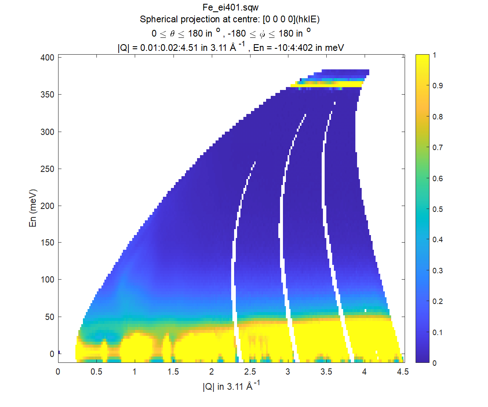
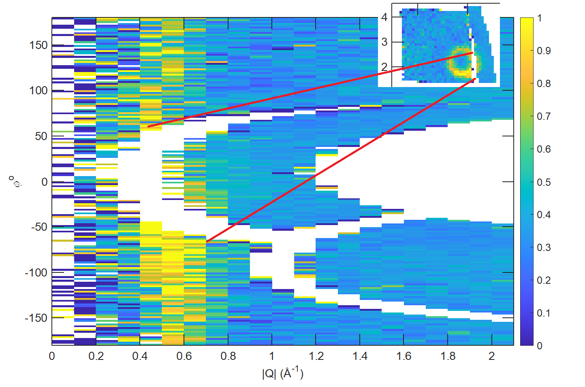

###########################################################
Cutting data of interest from SQW files and objects
###########################################################

.. |SQW| replace:: S(**Q**, :math:`\omega{}`)

.. |Q| replace:: :math:`|\textbf{Q}|`

.. role:: matlab(code)
   :language: matlab

Normally the whole data produced in neutron experiment are too large to fit the memory 
of majority of modern computers. Horace have stored them in large 4-D dataset, containing full information about experiment,
4-Dimensional image of reciprocal space ``hkl-dE`` covered during experiment and neutron events registered during experiment.
User operates with number of smaller objects, extracted from this dataset using various forms of ``cut`` command.

``cut`` is probably the most important Horace command, so its parameters demand special attention.

cut
===

``cut`` takes data from an ``sqw`` object, ``dnd`` object or saved ``sqw`` or
``dnd`` file and converts it to an object of the same or reduced size and dimensions.
The resulting cut object is itself an ``sqw`` or ``dnd`` object which can be plotted, manipulated,
etc. like any other ``sqw`` or ``dnd`` object. If the resulting object is itself too big to fit memory,
it will be backed by appropriate ``sqw`` file. 
The required inputs are as follows:

.. note::

   For the differences between ``dnd`` and ``sqw`` objects see: :ref:`here
   <manual/FAQ:What is the difference between sqw and dnd objects>`

.. code-block:: matlab

   my_cut = cut(data_source, proj, p1_bin, p2_bin, p3_bin, p4_bin,varargin)

where ``varargin`` describes optional arguments and may contain:

  ``-nopix``   -- the key requests that the cut should contain just image (``dnd`` object) and drop all pixels contributing into this image. This  option is faster but should not be used if you want to do subsequent cuts from the resulting cut ``my_cut``.
  
  ``filename`` -- if provided, requests that the resulting file is backed by the file with the ``filename``. This option is mandatory if cut is called without output argument.

Cutting consists of a rebinning of the pixels into the bins specified by the cut
parameters (described below).  These binned pixels will make up the ``dnd`` of
the output object which contains information regarding the plottable data.

Data Source
-----------

``data_source`` in ``cut`` is either a string giving the full filename (including path) of
the input ``.sqw`` file or just the variable containing an ``sqw`` or ``dnd``
object stored in memory from which the pixels will be taken.

.. warning::

   By convention both ``sqw`` and ``dnd`` objects use the ``.sqw`` suffix when
   stored to disc. It is advisable to name the file appropriately to distinguish
   the types stored inside, e.g. ``MnO2_sqw.sqw``, ``MnO2_d2d.sqw``.

Projection (proj)
-----------------

Second argument defines the coordinate system and thus the meaning of the 
`Binning arguments`_ you provided as arguments to `cut` and will 
use to plot and analyse the data.

``proj`` should be an child of a ``aProjectionBase`` class (such as ``line_proj``,
``sphere_proj``, etc.) containing information about the the coordinate
system you wish to use to plot and analyse the data.

.. note::

   Because each point of ``sqw.pix`` data describes the
   position in the reciprocal space and energy transfer, the underlying pixels will be
   unchanged. For image (``dnd`` object) it is possible to redefine the coordinate system with the one of
   your choice; the projection and binning parameters merely describe how pixels will be accumulated
   (binned) and thus displayed in image coordinate system.
   
Different projections in more details are covered in `Projection in more details`_ chapter below.

Binning arguments
-----------------

Specify the binning / integration ranges for the ``Q&Energy`` axes in the
target coordinate system. 

.. code-block:: matlab

  `p1_bin`, `p2_bin``, `p3_bin` and `p4_bin`

Each can independently have one of four
different forms below. The meaning of the first, second, third, etc. component in ``pN_bin``
changes between each form. Ensure that you have the correct value in each component to ensure your
cut is what you expect.

* ``[]``

  An empty binning range will use the source binning axes in that dimension.

* ``[n]``

  if a single (scalar) number is given then that axis will be a plot axis and the
  bin width will be the number you specify. The lower and upper limits are the
  source binning axes in that dimension.

.. note::

   A value of ``[0]`` is equivalent to ``[]`` and will use the source binning axes.

* ``[lo,hi]``

  If you specify a vector with two components then the signal will be integrated
  over that axis between limits specified by the two components of the vector.

.. warning::

   A two-component binning axis defines the integration region between bin
   edges. For example, ``[-1 1]`` will capture pixels from ``-1`` to ``1``
   inclusive.

* ``[lower,step,upper]``

  A three-component binning axis specifies an axis is a plot axis with the first
  ``lower`` and the last ``upper`` components specifying the centres of the
  first and the last bins of the data to be cut. The middle component specifies
  the bin width.

.. note ::

   If ``step`` is ``0``, the ``step`` is taken from the source binning axes.

.. warning::

   A three-component binning axis defines the integration region by bin centres,
   i.e. the limits of the data to be cut lie between ``min = lower-step/2`` and
   ``max = upper+step/2``, including ``min/max`` values. For example, ``[-1 1
   1]`` will capture pixels from ``-1.5`` to ``1.5`` inclusive.

* ``[lower, separation, upper, cut_width]``

  A four-component binning axis defines **multiple** cuts with **multiple**
  integration limits in the selected direction.  These components are:
  
.. code-block:: matlab

  * `lower`      -- % minimum cut bin-centre
  * `separation` -- % distance between cut bin-centres
  * `upper`      -- % approximate maximum cut bin-centre
  * `cut_width`  -- % half-width of each cut from each bin-centre in both directions

The number of cuts produced will be the number of ``separation``-sized steps
between ``lower`` and ``upper``.

.. warning::

   ``upper`` will be automatically increased such that ``separation`` evenly
   divides ``upper - lower``.  For example, ``[106, 4, 113, 2]`` defines the
   integration ranges for three cuts, the first cut integrates the axis over
   ``105-107``, the second over ``109-111`` and the third ``113-115``.
   
Filebacked and memory based cuts
--------------------------------

By default, ``cut`` attempts to put its result i.e. the image and all pixels contributed into image in memory. 
Pixels from large cuts would not fit memory. For this reason, if size of cut exceeds the specified size, 
the pixels are backed by file. If the ``filename`` option is provided, the file has this name, and if not, 
the file will have name of the source file and random extension in the form ``.tmp_XXXXXXX`` where 
``XXXXXXX`` are random letters and numbers. This file gets deleted if ``sqw`` object-cut result 
which the file backs gets deleted unless you :ref:`manual/Save_and_load:save` this object in file with permanent file name.

The options which define the number of pixels after which resulting cut becomes filebacked 
are defined in the configuration namely ``hor_config`` class. 
The options are ``mem_chunk_size`` and ``fb_scale_factor``. If the number of pixels in cut exceeds 
``mem_chunk_size*fb_scale_factor``,
the pixels are dropped to file and the ``sqw`` object obtained ast the result of ``cut`` becomes filebacked.

Projection in more details
---------------------------

As it is said before, the ``proj`` argument of the cut describes the coordinate system, you want to get the image of 
your cut object in.

Historically, Horace ``cut_sqw`` and ``cut_dnd`` algorithms were accepting a structure with fields ``u``, ``v`` etc. (see below) 
defining linear (:math:`hkle`) coordinate system, which is similar or may be rotated with regards to 
initial coordinate system produced by ``gen_sqw`` algorithm.  This coordinate system is now defined using ``line_proj`` class.
You still can use the structure with the appropriate fields, so if you define the ``cut`` input ``proj`` as a structure with
the same fields as ``line_proj`` below the ``line_proj`` will be constructed from these fields internally within ``cut`` algorithm.

Lattice based projections (``line_proj``)
^^^^^^^^^^^^^^^^^^^^^^^^^^^^^^^^^^^^^^^^^

The most common type of projection for single-crystal experiments is the
``line_proj`` which defines a (usually orthogonal, but not necessarily) system
of linear coordinates from a set of basis vectors.

Full ``line_proj`` constructor may contain up to 14 fields but normally you need to use
form two to five of them.

.. code-block:: matlab

   proj = line_proj(u,v,w,nonorthogonal,type,alatt,angdeg,offset,label,title,lab1,lab2,lab3,lab4);
   
Where:

.. code-block:: matlab

	'u' --  % reciprocal vector for first viewing axis.	
	'v' --  % reciprocal vector for second viewing axis.
	'w' --  % optional reciprocal vector of third axis.	
	        % See more information about these vectors below. 
	'nonorthogonal' -- true of false % defines treatment of the lattice vectors.	
	'type'   -- % the type of the projection normalization i.e. `aaa`, `rrr`, `ppp` 
	            % or the combinations of these letters.
	'alatt'  -- % three components of lattice parameters.	
	'angdeg' -- % three components of lattice angles. 	
	%           %  One do not need to define these vectors for cut unless he wants 
	%           %  to use projection class separately.
	%           %  The vectors will be taken from lattice defined in 
	%           %   ``sqw`` object.
	'offset' -- % centre of the projection coordinate system in (h,k,l,dE) coordinate system. 	
	'label'  -- % 4-element cellarray containing captions for axes of target ``sqw`` object.	
	'title'  -- % the string to place as the title of the plot you would
	%           % make from the ``sqw`` or ``dnd`` object resulting from cut.	
	'lab1-n' -- % separate components of the projection label.

Empty ``line_proj`` constructor builds ``line_proj`` with ``u=[1,0,0]`` and ``v=[0,1,0]``.
Like the majority of Horace objects, you may build ``line_proj`` providing some positional parameters in
order of their following in constructor and then provide any optional parameters as key-value pairs e.g. 
the constructor:

.. code-block:: matlab

   proj = line_proj([0,1,0],[0,0,1],'type','aaa','titile','my linear cut');

would produce ``line_proj`` with fields:

.. code-block:: matlab

   line_proj with properties:

                u: [0 1 0]
                v: [0 0 1]
                w: []
             type: 'aaa'
    nonorthogonal: 0
           offset: [0 0 0 0]
            label: {'\zeta'  '\xi'  '\eta'  'E'}
            title: ''

Alternatively you may define some parameters in constructor, and then set other parameters values using properties:

.. code-block:: matlab

   proj = line_proj([0,1,0],[0,0,1]);
   proj.type = 'ppr';
   proj.offset = [1,0,0];

The most important fields of ``line_proj`` constructor are the fields, which define the 
the position of the plain you want to cut. These fields are ``u`` and ``v``:

* ``proj.u`` --   3-vector of :math:`[h,k,l]` specifying first viewing axis.
* ``proj.v`` --   3-vector of :math:`[h,k,l]` in the plane of the second viewing axis.

  The second viewing axis is constructed to be in the plane of ``proj.u`` and
  ``proj.v`` and perpendicular to ``proj.u``.  The the third viewing axes is
  defined as the cross product of the first two. The 4th axis is always energy
  and need not be specified.

.. note::

   The ``u`` and ``v`` of a ``line_proj`` are distinct from the vectors ``u``
   and ``v`` that are specified in :ref:`gen_sqw
   <manual/Generating_SQW_files:gen_sqw>`, which describe how the crystal is
   oriented with respect to the spectrometer and are determined by the physical
   orientation of your sample. Like ``u`` and ``v`` vectors used during ``.sqw`` file 
   generation these vectors can not be parallel.

.. note::

   ``u`` and ``v`` are defined in the reciprocal lattice basis so if the crystal
   axes are not orthogonal, they are not necessarily orthogonal in
   reciprocal space.

   E.g.:

   .. code-block:: matlab

      angdeg % => [60 60 90]
      proj = line_proj([1 0 0], [0 1 0]);

   such that ``proj.u`` = :math:`[1,0,0]` and ``proj.v`` = :math:`[0,1,0]`. The
   reciprocal space projection will actually be skewed according to ``angdeg``.

There are optional fields too:

* ``proj.offset``

  3-vector in :math:`(h,k,l)` or 4-vector in :math:`(h,k,l,e)` specifies an offset for all
  cuts. For example you may wish to make the origin of all your plots :math:`[2,1,0]`,
  in which case set ``proj.offset = [2,1,0]``.

* ``proj.type``

  Three character string denoting the scaling along each of the three
  **Q**-axes, one character for each axis.

  There are 3 possible options for each element of ``type``:

  1. ``'a'`` -- Inverse angstroms

  2. ``'r'`` -- Reciprocal lattice units :math:`(r.l.u.)` which normalises so that the
     maximum of :math:`|h|`, :math:`|k|` and :math:`|l|` is unity.

  3. ``'p'`` -- Preserve the values of ``proj.u`` and ``proj.v``

  For example, if we wanted the first two **Q**-components to be in :math:`r.l.u` and
  the third to be in inverse Angstroms we would have ``proj.type = 'rra'``.

You may optionally choose to use non-orthogonal axes:

.. code-block:: matlab

   proj = line_proj([1 0 0], [0 1 0], [0 0 1], 'nonorthogonal', true);

If you don't specify ``nonorthogonal``, or set it to ``false``, you will get
orthogonal axes defined by ``u`` and ``v`` normal to ``u`` and ``u`` x
``v``. Setting ``nonorthogonal`` to true forces the axes to be exactly the ones
you define, even if they are not orthogonal in the crystal lattice basis.

.. warning::

   Any plots produced using a non-orthogonal basis will plot them as though the
   basis vectors are orthogonal, so features may be skewed.

   The benefit to this is that it makes reading the location of a feature in a
   two-dimensional **Q**-**Q** plot straightforward. This is the main reason for
   treating non-orthogonal bases this way.
   
``line_proj`` 2D cut example:
^^^^^^^^^^^^^^^^^^^^^^^^^^^^^

Let's have a look at scattering function of iron dataset. The reduced part of this dataset
is provided as demonstration dataset in Horace demo folder available on Github. The 
iron crystal has been aligned along [1,0,0] axis, so to see the part of the reciprocal space 
as viewed from sample position, one needs to make cut along [0,1,0],[0,0,1] directions:

.. code-block::matlab

	data_source = fullfile(fileparts(fileparts(which(horace_init))),'demo','Fe_ei401.sqw');
	proj  = line_proj([0,1,0],[0,0,1]);
	proj.type = 'aaa';
	w2    = cut(data_source,proj,[-4.5,0.1,14.5],[-5,0.1,5],[-0.1,0.1],[-10,10]);
	plot(w2);

The code produces: 

.. figure:: ../images/iv_hkl.png 
   :align: center
   :width: 800px
   :alt: 2d cut

   MAPS; slice of reciprocal space covered by the instrument for iron dataset with input neutron energy 401meV. Elastic line.
   
The cut with the same parameters as above at higher energy transfer 
(:matlab:`w2 = cut(data_source,proj,[-4.5,0.1,14.5],[-5,0.1,5],[-0.1,0.1],[50,60]);`) shows clear spin waves:

.. figure:: ../images/iv_hkl_dE.png 
   :align: center
   :width: 800px
   :alt: 2d cut instrument view energy transfer.

   MAPS; slice of reciprocal space covered by the instrument for iron dataset with input neutron energy 401meV. Energy transfer [50-60]meV.
   
``line_proj`` 1D cut example:
^^^^^^^^^^^^^^^^^^^^^^^^^^^^^
   
The sample cut along the direction :math:`[1,1,0]` i.e. the diagonal of the figure above shows the intensity of the spin wave:

.. code-block::matlab

	data_source = fullfile(fileparts(fileparts(which(horace_init))),'demo','Fe_ei401.sqw');
	proj  = line_proj([1,1,0],[-1,1,0],'offset',[-1,1,0]);
	w1    = cut(data_source,proj,[-5,0.1,5],[-0.1,0.1],[-0.1,0.1],[-50,60]);
	plot(w1);

   
   MAPS; 1D cut along the the diagonal of 2D image above.

Spherical Projections
^^^^^^^^^^^^^^^^^^^^^^

In order to construct a spherical projection, i.e. a projection in
|Q|, :math:`\theta` (scattering angle), :math:`\phi` (azimuthal angle), :math:`E`, we define the
projection in a similar way to other projections, but instead use ``sphere_proj`` class:

.. code-block:: matlab

   sp_proj = sphere_proj();

The projection defines spherical coordinates system, where :math:`\theta` angle is 
measured from z-axis directed along :math:`e_z` vector of the 
projection and changes from :math:`0` to :math:`180^o`. :math:`\phi` angle is measured
from :math:`r_x` vector of the projection and changes from :math:`-180^o` to :math:`180^o`. 
Spherical projection :math:`r_x` vector corresponds with ``shphere_proj`` class :math:`e_x` vector
for orthogonal reciprocal lattice. If reciprocal lattice is non-orthogonal, the :math:`e_x`-vector
of spherical projection defines the :math:`z-x` plane of spherical coordinate system and :math:`r_x` 
vector is build in this plane but orthogonal to :math:`e_z` vector.

.. figure:: ../images/spher_coordinates.png 
   :align: center
   :width: 800px
   :alt: spherical coordinate system. 

   Spherical coordinate system used by ``sphere_proj`` in case of orthogonal and non-orthogonal reciprocal lattice. In later case :math:`e_x` 
   defines the plain where x-axis (:math:`r_x` on the picture) of spherical coordinate system lies.

.. note::

   A spherical projection does not have any scaling aspect to the
   |Q| in the same way a ``line_proj`` can define non-unitary
   vectors as the axes.

When it comes to cutting and plotting, we can use a ``sphere_proj`` in exactly
the same way as we would a ``line_proj`` with one key difference. The binning
arguments of ``cut`` no longer refer to :math:`h,k,l,E`, but to |Q|,
:math:`\theta`, :math:`\phi`, :math:`E` coordinates.

.. code-block:: matlab

   sp_cut = cut(w, sp_proj, Q, theta, phi, e, ...);

The structure of the arguments to cut is still the same (see `Binning arguments`_)

By default a ``sphere_proj`` will define its principal axes :math:`e_z` and :math:`e_x` or rather 
:math:`r_x` for angular integration (:math:`\theta`, :math:`\phi`) along 
defined :math:`hkl` directions :math:`[1,0,0] (e_z)` and :math:`[0,1,0] (e_x)`. Using ``sphere_proj`` 
properties :math:`e_z` and :math:`e_x` spherical coordinate system may be reoriented to any
reciprocal lattice direction. Naturally, :math:`e_z` and :math:`e_x` vectors can not be parallel. 
   
   
``sphere_proj`` 2D and 1D cuts samples:
^^^^^^^^^^^^^^^^^^^^^^^^^^^^^^^^^^^^^^^^^
Spherical projection allows you to obtain powder average. Note that binning ranges are specified in 
target coordinate system. Energy transfer by default is expressed in inverse Angstroms and angles 
are in degrees.

.. code-block:: matlab

	data_source = fullfile(fileparts(fileparts(which(horace_init))),'demo','Fe_ei401.sqw');
	sp_proj  = sphere_proj();
	s2    = cut(data_source,sp_proj,[0,0.1,14],[0,180],[-180,180],[-10,4,400]);
	plot(s2);

The default constructor builds spherical projection with ``sp_proj.ez == [1,0,0]``, ``sp_proj.ex == [0,1,0]``
and ``sp_proj.offset == [0,0,0,0]``  Cut produces:

   MAPS; Scattering from iron at 400meV.

To the experts in the field this picture shows that the energies of phonons excitations are located under 50meV, some magnetic
scattering is present at |Q| < 5 and spin waves at high |Q| are suppressed by magnetic form factor.

Using spherical projection we can conveniently investigate the details of the particular spin wave branches taken from 
the objects produced using linear projection above, i.e. around the scattering point :math:`[0,-1,1]`. 

.. code-block:: matlab

	data_source = fullfile(fileparts(fileparts(which(horace_init))),'demo','Fe_ei401.sqw');
	sp_proj  = sphere_proj();
	sp_proj.offset  = [0,-1,1];	
	s2    = cut(data_source,sp_proj,[0,0.1,2],[80,90],[-180,4,180],[50,60]);
	plot(s2);

The unwrapping of the intensity of the spin-wave located around :math:`[0,-1,1]` Bragg peak shows:

   Spin-wave scattering intensity around :math:`[0,-1,1]` point, expressed in spherical coordinate system.
   
Visible gap caused by missing detectors is obvious in :math:`[-50^o:+50^o]` angles range. Averaging over all 
:math:`\theta` angles substantially improves statistics:

.. code-block:: matlab

	s2    = cut(data_source,sp_proj,[0,0.1,2],[0,180],[-180,4,180],[50,60]);

.. figure:: ../images/spin_w_theta_av.png
   :align: center
   :width: 500px
   :alt: Q-phi cut theta-averages

   :math:`\theta`-averaged spin-wave scattering intensity around :math:`[0,-1,1]` point.
   
and finally, 1D cut provides the intensity distribution as function of |Q|-distance from the spin-wave centre:

.. code-block:: matlab

	s2    = cut(data_source,sp_proj,[0,0.1,2],[0,180],[-180,180],[50,60]);

.. figure:: ../images/spin_w_intensity_1D.png
   :align: center
   :width: 500px
   :alt: intensity vs Q.
   
   Spin-wave intensity as function of distance from the scattering centre at :math:`[0,-1,1]`.
   
   

Cylindrical Projections
^^^^^^^^^^^^^^^^^^^^^^^

TBD

Further Examples
----------------

To take a cut from an existing ``sqw`` or ``dnd`` object, retaining the existing
projection axes and binning:

.. code-block:: matlab

   w1 = cut(w,[],[lo1,hi1],[lo2,hi2],...)

.. note::

   The number of binning arguments need only match the dimensionality of the
   object ``w`` (i.e. the number of plot axes), so can be fewer than 4.

.. note::

   You cannot change the binning in a dnd object, i.e. you can only set the
   integration ranges, and have to use ``[]`` for the plot axis. The only option
   you have is to change the range of the plot axis by specifying
   ``[lo1,0,hi1]`` instead of ``[]`` (the '0' means 'use existing bin size').

Legacy calls to ``cut``: ``cut_sqw`` and ``cut_dnd``
----------------------------------------------------
Historically, ``cut`` was used in two different forms ``cut_sqw`` and ``cut_dnd``. These forms 
are still available now. ``cut_sqw`` is fully equivalent to ``cut`` except attempt to apply it to
``dnd`` object or file, containing ``dnd`` object will throw ``HORACE:DnDBase:invalid_argument`` exception. 
``cut_dnd`` is equivalent to ``cut`` applied to ``dnd`` object or correspondent file. If ``cut_dnd`` is applied 
to ``sqw`` object, it acts on ``dnd`` part of ``sqw`` object (``sqw.data`` field) and returns ``dnd`` 
object cut from this ``dnd`` object.

section
=======

``section`` is an ``sqw`` method, which works like a cut but uses the existing
bins of an ``sqw`` object rather than rebinning.

.. code-block:: matlab

   wout = section(w, p1_bin, p2_bin, p3_bin, p4_bin)

Because it only extracts existing bins, this means that it doesn't need to
recompute any statistics related to the object itself and is therefore faster
and more efficient. However, it has the limitation that it cannot alter the
projection or binning widths from the original.

The parameters of section are as follows:

* ``w``

  ``sqw`` object(s) to be sectioned as an array (of 1 or more elements)

* ``pN_bin``

  Range of bins specified as bin edges to extract from ``w``.

  There are three valid forms for any ``pN_bin``:

  * ``[]``, ``[0]``

    Use entire original binning axis.

  * ``[lo, hi]``

    Range containing bin centres to extract from ``w``

.. note::

   The number of ``pN_bin`` specified must match the dimensionality of the
   underlying ``dnd`` object.

.. note::

   These parameters are specified by inclusive edge limits. Any ranges beyond
   the the ``sqw`` object's ``img_range`` will be reduced to only capture extant
   bins.

.. warning::

   The bins selected will be those whose bin centres lie within the range ``lo -
   hi``, this means that the actual returned ``img_range`` may not match ``[lo
   hi]``. For example, a bin from ``0 - 1`` (centre ``0.5``) will be included by
   the following ``section`` despite the bin not being entirely contained within
   the range. The resulting image range will be ``[0 1]``.

   .. code-block:: matlab

      section(w, [0.4 1])

In order to extract bins whose centres lie in the range ``[-5 5]`` from a 4-D
``sqw`` object:

.. code-block:: matlab

   w2 = section(w1, [-5 5], [], [], [])

