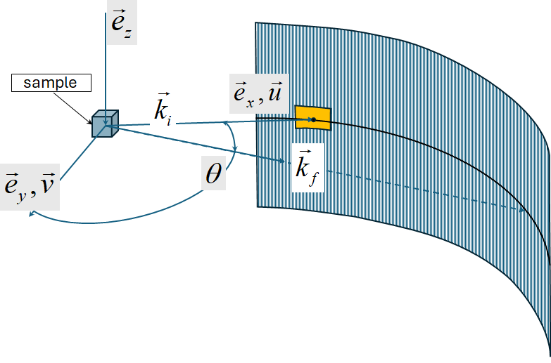
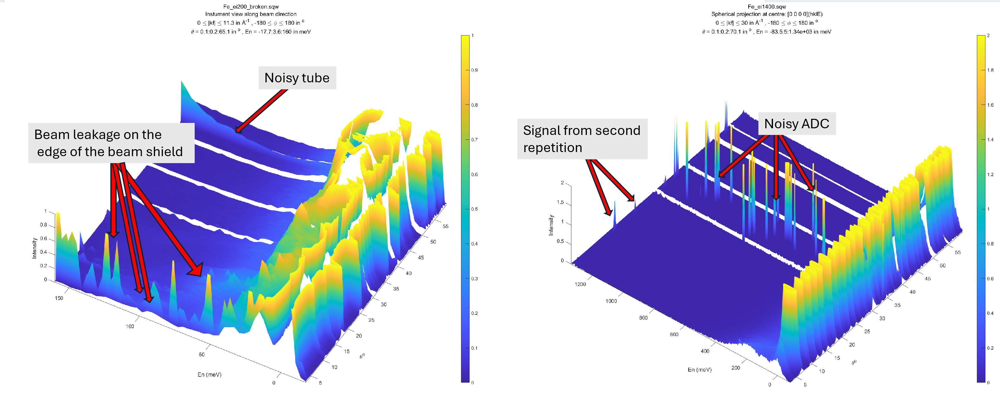
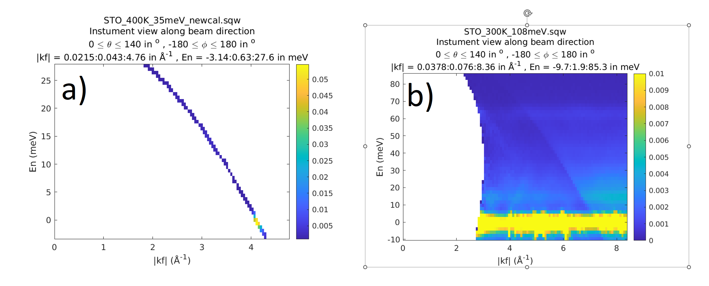

################
Data diagnostics
################

Horace contains various tools for diagnosing issues with the data. The foremost
of these is the `run_inspector`_ tool.

If you wish to decompose an sqw object into the data from its constituent runs,
the `split`_ routine outlined below can be used. If necessary after
manipulation, these data can then be recombined using the `join`_ routine.

run_inspector
-------------

The ``run_inspector`` routine may be used on 1d or 2d ``sqw`` objects to plot the
data from each individual run.

::

   run_inspector(w)

   run_inspector(w,'ax',[-5,4,0,370])

   run_inspector(w,'ax',[-5,4,0,370],'col',[0,1])

The ``'ax'`` and ``'col'`` arguments allow you to specify the xy axes, and the
colour scale, of the resulting plots. If these options are not set then each
frame will be plotted with different (tight) axes and a different colour scale.

To toggle through the frames, there are several keyboard options:

- Enter (Return) - play/pause video (5 frames-per-second default).

- Backspace - play/pause video a factor 5 slower.

- Right/left arrow keys - advance/go back one frame.

- Page down/page up - advance/go back 10 frames.

- Home/end - go to first/last frame of video.

Let us illustrate the information that may be obtained by means of an
example. First we generate a QE slice such as the one below

.. figure:: ../images/Fe_slice.jpg
   :align: center
   :width: 500px

   Selected QE slice

We can now use ``run_inspector`` to plot a series of slices that come from a
single contributing dataset, shown below.

.. figure:: ../images/Fe_slice_run_inspector_1.jpg
   :align: center
   :width: 500px

   Frame 1 in run inspector

.. figure:: ../images/Fe_slice_run_inspector_11.jpg
   :align: center
   :width: 500px

   Frame 11 in run inspector

.. figure:: ../images/Fe_slice_run_inspector_21.jpg
   :align: center
   :width: 500px

   Frame 21 in run inspector

split
-----

Split an sqw object into an array of ``sqw`` objects, each containing data from a
single contributing run. So if your dataset comprises information from 100 runs,
the output will be a 100-by-1 array of ``sqw`` objects.

::

   wout = split(w)

The inputs are:

``w`` - an ``sqw`` object.

The output is:

``wout`` - an array of ``sqw`` objects, each one made from a single ``.spe`` data file

join
----

Inverse of ``split`` - takes an array of ``sqw`` objects that have been created
using ``split`` and recombines them.

::

   wout = join(w[, wi])

The inputs are:

``w`` - an array of ``sqw`` objects, each one made from a single ``.spe`` data file

``wi`` **[Optional]** - the original pre-split ``sqw`` object (recommended).

The output is:

``wout`` - an ``sqw`` object formed of from the ``w`` input.

Instrument view cut
-------------------

Normally Horace works with :math:`S(\vec{Q},\omega)` scattering function build in reciprocal coordinate system related to a crystal. If sample is not sufficiently large to allow neutrons thermalization or instrument have various problems with its detectors or background scattering, some scattering artefacts may add noise or unrelated signals to measured  :math:`S(\vec{Q},\omega)` function. 
These artefacts will have spherical symmetry around the beam direction. To clearly identify such artefacts one may use
``instrument_view_cut`` algorithm:

::

   wout = instrument_view_cut(sqw_source,[0,theta_step,theta_max],[En_min,En_step,En_max]);
   
Where *sqw_source* is an source ``sqw`` object with pixels, and two other arguments define binning in two directions. ``theta`` -- the angle between beam and detector directions and ``En`` are the energy transfer values.
The algorithm makes the cut in the spherical coordinate system wich z-axis is aligned along the beam direction.
According to Horace agreement, beam in Horace is directed along :math:`e_{x}` coordinate or direction :math:`\vec{u}` of the crystal (see Chapter on :ref:`Generating SQW files<manual/Generating_SQW_files:Generating SQW files>` for details):

   Spherical coordinate system aligned with the beam and used by ``instrument_view_cut``.

The algorithm processes whole ``sqw`` source so takes a while to complete. Picture below shows the result
of executing this algorithm on two old (2010) MAPS `sqw` files produced without diagnostics running over contributing ``nxspe`` files.
There are various instrument artefacts clearly observable on the images. The noisy ADC are not even identifiable by diagnostics. 

   Various issues identified on instrument view.

The best way of dealing with these kind of issues if they can not be clearly observable from a single run is to use Mantid 
to add together all workspaces intended to use as Horace source data, display them on Mantid instrument view and create hard mask there.

There is another issue which can be identified by this algorithm usually while diagnosing old ``sqw`` data, as this issue have been hopefully fully fixed in Horace-4. You may notice, that cut applied over the whole sqw file range suddenly start loosing substantial fraction of pixels. For example, normal cut log for a cut applied over whole ``sqw`` file range will look like:

+------------------------------------------------------------------------------------------------------------+
| \*\*\* Cutting file-backed sqw object; returning result in file --> ignored as cut contains no pixels      |
+------------------------------------------------------------------------------------------------------------+
| \*\*\* Step 1 of 196; Read data for 20000000 pixels -- processing data... -----> included  20000000 pixels |
+------------------------------------------------------------------------------------------------------------+
| \*\*\* Step 2 of 196; Read data for 20000000 pixels -- processing data... -----> included  20000000 pixels |
+------------------------------------------------------------------------------------------------------------+
| \*\*\* Step 3 of 196; Read data for 20000000 pixels -- processing data... ----->  included  20000000 pixels|
+------------------------------------------------------------------------------------------------------------+
| \*\*\* Step 4 of 196; Read data for 20000000 pixels -- processing data... ----->  included  20000000 pixels|
+------------------------------------------------------------------------------------------------------------+
| \*\*\* Step 5 of 196; Read data for 20000000 pixels -- processing data... ----->  included  20000000 pixels|
+------------------------------------------------------------------------------------------------------------+
| \*\*\* Step 6 of 196; Read data for 20000000 pixels -- processing data... ----->  included  20000000 pixels|
+------------------------------------------------------------------------------------------------------------+
| \*\*\* Step 7 of 196; Read data for 20000000 pixels -- processing data... ----->  included  20000000 pixels|
+------------------------------------------------------------------------------------------------------------+
| \*\*\* Step 8 of 196; Read data for 20000000 pixels -- processing data... ----->  included  20000000 pixels|
+------------------------------------------------------------------------------------------------------------+
| \*\*\* Step 9 of 196; Read data for 20000000 pixels -- processing data... ----->  included  20000000 pixels|
+------------------------------------------------------------------------------------------------------------+
| \.\.\.\.                                                                                                   |
+------------------------------------------------------------------------------------------------------------+

Sometimes running cut on old Horace data, despite making ``instrument_view_cut`` over whole instrument ranges will produce log which look like:

+------------------------------------------------------------------------------------------------------------+
|\*\*\* Cutting file-backed sqw object; returning result in file --> ignored as cut contains no pixels       |
+------------------------------------------------------------------------------------------------------------+
|\*\*\* Step 1 of 264; Read data for 20000000 pixels -- processing data... ----->  included   5162352 pixels |
+------------------------------------------------------------------------------------------------------------+
|\*\*\* Step 2 of 264; Read data for 20000000 pixels -- processing data... ----->  included  10791836 pixels |
+------------------------------------------------------------------------------------------------------------+
|\*\*\* Step 3 of 264; Read data for 20000000 pixels -- processing data... ----->  included   5338109 pixels |
+------------------------------------------------------------------------------------------------------------+ 
|\*\*\* Step 4 of 264; Read data for 20000000 pixels -- processing data... ----->  included         0 pixels |
+------------------------------------------------------------------------------------------------------------+ 
|\*\*\* Step 5 of 264; Read data for 20000000 pixels -- processing data... ----->  included         0 pixels |
+------------------------------------------------------------------------------------------------------------+ 
|\*\*\* Step 6 of 264; Read data for 20000000 pixels -- processing data... ----->  included    191651 pixels |
+------------------------------------------------------------------------------------------------------------+ 
|\*\*\* Step 7 of 264; Read data for 20000000 pixels -- processing data... ----->  included   7974898 pixels |
+------------------------------------------------------------------------------------------------------------+ 
|\*\*\* Step 8 of 264; Read data for 20000000 pixels -- processing data... ----->  included  12112223 pixels |
+------------------------------------------------------------------------------------------------------------+ 
|\*\*\* Step 9 of 264; Read data for 20000000 pixels -- processing data... ----->  included   1943239 pixels |
+------------------------------------------------------------------------------------------------------------+
| \.\.\.\.                                                                                                   |
+------------------------------------------------------------------------------------------------------------+

despite the cut is performed over whole instrument ranges. This indicates subtle issue in Horace ``sqw`` files,
where they lost synchronization between pixels information and information about crystal orientation.
To clarify this issue exactly, one may run ``instrument_view_cut`` with ``-check_correspondence`` option.

::

   wout = instrument_view_cut(source_sqw,[0,0.2,140],[],'-check_correspondence');
   plot(wout)
   
This option force 2D cut in :math:`|k_{f}|` - :math:`dE` coordinates. As these values are connected by 
arithmetic relationship, the cut in these coordinates should represent a line. If one see a 2-dimensional image instead,
the correspondence between pixel information describing neutron "pseudo-events" and experiment information describing 
runs and crystal orientation is violated. The following figure represents two ``sqw`` datasets, where the first one
was build with correct correspondence between experiment and pixels information and the second one -- where
this correspondence have been broken.

   Correct -- a) and broken -- b) relationship between experiment information and pixels information.
   
The dataset with broken pixel-experiment correspondence can be cut, sliced and multifitted, but Tobyfit would not 
produce correct result on it. To use Tobyfit, one needs to rebuild such ``sqw`` dataser using Horace-4. If you do not 
have original data to reproduce such ``sqw`` dataset and need to use Tobyfit, contact HoraceHelp@stfc.ac.uk. The team should
be able to help you rebuilding such ``sqw`` dataset.
