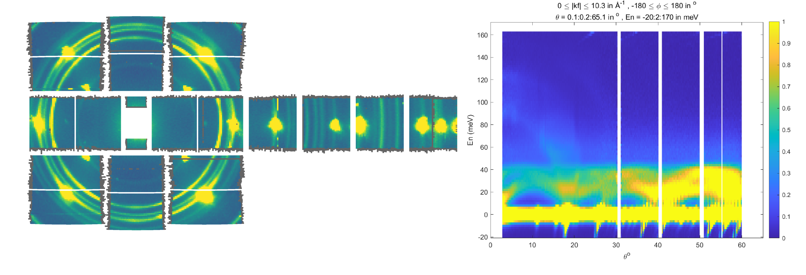
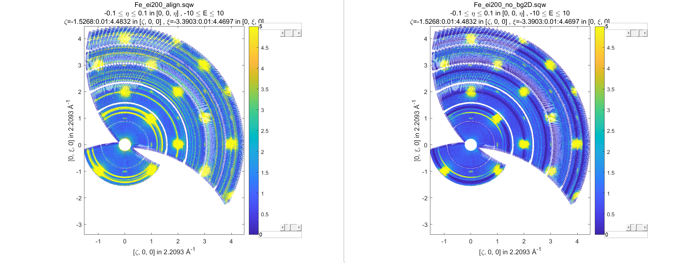
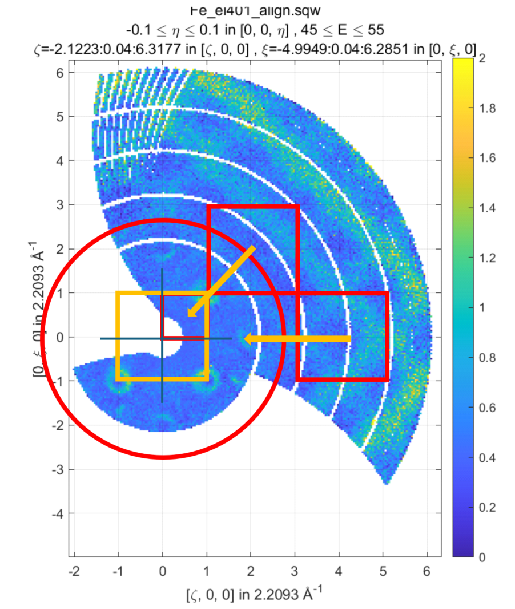
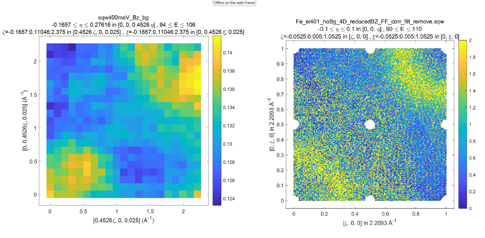
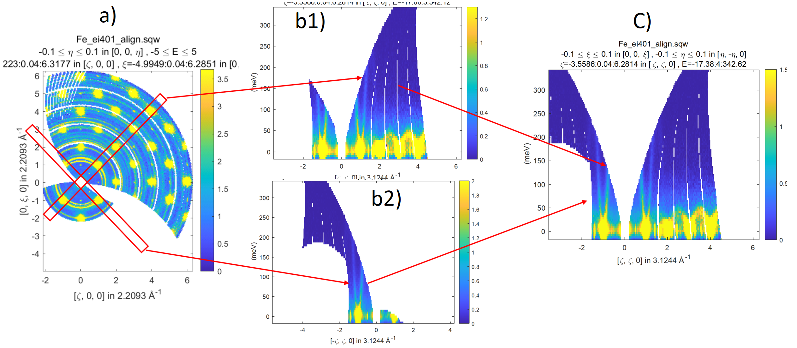

#######################
Generic Transformations
#######################

The previous chapters describe how one may do various  
:doc:`unary </manual/Unary_operations>` or :doc:`binary operations </manual/Binary_operations>` over your data or build analytical model and :doc:`simulate it over whole sqw file </manual/Simulation>`. 
As whole ``sqw`` file can not be generally placed in memory, all these operations are 
based on special ``PageOp`` family of algorithms, which operate loading a page of data in memory
and applying various operations to these data. For :doc:`unary </manual/Unary_operations>` and :doc:`binary </manual/Binary_operations>` operations we wrote these transformations for users and the ``sqw_eval`` algorithm from :doc:`Simulation </manual/Simulation>` section 
gives user a set of rules to write his own model in `hklE` coordinate system and apply it to whole ``sqw`` object.

Introduction
============

Generic transformations are the set of algorithms, which give user access to the body of `PageOp` algorithm to do whatever he needs with his ``sqw`` data. As this gives user the most flexible access to modifying ``sqw`` data, it requests from user most knowledge of ``sqw`` object design to do useful things with these data. 

In particular, user have to know, that Horace stores its pixel data in Crystal Cartesian coordinate
system, which is orthogonal coordinate system attached to crystal lattice with x-axis parallel to 
``a*`` inverse lattice vector and two other axis being orthogonal to it. He needs to write
transformations over page of data presented in the form of [9 x npix]  matrix, where *npix* is the page size (defined by ``hor_config.mem_chunk_size`` value), each column corresponds to a pixel and  the pixel contain the following values:

.. _Pixels_structure:

.. code-block:: matlab

    row 1: u1                 % first momentum transfer (Q_x) coordinate in A^-1
    row 2: u2                 % second momentum transfer (Q_y) coordinate in A^-1
    row 3: u3                 % third momentum transfer (Q_z) coordinate in A^-1
    row 4: dE                 % energy transfer values  (meV)
    row 5: run_idx            % identifier of the run, contributed into this pixel
    row 6: detector_idx       % indices of the detectors, contributing into the image
    row 7: energy_idx         % indices of energy transfer values registered in experiment
    row 8: signal             % signal (normalized number of neutron events) registered for this pixel
    row 9: variance           % variance of the signal above.
    
In addition to that user should be familiar with the definition of `projection <Cutting_data_of_interest_from_SQW_files_and_objects.html#projection-in-details>`__, which establishes relationship between pixel coordinate system and the image coordinate system. A projection has number of methods from which two the most useful for transformations are:

.. code-block:: matlab

        % Transform pixels expressed in crystal Cartesian or any source
        % coordinate systems defined by projection into image coordinate system
        [pix_transformed] = proj.transform_pix_to_img(pix_cc);
        % Transform pixels expressed in image coordinate coordinate systems
        % into crystal Cartesian system or other source coordinate system,
        % defined by projection
        [pix_cc] = proj.transform_img_to_pix(pix_transformed);

Where ``proj`` is usually projection used by ``sqw`` object of interests, `pix_cc` is [4 x npix] matrix of pixel coordinates expressed in Crystal Cartesian coordinate system (see four first rows of :ref:`pixels data <Pixels_structure>` above) and `pix_transformed` is [4 x npix] array of pixels coordinates expressed in image coordinate system.

Finally user should be familiar with concept of object oriented programming as to write custom transformation one needs to use properties of the core transformation classes ``PageOp_sqw_op`` or
``PageOp_sqw_op_bin_pixels`` described below alongside with the description of the appropriate algorithm.

``sqw_op`` algorithm
====================

``sqw_op`` is the algorithm, which provides user with opportunity to modify signal and error values and
perform multiple unary or binary operations in simultaneously transforming large ``sqw`` object. Its signature looks as follows:

.. code-block:: matlab

    wout = sqw_op(win, @sqw_op_func, pars)
    wout = sqw_op(win, @sqw_op_func, pars,'outfile',target_file_name)
    
where:

- ``win`` -- ``sqw`` file, cell array array of ``sqw`` objects or strings that provides filenames of ``sqw`` objects on disk serving as the source of ``sqw`` data to process using ``sqwop_func``
- ``@sqw_op_func`` --  handle to a function which performs desired operation over sqw data.
- ``pars`` --    cellarray of parameters used by ``sqw_op_func``. If ``sqw_op_func`` have no parameters, empty parentheses ``{}`` should be provided.
            
Optional:
   
- ``"outfile"`` -- key followed by the string, which defines the name or name with full path to the file to store resulting filebacked ``sqw`` object.  If one does not specify this, the resulting filebacked object will be temporary, i.e. will be deleted after variable ``wout`` will go out of scope.

The output is:

- ``wout``: an ``sqw`` object built from ``win`` by applying ``sqw_op_func`` over all pixels of ``win`` objects and calculating appropriate image averages.

``@sqw_op_func`` should have the form:

.. code-block:: matlab

   function output_sig_err = sqw_op_func(in_page_op,parameters)
      
      data = in_page_op.data; % get page of pixel data expressed in Crystal Cartesian coordinate system
      % Operations over signal and error as function of in_page_op, data and other parameters
      ...
      % return results of operation as [2 x npix ] array of modified signal and variance data
      output_sig_err = [signal_calc(:)';error_calc(:)'];
   end

where ``in_page_op`` is the instance of ``PageOp_sqw_op`` class which is the core of ``sqw_op`` algorithm and will provides user with access to page of pixels data and other properties, necessary to define proper transformation.

Now let's assume that you want to multiply an sqw object by 2 and extract a constant from the obtained value. You can do that using unary and binary operations, described in :doc:`the chapter above </manual/Unary_operations>`:

.. code-block:: matlab

   >>wout = 2*w_in - 1;

This is simple code, but if your objects are filebased, this will requests two scans over large 
``sqw`` object. If you write ``sqw_op_func`` function:

.. code-block:: matlab

   function output_sig_err = sqw_op_unary(in_page_op,varargin)
      % Apply two simple transformations of signal of an sqw object in one go.
      
      data = in_page_op.data;     % get access to page of pixel data
      data(8,:) = 2*data-1;       % change pixel data signal by multiplying it by 2 and extracting 1
      output_sig_err = data(8:9,:); % combine signal and unchanged error into form, requested by algorithm
   end

and apply ``sqw_op`` algorithm:

.. code-block:: matlab

    wout = sqw_op(win, @sqw_op_unary, 'outfile','operations_result.sqw')

You can do the same operation over large filebacked ``sqw`` object in one scan over whole ``sqw`` file, which in this simple case will be two times faster then applying these operations one after another.

If your theoretical model is built in Crystal Cartesian coordinate system rather than in `hkldE` coordinates you may write and apply it to pixel coordinates exactly like `hkldE` model for ``sqw_eval`` algorithm. Here, as the example of using ``sqw_op`` we try to remove cylindrical background obtained in the `diagnostics <Data_diagnostics.html#instrument-view-cut>`__ chapter of this manual. It may be not the best way of removing whole background but a good example of using special projection to transform data expressed in Crystal Cartesian coordinate system to image coordinate system.

The sample background present in this case may be estimated by running Mantid reduction script and adding all reduced runs together:

Left part of the image represents Mantid instrument view image. It is obvious that there is small beam leakage around beam stop window and strong powder lines around Bragg peaks. This is the background which one wants to remove. Right part of this image represents 2-dimensional image obtained from ``instrument_view_cut`` and we want to extract this image from whole sqw file containing magnetic signals.

Slim-lined script which would produce such background removal is provided below:

.. code-block:: matlab

    %%=============================================================================
    %       Calculate and remove background for Ei=200 meV sample dataset
    % =============================================================================
    % Get access to sqw file for the Ei=200meV containing Horace angular scan
    % which is located in "sqw/sqw2024" folder, in the position relative to the 
    % location of the script.
    root_dir = fileparts(fileparts(fileparts(mfilename("fullpath"))));
    sqw_dir=fullfile(root_dir,'sqw','sqw2024');

    % define the name of the source file and the name of the resulting data file.
    data_src200 =fullfile(sqw_dir,'Fe_ei200_align.sqw');
    target = fullfile(sqw_dir,'Fe_ei200_no_bg2D.sqw');
    src200 = sqw(data_src200); % create filebacked source sqw object

    % calculate 2-dimensional cylindrical background in Instrument coordinate system.
    w2_200meV  = instrument_view_cut(src200,[0,0.2,65],[-20,2,170]);

    % build background model for interpolation expressed in 
    % instrument view coordinate system.
    x1 = w2_200meV.p{1};
    x2 = w2_200meV.p{2};
    x1 = 0.5*(x1(1:end-1)+x1(2:end));
    x2 = 0.5*(x2(1:end-1)+x2(2:end));
    F = griddedInterpolant({x1,x2},w2_200meV.s); % define background model using linear
    % interpolation of signal
    
    % call sqw_op with function to remove background
    src200_noBb = sqw_op(src200,@remove_background,{w2_200meV,F},'outfile',target);
 
The page-function with actually used to remove background in the code above is:
 
.. code-block:: matlab
 
    function sig_var = remove_background(pageop_obj,bg_data,bg_model,varargin)
        % function to remove background from page of data.
        % Inputs:
        % pageop_obj -- instance of PageOp_sqw_op class providing necessary page of pixels data
        % bg_data    -- two dimensional background dataset to remove
        % bg_model   -- gridded interpolant to calculate background signal on 2-Dimensional 
        %               image.
        % Returns:
        % sig_var     -- 2xnpix array of modified pixel's signal and variance.
        
        data  = pageop_obj.page_data; % get access to page of pixel data

        % 2D background. get access to kf_sphere_proj to transform pixel data
        % into instrument coordinate system where background is
        % defined using instrument view projection
        % As this is special projection, it needs 5 rows of pixel data (needs run_id)
        % rather then the standard projection, which takes 4 rows.
        pix   = bg_data.proj.transform_pix_to_img(data(1:5,:)); % you may define your own
        % complex transformation to convert pixels in Cry
        
        % interpolate background signal on the pixels coordinates expressed 
        % in instrument coordinate system.
        bg_signal = bg_model(pix(2,:),pix(4,:));
    
        % retrieve existing signal and variance values
        sig_var = data([8,9],:);
        % remove interpolated  background signal from total signal
        sig_var(1,:) = data(8,:)-bg_signal;
        % exclude negative results from possible future fitting routine
        over_compensated = sig_var(1,:)<0;
        %sig_var(1,over_compensated) = 0;
        sig_var(2,over_compensated) = 0;

    end

Modified image clearly shows substantial decrease in parasitic signal around elastic line:

 
Better background model is possible to remove more parasitic signal, though this task is fully in the hands of user.

``sqw_op_bin_pixels`` algorithm
===============================

Let's assume you are interested in magnetic signal which is present at relatively low :math:`\|Q\|` due to magnetic form factor and signal covers multiple Brillouin zones at low :math:`\|Q\|`. You want to accumulate magnetic signal in first Brillouin zone to increase statistics and consider everything which is beyond some specific :math:`\|Q\|` - value to be background to remove as signal there is negligibly small due to magnetic form factor, so you also want to move this signal to first Brillouin zone and extract background from the magnetic signal. Figure below give example of such situation:

   
   Sample differential cross-section measured on MAPS and showing
   magnetic signal within read-cycle surrounded area and background signal (phonons)
   inside and outside of this area. Yellow box represents double-size Brillouin zone where 
   data moved using shift operation and its top right quadrant -- the area where data should
   be finally moved using folding and reflection.
   

``sqw_op`` algorithms would not allow you to do this, as you can not change pixels coordinates alongside with everything else.
``sqw_op_bin_pixels`` algorithm is written to allow user changing pixels coordinates. Its interface 
is the mixture of ``sqw_op`` interface and ``cut`` interface, which defines construction of new
image of interest from provided pixel and image data:

.. code-block:: matlab

    wout = sqw_op_bin_pixels(win, @sqw_op_func, pars,cut_pars{:})
    wout = sqw_op_bin_pixels(win, @sqw_op_func, pars,cut_pars{:},'outfile',target_file_name);

where:

- ``win`` -- ``sqw`` file, cell array array of ``sqw`` objects or strings that provides filenames of ``sqw`` objects on disk serving as the source of ``sqw`` data to process using ``sqwop_func``
- ``@sqw_op_func`` --  handle to a function which performs desired operation over sqw data.
- ``pars`` --    cellarray of parameters used by ``sqw_op_func``. If ``sqw_op_func`` have no parameters, empty parentheses ``{}`` should be provided.
- ``cut_pars`` -- cellarray of cut parameters as described in `cut <Cutting_data_of_interest_from_SQW_files_and_objects.html#cut>`__ except symmetry operations which are not supported by this algorithm as ``cut`` parameters but may be customized and provided as the parameters of ``sqw_op_func``.

Namely, ``cut_pars`` have the form:

.. code-block:: matlab

    cut_pars ={[ proj], p1_bin, p2_bin, p3_bin, p4_bin[, '-nopix']};

where:

- `proj <Cutting_data_of_interest_from_SQW_files_and_objects.html#projection-proj>`__ defines the axes and origin of the cut including
  the shape of the region to extract and the representation in the resulting
  histogram. If not provided, the projection is taken from the input ``win`` object.
- `pN_bin <Cutting_data_of_interest_from_SQW_files_and_objects.html#binning-arguments>`__ describe the histogram bins to capture the  data. In details they described in the `chapter about binning arguments  <Cutting_data_of_interest_from_SQW_files_and_objects.html#binning-arguments>`__
- optional ``'-nopix'`` argument means that resulting object would be ``dnd`` object, i.e. object
  which does not contain pixels.

Slim-lined script to calculate background in the situation, described on the figure above looks like that:

.. code-block:: matlab

    %%=============================================================================
    %       Calculate background for Ei=400 meV
    % =============================================================================
    % Get access to sqw file for the Ei=400meV Horace angular scan
    root_dir = fileparts(fileparts(fileparts(mfilename("fullpath"))));
    sqw_dir=fullfile(root_dir,'sqw','sqw2024');

    data_src400 =fullfile(sqw_dir,'Fe_ei401_align.sqw');
    target = fullfile(sqw_dir,'Fe_ei401_noBg_4D_reducedBZ_FF_ignored.sqw');

    % initialize source filebacked object to operate over
    src400 = sqw(data_src400);

    alatt = src400.data.alatt;  % get access to lattice parameters 
    angdeg= src400.data.angdeg; % and lattice angles
    rlu = 2*pi./alatt;          % calculate reciprocal lattice (case of cubic lattice)
    r_cut2 = (3.5*rlu(1))^2;    % define cut-off radius for background 
    old_range = src400.data.axes.get_cut_range(); % obtain binning for existing object
    del = 0.05;                 % define new binning for q-coordinates
    zoneBins = [-del,0.05,1+del];
    e_bins = old_range{4};      % retain existing binning for energy coordinates
    
    % define cut ranges
    cut_range = {zoneBins *rlu(1),zoneBins*rlu(2),zoneBins*rlu(3),[-15,2,340]};

    bg_file = 'w4Bz_400meV_bg.mat'; % where we want to save our background

    % run sqw_op_bin_pixels to calculate background in the first Brillouin zone.
    sqw400meV_Bz_bg = sqw_op_bin_pixels(src400, @build_bz_background, {r_cut2,rlu},cut_range{:},'-nopix');  % 
    sqw400meV_Bz_bg.filename = 'sqw400meV_Bz_bg'; % redefine name of the resulting dnd object
    save(bg_file,'sqw400meV_Bz_bg');   % save result for further usage.

Where the function to calculate background is:

.. code-block:: matlab

    function data = sqw_op_build_bz_bckgrnd(pageop_obj,r2_ignore,rlu)
    %sqw_op_build_bz_bckgrnd calculates background signal from scattering function
    % taken at of q-values beyond of the specified cut-off radius 
    % and moves background signal into first Brilluoin zone.
    %
    % Inputs:
    % pageop_obj -- Initialized instance of PageOp_sqw_op_bin_pixels object providing all necessary data
    % r2_ignore  -- square of cut-off radius to select background (A^-2)
    % rlu        -- reciprocal lattice vectors for the used lattice 
    
    % Get access to [9 x Npix] page of pixels data
    data = pageop_obj.page_data;
    % calculate pixels distances from centre of Crystal Cartesian coordinate system
    Q2 = data(1,:).*data(1,:)+data(2,:).*data(2,:)+data(3,:).*data(3,:);
    keep = Q2>=r2_ignore; % background % identify pixels outside of cut-off radius
    %keep = Q2<r2_ignore;   % foreground
    data = data(:,keep);  % select pixels outside of cut-off radius
    if isempty(data)
        return;    % leave if this page does not contain background data
    end
    % Cubic lattice scale in BCC lattice
    scale = 2*rlu;
    q_coord = data(1:3,:);
    img_shift   = round(q_coord./scale(:)).*scale(:); % BRAGG positions 
    % in the new lattice are located at the even rlu values
    % move all q-coordinates into expanded Brillouin zone +-1*rlu size
    q_coord  = q_coord - img_shift;
    
    % move 7 cubes with negative coordinates of expanded Brillouin zone into the first cube.
    invert = q_coord<0;
    q_coord(invert) = -q_coord(invert);
    
    % construct result containing modified coordinates    
    data(1:3,:) = q_coord;

    end

Note that the function returns full [9x N] page of pixel data, where N is smaller then input number of 
pixels. Rows 12-13 of the function above distinguish between background and foreground.
As one can see, difference is just in taking signal for background outside of the cut-off radius
and foreground -- inside of cut-off radius. This causes visible magnetic foreground signal contributing into background, but as this signal is smaller then 10% of foreground signal, here we ignore it, bearing in mind that this correction may be calculated more accurately and applied to final results.

All these considerations and their significance or non-significance are case-specific user have
full control and responsibility for writing his own background/foreground function and interpreting results, obtained using this function.

Figure below shows sample background calculated using ``sqw_op_bin_pixels`` algorithm and background-calculating function ``sqw_op_build_bz_bckgrnd.mat`` provided above. The background extraction is also performed using ``sqw_op_bin_pixels`` algorithm as it combines moving foreground signal into first Brillouin zone,
background extraction, Magnetic form-factor corrections and parasitic signal removal. As this is relatively complex user function based on elements, provided above, we do not provide script to obtain this result in the document but placed the script which does these operations (``sqw_op_move_to_bz0_and_remove_bckgrnd.mat``) into ``Horace/example/`` folder.

   
   Background and Foreground signals for data demonstrated at the beginning of this chapter.
   Note the difference in intensity scale between background and foreground signals. 

Round holes in the corners, centre and middle-edges of the foreground scattering function are related to
the procedure of suppression of the parasitic reflections in [0,0,1] direction from cubic sub-lattice
of the sample. The piece of code responsible for this suppression and the holes is marked and highlighted within
the sample code.
   
.. note::

  ``sqw_ob_bin_pixels`` is the algorithm acting on full ``sqw`` object. As such, it is not particularly fast until it parallel implementation is available. The examples, provided here are done for whole ``sqw`` object, located on file, so the pictures show 2-dimensional cuts of full 4-dimensional filebacked object.
  It is recommended to debug user functions on 2-dimensional cuts/objects located in memory before running long calculations on full 4-dimensional object.

``sqw_op_bin_pixels`` algorithm with ``"-combine"`` option
==========================================================

Normally ``sqw_op_bin_pixels`` algorithm applied to cellarray of ``sqw`` objects or ``sqw`` files
will apply specified ``sqw_op_function`` to each input ``sqw`` object. If you invoke this algorithm with ``"-combine"`` option, it will combine all input objects into single object with coordinate system defined by the first input object.

We extracted description of ``"-combine"`` option into separate chapter due to close connection between 
the ``sqw_op_bin_pixels`` with the sample function described :ref:`below <move-all-to-proj-label>` within ``cut`` in `Cut with symmetry operations <Symmetrising_etc.html#cutting>`__, described in chapter :doc:`Symmetry Operations </manual/Symmetrising_etc>`.
The code of the sample function below substantially overlaps with the code used in the core ``cut`` with ``SymOp`` symmetrisation algorithm.

The similarities and differences between these two algorithms are summarized in the table:

+---------+--------------------------+------------------------------+-------------------------------------------+
| Number  |      Action              | ``cut`` with ``SymOp``       | ``sqw_op_bin_pixels`` with ``"-combine"`` |
+---------+--------------------------+------------------------------+-------------------------------------------+
|    1    |     Cuts source:         | single ``sqw`` obj with cuts | random selections of ``sqw`` cuts,        |
|         |                          | generated by symmetry        | may be from different ``sqw`` objects     |
|         |                          | operations                   |                                           |
+---------+--------------------------+------------------------------+-------------------------------------------+
|    2    | Multiple transformations |    Not allowed               | simple modifications to standard script   |
|         | applied to single data   |                              |                                           |
+---------+--------------------------+------------------------------+-------------------------------------------+
|    3    | Include same pixels from |    No. Efficient exclusion   | request complex coding. Probably          |
|         | multiple symmetry op.    |    algorithm                 | not very efficient but possible.          |
+---------+--------------------------+------------------------------+-------------------------------------------+
|    4    | Possibility to perform   |                              |                                           |
|         | other operations         |          No                  |             Possible                      |
|         | alongside with symmetry. |                              |                                           |
+---------+--------------------------+------------------------------+-------------------------------------------+
|   5     | User efforts             |        Average               |             High                          |
+---------+--------------------------+------------------------------+-------------------------------------------+

In more details the table above can be expanded as follows:

    1. ``cut`` with ``SymOp`` generates number of cuts related by symmetry operation and combine data from these
       cuts together. You have to provide ``sqw_op_bin_pixels`` with set of cuts (related by symmetry operations or
       not related -- its your choice) and then these cuts are combined together exactly in the same way as in ``cut``
       with ``SymOp``. As the consequence, ``cut`` with ``SymOp`` will work with single ``sqw`` file, and cuts
       provided to ``sqw_ob_bin_pixels`` can be taken from multiple ``sqw`` files.
    2. Let's assume you transform data defined in range [-1:-3] into range [0:1] using folding operations
       around axes passing through points 0 and 1. If you use ``cut`` with ``SymOp``, the data reflected from range [1:3] will be reflected into range [-2:1] and the data block [-2:0] will be dropped by cut ranges. reflected. This is the consequence of using the current implementation of the algorithm, which eliminates double counting of the same data transformed multiple times using multiple
       symmetry operations. If you need to keep these data, you need to use ``sqw_op_bin_pixels``
       with properly modified custom ``sqw_op_function``. 
    3. ``cut`` with ``SymOp`` carefully cares about error counting not to double-count the same pixels, 
       transformed multiple times by different symmetry operations. As data in ``SymOp`` may come from
       multiple sources, its very difficult to implement such algorithm for ``sqw_op_bin_pixels``. 
       This may be done with some efforts from user (e.g. by calculating unique pixel id and comparing pixels usage)
       but this algorithm does not look very efficient.
    4. As user expects to write his own ``sqw_op_function`` he may use multiple transformations of his 
       choice to modify combined data. ``cut`` with ``SymOp`` intended for performing  operations performed by well defined ``SymOp`` classes.
    5. Summarizing all above, one can say that ``cut`` with ``SymOp`` is intended for simple combining
       of symmetry-related
       cuts, while ``sqw_op_bin_pixels`` gives user wider opportunities, allows combining much wider range
       of data but requests from user more experience with MATLAB programming and better knowledge of Horace
       internal structure.
       
Simplest form of the function, which allows combining multiple cuts into single cut is:

.. _move-all-to-proj-label:

.. code-block:: matlab

    function result = move_all_to_proj(pageop_obj,proj_array,varargin)
    % Convert all equivalent directions found in the cellarray of input datasets into
    % the coordinate system specified by pageop_obj.
    %
    % Inputs:
    % pageop_obj  -- instance of PageOp_sqw_binning object containing
    %                information about source sqw object(s), including page of
    %                pixel data currently loaded in memory, projection, which 
    %                defines target coordinate system and the target image 
    %                to convert all input data in.
    % proj_array  -- array of projections which describe directions of cuts
    %                to combine.
    %
    % Returns
    % result      -- page of modified pixels data to bin using
    %                PageOp_sqw_binning algorithm transformed into coordinate
    %                system related with first projection
    %
    %

    % Get access to [9 x Npix] page of pixels data
    data = pageop_obj.page_data;
    % get access to the projection, which describes target image
    targ_proj = pageop_obj.proj;
    %
    % done explicitly for 2-D cuts for performance to avoid internal loop over pixels ranges
    %---------------------------------------------------------------------------------------
    % Get access to the target image and obtain indices of the integration axis
    iax  = pageop_obj.img.iax;  % expect two integration axis here
    % get cut ranges of the image to combine everything into these ranges
    cut_range = pageop_obj.img.img_range(:,iax  );
    %
    q_coord = data(1:3,:);
    result = cell(1,numel(proj_array));
    % go through all combining images coordinates system, converting appropriate pixels
    % into coordinate system, related to target projection
    for i=1:numel(proj_array)
        % input projections used for cut do not have lattice set up for them.
        % They need lattice so let's set it up here.
        proj_array(i).alatt = targ_proj.alatt;
        proj_array(i).angdeg = targ_proj.angdeg;
        % transform momentum transfer values from current page of data into
        % image associated with proj_array(i) projection
        coord_tr = proj_array(i).transform_pix_to_img(q_coord);
        % find the data falling outside of the target image range
        % forcing target image and the image produced by current projection to
        % coincide.
        include = coord_tr(iax(1),:)>=cut_range(1,1)&coord_tr(iax(1),:)<=cut_range(2,1)&...
            coord_tr(iax(2),:)>=cut_range(1,2)&coord_tr(iax(2),:)<=cut_range(2,2);
        % extract coordinates which lie within current cut ranges.
        coord_tr  = coord_tr(:,include);
        res_l = data(:,include);
        % transform pixels coordinates from image defined by proj_array(i) cut
        % projection into the Crystal Cartesian coordinates system related with
        % target projection.
        res_l(1:3,:) = targ_proj.transform_img_to_pix(coord_tr);
        % collect transformed pixels as partial result
        result{i} = res_l;

        data = data(:,~include); % extract remaining data for processing using
        % other projections.
        if isempty(data) % leave if all data was processed and transformed
            break
        end
        q_coord = data(1:3,:);
    end
    % combine all partial cut results
    result = cat(2,result{:});
    end
            
The original of this function is located in ``Horace/example/`` folder. The details of the implementation are provided
in the comments to the function. The main idea of the operation is that you select one main cut and combine all additional images forcefully "overlapping" images one over another transforming pixels coordinates accordingly.

Image below shows the way to overlapping two cuts together and the result of such overlapping.

   Overlap two cuts demonstrated on the left image, display them (central image) and combine together using
   ``sqw_op_bin_pixels`` algorithm with combine function above.

Simple script which allows to produce result presented on the right side of picture above (image (c) ) from the data on the left side of the image above using ``sqw_op_bin_pixels`` and :ref:`combine function above <move-all-to-proj-label>` looks as follows:

.. code-block:: matlab
    
    source = sqw('source_file_name');  % define filebacked source sqw object
    w2 = cut(line_proj,[],[],[-0.1,0.1],[-5,5],'-nopix');
    plot(w2)    % plot image (a)
    proj1 = line_proj([1,1,0],[-1,1,0]);
    proj2 = line_proj([-1,1,0],[1,1,0]);    
    cut_ranges = {[],[-0.1,0.1],[-0.1,0.1],[-10,5,360]};
    cut1  = cut(source,proj1,cut_ranges{:});  % cut sqw object presented on image b1)
    cut2  = cut(source,proj2,cut_ranges{:});  % cut sqw object presented on image b2)  
    % combine cut1 and cut2 together producing final result.
    wout  = sqw_op_bin_pixels({cut1,cut2},{[proj1,proj2]},proj1,cut_ranges{:},'-combine');
    plot(wout); % plot image c)
    
    