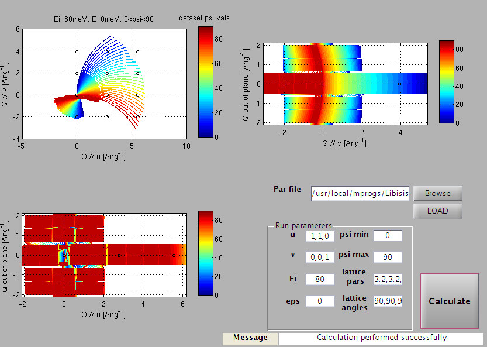
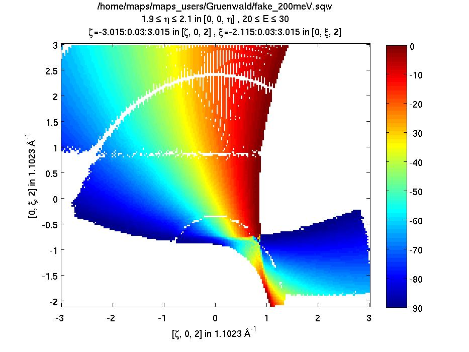

######################
Planning a Horace scan
######################

horace_planner: a simple scan planner
-------------------------------------

Horace has a useful little tool which allows you to work out the coverage of
reciprocal space that will be achieved for a given instrument, the incident
energy and the sample angle range.

You start it up by typing

::

   horace_planner

The graphical user interface shown below should open up

   Horace planner GUI

- You first select the ``.par`` file associated with your instrument (which
  specifies detector positions), by browsing to it, and then clicking ``LOAD``.

- Next you enter the vector **u** and **v** as comma-separated lists.

  - **u** is the **Q**-space direction parallel to the incident beam when the
    crystal rotation angle, :math:`\psi`, is equal to 0

  - **v** is a second vector not parallel to **u** lying in the equatorial plane
    of the detectors (horizontal for most instruments).

.. note::

   It is not necessary for **v** to be perpendicular to **u**.

- Enter the lattice parameters (in Angstroms) and lattice angles (in degrees) of
  your sample as comma-separated lists.

- Enter the incident energy, :math:`E_i`, and the energy transfer you are
  interested in, then the minimum and maximum values of :math:`\psi` you are
  considering.

- Now hit ``Calculate`` and the coverage is calculated. The axes of the three
  plots are the **Q** directions parallel to **u** and **v**, and the
  out-of-plane direction, respectively. The axes are labelled with inverse
  Angstroms, and circles are shown at integer :math:`(h,k,l)` positions.

- The three views shown in the image above correspond to looking at the
  **Q**-coverage volume from three different perspectives.

  - Top-left we see the view from above (i.e. down an axis perpendicular
    to **u** and **v**)

  - Top-right we see the view from the right-hand side (i.e. along **u**
    from the positive side)

  - Bottom-left we see a view from the bottom (i.e. along **v** from the
    negative side)

More detailed planning of scans
-------------------------------

The scan planner shown above is quick and simple to use, but sometimes you need
greater detail about what reciprocal space coverage you will get for a given
scan. To do this, you can generate a fake dataset, where the ``signal`` is
represented as the angle of of the contributing scan at each point.

.. note::

   This process can be rather slow. Often it is better to check using the simple
   scan planner detailed above first before making decisions.

An example script for generating fake data is given below.

.. code-block:: matlab

   en = [0:10:190];  % energy bins (coarse for simulation)
   par_file = '/usr/local/mprogs/Libisis/InstrumentFiles/maps/4to1_124.par';  % detector parameter file
   sqw_file_fake = '/home/maps/maps_users/Gruenwald/fake_200meV.sqw';         % name of output file

   efix = 200;  % incident energy
   emode = 1;   % select 1 for direct geometry spectrometer

   alatt = [5.7, 5.7, 5.7];
   angdeg = [90, 90, 90];

   u = [1, 0, 0];
   v = [0, 1, 1];

   psi = [-90:0];  % scan range in degrees

   omega = 0;
   dpsi = 0;
   gl = 0;
   gs = 0;

   dummy_sqw (en, par_file, sqw_file_fake, efix, emode, alatt, angdeg, ...
              u, v, psi, omega, dpsi, gl, gs);

Once you have created this fake dataset you can take cuts and slices out of it
in exactly the same way as you would a real dataset. For example:

.. code-block:: matlab

   proj = line_proj([1, 0, 0], [0, 1, 0]);  % viewing axes for plots

   my_l = [-2:2];  % loop over a set of values of L

   for i = 1:numel(my_l)
       my_slice(i) = cut(sqw_file_fake, proj, [-3, 0.03, 3], [-3, 0.03, 3], [my_l(i)-0.1, my_l(i)+0.1], [80, 90], '-nopix');
       plot(compact(my_slice(i)));
       keep_figure;
   end

   Sample plot of fake dataset
