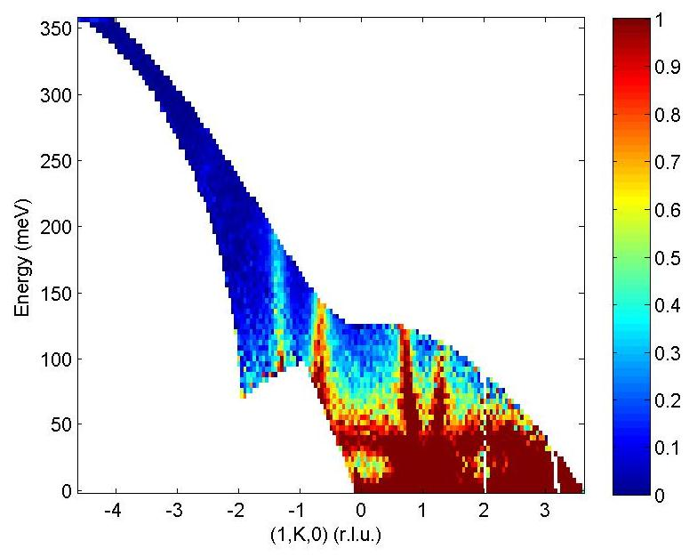
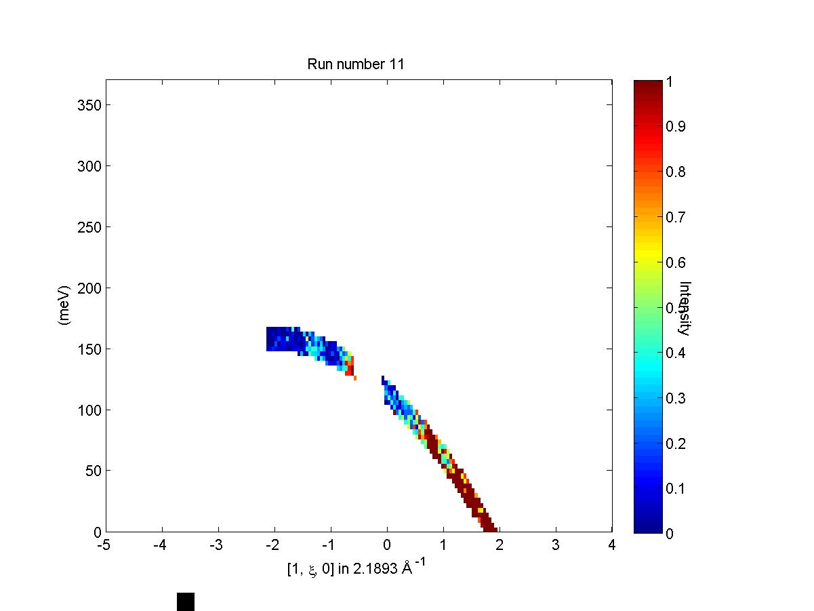

#############
Run inspector
#############

run_inspector
-------------

The ``run_inspector`` routine may be used on 1d or 2d sqw objects to plot the data from each individual run.

::

   run_inspector(w)
   run_inspector(w,'ax',[-5,4,0,370])
   run_inspector(w,'ax',[-5,4,0,370],'col',[0,1])

The ``'ax'`` and ``'col'`` arguments allow you to specify the xy axes, and the colour scale, of the resulting plots. If these options are not set then each frame will be plotted with different (tight) axes and a different colour scale.

To toggle through the frames, there are several keyboard options:

- Enter (Return) - play/pause video (5 frames-per-second default).

- Backspace - play/pause video a factor 5 slower.

- Right/left arrow keys - advance/go back one frame.

- Page down/page up - advance/go back 10 frames.

- Home/end - go to first/last frame of video.

Let us illustrate the information that may be obtained by means of an example. First we generate a QE slice such as the one below

We can now use ``run_inspector`` to plot a series of slices that come from a single contributing dataset, shown below.

.. image:: ../images/Fe_slice_run_inspector_1.jpg
   :width: 500px
   :alt: Frame 1 in run inspector

.. image:: ../images/Fe_slice_run_inspector_21.jpg
   :width: 500px
   :alt: Frame 21 in run inspector
