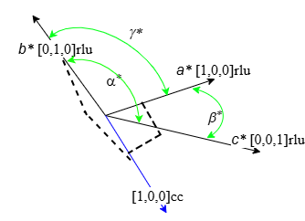
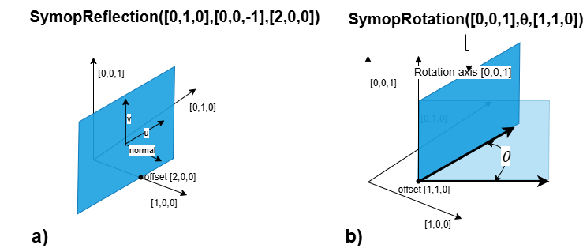
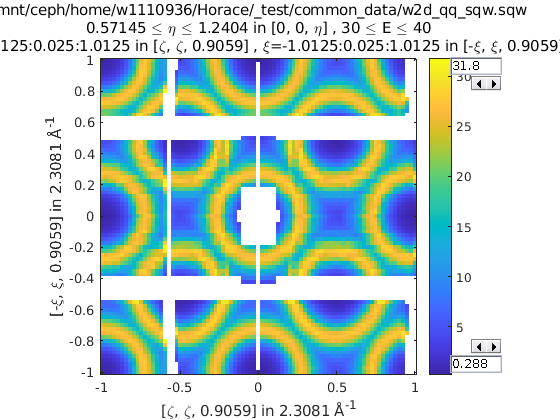
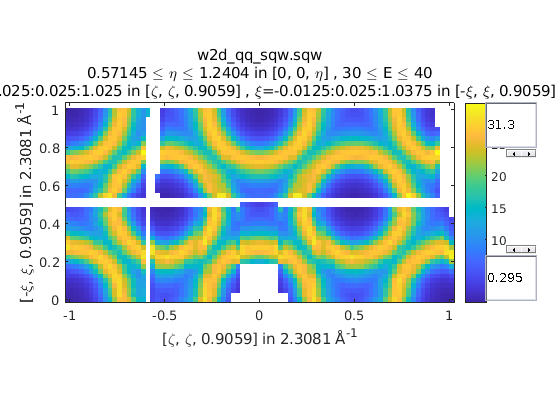
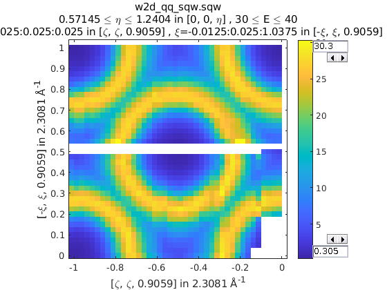
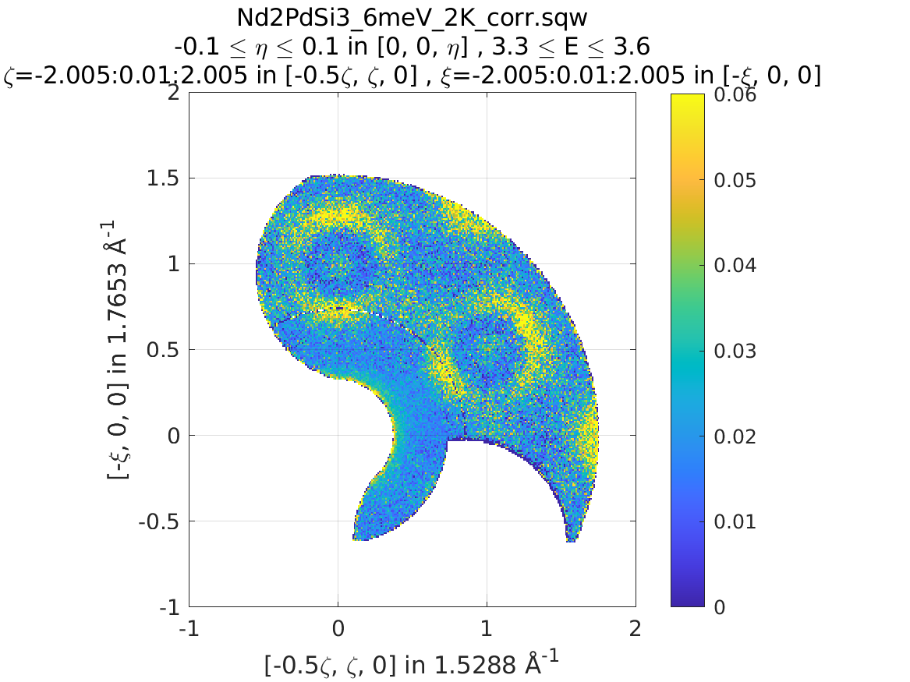
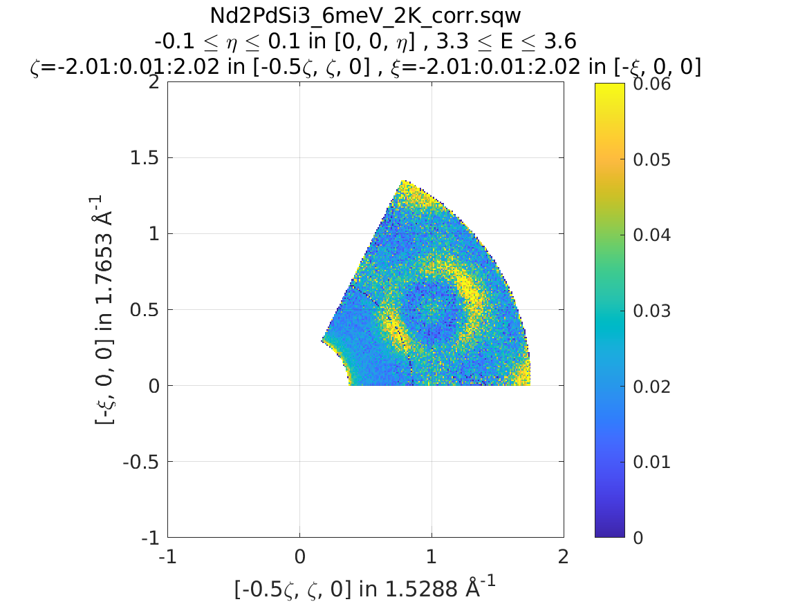
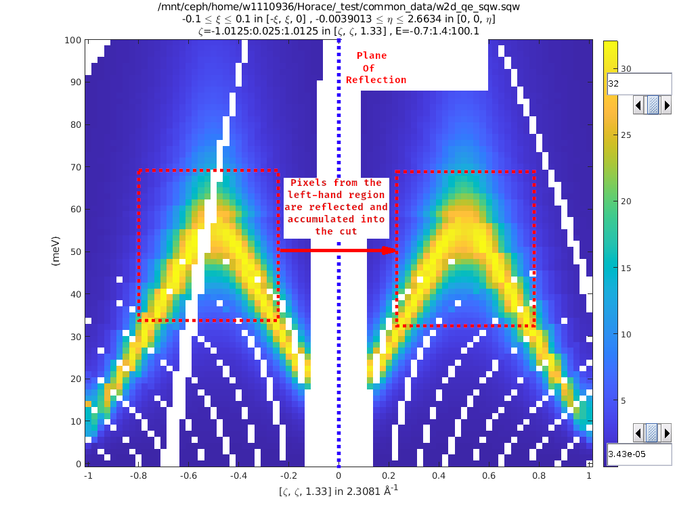
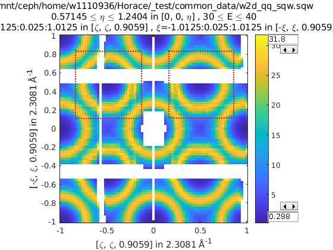
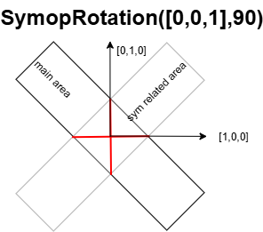

###################
Symmetry Operations
###################

.. |SQW| replace:: S(**Q**, :math:`\omega{}`)

Symmetry Operators
==================

Symmetry operators or "sym op"s define the transformation between sets of
symmetry related sets. In Horace these are implemented as the ``Symop`` class,
which is subclassed to represent the three basic forms of symmetry operations:

* ``SymopRotation``
  A rotation about an axis
* ``SymopReflection``
  A reflection across a plane  
* ``SymopGeneral``
  A general matrix transform which may be the product of a
  series of reflections and rotations

.. note::

   Symmetry operators are, by definition, non-scaling transformations and as
   such must have a determinant of ``1`` (Rotation) or ``-1`` (Reflection).

Rotations
---------

Rotations are implemented as the ``SymopRotation`` class and are defined by two
3-vectors and a scalar; these are the axis of rotation, the angle (in degrees)
of rotation and the centre of the transformation (the offset). Alternatively, instead of rotation axis, you may define 
rotation plane by two 3-vectors belonging to the rotation plane.
In addition, fully operational ``SymopRotation`` class
needs Busing-Levy ``B-matrix``, used to transform momentum transfer coordinates from ``rlu`` to Crystal Cartesian 
system of coordinates. Users do not need to set up this matrix in constructor as it will be transferred from an
input ``sqw`` object by every algorithm which uses symmetry operation, but if you want to test
rotation separately, you need to specify it to convert all values expressed in ``rlu`` into Crystal Cartesian. This is necessary 
as the pixels available within ``sqw`` object and are subject of a symmetry transformation are always expressed in Crystal Cartesian.

Horace have simple utility :math:`bm = bmatrix([a,b,c],[\alpha,\beta,\gamma])` which builds
``B-matrix`` for Horace coordinate system using known lattice parameters,
namely :math:`[a,b,c]` -- lengths of cell edges and :math:`[\alpha, \beta,\gamma]`
-- angles between them.

The constructors for a ``SymopRotation`` has the following forms:

.. code-block:: matlab

   >> sym = SymopRotation([0 0 1], 60, [0 0 0]); % Rotation of 60 degrees about the Z axis
   >> sym = SymopRotation([1 0 0],[0 1 0] 60, [0 0 0]); % the same but providing two vectors in rotation plane.
   >> sym = SymopRotation(__,[b_matrix],["cc"|"rlu"]); % full constructor for rotation above.

Zero offset value can be omitted.
As ``SymopRotation`` is a fully serializable object, you may construct it using key-value pairs, defining ``SymopRotation`` properties 
or add them in random order after some positional parameters described above have been defined.
The names of its properties are: 

+----------------------+-----------+------------------------------------------------------------------+
| property             | value     | meaning                                                          |
+======================+===========+==================================================================+
| ``normvec``          | 3x1 vector| rotation axis aka. normal to the rotation plane. Input units may |
|                      | in ``cc`` | be ``cc`` or ``rlu``; output is always ``cc`` when b-matrix is   |
|                      |           | present.                                                         |
+----------------------+-----------+------------------------------------------------------------------+
| ``u``                | 3x1-vector| first vector in the plane. Always ``rlu``                        |
+----------------------+-----------+------------------------------------------------------------------+
| ``v``                | 3x1-vector| second vector in the plane. Always ``rlu``                       |
+----------------------+-----------+------------------------------------------------------------------+
| ``theta_deg``        | value     | rotation angle (degrees)                                         |
+----------------------+-----------+------------------------------------------------------------------+
| ``offset``           | 3x1-vector| location of the transformation origin. Always ``rlu``            |
+----------------------+-----------+------------------------------------------------------------------+
| ``b_matrix``         | 3x3       | Busing–Levy matrix defining transformation from ``rlu``          |
|                      | matrix    | to ``cc`` coordinate systems :math:`A^{-1}`                      |
+----------------------+-----------+------------------------------------------------------------------+
| ``input_nrmv_in_rlu``| `true` or | defines input units of ``normvec`` when the coordinate  system   |
|                      | `false`   | is non-orthogonal. Also accepts "rlu" or "cc" converting it to   |
|                      |           | to `true`|`false`                                                |
+----------------------+-----------+------------------------------------------------------------------+

The key-value form of constructor would have the form:

.. code-block:: matlab

   >> sym = SymopRotation('normvec',[0 0 1],'theta_deg',60,'offset',[1 0 0]...); 
   >> sym = SymopRotation('u',[0 0 1],'v',[1 0 0],'theta_deg',60,...);

where you can provide key-value pairs in random order and should not mix up definition of rotation plane using normal to it
with the definition which uses two in-plane vectors. (one random description will be chosen at the end).

One may notice additional parameter "cc" or "rlu" provided to the constructor and setting up the internal property ``input_nrmv_in_rlu``
to true or false.
It is necessary and have to be provided if the lattice is non-orthogonal and you define rotation plane using normal vector to it. 
Directions of axis in Crystal Cartesian and ``rlu`` (``hkl``) coordinate systems coincide in orthogonal coordinate system but different 
in non-orthogonal. For example, the picture below shows non-orthogonal reciprocal coordinate system. If we want to do rotations in plane
:math:`\{[1,0,0](a^*);[0,1,0](b^*)\}` we need to define normal to it with blue vector :math:`[1,0,0]cc`. If you define rotation vector in
``rlu``, it will coincide with :math:`[0,0,1](c^*)` and actually defines different rotation plane.

Due to difficulties in defining desired ``normvec`` in non-orthogonal coordinate system, recommended method of defining rotation axis
in non-orthogonal system would be using ``u,v`` pairs in-plane vectors.

``SymopRotation`` also provides a convenience method for generating the
appropriate set of symmetry operations for cutting/reducing an n-Fold
rotationally symmetric dataset about an axis. This takes a scalar integer,
two 3-vectors defining the number of reductions (for an angle of ``360/nFold`` each
time) and the axis and offset of the rotation as above. If you lattice is non-orthogonal, you should
provide the coordinate system ("cc" or "rlu") the rotation vector is expressed in.

.. code-block:: matlab

   SymopRotation.fold(nFold, axis, offset)
   >> sym = SymopRotation.fold(4, [0 0 1], [0 0 0])   % Ready to cut from a 4-fold rotationally symmetric dataset about Z

   sym =

     4x1 cell array

       {1x1 SymopIdentity}
       {1x1 SymopRotation}
       {1x1 SymopRotation}
       {1x1 SymopRotation}

   >> celldisp(sym)

    celldisp(sym)
 
    sym{1} =
    Identity operator (no symmetrisation)

    sym{2} =
    Rotation operator:
          axis (cc): [0;0;1];     offset(rlu): [0;0;0]; angle(deg): 90.00;
    In-plane u(rlu): [1;0;0]; In-plane v(rlu): [0;1;0];
 
    sym{3} = 
    Rotation operator:
          axis (cc): [0;0;1];     offset(rlu): [0;0;0]; angle(deg): 180.00;
    In-plane u(rlu): [1;0;0]; In-plane v(rlu): [0;1;0];
 
    sym{4} = 
    Rotation operator:
          axis (cc): [0;0;1];     offset(rlu): [0;0;0]; angle(deg): 270.00;
    In-plane u(rlu): [1;0;0]; In-plane v(rlu): [0;1;0];

Reflections
-----------

Reflections are implemented as the ``SymopReflection`` class. As in the rotation, the 
reflection plane can be defined using two vectors in this plane or the normal vector to the plane.
You also need a vector which defines a point the plane passes through (the offset). Similarly to *Rotation*, you may add
``B-matrix`` to the list of arguments but this will be done by ``symop`` algorithms anyway. 

The constructor for ``SymopReflection`` for two vectors in plane is as follows:

.. code-block:: matlab

   >> sym = SymopReflection([1 0 0], [0 1 0]); % Reflection across the XY axis with 0 offset
   >> sym = SymopReflection([1 0 0], [0 1 0], [1 0 0]); % Reflection across the XY axis with offset
   >> sym = SymopReflection(__,b_matrix); 
   >> sym = SymopReflection('u',[1 0 0],'v',[0 1 0],'offset',[0 0 0]); % Reflection across the XY axis   

The form of the constructor above is historical and was used in Horace-3 as well. Unfortunately it is impossible to distinguish 
between ``SymopReflection`` without ``offset`` provided and ``SymopReflection`` with ``offset`` and rotation plane defined by 
normal vector to it. Because of that, if you want to define
reflection plane using normal vector to it, you have to use key-value pairs constructor:

.. code-block:: matlab

   >> sym = SymopReflection('normvec',[0,0,1],'offset',[0 1 0],["rlu"|"CC"]); % Reflection across the XY axis
   >> sym = SymopReflection(__,'b_matrix',b_matrix_value); %

The list of properties, available to ``SymopReflection`` is the same as for ``SymopRotation`` except ``theta_deg``
is naturally not available. 

.. note::

   For any ``Symop`` constructor the offset can be omitted and it will default
   to ``[0 0 0]``. In this case, ``B-matrix``, if necessary, should be provided as key-value pair:
   `b_matrix`,value

As with ``SymopRotation`` `u-v` vectors based constructor is recommended for usage when your lattice is non-orthogonal.

`Cutting`_ with ``SymopReflection`` and `Symmetrising`_ (see below) use this transformation for reflecting 
data from the half of the space separated by reflection plane into another half of the space. The target half-space 
is the area where the vector, built on the vectors, defining reflection plane according to right-hand rule is positive.

General Transformations
-----------------------

Generalised matrix transforms are implemented as the ``SymopGeneral`` class and
are defined by a 3x3 matrix and a 3-vector. These are the transform itself and
the offset. The constructor for a ``SymopGeneral`` is as follows:

.. code-block:: matlab

   SymopGeneral(matrix, offset)
   >> sym = SymopGeneral([0 1 0
                          1 0 0
                          0 0 1], [0 0 0]); % Reflection across y=x

.. warning::

   The matrix defining a ``SymopGeneral`` must have a determinant of ``1`` or
   ``-1`` or else this will result in an error.

It should be noted that it is possible to get the general transformation from
any of the other transformation types by applying the transform to the identity
(for which ``R`` is a convenience property), though this does not consider
offsets.

.. code-block:: matlab

   >> sym = SymopRotation([0 1 0], 90, [0 0 0]);
   >> sym.R

    ans =

        0.0000         0    1.0000
             0    1.0000         0
       -1.0000         0    0.0000

   >> sym.transform_vec(eye(3))

    ans =

        0.0000         0    1.0000
             0    1.0000         0
       -1.0000         0    0.0000

Groups of symmetry operators
----------------------------

For a more complex transformation involving a series of rotations and
reflections applied to single area of space, it is possible to construct an array 
of transformations to be applied in sequence (as a series of pre-multiplications,
i.e. applied in the reverse order of the list).

.. code-block:: matlab

   % Rotate 90 deg about X, Reflect across X, Rotate back 90 deg about X
   >> big_sym = [SymopRotation([1 0 0], 90), SymopReflection([0 1 0], [0 0 1]), SymopRotation([1 0 0], -90)];
   
.. note::

  The group of symmetry operations can have only one offset. You may provide it with only one symmetry in the group,
  but code will propagate it to all group's transformations. For example, the expression: ``[SymopRotation([1 0 0], 90,[1,0,0]), SymopReflection([0 1 0], [0 0 1])]`` is equivalent to: ``[SymopRotation([1 0 0], 90,[1,0,0]), SymopReflection([0 1 0], [0 0 1],[1,0,0])]``, Attempt to give different offsets to different operations,
  e.g. ``[SymopRotation([1 0 0], 90,[1,0,0]), SymopReflection([0 1 0], [0 0 1],[0,1,0])]``; will fail.
  Use cellarray of symmetry transformations to allow different offsets and apply symmetries to different areas of the object.

Irreducible region
------------------

``Symop`` transformations on pixels take what we call the irreducible region
into account when transforming. The irreducible region exists to ensure that
symmetry reductions reduce the data, rather than mapping the data across the
symmetry transformation.

.. warning::

   This is currently only defined for ``SymopReflection`` and ``SymopRotation``
   (which is why ``SymopGeneral`` is not currently permitted for symmetric
   reductions).

The irreducible region for ``SymopReflection`` is defined as the the positive
half-volume with respect to the normal vector of the plane of
reflection. Mathematically this is defined as:

.. math::

   \lbrace{}\vec{q} \in{} Q ~|~
   \vec{q} \cdot{} (\vec{u}\times{}\vec{v}) > 0 \rbrace{}

where :math:`Q` is the set of coordinates to be transformed and :math:`\vec{u}`
and :math:`\vec{v}` are the vectors defining the plane of reflection.

The irreducible region for ``SymopRotation`` is defined as the wedge bounded in
the upper-right (positive) quadrant in the q-coordinate space by the planes
defined by the absolute (relative to the q-coordinates) x-axis and the axis of
rotation; and the transformed x-axis and the axis of rotation.

.. note::

    In the special case of rotation about the x-axis, the y-axis is used to
    define the wedge instead of the x-axis.

Mathematically, this is defined as:

..
    For any **u** not parallel to **n** and **v** = **R** ``*`` **u**; The planes defined by **UN**, **VN** encapsulate the
    reduced region, and thus any coordinate **q** from **{Q}** where ``q*(n x u) > 0 && q*(v x n) > 0`` belong to the
    irreducible set in the upper right quadrant.

.. math::

   \lbrace{}\vec{q} \in{} Q ~|~
   \vec{q} \cdot{} (\vec{n} \times{} \vec{u}) > 0 \wedge{} \vec{q} \cdot{} (\vec{v} \times{} \vec{n}) > 0 \rbrace{},
   \textrm{where}~~ \vec{u}, \vec{n} \textrm{ and } \vec{v} \textrm{ are not co-planar}

where :math:`Q` is the set of coordinates to be transformed, :math:`\vec{n}` is
the axis of rotation, :math:`\vec{u}` is the x- (or y-) axis (as above) and
:math:`\vec{v}` is the transformed :math:`\vec{u}`.

.. note::

   For an angle > 90 degrees or folds < 4, this will cover the positive quadrant
   and some of a negative domain.

Examples of irreducible zones for ``SymopReflection`` and ``SymopRotation`` are presented on the picture below:

Commands for cuts and slices
============================

In Horace it is possible to symmetrise by 3 methods:

* symmetrise whole |SQW| objects using ``symmetrise_sqw``
* symmetrise and extract subsets of |SQW| objects using ``cut``
* equivalently to ``cut`` with symmetry, it is possible to use
  ``symmetrise_sqw`` and then ``cut``

.. note::

   While ``symmetrise_sqw`` then ``cut`` is possible, it is not recommended
   unless the intermediate symmetrised |SQW| is required. This approach has the
   overhead of transforming all pixels in |SQW|, while ``cut`` has optimisations
   to transform only those that might contribute to the result.

.. warning::

   Symmetrisation maps the pixels outside the `irreducible region`_ into their
   respective symmetry related sites. This means that subsequent binning/cutting
   of the ``sqw`` object will see these pixels as being on the symmetry related
   site rather than their original location.

   Symmetrising an |SQW| is an irreversible operation and overwriting saved
   ``.sqw`` files may lead to loss of information.

Symmetrising
============

``symmetrise_sqw``
------------------

It is possible to reduce an entire dataset at once by symmetry, transforming all
pixels according to the symmetry operations and accumulating the transformed
pixels into the bins appropriately. This is done through the ``symmetrise_sqw``
function, the signature for which is below:

.. warning::

   Due to restrictions related to the `irreducible region`_, ``symmetrise_sqw`` is
   only defined for ``SymopReflection`` and ``SymopRotation`` and **NOT** for
   ``SymopGeneral``.

.. code-block:: matlab

   >> w1 = sqw(data);

.. code-block:: matlab

   >> sym = SymopReflection([0 0 1], [1 1 0]); % Reflect about X-axis
   >> w2 = symmetrise_sqw(w1, sym);

We can also combine symmetry operations:

.. code-block:: matlab

   sym = SymopReflection([0 0 1], [1 1 0]);
   sym2 = SymopReflection([0 0 1], [-1 1 0]);
   sym_comb = [sym, sym2];
   w2 = symmetrise_sqw(wa, sym_comb);

It is also possible to reduce data through a rotationally symmetric operation:

.. code-block:: matlab

   % Perform a 6-fold rotational reduction about Z
   % The resulting wedge with be a 60 degree segment
   >> w1 = sqw(data);

A ``SymopRotation`` maps pixels into the `Irreducible region`_)

.. code-block:: matlab

   >> sym = SymopRotation([0 0 1], 60);
   >> w2 = symmetrise_sqw(w1, sym);

.. note::

   Equally we could have folded the data through:

   .. code-block:: matlab

      >> sym = SymopRotation.fold(6, [0 0 1]); % Same as above
      >> w3 = symmetrise_sqw(w1, sym);

   And they would be equivalent

   .. code-block:: matlab

      >> equal_to_tol(w2, w3);

      ans =

         logical

         1

``gen_sqw``
-----------

.. _gen_sqw:

If you need to symmetrise a large ``sqw`` object, it can also be done during
``sqw`` generation, i.e. during generation of the ``sqw`` file, rather than
after the object has been created. The ``gen_sqw`` function has a special option
``transform_sqw`` which can be used with any method, transforming an |SQW| at
generation time.

For example:

.. code-block:: matlab

   sym = SymopReflection(v1, v2, offset);
   gen_sqw (spefile, par_file, sym_sqw_file, efix, emode, alatt, angdeg,...  u, v, psi, omega, dpsi, gl,
            gs, 'transform_sqw', @(x)(symmetrise_sqw(x,sym)))

or, more generally:

.. code-block:: matlab

   gen_sqw (spefile, par_file, sym_sqw_file, efix, emode, alatt, angdeg,...  u, v, psi, omega, dpsi, gl,
            gs, 'transform_sqw', @user_symmetrisation_routine)

where ``spefile``, ``par_file``, etc... are the options used during initial
``sqw`` file generation (see :ref:`Generating SQW files
<manual/Generating_SQW_files:Generating SQW files>`).  The first ``gen_sqw``
would build a ``.sqw`` file reflected as in the example for the reflection
above. In the second, more general, case the user defined function (in a
``.m``-file on the Matlab path) can define multiple symmetrisation operations
that are applied sequentially to the entire data. An example is as follows,
which folds a cubic system so that all eight of the symmetrically equivalent
regions are folded onto each other:

.. code-block:: matlab

   function wout = user_symmetrisation_routine(win)

   %fold about line (1,1,0) in HK plane
   wout = symmetrise_sqw(win, SymopReflection([1,1,0], [0,0,1]));
   %fold about line (-1,1,0) in HK plane
   wout = symmetrise_sqw(wout,SymopReflection([-1,1,0],[0,0,1]));
   %fold about line (1,0,1) in HL plane
   wout = symmetrise_sqw(wout,SymopReflection([1,0,1], [0,1,0]));
   %fold about line (1,0,-1) in HL plane
   wout = symmetrise_sqw(wout,SymopReflection([1,0,-1],[0,1,0]));

   end

.. warning::

   When defining the function to apply the symmetrisation (as above) one can
   only use symmetry operations supported by ``symmetrise_sqw``. Any other
   transformations may modify the data ranges in unexpected ways, making the
   resulting transformed *sqw* file into complete nonsense!

.. note::

   Due to a quirk in MATLAB's function loading, in order to work with parallel Horace
   (c.f. :ref:`manual/Parallel:Running Horace in Parallel`) it is necessary that
   the symmetrisation function is in the same folder as the generation script.

..
   MPI workers are normal Matlab sessions which inherit basic Matlab path and
   initiate Horace themselves if the Horace path is not stored by the user (It's
   not usually recommended and may be impossible for multiuser machines). The
   workers do not process Matlab's ``startup.m`` file. The user's symmetrisation
   routine has to be available on the worker's Matlab path. The best way to
   achieve this is to put the routine into current Matlab working folder -- the
   folder from which you run the symmetrisation. If this routine uses some
   additional user functions, located elsewhere on a custom user path, these
   routines have to be initialised by the user routine. This can be achieved by
   the following piece of code added to the beginning of your custom
   symmetrisation routine:

.. code-block:: matlab

   if isempty(which('my_additional_user_routine'))
       addpath('/home/myFedID/path_to_my_additional_user_routine');
   end

Alternatively with an array of ``Symop`` objects this could be done in one step
as:

.. code-block:: matlab

   sym = [SymopReflection([1,1,0], [0,0,1])
          SymopReflection([-1,1,0],[0,0,1])
          SymopReflection([1,0,1], [0,1,0])
          SymopReflection([1,0,-1],[0,1,0])];
   gen_sqw (spefile, par_file, sym_sqw_file, efix, emode, alatt, angdeg,...  u, v, psi, omega, dpsi, gl,
            gs, 'transform_sqw', @(x)(symmetrise_sqw(x,sym)))

Cutting
=======

In order to do a symmetrised cut, the ordinary ``cut`` function (see
:ref:`manual/Cutting_data_of_interest_from_SQW_files_and_objects:cut`)
is used with the appropriate symmetry operations additionally passed into the
function as an argument after the bin axes specification (see example
below). The ``cut`` operation will then use the symmetry operations to compute
the transformations of the given projection, accumulate the
symmetrically-related pixels into the primary binning axes (the cut region
specified in the ``cut`` operation) and transform their pixel coordinates
according to the symmetry operations as though the |SQW| had been symmetrised.

.. code-block:: matlab

   >> w1 = sqw(data);

   % Take 2D cut from w1
   >> sym = SymopReflection([0 1 0], [0 0 1]);
   >> w3 = cut(w1, ortho_proj([1 0 0], [0 1 0]), [0.2 0.1 0.8], [32 2 70], [-inf inf], [-inf inf], sym)

   Representation of ``w3``'s cut.  The primary axes are within the
   rectangle specified by the two corners (0.2,32) and (0.8, 70). The reflection
   about the Y-axis captures the data in the region between (-0.2, 32) and
   (-0.8, 70) which are transformed by the symmetry operation into the primary
   axes and accumulated into the cut.

.. code-block:: matlab

   w = sqw(...)

.. code-block:: matlab

   wout = cut(w, ...);

.. code-block:: matlab

   % 2 cuts (identity always included), 2 quadrants
   sym = {SymopReflection([1 1 0], [0 0 1])}
   wout = cut(w, ...);

.. code-block:: matlab

   % 3 cuts, 3 quadrants
   sym = {SymopReflection([1 1 0], [0 0 1]), ...
          SymopReflection([-1 1 0], [0 0 1])}
   w_out = cut(w, ..., sym)

.. code-block:: matlab

   % Cut all 4 quadrants and combine
   sym = {SymopReflection([1 1 0], [0 0 1]), ...
          SymopReflection([-1 1 0], [0 0 1]), ...
          [SymopReflection([1 1 0], [0 0 1]), ...
           SymopReflection([-1 1 0], [0 0 1])]}
   w_out = cut(w, ..., sym)

.. _single-transform-note:

.. Note::

    By design, you may apply only single symmetry transformation to pixels within a cut. Its done intentionally, to avoid double counting and wrong statistics in cases like the image below, where you cut with ``SymopRotation`` by 90deg with a command like: ``w2 = cut(an_sqw,line_proj([-1,1,0],[-1,-1,0]),[-2,0.01,2],[-0.2.0.01,0.2],[],[],SymopRotation([0,0,1],90)`` and do not want to count pixels contributed into red-crossed area twice.

The consequence of this feature is that you can not make cut which will do two transformations on the same pixels. E.g. 
If you need this, you have to perform two cuts or
build your own generic transformation with symmetry, as described in :ref:`Generic Transformations. <sqw-op-bin-pixels-algorithm>`
   

Combining
=========

.. code-block:: matlab

   wout=combine_sqw(win)

Combine two ``sqw`` objects (``w1`` and ``w2``) of the same dimensionality into
a single ``sqw`` object in order to improve statistics.

.. note::

   The output object will have a combined value for the integration range
   e.g. combining two 2d slices taken at L=1 and L=2 will result in an output
   for which the stated value of L is L=1.5.

.. note::

   Two objects which use different projection axes can be combined. The output
   object will have the projection axes of ``w1``.

Rebinning
=========

Resize the bin boundaries along one or more axes, and rebin the data
accordingly. There are several possibilities for the input format:

.. code-block:: matlab

   wout = rebin_sqw(win,step1,step2,...)

Rebin the sqw object ``win`` with bins along the first axis that have width
``step1``, bins along the second axis (if there is one) with width ``step2``,
and so on. The original limits of the axes will be retained. To leave an axis
unaltered, the corresponding step argument can be set to 0.

.. code-block:: matlab

   wout = rebin_sqw(win,[lo1,step1,hi1],[lo2,step2,hi2],...)

As above, but specifying new upper and lower limits along each of the axes to be
rebinned.

.. code-block:: matlab

   wout = rebin_sqw(win,w2)

Rebin the sqw object ``win`` with the boundaries (and projection axes) of the
template object ``w2``.

.. Note:

   ``rebin_sqw`` in fact is interface to ``cut(win,[lo1,step1,hi1],[lo2,step2,hi2],...)`` providing
   different ways of supplying bin ranges to the ``cut``.

Symmetrise data, then unfold back to original range
===================================================

.. warning::

   For producing plots only, any analysis on these results will be invalid due to
   multiple counting of data.

Below we show a script that uses the ``symmetrise_sqw`` and ``combine_sqw``
commands to reduce a dataset and then unfold it. In the example we have a
constant energy slice in the (h,k)-plane which we reduce twice to obtain the
positive quadrant. We then reflect the result in the opposite direction and
combine with the positive quadrant, then reflect this and combine. This produces
an image which covers all four quadrants of the original with the reduced
dataset (thereby increasing the counts four-fold).

.. code-block:: matlab

   %The original data
   proj2 = ortho_proj([1,0,0], [0,1,0]);
   hkplane = cut_sqw(sqw_file,proj2,[-2,0.05,2],[-2,0.05,2],[-0.05,0.05],[13,16]);
   plot(smooth(d2d(hkplane)));

   %Fold twice to get into a quadrant. Note order of vectors
   sym = [SymopReflection([0,0,1],[0,1,0])
          SymopReflection([1,0,0],[0,0,1])];
   fold2 = symmetrise_sqw(hkplane,sym);

   %Check the result
   plot(smooth(d2d(fold2)));

   %Fold this back again (reverse order of vectors in first fold)
   sym = SymopReflection([0,1,0],[0,0,1]);
   fold2a = symmetrise_sqw(fold2,sym);
   plot(smooth(d2d(fold2a)))

   %Combine with what you started with
   combi1 = combine_sqw(fold2,fold2a);
   plot(smooth(d2d(combi1)));

   %Fold back again (reverse order of vectors in second fold)
   sym = SymopReflection([0,0,1],[1,0,0]);
   fold3a = symmetrise_sqw(combi1, sym);
   plot(fold3a)

   %Combine and plot
   combi2 = combine_sqw(combi1,fold3a);
   plot(smooth(d2d(combi2)));

..
   Correcting for magnetic form factor
   -----------------------------------

   Horace allows basic correction of scattering intensity from simple ions by
   adjusting it by the magnetic form factor according to formulas provided in
   International Tables of Crystallography, Vol C. (see, for example `here
   <https://www.ill.eu/sites/ccsl/ffacts/ffachtml.html>`__)

   The class ``MagneticIons`` contains the tables of fitting parameters, used to
   calculate changes in scattering intensity due to changes in magnetic form
   factor and defines the method ``correct_mag_ff``, which takes an ``sqw``
   object as input and returns a similar object, with intensities adjusted by
   the magnetic form factor:

   .. code-block:: matlab

      mff = MagneticIons('Fe0');
      w2_fixed = mff.correct_mag_ff(w2);

   Where 'Fe0' is the name of the ion for which the magnetic form factor is
   calculated.

   .. warning::
      This method should be applied only once.

   The auxiliary ``MagneticIons``'s method ``IonNames`` returns the cell array
   of ion names, which are currently tabulated in Horace and for which
   scattering can be corrected using the expression above. Additional
   ``MagneticIons`` methods ``calc_mag_ff`` and ``apply_mag_ff`` allow one to
   calculate magnetic form factor on or apply magnetic form factor to the
   dataset provided.

..
   Regarding #1447: should we reimplement `combine_equivalent_zones`,
   see the file "symmeterize_equivalent_zones_description.bak_Re#1447"
   in this folder.

Limitations
===========
* At present ``symmetrise_sqw``, ``combine_sqw``, and ``rebin_sqw`` work ONLY
  for sqw objects, since they require access to individual detector pixel
  information. The functions will work for any dimensionality of object,
  however.
  
* As described :ref:`above <single-transform-note>`, ``cut`` with symmetry operations can apply
  only one symmetry transformations to pixels within a symmetry-related area. 
  Pixels from overlapping parts of symmetry related areas are transformed only once. Secondary 
  symmetry transformations over the same pixels have to be performed by another ``cut`` with 
  symmetries, or by writing a :ref:`generic transformation. <sqw-op-bin-pixels-algorithm>`

..
  Removed due to #1447

  * ``combine_equivalent_zones`` has to perform some memory and
  hdd-access intensive calculations, which should ideally be performed
  on a :ref:`high performance computing cluster
  <Download_and_setup:High Performance Computing Configuration>`_.

Symop Methods - Advanced
========================

``Symop`` objects have methods to transform a variety of objects which
may be related by symmetry. These are:

* ``transform_vec``
* ``transform_pix``
* ``transform_proj``

Which transform numeric vectors, ``PixelDataBase`` objects and `aProjection`
objects respectively.

``transform_vec``
-----------------

``transform_vec`` takes a 3xN list of 3-vectors to transform. This method can be
applied directly from a single ``Symop`` or from an array (but not cell array)
of ``Symop`` objects (see: `Groups of symmetry operators`_).

.. code-block:: matlab

    >> sym = SymopReflection([1 0 0], [0 1 0])

    sym = 
    Reflection operator:
    In-plane u(rlu): [1;0;0]; In-plane v(rlu): [0;1;0]
        offset(rlu): [0;0;0];   normvec (rlu): [0;0;1]
        
    >> sym.transform_vec([3; 6; 1])

    ans =
         3
         6
        -1

.. code-block:: matlab

    >> big_sym = [SymopRotation([1 0 0], 90), SymopReflection([0 1 0], [0 0 1]), SymopRotation([1 0 0], -90)];
                             %v1|v2|v3|v4|v5
    >> big_sym.transform_vec([1, 3, 5, 1, 3
                              2, 2, 4, 6, 1
                              6, 3, 1, 3, 6])

    ans =
        %v1'| v2'|  v3'|  v4'|  v5'
        -1    -3    -5    -1    -3
         2     2     4     6     1
         6     3     1     3     6
         
.. Note:

   If ``Symop`` has offset, its value is converted in Crystal Cartesian coordinate system and extracted
   before performing transformation. The offset value then added back to the symmetry-transformed values.
   To perform conversion properly, ``Symop``-s ``b_matrix`` property should be set-up. The algorithms extract
   this matrix from appropriate projection and set it up on used ``Symop``,
   but if you want to use ``transform_vec`` independently, the matrix have to be set-up
   manually. 

``transform_pix``
-----------------

``transform_pix`` takes a ``PixelDataBase`` derived object and transforms the
contained pixel q-coordinates according to the symmetry operations and returns a
new object with the transformed pixels.

.. note::

   ``transform_pix`` takes the ``Symop`` object's `Irreducible region`_ into
   account and does not transform the pixels which are considered to be within
   the irreducible region.

.. code-block:: matlab

   >> sym = SymopReflection([1 0 0], [0 1 0]);
   % 5 pixels in memory
   >> pix = PixelDataMemory(rand(9, 5));
   % Put pixels outside of "positive quadrant"
   >> pix.q_coordinates(:, [1 2]) = -pix.q_coordinates(:, [1 2]);
   >> pix_new = sym.transform_pix(pix);
   >> pix.data

   ans =

      -0.4898   -0.1190    0.6991    0.8143    0.8308 % q_x
      -0.4456   -0.4984    0.8909    0.2435    0.5853 % q_y
      -0.6463   -0.9597    0.9593    0.9293    0.5497 % q_z
       0.7094    0.3404    0.5472    0.3500    0.9172 % dE
       0.7547    0.5853    0.1386    0.1966    0.2858 % run_idx
       0.2760    0.2238    0.1493    0.2511    0.7572 % detector_idx
       0.6797    0.7513    0.2575    0.6160    0.7537 % energy_idx
       0.6551    0.2551    0.8407    0.4733    0.3804 % signal
       0.1626    0.5060    0.2543    0.3517    0.5678 % variance

   >> pix_new.data

   ans =

      -0.4898   -0.1190    0.6991    0.8143    0.8308 % q_x
      -0.4456   -0.4984    0.8909    0.2435    0.5853 % q_y
       0.6463    0.9597    0.9593    0.9293    0.5497 % q_z
       0.7094    0.3404    0.5472    0.3500    0.9172 % dE
       0.7547    0.5853    0.1386    0.1966    0.2858 % run_idx
       0.2760    0.2238    0.1493    0.2511    0.7572 % detector_idx
       0.6797    0.7513    0.2575    0.6160    0.7537 % energy_idx
       0.6551    0.2551    0.8407    0.4733    0.3804 % signal
       0.1626    0.5060    0.2543    0.3517    0.5678 % variance

``transform_proj``
------------------

``transform_proj`` is used to transform subclasses of the ``LineProjBase``
type and check and modify input symmetry operations into the form, corresponding to this projection,
including setting up ``B-matrix`` used for correct ``offset``-s interpretation. 
It is an internal function which creates a new ``line_proj`` with the
symmetries applied and is not normally needed by users, but is recorded here for
completeness.
