###############
Getting started
###############

In order to get going with Horace we suggest that you take a little time to
familiarise yourself with the program. To aid this we have created the following
step-by-step guide that takes you through the process of converting SPE files
into a format useable by Horace, and then shows you how to do different kinds of
plot, how to manipulate your data, and finally how to simulate and fit your
data. To do this we will refer to the demonstration files included in

::

   C:\mprogs\Horace\demo\

which relate to a real experiment to investigate spin excitations in Fe using
the MAPS spectrometer at ISIS.

Before starting you must first run the ``setup_demo_data`` function from the
``demo`` folder which will take a few minutes to generate a number of ``.nxspe``
files which will be used during the demo.

Creating an SQW file
====================

The first step in using Horace is to make your dataset from all of your relevant
SPE files. How this works depends somewhat on the properties of your computer,
specifically the amount of memory available, and is dealt with
:ref:`here<introduction/Download_and_setup:System Requirements>`.

On most machines (those with <10GB RAM) the dataset is written to a new file
with the extension ``.sqw``, and intermediate ``.tmp`` files, which contain axes
projection information, are written as Horace combines the data.

Once you have created your ``.sqw`` file and are happy with it then you can delete
these intermediate ``.tmp`` files, although it is generally a good idea to keep
for a few days them unless disk space is a problem, in case you wish to
re-generate your ``.sqw`` file.

For cases where large amounts of memory are available then the creation of
``.tmp`` files can be unnecessary and the ``.sqw`` file can be created directly (see
:ref:`advanced use <user_guide/Advanced_use:Advanced use>`).

.. note::

   If you have an old-style data file, in addition to your data there is one
   other file that is required -- the parameter (``.par``) file for the
   instrument that you used to collect the data.  This file has the extension
   ``.par``, and is not the same as a ``.phx`` file. For more recent ``.nxspe``
   files, this is included in the ``.nxspe`` itself.

   The ``.par`` file for the instrument you used to generate your data can be
   obtained from the instrument scientist. It is important that you have the
   correct version of this file for the configuration of the instrument as it
   was when you used it (much like for the ``.phx`` file).

.. warning::

   If you try to use a ``.phx`` file with Horace you will just get an error
   message!

Example
-------

Let's now run through a simple example. To do this we'll need some example
``.spe`` files and a ``.par`` file. The script file containing all of the
commands described below is located in:

.. warning::

   This example goes through using old-style ``.spe`` files, you may not need to
   provide a separate ``.par`` file for your experiment, in which case the
   ``par`` argument can be left as the empty string (``''``).

::

   C:\mprogs\Horace\demo\demo_make_sqw_fe.m

First we need to tell Horace where the ``.spe`` files are, so we write:

::

   indir = 'C:\mprogs\Horace\demo\';

We also need to know where the ``.par`` file is, and where the ``.sqw`` file that
we're making is going to go:

::

   par_file = 'C:\mprogs\Horace\demo\demo_par.par';
   sqw_file = 'C:\mprogs\Horace\demo\demo_fe_sqw.sqw;'

Next we need to specify the (fixed) incident energy that was used and the
geometry of the spectrometer. In this case all of the data were taken using
:math:`E_{i} = 787 \textrm{meV}` on a direct geometry spectrometer, so we have:

::

   efix = 787;
   emode = 1;

If we were using an indirect geometry spectrometer then we would have written

::

   emode = 2;

We cannot combine data from different spectrometers, so ``emode`` is always
either 1 or 2.

If we had used multiple incident energies then we would have made ``efix`` a
vector whose length was the number of ``.spe`` files we wish to combine and
whose elements were the incident energy for each ``.spe`` file.

We now need to tell Horace the lattice parameters of the sample:

::

   alatt = [2.87, 2.87, 2.87];
   angdeg = [90, 90, 90];

- ``alatt``, which can be a row vector or a column vector, gives the lattice
  parameters :math:`a`, :math:`b`, and :math:`c`.

- ``angdeg``, which can also be a row vector or a column vector, gives the
  lattice angles :math:`\alpha`, :math:`\beta`, and :math:`\gamma`.

Then we need to specify the orientation of the crystal with respect to the
incident beam and the spectrometer. We do this by specifying the scattering
plane with two orthogonal vectors:

::

   u = [1, 0, 0];
   v = [0, 1, 0];

The vector :math:`\vec{u}` defines the direction in the :math:`[h,k,l]` frame of
the incident beam (so in the above example the crystal's :math:`[1,0,0]`
direction is parallel to the incident beam). The vector :math:`\vec{v}` may be
perpendicular to :math:`\vec{u}` (although it does not have to be) and lies in
the equatorial plane of the spectrometer (i.e. the horizontal plane on MERLIN
and MAPS). Thus the cross product of :math:`\vec{u}` and :math:`\vec{v}` should
point up/down the sample stick.

If after your experiment you realise that your crystal was not aligned how you
thought it was, all is not lost! Horace allows you to specify some virtual
goniometer angles which tell the program how to convert the supplied (incorrect)
co-ordinate frame :math:`\vec{u}` and :math:`\vec{v}` to the real one. Of course
you should make every effort to ensure your sample was correctly aligned, in
which case you write

::

   omega = 0;
   dpsi = 0;
   gl = 0;
   gs = 0;

The definitions of these angles are best described with reference to the picture
below:

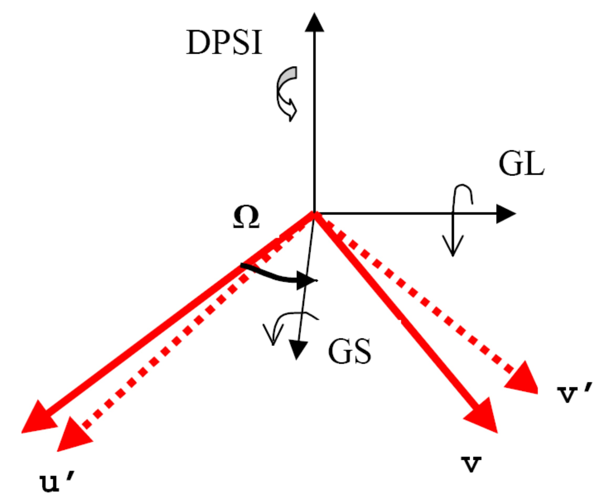

In this diagram the nominal vectors :math:`\vec{u}` and :math:`\vec{v}` are
those supplied to Horace, whereas :math:`\vec{u'}` and :math:`\vec{v'}` are the
actual vectors. ``gl`` and ``gs`` deal with misorientation about axes which lie
in the spectrometer's equatorial plane, whereas ``dpsi`` deals with
misorientations about a vector perpendicular to this plane. ``omega`` is the
angle by which the ``gs`` axis is rotated compared to the nominal vector
:math:`\vec{u}`.

In principle this means that you could put a single crystal with unknown
orientation into the spectrometer and conduct your experiment. However this is
not a good idea, because the direction about which you rotate your crystal may
not be optimal for you to get all of the data that you want to, since the
detectors do not cover :math:`4 \pi` steradians.

Now we've told Horace about the setup of the spectrometer we can go on to
specify how our experiment was conducted and which ``.spe`` files will
contribute to our dataset.

Suppose, as is the case here, we want to combine 24 ``.spe`` files, and that the
angle ``psi`` was different for each one. ``psi`` is a vector, which in this case
has 24 elements. We could write it out explicitly, however in our example we
took data in equal steps of psi between 0 degrees and -23 degrees (1 degree
steps), so we can use a Matlab trick:

::

   nfiles = 24;
   psi = linspace(0,-(nfiles-1),nfiles);

Horace needs to know the name of all 24 ``.spe`` files. To do this they are
combined into a single object -- a cell array, which is a Matlab data format you
can read about in the Matlab help. In this case each element of the cell array
is a string which specifies the location of our ``.spe`` files. We could write
this out explicitly, however in this example the ``.spe`` files are numbered
sequentially, so we can take another shortcut:

::

   spe_file=cell(1,nfiles);
   for i=1:length(psi)
       spe_file{i}=[indir,'MAP',num2str(11012+(2*i)),'.SPE'];
   end

.. warning::

   Filenames are case-insensitive on Windows, but will be case sensitive on \*NIX
   machines.

The first line creates an empty cell array the right size to take our 24 file
strings. Inside the ``for`` loop the ``i`` th element of the cell array is a string
specifying where the ``i`` th ``.spe`` file is located. So the 5th element of the cell array
``spe_file`` is:

::

   spe_file{5} = 'C:\mprogs\Horace\demo\demo_data\MAP11022.SPE';

We are now ready to make our ``.sqw`` file! This is done by a single function:

::

   gen_sqw(spe_file, par_file, sqw_file, efix, emode, alatt, angdeg, u, v, psi, omega, dpsi, gl, gs);

If everything has worked then the Matlab command window will show text like
this, which will be updated when each successive ``.spe`` file is read from the
disk.

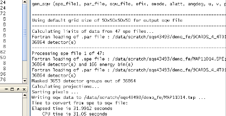

.. note::

   The above screenshot was created when processing a larger number of files
   from the same dataset as has been used for this demo. The only practical
   difference this makes is to the size of errorbars in 1d cuts, the time taken
   to process the data, and some of the on-screen printouts.

Further through the process you should see something like this:

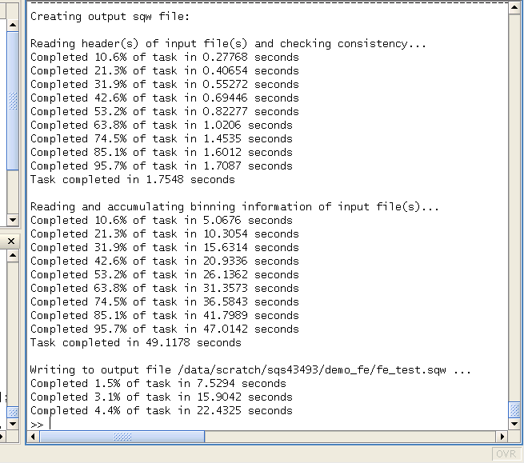

.. note::

   This was run on a Linux machine, hence the different style of
   directory name and appearance of the Matlab window.

Horace will now run for some time generating the ``.sqw`` file. This can be quite a
long time, and depends quite a lot on how much memory your computer has and its
processor speed.

.. warning::

   It is probably best at this stage just to leave your computer to run and go
   for a coffee!

.. note::

   As a rough guide: 150 ``.spe`` files, each of 105MB, would be combined on a
   machine with 4GB of RAM (with its :ref:`3GB switch enabled
   <introduction/Download_and_setup:System Requirements>`) and a speed of 2.5GHz
   in about 2 hours.

For this demo the data files have purposely been made much smaller (by using
only the low angle detector banks on MAPS, and by only including a limited
number of energy bins in the ``.spe`` files). Each ``.spe`` file is about 18MB,
and thus it takes about 8 minutes to process all of the data. If all is well
messages will be frequently printed to the Matlab command window to let you know
the status of your ``.sqw`` file generation.

Data visualisation
==================

Now that we've made our ``.sqw`` file the next step is to see what the data look
like. The first thing to do is to tell the program where the ``.sqw`` file is
located:

::

   data_source = 'C:\mprogs\Horace\demo\demo_fe_sqw.sqw';

which is of course the location of the ``.sqw`` file we created in the previous
section.

Now we have to define the projection axes for our data visualization. The
projection information is contained in a data object, which in this case we are
calling ``proj_100``. These are chosen to define the normalization (so they must
be unit vectors). There are also other pieces of information that can be
provided about the projection, but these will be dealt with later. So we have:

::

   proj_100 = line_proj([1, 0, 0], [0, 1, 0]);

You can choose any set of axes to make cuts and visualise your data - you are
not limited to the projection axes of the crystal with respect to the
spectrometer.

.. note::

   This is one of the main advantages of using Horace to visualise your data!

..
   Another piece of projection information that we need to know is whether the
   projection axes are normalised in Angstroms or reciprocal lattice units. There
   are 3 letters (for the 3 projection axes, the third of which is the cross
   product of the other two), ``'r'`` is used for reciprocal lattice units and
   ``'a'`` is used for angstroms.

   ::

      proj_100.type='rrr';

Finally, we need to know if we are defining our projection axes relative to some
offset. This vector has 3 or 4 components, since we could offset in energy as well as
the 3 components of Q:

::

   proj_100.offset=[0,0,0,0];

   %OR

   proj_100 = line_proj([1, 0, 0], [0, 1, 0], [0, 0, 0, 0]);

We now have all the information needed to make any kind of cut we like. Let's
start by making a 2D slice:

::

   w100_2 = cut(data_source, proj_100, [-0.2, 0.2], 0.05, [-0.2, 0.2], [0, 0, 500]);

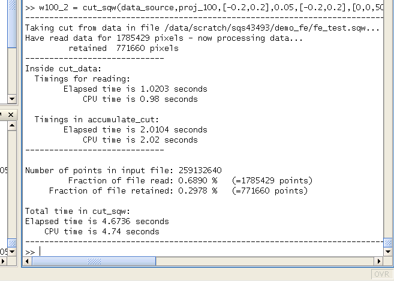

This slice has as its axes :math:`[0,1,0]` and energy. The first two arguments in the
function ``cut_sqw`` are where the data is on the computer, and the details of
the projections.

The next four arguments give either the integration range or the step size of
each component of **Q** and energy.

In this example we are integrating between :math:`-0.2` and :math:`0.2`
r.l.u. in the :math:`[1,0,0]` component, and between :math:`-0.2` and
:math:`0.2` in the :math:`[0,0,1]` component.

The slice axes are :math:`[0,0,1]` whose step size is :math:`0.05` r.l.u., and
energy whose step size is the existing step size in the file.

Notice that we've specified the energy step size differently from the
:math:`[0,0,1]` step size. If a scalar is used then the whole range of data
along that axis will be plotted. If a vector of the form [low,step,high] is used
then only data within the range low -> high will be plotted, with step size
given by ``step`` (c.f. :ref:`cutting <manual/Manipulating_and_extracting_data_from_SQW_files_and_objects:cut>`).

This creates a new object containing that particular slice of data. To plot it,
we write:

::

   plot(w100_2);

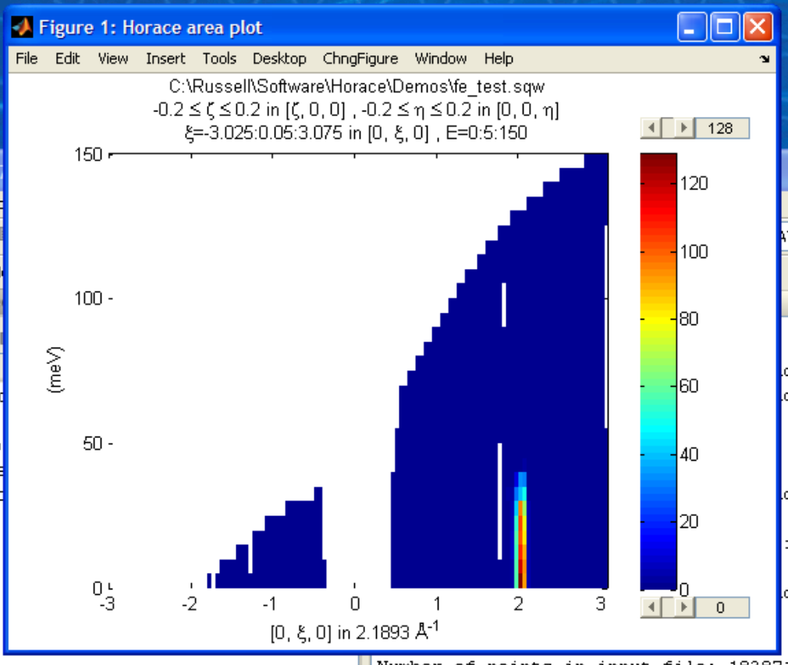

The ranges of the axes are not quite right, but we can easily change that:

::

   lx 1 3 ly 0 150 lz 0 1

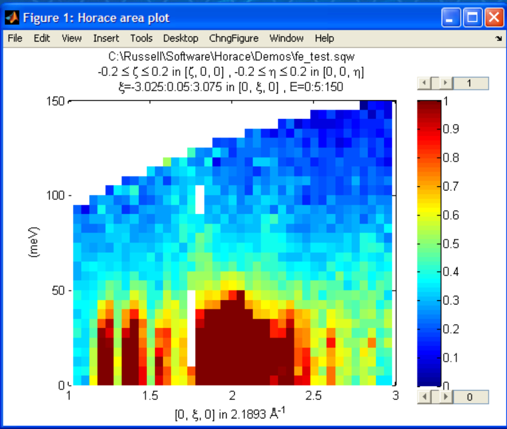

This makes the horizontal axis go from 1 to 3, the vertical axis from 0 to 150,
and the colour scale go from 0 to 1.

If we wanted to make a 1D cut through the data then the syntax is exactly the
same. For example:

::

   w100_1 = cut(data_source, proj_100, [-0.2, 0.2], 0.05, [-0.2, 0.2], [60, 70]);
   plot(w100_1);
   lx 1 3 ly 0.2 0.8

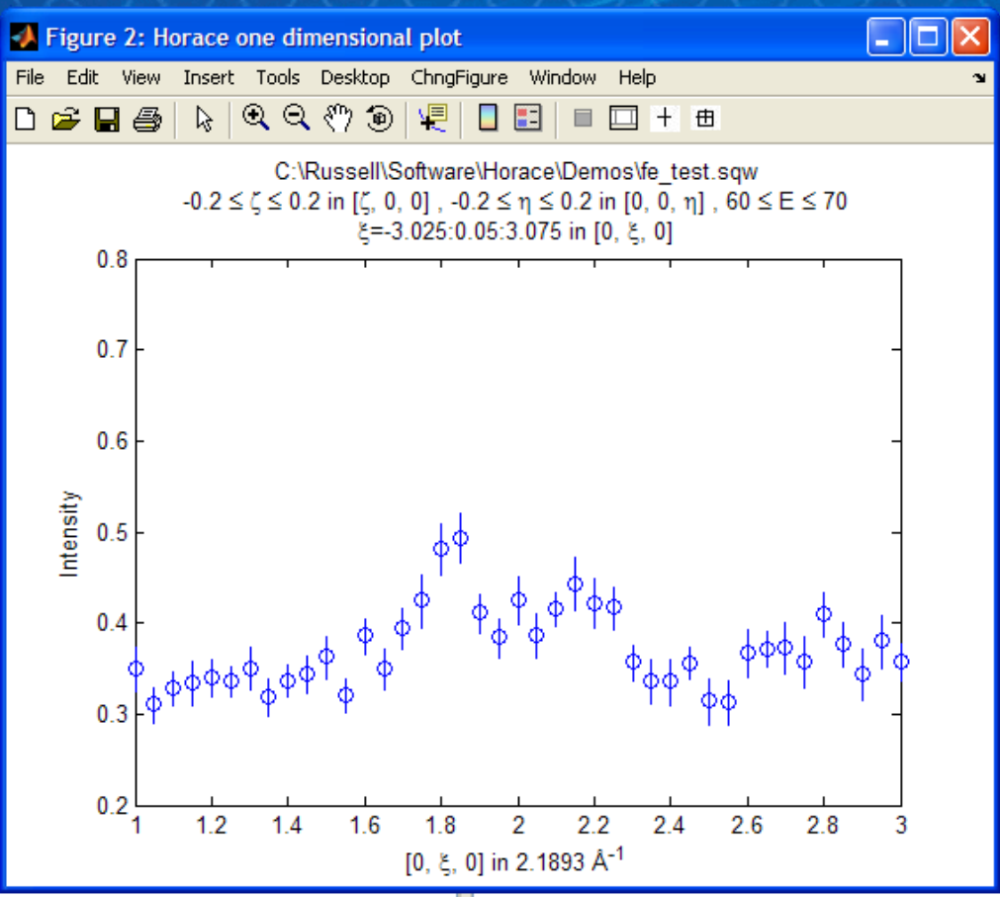

would give us a cut along the :math:`[0,k,0]` axis at a constant energy of
:math:`65meV`.

3D slices are also possible. To visualize these the "sliceomatic" program is
used. When the plot command is executed a GUI is launched that allows you to
plot multiple slices through the data. For example you could plot the same slice
with x and y axes of (1,0,0) and (0,1,0) at a range of energies.

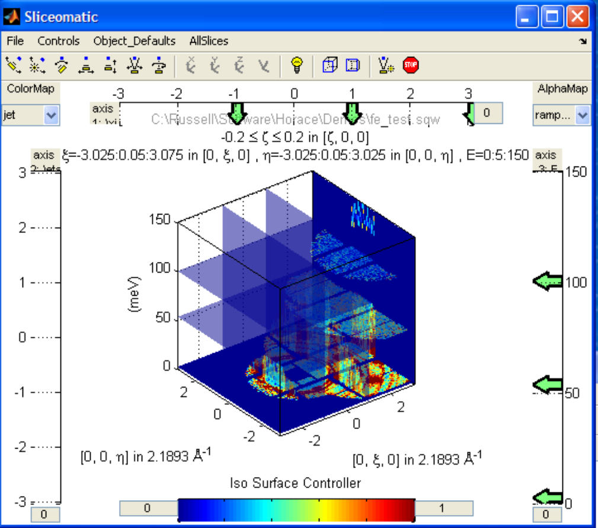

It is possible to save your cuts / slices to be viewed again later. This can be
done very simply in two ways. If you add an extra argument to the end of
``cut``, then the cut data are sent to a file. For our 1D cut above this
would be:

::

   cut_file = 'C:\mprogs\Horace\demo\plots\w100_1.sqw';

   w100_1b = cut(data_source, proj_100, [-0.2, 0.2], 0.05, [-0.2, 0.2], [60, 70], cut_file);

Now if we want to read this in again at some later time all we need to do is
type:

::

   w100_1b = sqw(cut_file);
   plot(w100_1b);
   lx 1 3; ly 0.2 0.8

Alternatively you can store the cut data in the Matlab workspace, simply by
typing:

::

   w100_1b = cut(data_source, proj_100, [-0.2, 0.2], 0.05, [-0.2, 0.2], [60, 70]);

Note, however, that the variable ``w100_1b`` will only be stored in the Matlab
workspace, so it could easily be overwritten, or lost if you quit Matlab without
``save`` ing your workspace.

::

   save(w100_1b, cut_file);

As we stated above, the objects that you created using the basic ``cut``
commands are all ``sqw`` s. These are the generic objects dealt with in Horace
and can represent data that is 0- to 4-dimensional. The ``sqw`` objects contain
information about the contributing pixels to the cut, which allow for example
resolution corrections to be applied when you analyse your data.

However in some instances, you may not wish to retain this information, for
example if you are dealing with lots of large 4-dimensional objects and are
worried about running out of space, or if you do not intend to use the pixel
information.

::

   w100_2_nopixels = cut(data_source, proj_100, [-0.2, 0.2], 0.05, [-0.2, 0.2], [0, 0, 500], '-nopix');

OR

::

   w100_1d = cut(w100_2, 0.05, [60, 70], '-nopix');

where ``w100_2`` is the 2-dimensional sqw object created earlier.

If you make a cut to create an object that is 2-dimensional, but with no pixel
information, then it becomes a new type of object -- in this case a ``d2d``.

.. note::

   If the cut would create a 1-d object then it is known as a ``d1d``, and so
   on. The collective set of objects are known as ``dnd`` s.

.. warning::

   Once you have cut an object without pixels and created a ``dnd`` it is not
   possible to recover the object with pixels from this. Instead the original
   data must be re-``read``/re-``cut`` in order to recover the pixel data.

Most operations that apply to ``sqw`` objects can be applied to ``dnd`` objects,
e.g. the command ``plot`` applies to both kinds of data. The most notable
difference applies to using ``simulate`` and ``fit`` on data
(c.f. :ref:`Multifit <manual/Multifit:Overview>`).

Basic data manipulation
=======================

Horace allows you to manipulate your data in many different ways.

It is important to realise that there are essentially 3 different kinds of
function, each with a slightly different syntax:

1. A function which takes an existing data set and transforms it in some way,
   returning the transformed dataset.

.. note::

   An example of this would be dividing the entire dataset by the Bose factor.

2. A function which takes a number of input vectors, corresponding to the axes
   of the desired output object, performing a mathematical operation on these
   ranges returning an n-dimensional output.

.. note::

   An example of this would be a function called something like ``gauss_2d``
   which takes two vectors that specify a grid in (**Q**,E)-space and some
   parameter, and returns a 2D grid with an intensity modeled by a Gaussian.

3. A function which operates on a model of S(**Q**,E), one which takes the
   values of h,k,l and E for a particular dataset and applies a transformation
   to each point.

.. note::

   An example of this would be calculating a dispersion relation, for a simple
   harmonic oscillator response function.

With the above caveats in mind, let's demonstrate two different kinds of data
manipulation of the first type discussed above. In the first we will simulate
the background for a 2D slice by looking at the signal at high
:math:`|\textbf{Q}|` in a 1D cut and then replicating it into 2D and subtracting
from the real data. We'll then demonstrate correcting the data for the
Bose-Einstein thermal population factor.

Process
-------

First create a new 2D slice and save to file:

::

   cut_file = 'C:\mprogs\Horace\demo\w110.sqw';

   cut(data_source, proj_110, [-0.2,0.2], [1,0.05,5], [-0.2,0.2], [0,0,150], cut_file);

   w110 = sqw(cut_file);

Now make a 1D cut out of this slice along the energy axis, with the integration
range along :math:`[0, 1, 0]` of 4.8 to 5:

::

   wbackcut = cut(w110, 1, [4.8, 5]);

Next make a new 2D slice by replicating the cut along one of the integration
axes:

::

   wback = replicate(wbackcut, w110);
   plot(wback);

.. note::

   Here we are passing ``w110`` as the template object to expand the
   slice we just made to the same shape.

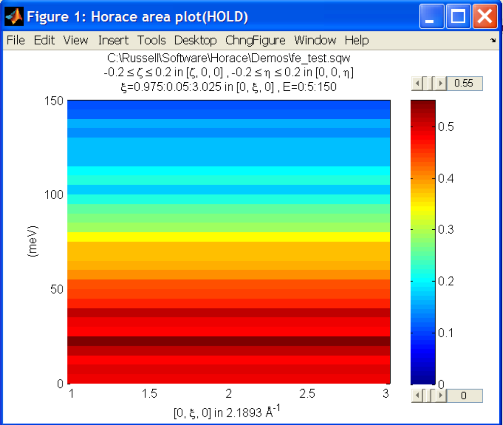

This is a now 2D slice that is over the same range as w110. We can now
:ref:`subtract <manual/Binary_operations:Binary operations>` this from the real
data to remove the background:

::

   wdiff = w110 - wback;
   plot(wdiff);

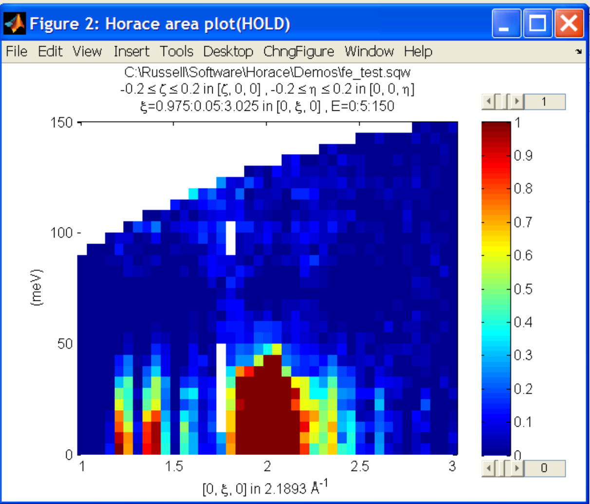

Simulations
===========

It is not only possible to plot and manipulate data, it is also possible to
simulate an entire dataset, or parts of a dataset.

We will illustrate this option using two examples, one that gives a quartet of
Gaussian profile peaks, and another that simulates the intensity from a
Heisenberg ferromagnet.

Gaussian Profile Peaks
----------------------

It is often the case that you do not have a full model of S(**Q**,E), but rather
you just want to determine how a particular peak changes with, for example,
temperature or neutron energy transfer.

An example would be to monitor the positions and intensities of a quartet peaks.

We can generate a slice from our demo data by typing:

::

   w_template = cut(data_source, proj_100, [-0.4, 0.2], [0, 0.05, 3], [-0.5, 0.05, 3], [30, 40]);

This should give a plot that looks like this:

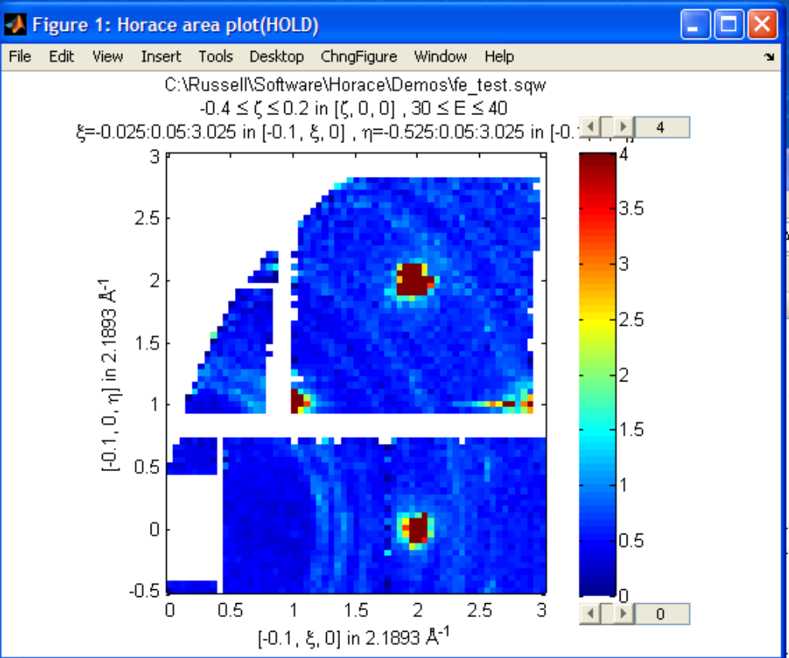

We will now simulate this using the demonstration function ``demo_4gauss``. This
is a specially written function which works only for 2D datasets (slices) where
both axes are momentum (h,k,l).

Read through the code in:

::

   C:\mprogs\Horace\functions\demo_4gauss.m

to see if you can understand how the function works.

It is a far from simple task to write a function that is completely general for
any dimensionality of dataset, so you typically write functions such as this
that work only for a particular dimensionality. It is important, therefore, for
your own book-keeping, that you give the functions sensible names that reflect
both what they do and what sort of dataset they apply to.

Now let's run the function, here we will use ``func_eval``.

The syntax for functions called by this routine is slightly different:

::

   w_sim = func_eval(w_template, @demo_4gauss, [6 1 1 0.1 1.25 6 1]);

The arguments in the square parentheses are the function inputs, and in this
case they correspond respectively to:

- amplitude
- satellite position x-coordinate
- satellite y-coordinate
- central position x-coordinate
- central y-coordinate
- background

.. note::

   In general the input to a function called by ``func_eval`` can take any form
   (e.g. a cell array, a structure array, a string, etc.), although if you wish
   to pass anything other than a vector of parameters, such as that shown above,
   then it must be packed into a cell array.

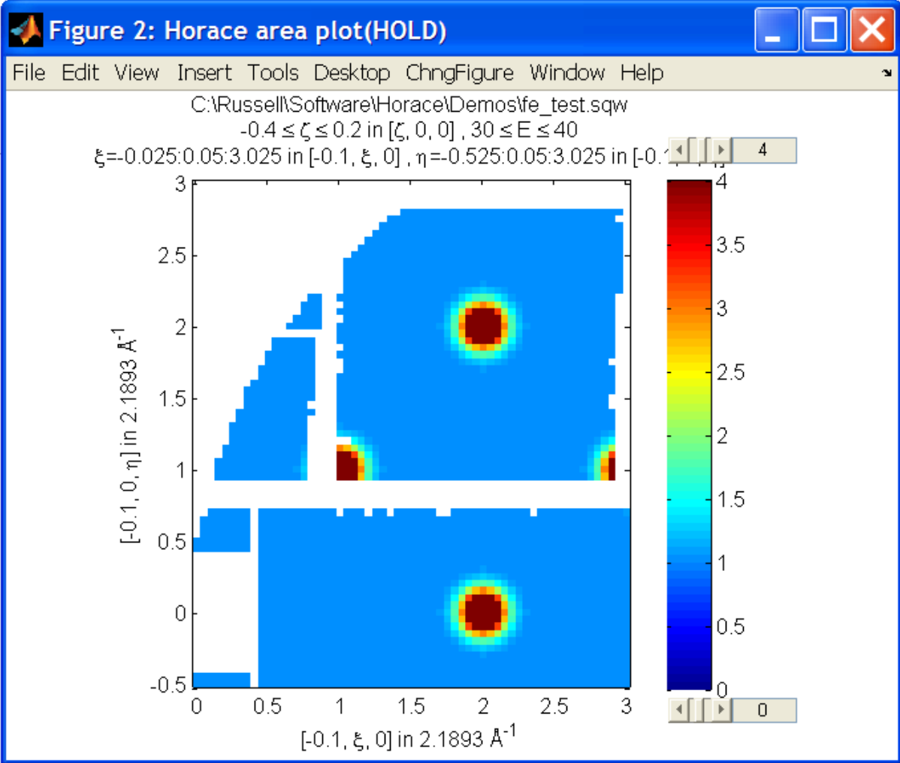

.. note::

   ``func_eval`` works for both ``sqw`` and ``dnd`` objects with almost the same
   syntax.

.. note::

   For ``sqw`` objects, pixel information is simulated according to the
   calculated intensity for the data grid, whereas for ``dnd`` objects this is
   not required.

It is also possible to simulate a ``dnd`` from a template ``sqw``
object by using an additional keyword argument ``'all'`` as follows:

::

   dnd_sim = func_eval(w_template, @demo_4gauss, [6 1 1 0.1 1.25 6 1], 'all');

Furthermore one can use the ``'all'`` keyword argument with a template ``dnd``
object so that intensity is simulated over the entire data range, rather than
just at the points where there are data in the template object.

3D Heisenberg Ferromagnet
-------------------------

In this case we will be fitting a full model of S(**Q**,E), using ``sqw_eval``.

.. note::

   The difference between ``sqw_eval`` and ``func_eval`` is the way in which the
   arguments are passed to the target function. ``sqw_eval`` passes the
   positions (h,k,l,e) for each point, while ``func_eval`` simply passes the
   calculated intensity.

The function we will use to demonstrate here is a model appropriate for spin
excitations of a 3D Heisenberg ferromagnet; it is called
``FM_spinwaves_2dSlice_sqw``, and it takes as inputs the components of **Q**
(h,k,l) plus energy, as well as other function parameters (exchange constant
etc.).

Please take a look at the code of the example function by typing:

::

   edit FM_spinwave_2dSlice_sqw

into the Matlab terminal.

You should notice that the format of the inputs for this function are thus
different from those of ``demo_4gauss`` -- to see the differences it is easiest
to examine the code for the two functions side-by-side.

Tun call the function we run:

::

   w_sim = sqw_eval(w_template, @FM_spinwaves_2dSlice_sqw, [300 0 2 10 2]);

The similar syntax makes it easier to remember how to apply general functions,
while the ``sqw_eval`` vs. ``func_eval`` allows us to define specialised and
flexible functions for computing transformations of our data.

.. note::

   In general it is better to use ``func_eval`` for simple functions such as
   Gaussians and so on, and ``sqw_eval`` for "proper" models of the scattering.

.. note::

   As before, the keyword ``'all'`` can be added to the arguments of this
   function, however in this case it is ignored if the object ``w_template`` is
   an ``sqw`` object.

   If ``w_template`` is a ``dnd`` object then, as for ``func_eval``, the keyword
   ``'all'`` ensures that data are simulated over the entire data range.

.. note::

   As with ``func_eval``, the parameters passed to the function can
   either take the form of a vector of numerical parameters, or a cell array
   comprising any other form of input.

Bose Temperature
----------------

In this example we will look at the generalised application function ``apply``.

``apply`` is a somewhat advanced function which requires some knowledge of the
underlying ``sqw`` object structure but allows us to apply arbitrary functions
affecting more than just the signal to an object is a concise and flexible
manner.

For this example we will be applying a Bose population correction, first we define
the function:

.. math::

   s' = \left(1 - \mathrm{e}^{ \frac{\sigma{}E}{T} }\right) s

where :math:`s` is the signal intensity, :math:`T` is temperature, :math:`E` is is the energy, and :math:`\sigma = -11.6044`

::

   function pix = bose_population(pix, T)
      pix.signal = pix.signal .* (1 - exp(-11.6044 .* pix.dE ./ T))
   end

Here we can see that this function takes ``pix`` as an argument which is the
``PixelData`` object which contains all of the pixel information that underlies
the ``sqw`` object. We are directly transforming the ``signal`` of the pixels with respect to ``E`` and the other input variable ``T`` (temperature)

We can then simply apply the function to transform the underlying data of the ``sqw``.

::

   w_apply = w_template.apply(@bose_population, {50})

This subsequently evaluates the correction with a temperature of ``50``.

.. note::

   Because the ``apply`` function is a somewhat low-level function, and it can take
   multiple functions as arguments (as a cell-array of function handles) and
   thus multiple sets of arguments, arguments are **always** passed as
   cell-arrays or cell-arrays of cell-arrays in the case of multiple functions.

Fitting
=======

You can also use Horace to fit parameters to your data. Since this a more
complicated subject, for an introduction and overview of how to use the fitting
functions, please read :ref:`Fitting data<manual/Multifit:Multifit>`.

.. warning::

   For comprehensive help with anything in this guide, please use the Matlab
   documentation for the various fitting functions that can be obtained by using
   the ``doc`` command, for example ``doc d1d/multifit`` (for fitting function
   like Gaussians to d1d objects) or ``doc sqw/multifit_sqw`` (fitting models
   for S(**Q**,w) to ``sqw`` objects).
